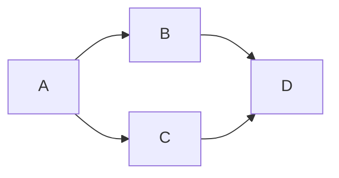

# はじめに
https://zenn.dev/estra/articles/npm-lockfile-dependencies

前回、上記の記事で「npm の依存関係と v7 のロックファイル」について調べた。
その後色々と調べたり試しているうちに、勘違いしていたことや分かっていなかったことがいくつもあったため、それらについてのまとめを作成したいと思う。

:::details ChangeLog
- 2022-03-30
  - リントミスを修正
  - 誤字脱字・分かりにくい日本語などを修正
  - 全体的に補足をいくつか追加
- 2022-03-31
  - Phantom dependencies についての記述を追加
:::

# そもそも
前回の記事では `chalk` や `cowsay` などパッケージを実際にインストールして、ロックファイルの構造や依存関係のことを調査した。その調査の結論としては、「node_modules フォルダには `package.json` ファイルの dependencies に記載されているパッケージだけでなく、そのパッケージ自体が依存するパッケージもすべてインストールするということが分かった」というものだった。

実際に `node_modules` フォルダを覗いてみたところ、`package.json` に記載した覚えのないパッケージ、インストールした覚えの無いパッケージがいくも配置されていた。たとえば、`cowasy@1.5.0` を `npm install` した場合の `node_modules` フォルダを見てみると以下のようになっている。

```sh
# なにもない状態から cowsay@1.5.0 をインストールする
❯ npm install cowsay@1.5.0
added 41 packages, and audited 42 packages in 9s

3 packages are looking for funding
  run `npm fund` for details

found 0 vulnerabilities
# node_modules ディレクトリに直下に配置されたパッケージを見てみる
❯ ls node_modules/
ansi-regex/              get-caller-file/         set-blocking/
ansi-styles/             get-stdin/               string-width/
camelcase/               is-fullwidth-code-point/ strip-ansi/
cliui/                   locate-path/             strip-final-newline/
color-convert/           p-limit/                 which-module/
color-name/              p-locate/                wrap-ansi/
cowsay/                  p-try/                   y18n/
decamelize/              path-exists/             yargs/
emoji-regex/             require-directory/       yargs-parser/
find-up/                 require-main-filename/
```

前回の記事では、これらの `node_modules` フォルダ直下に存在しているものが**インストールされたすべてのパッケージであると思いこんでいた**。

これは**完全な思い違い**であったことが分かった。例えば、`cliui` パッケージの更に中を覗いてみると以下のように、パッケージフォルダには更に `node_modules` というフォルダがあることがわかる。

```sh
# exa コマンドの tree 表示で `node_modules/cliui/` 内部を見てみる
❯ exa --tree node_modules/cliui/
node_modules/cliui
├── CHANGELOG.md
├── index.js
├── LICENSE.txt
├── node_modules
│  ├── ansi-regex
│  │  ├── index.d.ts
│  │  ├── index.js
│  │  ├── license
│  │  ├── package.json
│  │  └── readme.md
│  ├── is-fullwidth-code-point
│  │  ├── index.d.ts
│  │  ├── index.js
│  │  ├── license
│  │  ├── package.json
│  │  └── readme.md
│  ├── string-width
│  │  ├── index.d.ts
│  │  ├── index.js
│  │  ├── license
│  │  ├── package.json
│  │  └── readme.md
│  └── strip-ansi
│     ├── index.d.ts
│     ├── index.js
│     ├── license
│     ├── package.json
│     └── readme.md
├── package.json
└── README.md
```

つまり、「`node_module` 内のパッケージフォルダの中には、`node_modules` フォルダが存在しており、その中にもパッケージが配置されているケースがある」ということが判明した。

これは前回の記事の内容だけではまったく説明がつかない。

実際になぜこのようなことが起きるのかについての説明は後で詳しく行うが、そもそも勘違いをしているのに気づいたのは `npm explain` コマンドを実行した際に変な違和感を覚えたためだ。


上の画像のように `node_modules` ディレクトリ内にローカルインストールされたものが、どのような依存関係によってインストールされたのかということを、`npm explain` コマンドを使って解明できることを前回の記事では紹介した。

具体的には `npm explain` コマンドに引数としてパッケージを指定して実行することで、依存元を階層的に表示できる。実際にこのコマンドで `cowsay@1.5.0` の依存の１つとなっている `ansi-regex` というパッケージのインストール原因(つまり、どのように依存があるか)を追求してみると次のような出力結果を得た。

```sh
# `ansi-regex` パッケージがインストールされた理由を説明させる
❯ npm explain ansi-regex
ansi-regex@5.0.1
node_modules/ansi-regex
  ansi-regex@"^5.0.1" from strip-ansi@6.0.1
  node_modules/strip-ansi
    strip-ansi@"^6.0.0" from cliui@6.0.0
    node_modules/cliui
      cliui@"6.0.0" from the root project
    strip-ansi@"^6.0.0" from wrap-ansi@6.2.0
    node_modules/cliui/node_modules/wrap-ansi
      wrap-ansi@"^6.2.0" from cliui@6.0.0
      node_modules/cliui
        cliui@"6.0.0" from the root project
    strip-ansi@"^6.0.1" from string-width@4.2.3
    node_modules/string-width
      string-width@"^4.2.0" from cliui@6.0.0
      node_modules/cliui
        cliui@"6.0.0" from the root project
      string-width@"^4.1.0" from wrap-ansi@6.2.0
      node_modules/cliui/node_modules/wrap-ansi
        wrap-ansi@"^6.2.0" from cliui@6.0.0
        node_modules/cliui
          cliui@"6.0.0" from the root project

ansi-regex@3.0.0
node_modules/wrap-ansi/node_modules/ansi-regex
  ansi-regex@"^3.0.0" from strip-ansi@4.0.0
  node_modules/wrap-ansi/node_modules/strip-ansi
    strip-ansi@"^4.0.0" from wrap-ansi@3.0.0
    node_modules/wrap-ansi
      wrap-ansi@"3.0.0" from the root project
    strip-ansi@"^4.0.0" from string-width@2.1.1
    node_modules/wrap-ansi/node_modules/string-width
      string-width@"^2.1.1" from wrap-ansi@3.0.0
      node_modules/wrap-ansi
        wrap-ansi@"3.0.0" from the root project
```

結果を見てみると、`ansi-regex` という名前のパッケージは２つ存在していることが分かる。

しかし、これはおかしい。`node_modules` フォルダの中には `ansi-regex` フォルダは１つしか無かったはずだ。


同じ名前のパッケージが２つインストールされてしまっているとは一体どういうことだろうか?  
なぜ同じパッケージが複数個必要なのか?  

🤔 🤔 🤔

出力結果を更によく見てみると、`anis-regex@5.0.1` と `ansi-regex@3.0.0` が存在している。そして `npm explain` ではインストール場所も示してくれるらしいが、`ansi-regex@5.0.1` は `node_modules/ansi-regex` にある一方、`ansi-regex@3.0.0` は `node_modules/wrap-ansi/node_modules/ansi-regex` にある。

つまり、`ansi-regex` のバージョン `3.0.0` が `node_modules/wrap-ansi/node_modules/ansi-regex` というネストされた node_modules フォルダに配置されているわけだ。

なぜ `node_modules` フォルダがネストされるのか?  
なぜ別のバージョンがインストールされているのだろうか?  

🤔 🤔 🤔

## 調べてみると
実際に調査していくうちに判明したのは、npm は v2 と v3 で大きな変更があり、**パッケージの配置方法が大きく変わった**ということだ。これを知らないと、一目見ただけでは npm が行うパッケージの配置について理解できないという落とし穴がある。そもそも"依存関係"そのものの前提知識が必要であったことも判明した。

パッケージの配置方法は npm においてかなり重要なコンセプトであり、 npm v7 からは "arborist" というプログラムがフォルダツリーと呼ばれるモデルを構築し、実際のフォルダ配置の中枢を担っているらしい。

npm は記事執筆時点で v8 までリリースされており、かなり歴史があるようなので npm のコアコンセプトは何年か前の記事で紹介されているものが多かった。しかし、最近登場した Arborist についてはセキュリティ上問題があったという記事のみで、日本語・英語に関わらず具体的にどんなことをやっているのかという記事をみつけることができなかったため、CLI を駆使した調査でいくつか説明したいと思う。

また、パッケージ配置のコンセプトについては後発の yarn や pnpm といったもの、rush というモノリポジトリ管理に特化したツールなどで改良や独自のアプローチがとられているため、それらツールのドキュメントでは npm の問題点や npm のアプローチに関しての独自定義の専門用語などを使って説明されているものを見つけることができたので紹介する。

ちなみに、npm のドキュメントは執筆時点で v7 が最新のものである。基本的に公式ドキュメントを読む必要はあるのだが、npm の最新ドキュメントを見ても今から解説することの全貌を掴むことができなかった。

最新の公式ドキュメントの関連していそうな部分についてはある程度調べたのだが、後発ツールのドキュメントや npm の過去のドキュメントを見つけることができて、ようやく npm の全貌がおぼろげに見えてきた。それらの用語を使って今まで npm について勘違いしていたことと知らなかったことを説明していく。

:::message
npm のパッケージ配置アルゴリズムについての公式ドキュメントでの直接的説明は以下の２つにページに記載されているので読んでみてほしい。「このパッケージは、この依存関係を満たすからこういう配置になっている」的な説明がなされているため、配置がそうなることは納得できるが、具体的にどうやって実際に配置されるかを想像するの結構難しい。

- [npm-install algorithm | npm Docs](https://docs.npmjs.com/cli/v7/commands/npm-install#algorithm)
- [Cycles, Conflicts, and Folder Parsimony | npm Docs](https://docs.npmjs.com/cli/v7/configuring-npm/folders#cycles-conflicts-and-folder-parsimony)
:::

## 前回記事時点までの勘違い
調査してみて自分が知らなかった、もしくは勘違いしていたことは以下の事柄である。

- npm の役割そのもの
- `node_modules` フォルダの構造
- `npm install` が実際に行うこと
- ロックファイルの役割と構造、そしてリストされているパッケージについて
- `npm explain` と `npm ls` のコマンドが表現するものについて

ここからは、これらについてまとめていきたいと思う。

# npmの役割
まずは「npm の役割」について確認したい。

『そもそも npm とは何をするためのものか？』

実際、npm のことを説明しようと思ったらどのように説明すればよいのか。公式ドキュメントでは以下のように書かれている。

>npm は Node JavaScript プラットフォームのためのパッケージマネジャーである。npm は node によってモジュールが発見できるようにモジュールを正しく配置し、依存関係の衝突を賢くマネージする。
>
>npm is the package manager for the Node JavaScript platform. **It puts modules in place so that node can find them, and manages dependency conflicts intelligently**.
>\- [npm | npm Docs](https://docs.npmjs.com/cli/v7/commands/npm)より引用

npm と呼ばれるパッケージマネジャーの役割は大きく分けて次の 2 つとのことだ。

- **nodeが**発見できるようにモジュールを配置
- 依存関係の衝突のマネージ

この「モジュールの配置」というのが、パッケージを `node_modules` フォルダに配置するだけなのに大層に「依存関係の解決」と並んでいるのには最初は違和感があった。

しかし、当初自分が想定していた `node_modules` フォルダへの配置、つまり冒頭の勘違いである「`node_modules` フォルダの直下に存在しているものがインストールされたすべてのパッケージであると思いこんでいた」ものと `npm install` によって実際に行われるモジュールの配置はまったく異なるものであることが判明した。つまり npm の大きな役割を占めるほどに、モジュールの配置は複雑なものであり、フォルダ内の構造を見たり、`package.json` に記載する依存パッケージの種類を知るだけで予測することが難しくなっている。

実際どのようにパッケージが配置されるかについては、まだ前提知識が必要なので１つずつ確認していく。

# ロックファイルの構造再び
前回の記事で `cowsay` のパッケージを単体インストールする際に生成される `package-lock.json` ファイルの中身を見たが、今回もそれを使っていく。

まずは再び `package-lock.json` ファイルの構造を見てみる(※相対パスの後は省略してある)。冒頭で行ったように `npm install cowsay@1.5.0` を実行すると以下のようなロックファイルが生成される。

```json:pakcage-lock.jsonの構造
{
  "name": "cows",
  "version": "1.0.0",
  "lockfileVersion": 2,
  "requires": true,
  "packages": {
    "": {...},
    "node_modules/ansi-regex": {...},
    "node_modules/ansi-styles": {...},
    "node_modules/camelcase": {...},
    "node_modules/cliui": {...},
    "node_modules/cliui/node_modules/ansi-regex": {...},
    "node_modules/cliui/node_modules/is-fullwidth-code-point": {...},
    "node_modules/cliui/node_modules/string-width": {...},
    "node_modules/cliui/node_modules/strip-ansi": {...},
    "node_modules/color-convert" {...}, 
    "node_modules/color-name" {...},
    "node_modules/cowsay" {...},
    "node_modules/decamelize" {...},
    "node_modules/emoji-regex" {...},
    "node_modules/find-up" {...},
    "node_modules/get-caller-file" {...},
    "node_modules/get-stdin" {...},
    "node_modules/is-fullwidth-code-point" {...},
    "node_modules/locate-path" {...},
    "node_modules/p-limit" {...},
    "node_modules/p-locate" {...},
    "node_modules/p-try" {...},
    "node_modules/path-exists" {...},
    "node_modules/require-directory" {...},
    "node_modules/require-main-filename" {...},
    "node_modules/set-blocking" {...},
    "node_modules/string-width" {...},
    "node_modules/strip-ansi" {...},
    "node_modules/strip-final-newline" {...},
    "node_modules/which-module" {...},
    "node_modules/wrap-ansi" {...},
    "node_modules/wrap-ansi/node_modules/ansi-regex" {...},
    "node_modules/wrap-ansi/node_modules/is-fullwidth-code-point" {...},
    "node_modules/wrap-ansi/node_modules/string-width" {...},
    "node_modules/wrap-ansi/node_modules/strip-ansi" {...},
    "node_modules/y18n" {...},
    "node_modules/yargs" {...},
    "node_modules/yargs-parser" {...},
    "node_modules/yargs/node_modules/ansi-regex" {...},
    "node_modules/yargs/node_modules/is-fullwidth-code-point" {...}, 
    "node_modules/yargs/node_modules/string-width" {...},
    "node_modules/yargs/node_modules/strip-ansi" {...}
  },
  "dependencies": {...}
}
```

npm v7 で見るべき package のフィールドに記載されているのは `node_modules` フォルダにインストールされたすべての依存パッケージである。依存パッケージの名前は**プロジェクトルートからの相対パス**で示されている。

`node_modules/cliui` の後を見ると、つぎのように node_modules フォルダがネストされた状態で `ansi-regex`、`is-fullwidth-code-print`、`string-width`、`strip-ansi` という 4 つのパッケージが配置されていることがわかる。

```json:pakcage-lock.json
    "node_modules/cliui/node_modules/ansi-regex": {...},
    "node_modules/cliui/node_modules/is-fullwidth-code-point": {...},
    "node_modules/cliui/node_modules/string-width": {...},
    "node_modules/cliui/node_modules/strip-ansi": {...},
```

さらに `package-lock.json` ファイルをよく見てみると、同様に `wrap-ansi` と `yargs` パッケージの下にもネストされた `node_modules` フォルダがあることがわかる。

ここで改めて `package-lock.json` の役割は何かを確認する。公式ドキュメントには以下のように書かれている。

>It describes the **exact tree that was generated, such that subsequent installs are able to generate identical trees**, regardless of intermediate dependency updates.
>(中略)
>As of npm v7, lockfiles include **enough information to gain a complete picture of the package tree**, reducing the need to read `package.json` files, and allowing for significant performance improvements.
>\- [package-lock.json | npm Docs](https://docs.npmjs.com/cli/v7/configuring-npm/package-lock-json) より引用

直訳すると分かりづらくなるが、まず初めに「ロックファイルは後で行われるインストールにおいて**同一のツリー**を生成できるように、生成された**正確なツリー**を記述する」とある。

より具体的には、「同一の node_modules ツリー(またはフォルダツリー)を再現するためにすべてのインストールされたパッケージの正確なバージョンと相対パスでのロケーションを記録して、node_module フォルダの正確なレイアウトを表現する」ということが中略の後に説明されている。

🤔 🤔 🤔

言葉を補足すると、チームでの運用などにおいて、誰がいつ依存パッケージをインストールしても同じバージョンで同じ `node_modules` フォルダの構造で、環境そのものが同じになることを保証するために、正確なフォルダのレイアウトを記録しておくことが `package-lock.json` の役割である。

# ツリーとグラフ
ここで、キーコンセプトである「ツリー」という用語がでてきたが、今度はこの「ツリー」という言葉に注目してみたい。

「ツリー」とはまさしくツリー構造のことを指しているが、そもそも**依存関係**というのはツリー構造になっていない。

前回の記事で紹介した[npmのパッケージの依存関係を表現してくれるツール](https://npm.anvaka.com/#/)でも見たが、これは **依存グラフ(dependency graph)** と呼ばれている。


>パッケージマネジメントについて議論される際に dependency tree (依存ツリー)という言葉に言及したくなるが、実質的に dependencies の間での関係性は厳密にはツリー(tree)ではなくグラフ(graph)である。サイクル(閉路)や重複する関係性を持つため、単一のノードがシステムの中で複数の役割を果たすことができる。
>\- [npm Blog Archive: npm v7 Series - Arborist Deep Dive](https://blog.npmjs.org/post/618653678433435649/npm-v7-series-arborist-deep-dive.html)より

依存とはツリー構造ではなく、グラフ構造であった。更に正確に言うならば[有向非巡回グラフ](https://ja.wikipedia.org/wiki/%E6%9C%89%E5%90%91%E9%9D%9E%E5%B7%A1%E5%9B%9E%E3%82%B0%E3%83%A9%E3%83%95)(DAG: Directed acyclic graph)という名前のグラフになる。

DAG と Tree の構造は下図のように異なる。

| DAG | Tree | 
|---|---|
|  |  | 

そもそも"非循環依存関係の原則"(**Acyclic dependencies principle**)というソフトウェアデザイン原則が存在しているらしい。
これは「パッケージの依存関係は閉路を持たないようにする」という原則で、パッケージ作成などを行う際にはこの原則に従うことで、閉路(cycle)を作成しないように、つまり DAG にするようにデザインしなくてはいけないとのこと(パッケージだけでなくコンポーネントについてもこの原則が適用される)。

https://en.wikipedia.org/wiki/Acyclic_dependencies_principle?oldformat=true

さて、前回の記事で紹介した `npm ls` コマンドは「依存関係を**ツリー構造**で表示してくれるコマンド」であったはずだが、依存関係はツリー構造ではなく、グラフ構造だ。

🤔 🤔 🤔

となると、`npm ls` コマンドで出力される**ツリー構造**は一体何なのか？

# npm lsとexplainが表現するもの
`npm ls` コマンドについて、ドキュメントでは以下のように書いてある。

>`npm ls -a` で出力されるツリーはパッケージの依存関係に基づいた論理的依存ツリー(logical dependency tree)であって、物理的な `node_modules` ディレクトリ内部のレイアウトではない。
>\- [npm-ls | npm Docs](https://docs.npmjs.com/cli/v7/commands/npm-ls)より

また新しい単語がでてきた。
**論理的依存ツリー**とは一体何なのか？

正確な定義は記載されていないが公式ドキュメントの後にはこう書かれている。

>`npm ls` コマンドの出力と動作はnpmがすべての依存関係を単純にネストするnode_modulesフォルダを作成していたときには非常に意味があった(npm v2以前)。そのような場合には、論理的依存ツリーと物理的にディスク上に存在しているパッケージツリー(physical tree of packages on disk)がほぼ同じであった。
>npm v3において登場したインストール時自動重複排除(automatic install-time deduplication of depednencies)の機能によってnpm lsの出力は論理的依存グラフ(logical depdendency graph)をツリー構造として表示するように修正された。
>\- [npm-ls | npm Docs](https://docs.npmjs.com/cli/v7/commands/npm-ls)より

つまり「論理的依存ツリー」とは、本来の依存関係としてのグラフ構造がツリー構造として表現できるように修正されたものであった。

実際には厳密な言葉の定義がないので自分なりに解釈すると、`npm ls` で出力されるツリー構造は node_modules の物理的なレイアウトを表現していないため actual や physical ではなく logical な依存ツリー(=論理的依存ツリー)であるということではないだろうか。

そして逆に `npm explain` コマンドはその論理的依存ツリー構造を特定のパッケージから見て逆にたどったものを表現していると考えられる。

このドキュメントの中で出てきた概念として重複排除(deduplication)や node_modules のネストも重要である。注意として、このドキュメントだけを見てもよくわからないが npm v2 や v3 に関するドキュメントや解説記事をみると意味がつかめる。

まずは重複排除について。

`npm ls -a` で表示される deduped は重複したパッケージということではなく重複排除(deduplicaiton)が行われたということを意味していた。

:::message
**重複排除**とはバックアップの際に対称データを解析して、重複データを自動的に検知して排除する技術。英語では De-dupulication, deduplication などと呼ばれれる。データサイズをなるべく抑えることを目的とする。動詞は「dedupe」
\- 参考 [重複排除（デデュプリケーション、デデュープ）](https://www.fujitsu.com/jp/products/computing/storage/lib-f/tech/de-duplication/)
:::

例えば、`npm ls` コマンドは後にパッケージ名を指定するとそれが末端となるツリーを表示してくれる。

```shell
❯ npm ls strip-ansi
cows@1.0.0 /Users/roshi/Projects/Cows
└─┬ cowsay@1.5.0
  ├─┬ string-width@2.1.1
  │ └── strip-ansi@4.0.0
  └─┬ yargs@15.4.1
    ├─┬ cliui@6.0.0
    │ ├─┬ string-width@4.2.3
    │ │ └── strip-ansi@6.0.1 deduped
    │ ├── strip-ansi@6.0.1
    │ └─┬ wrap-ansi@6.2.0
    │   ├─┬ string-width@4.2.3
    │   │ └── strip-ansi@6.0.1 deduped
    │   └── strip-ansi@6.0.1
    └─┬ string-width@4.2.3
      └── strip-ansi@6.0.1
```

strip-ansi について ls 出力してみると上の様に表示される。strip-ansi というパッケージが出現しているのは 6 箇所あるが、deduped とついた箇所が 2 つある。これはその 2 箇所にインストールされるはずだった strip-ansi パッケージは実際には取り除かれているということを意味している。

逆に strip-ansi がどこへインストールされているかを `npm expalin` で調べる。`explain` コマンドは指定パッケージのインストール原因となる依存関係をボトムアップにプロジェクトルートまで駆け上がって表示してくれる。

:::message
ちなみに、`npm explain` コマンドはエイリアスとして `npm why` が利用でき、`npm ls` コマンドではエイリアスとして `npm list` などが使える。
:::

```sh
❯ npm why strip-ansi
strip-ansi@6.0.1
node_modules/cliui/node_modules/strip-ansi
  strip-ansi@"^6.0.0" from cliui@6.0.0
  node_modules/cliui
    cliui@"^6.0.0" from yargs@15.4.1
    node_modules/yargs
      yargs@"15.4.1" from cowsay@1.5.0
      node_modules/cowsay
        cowsay@"^1.5.0" from the root project
  strip-ansi@"^6.0.1" from string-width@4.2.3
  node_modules/cliui/node_modules/string-width
    string-width@"^4.2.0" from cliui@6.0.0
    node_modules/cliui
      cliui@"^6.0.0" from yargs@15.4.1
      node_modules/yargs
        yargs@"15.4.1" from cowsay@1.5.0
        node_modules/cowsay
          cowsay@"^1.5.0" from the root project

strip-ansi@4.0.0
node_modules/strip-ansi
  strip-ansi@"^4.0.0" from string-width@2.1.1
  node_modules/string-width
    string-width@"~2.1.1" from cowsay@1.5.0
    node_modules/cowsay
      cowsay@"^1.5.0" from the root project

strip-ansi@6.0.1
node_modules/wrap-ansi/node_modules/strip-ansi
  strip-ansi@"^6.0.0" from wrap-ansi@6.2.0
  node_modules/wrap-ansi
    wrap-ansi@"^6.2.0" from cliui@6.0.0
    node_modules/cliui
      cliui@"^6.0.0" from yargs@15.4.1
      node_modules/yargs
        yargs@"15.4.1" from cowsay@1.5.0
        node_modules/cowsay
          cowsay@"^1.5.0" from the root project
  strip-ansi@"^6.0.1" from string-width@4.2.3
  node_modules/wrap-ansi/node_modules/string-width
    string-width@"^4.1.0" from wrap-ansi@6.2.0
    node_modules/wrap-ansi
      wrap-ansi@"^6.2.0" from cliui@6.0.0
      node_modules/cliui
        cliui@"^6.0.0" from yargs@15.4.1
        node_modules/yargs
          yargs@"15.4.1" from cowsay@1.5.0
          node_modules/cowsay
            cowsay@"^1.5.0" from the root project

strip-ansi@6.0.1
node_modules/yargs/node_modules/strip-ansi
  strip-ansi@"^6.0.1" from string-width@4.2.3
  node_modules/yargs/node_modules/string-width
    string-width@"^4.2.0" from yargs@15.4.1
    node_modules/yargs
      yargs@"15.4.1" from cowsay@1.5.0
      node_modules/cowsay
        cowsay@"^1.5.0" from the root project
```

strip-ansi の同一名パッケージが 4 つ入っている。
バージョンは 4.0.0 が 1 つと 6.0.1 が 3 つ。しかし、よく見てみると最初の `strip-ansi@6.0.1` と 2 番目の `strip-ansi@6.0.1` にはそのパッケージが必要とされている箇所がそれぞれ 2 箇所ずつあることに気づく。それぞれを整理してみると以下のようにそれぞのパッケージ場所と必要とされている条件がすこしずつ違う。

- `strip-ansi@6.0.1 node_modules/cliui/node_modules/strip-ansi`
	- `strip-ansi@"^6.0.0" from cliui@6.0.0 node_modules/cliui`
	- `strip-ansi@"^6.0.1" from string-width@4.2.3 node_modules/cliui/node_modules/string-width`
- `strip-ansi@6.0.1 node_modules/wrap-ansi/node_modules/strip-ansi`
	- `strip-ansi@"^6.0.0" from wrap-ansi@6.2.0 node_modules/wrap-ansi`
	- `strip-ansi@"^6.0.1" from string-width@4.2.3 node_modules/wrap-ansi/node_modules/string-width`

書かれているパスとパッケージ名から `strip-ansi` パッケージのみに注目して `node_modules` フォルダ内での物理的なレイアウト構造を再現してみると次のようになる。

```sh
.
└── node_modules
    ├── cliui@6.0.0
    │   └── node_modules
    │       └── strip-ansi@6.0.1
    ├── strip-ansi@4.0.0
    ├── wrap-ansi@6.2.0
    │   └── node_modules
    │       └── strip-ansi@6.0.1
    └── yargs@15.4.1
        └── node_modules
            └── strip-ansi@6.0.1
```

これと `npm ls` で出力した `strip-ansi` に関するツリー構造をみてみると何かわかるだろうか？

```sh
❯ npm ls strip-ansi
cows@1.0.0 /Users/roshi/Projects/Cows
└─┬ cowsay@1.5.0
  ├─┬ string-width@2.1.1
  │ └── strip-ansi@4.0.0
  └─┬ yargs@15.4.1
    ├─┬ cliui@6.0.0
    │ ├─┬ string-width@4.2.3
    │ │ └── strip-ansi@6.0.1 deduped
    │ ├── strip-ansi@6.0.1
    │ └─┬ wrap-ansi@6.2.0
    │   ├─┬ string-width@4.2.3
    │   │ └── strip-ansi@6.0.1 deduped
    │   └── strip-ansi@6.0.1
    └─┬ string-width@4.2.3
      └── strip-ansi@6.0.1
```

構造が似ているような気もするが正直よく分からない。これの違いがわかるようになるためには npm v2 と v3 での機能的な変更についての知識が必要になる。もういちど `npm ls` コマンドについての公式ドキュメントを読んでみる。

>`npm ls` コマンドの出力と動作はnpmがすべての依存関係を単純にネストするnode_modulesフォルダを作成していたときには非常に意味があった(npm v2以前)。そのような場合には、論理的依存ツリーと物理的にディスク上に存在しているパッケージツリー(physical tree of packages on disk)がほぼ同じであった。
>\- [npm-ls | npm Docs](https://docs.npmjs.com/cli/v7/commands/npm-ls) より

ちなみに"(npm v2 以前)"という言葉は自分で補った部分である。実は npm v2 と v3 以降では node_modules フォルダの構造がまったく違うものとなっている。そして過去の npm(v2)では `npm ls` で出力されたツリーと node_modules フォルダがほぼ同じであったという旨が読み取れる。

具体的には `npm install` のアルゴリズムが v2 と v3 で大きく変わったことを知る必要がある。npm v3 については過去のドキュメントが以下の URL から見ることができる。

https://npm.github.io/how-npm-works-docs/npm3/how-npm3-works.html

# 依存にまつわる用語
`node_module` フォルダの構造について説明する前にここで一度用語の紹介をしておきたいと思う。以下の用語について把握しておくことで `node_modules` フォルダの構造がなぜそうなるのを理解するのに役立つ。

- Prod (Production dependencies)
  - 動作や実行するのに必要なパッケージ
	- `package.json` の `dependencies`
	- `peerDependencies` や `optionalDependencies` もこれに含まれる
- Dev (Development dependencies)
  - 開発中のみに必要とされるパッケージ
  - `package.json` の `devDependencies`
- **Primary** dependencies (**Direct** dependencies)
	- プロジェクトルートの `package.json` ファイルから要求される依存パッケージ
- **Secondary** dependencies (**Indirect** dependencies)
	- Primary(Direct) dependencies または他の Secondary(Indirect)から呼ばれる間接的な依存パッケージ
	- node_modules フォルダに含まれる大多数がこちらに属する
	- 別名:
		- [Transitive dependencies](https://en.wikipedia.org/wiki/Transitive_dependency)(推移的依存関係)
		- ~~Phantom dependencies(rush における定義)~~
- **Flat** package
	- node_modules フォルダのルートに配置されたパッケージ
	- この状態を「Flat にインストール」とか言う。
- **Nested** package
	- Flat packge フォルダ内部の node_modules フォルダ内部に配置されたパッケージ
- deep tree
	- node_modules フォルダが何重にもネストされたフォルダの状態
- [npm doppelganger](https://rushjs.io/pages/advanced/npm_doppelgangers/) (npm ドッペルゲンガー)
	- npm のインストールによって複数個インストールされてしまった同一バージョンのパッケージのことを指す
- [Phantom dependencies](#phantom-dependencies)
  - `require` できてしまうことで発生する"幽霊のような依存"
- node_modules tree (Folder tree)
	- 実際の node_modules フォルダの構造
- logical dependnecy tree (論理的依存ツリー)
	- node_modules tree とは異なる依存の論理的な木構造
	- dependency graph を tree 構造に overlay したもの
	- `npm ls` コマンドで出力される tree 構造
- dependency graph
	- パッケージ間の本質的な依存関係をグラフ構造に表現したもの
	- DAG(Directed acyclic graph)


参考
https://tech.groww.in/introduction-to-package-dependency-resolution-in-npm-ad1b374fc13a

https://snyk.io/blog/whats-an-npm-dependency/

以上のように dependecny や tree といってもいろいろな種類や見方があることを把握しておく。

# Primary(Direct)の配置
ここから具体的な npm のパッケージ配置方法について説明していく。
まずは、上で紹介した用語である "Primary" と "Secondary" の観点から考えるとパッケージの配置について理解しやすくなる。

`npm install` ではまず `package.json` に記載されている Primary(Direct) dependencies のパッケージを `node_modules` ディレクトリのルートへ "Flat" に配置する。

再び `cowsay` を単体でインストールすることを考えてみる。
まずはじめに Primary である `cowsay` パッケージがインストールされることで、ディレクトリは次のような状態となる。

```sh
.
├── node_modules
│   └── cowsay
└── package.json
```

`npm install` にオプション `--timing` を付けるとインストールログをみることができる。

:::details npm install のログ
@[gist](https://gist.github.com/yo-goto/8bcb8047d9fb1103590662ab386e47ee)
:::

インストールログを見てみると npm レジストリからパッケージを fetch する順番を確認できる。

インストールの順番としては、最初に Primary である `cowsay` がインストールされる。そのつぎに Secondary を fetch するが、まずは `cowsay` の dependencies である `get-sidin`、`string-width`、`strip-final-newline`、`yargs` の 4 つを fetch している事がわかる。

このように `cowsay` の次にインストールされるパッケージは `npm ls --depth=1` で出力されるパッケージ、つまり深さが１のものであることが分かる。

```log
$ npm ls --depth=1
cows@1.0.0 /Users/roshi/Projects/Cows
└─┬ cowsay@1.5.0
  ├── get-stdin@8.0.0
  ├── string-width@2.1.1
  ├── strip-final-newline@2.0.0
  └── yargs@15.4.1
```

Primary の配置が終わった後はこの `--depth=1` の Secondary の配置が考慮される。

その次には、以下の `--depth=2` の Secondary の配置を考慮する...といったように依存の深さごとに fetch や配置が行われていくと考える(インストールログを見てみても、依存の深さごとに fetch が行われているのがわかる)。

```log
$ npm ls --depth=2
cows@1.0.0 /Users/roshi/Projects/Cows
└─┬ cowsay@1.5.0
  ├── get-stdin@8.0.0
  ├─┬ string-width@2.1.1
  │ ├── is-fullwidth-code-point@2.0.0
  │ └── strip-ansi@4.0.0
  ├── strip-final-newline@2.0.0
  └─┬ yargs@15.4.1
    ├── cliui@6.0.0
    ├── decamelize@1.2.0
    ├── find-up@4.1.0
    ├── get-caller-file@2.0.5
    ├── require-directory@2.1.1
    ├── require-main-filename@2.0.0
    ├── set-blocking@2.0.0
    ├── string-width@4.2.3
    ├── which-module@2.0.0
    ├── y18n@4.0.3
    └── yargs-parser@18.1.3
```

# Secondary(Indirect)の配置
それでは `--depth=1` のレベルのにある Primary(４つの依存パッケージ) が `node_modules` フォルダのルートに配置されたとして、次に配置されるパッケージはどういった構造で配置されるだろうか。

npm v2 では Primary のパッケージディレクトリで Secondary をすべてネストすることで解決を図っていた。

例えば、`A` と `B` というパッケージが `package.json` の dependencies と宣言されており、さらに `A` は `X` と `Y`、`B` は `X` と `Z` という依存を持つとする。

```shell:Logical Dependency Tree
.
├── A
│   ├── X
│   └── Y
└── B
    ├── X
    └── Z
```

これを先程と同じように `npm install` で配置すると npm v2 では以下のようにネストさせる。

```shell:npm v2
.
├── node_modules
│   ├── A
│   │   └── node_modules
│   │       ├── X
│   │       └── Y
│   └── B
│       └── node_modules
│           ├── X
│           └── Z
└── package.json
```

X,Y,Z が更に依存を持つ場合にはそれぞのパッケージディレクトリに更にネストさせた `node_modules` をつくっていくわけであるが、それらの依存パッケージがさらに依存を持つと、再びネストした `node_modules` フォルダが作成されていく。この繰り返しの末にフォルダが何重にもネストされた状態になってしまう。このような状態を "Deep tree" と言う。

```sh:Deep Tree
# node_modules フォルダが何重にもネストされた deep tree の状態。
.
├── node_modules
│   ├── A
│   │   └── node_modules
│   │       ├── X
│   │       │   └── node_modules
│   │       │       ├── V
│   │       │       │   └── node_modules/...
│   │       │       └── W
│   │       │           └── node_modules/...
│   │       └── Y
│   │           └── node_modules
│   │               └── V
│   │                   └── node_modules/...
│   └── B
│       └── node_modules
│           ├── X
│           │   └── node_modules
│           │       ├── V
│           │       │   └── node_modules/...
│           │       └── W
│           │           └── node_modules/...
│           └── Z
│               └── node_modules
│                   ├── K
│                   │   └── node_modules/...
│                   ├── P
│                   │   └── node_modules/...
│                   ├── V
│                   │   └── node_modules/...
│                   └── W
│                       └── node_modules/...
└── package.json
```
 
この形式であれば Primary dependencies のみが Flat に配置され、Secondary dependencies は Nest された状態であるためわかりやすい構造であるし、`npm ls` で出力した論理的依存ツリーと構造がほぼ一致する。npm v2 では `node_modules` フォルダをこのような構造にしていた。

しかし、ディレクトリの状態を見れば X というパッケージは A と B のフォルダに両方存在していることがわかる。これではデータ量が無駄におおきくなってしまう。Deep tree の状態であればどれだけ無駄な重複ができてしまうかわからない。

↓ 冗長性を表す有名なミーム画像。


[tj/node-prune](https://github.com/tj/node-prune) より引用
 
このような状態を避けてなるべく冗長性をへらすように npm v3 では構造の最適化が行われるようになった。すべての Flat dependencies は Primary だけではなく一部の Secondary を含むようになり、node_noduels フォルダルートへ Flat に配置されるようになった。

もう一度 npm v2 での配置構造を見てみる。

```shell:npm v2
.
├── node_modules
│   ├── A
│   │   └── node_modules
│   │       ├── X # <- 重複
│   │       └── Y
│   └── B
│       └── node_modules
│           ├── X # <- 重複
│           └── Z
└── package.json
```

この場合のように `X` が重複している場合には、それを Flat に配置してあげることによって冗長性をへらすことができる。実際には必ずしもルートに配置するのではなくパッケージが存在する上の階層の node_modules フォルダに同じ名前のパッケージがなければパッケージを配置しようとし、更に上の階層の node_modules フォルダに同名パッケージがなければさらに上の階層に配置...というように最終的にルートまで上がって同じ名前のパッケージがなければ Flat に配置する。これをパッケージの巻き上げ(hoisting)という。
 
```shell:Xをhoistingする
├── node_modules
│   ├── A
│   │   └── node_modules
│   │       └── Y
│   ├── B
│   │   └── node_modules
│   │       └── Z
│   └── X # <- 重複が解消された
└── package.json
```
 
これが基本コンセプトとなるが、npm v3 ではあらゆる Secondary dependencies について可能な限り巻き上げを行い Flat に配置してフォルダツリーをなるべく浅くしようとする(flatten する)。つまり上の構造は正しいものでなく、実際には以下のように配位される。
 
```shell:可能な限りhoistingを行う
.
├── node_modules
│   ├── A
│   ├── B
│   ├── X
│   ├── Y # <- flattened
│   └── Z # <- flattened
└── package.json
```
 
これによってインストールされる `X` を 1 つ減らすことできていることが分かる。このように重複したパッケージを削除することを "dedupe" といい。巻き上げ(hoisting)とこれに伴う自動的な重複排除(deduplicaition)が npm v3 で実装された。

例えば `chalk` のような単純なパッケージを単体でインストールした際には同じようにすべてのパッケージが Flat に配置される。

:::message
chalk は v5.0.0 で依存するパッケージをすべてバンドルしたので、このバージョン以降 `npm ls -a` しても `chalk@5.0.0` としか表示されないので注意。
\- [Release v5.0.0 · chalk/chalk](https://github.com/chalk/chalk/releases/tag/v5.0.0)
:::
 
```shell
# chalk のみをインストール
❯ npm install chalk@4.1.2
# ディレクトリ構造を見てみると noed_modules のネストが無いことが分かる
❯ exa --classify --tree
./
├── node_modules/
│  ├── ansi-styles/
│  │  ├── index.d.ts
│  │  ├── index.js
│  │  ├── license
│  │  ├── package.json
│  │  └── readme.md
│  ├── chalk/
│  │  ├── index.d.ts
│  │  ├── license
│  │  ├── package.json
│  │  ├── readme.md
│  │  └── source/
│  │     ├── index.js
│  │     ├── templates.js
│  │     └── util.js
│  ├── color-convert/
│  │  ├── CHANGELOG.md
│  │  ├── conversions.js
│  │  ├── index.js
│  │  ├── LICENSE
│  │  ├── package.json
│  │  ├── README.md
│  │  └── route.js
│  ├── color-name/
│  │  ├── index.js
│  │  ├── LICENSE
│  │  ├── package.json
│  │  └── README.md
│  ├── has-flag/
│  │  ├── index.d.ts
│  │  ├── index.js
│  │  ├── license
│  │  ├── package.json
│  │  └── readme.md
│  └── supports-color/
│     ├── browser.js
│     ├── index.js
│     ├── license
│     ├── package.json
│     └── readme.md
├── package-lock.json
└── package.json
```

このディレクトリの論理的依存ツリーは `npm ls -a` で見ると次のようになっている。

```shell
$ npm ls -a
chalktest@1.0.0 /Users/roshi/Projects/ChalkTest
└─┬ chalk@4.1.2
  ├─┬ ansi-styles@4.3.0
  │ └─┬ color-convert@2.0.1
  │   └── color-name@1.1.4
  └─┬ supports-color@7.2.0
    └── has-flag@4.0.0
```

`chalk` の依存グラフはシンプルなものであったから folder tree (node_modules tree) にすべてのパッケージを Flat に配置できた。重複排除されたパッケージがあれば deduped と表示されるが、`chalk` の場合には重複が無いためにな何も削除されていないことが分かる。

問題なのは node_modules フォルダのネストが起きてしまう場合である。再び `cowsay` のインストールに戻る。

`cowsay` の `node_modules` では例えば `strip-ansi` というパッケージが複数個存在し、他パッケージのネストされた `node_modules` フォルダに配置されているものがいくつかあった。 `node_modules` フォルダの `stirp-ansi` がインストールされている場所だけを見てみると次のようになっている。

```shell
.
└── node_modules
    ├── cliui
    │   └── node_modules
    │       └── strip-ansi # @6.0.1
    ├── strip-ansi # @4.0.0
    ├── wrap-ansi
    │   └── node_modules
    │       └── strip-ansi # @6.0.1
    └── yargs
        └── node_modules
            └── strip-ansi # @6.0.1
```

`strip-ansi` のバージョン 4.0.0 は Flat に配置されているがバージョン 6.0.1 が 3 つネストされて配置されている事がわかる。

`npm explain` で見たように。あるパッケージから求められるバージョンの条件と別のパッケージから求められるパッケージの条件がことなっている場合がある。そういった場合には依存の衝突が起きていることになり、別々のバージョンで同じパッケージをインストールしなくてはならない。その場合ディレクトリルートへ巻き上げが行われる(=Flat に配置される)パッケージは 1 つとなる。単純に同じディレクトリに同じ名前のフォルダを配置できないからだ。つまり `strip-ansi` のバージョン 6.0.1 は巻き上げがこれ以上できないので仕方なく配置されている。

ちなみにこういった複数個インストールされている同一バージョンのパッケージのことを[rush](https://rushjs.io)のドキュメントでは **npmドッペルゲンガー** (npm doppelganger) と呼ぶ。

一方、もう一度 `npm ls` で論理的依存ツリーを見てみみると deduped(重複排除)されたパッケージがいくつかあることが分かる。

```shell
$ npm ls strip-ansi
cows@1.0.0 /Users/roshi/Projects/Cows
└─┬ cowsay@1.5.0
  ├─┬ string-width@2.1.1
  │ └── strip-ansi@4.0.0
  └─┬ yargs@15.4.1
    ├─┬ cliui@6.0.0
    │ ├─┬ string-width@4.2.3
    │ │ └── strip-ansi@6.0.1 deduped
    │ ├── strip-ansi@6.0.1
    │ └─┬ wrap-ansi@6.2.0
    │   ├─┬ string-width@4.2.3
    │   │ └── strip-ansi@6.0.1 deduped
    │   └── strip-ansi@6.0.1
    └─┬ string-width@4.2.3
      └── strip-ansi@6.0.1
```

パッケージの巻き上げ(hoisting)によって自動的に `stirp-ansi` パッケージは親の階層になるべく上げて配置されるようになっているためどこかで必要とされるパッケージから共通化されていることになる。

再び `npm explain` で依存元を見てみると最初のブロックで `strip-ansi@6.0.1` が 2 つのパッケージ(2 つの場所)から必要とされていることが分かる。

```shell
❯ npm explain strip-ansi
strip-ansi@6.0.1
node_modules/cliui/node_modules/strip-ansi
  strip-ansi@"^6.0.0" from cliui@6.0.0
  node_modules/cliui
    cliui@"^6.0.0" from yargs@15.4.1
    node_modules/yargs
      yargs@"15.4.1" from cowsay@1.5.0
      node_modules/cowsay
        cowsay@"^1.5.0" from the root project
  strip-ansi@"^6.0.1" from string-width@4.2.3
  node_modules/cliui/node_modules/string-width
    string-width@"^4.2.0" from cliui@6.0.0
    node_modules/cliui
      cliui@"^6.0.0" from yargs@15.4.1
      node_modules/yargs
        yargs@"15.4.1" from cowsay@1.5.0
        node_modules/cowsay
          cowsay@"^1.5.0" from the root project
		  
# ...省略
```

`cliui@6.0.0` と `string-width@4.2.3` の 2 つから必要とされている。論理的依存ツリーの以下の部分が対応している。ちょうどバージョン条件を両方満たす 6.0.1 で共通化し片方を deduped(重複排除)してサイズをへらすことに成功している。

```shell
    ├─┬ cliui@6.0.0
    │ ├─┬ string-width@4.2.3
    │ │ └── strip-ansi@6.0.1 deduped
    │ ├── strip-ansi@6.0.1
```

しかし `cliui@6.0.0` は `wrap-ansi@6.2.0` というパッケージを依存としてもっており、そのパッケージの依存先に `strip-ansi@6.0.1` が 2 つあることが論理的依存ツリーからみてとれる。

これはどのように説明できるか。

`wrap-ansi` は依存元が `cliui` だけなので重複が起こらず巻き上げがルートまで起きている。つまり Flat に配置されている。その Flat に配置された `wrap-ansi` パッケージのフォルダ内で 2 つの `strip-ansi@6.0.1` は共通化され、片方は dedupe されている。`npm explain strip-ansi` の続きを見てみると以下のように `wrap-ansi` フォルダの `node_modules` に配置された `stirp-ansi` パッケージによって 2 つの依存が共通化れていることがわかる。

```shell
strip-ansi@6.0.1
node_modules/wrap-ansi/node_modules/strip-ansi
  strip-ansi@"^6.0.0" from wrap-ansi@6.2.0
  node_modules/wrap-ansi
    wrap-ansi@"^6.2.0" from cliui@6.0.0
    node_modules/cliui
      cliui@"^6.0.0" from yargs@15.4.1
      node_modules/yargs
        yargs@"15.4.1" from cowsay@1.5.0
        node_modules/cowsay
          cowsay@"^1.5.0" from the root project
  strip-ansi@"^6.0.1" from string-width@4.2.3
  node_modules/wrap-ansi/node_modules/string-width
    string-width@"^4.1.0" from wrap-ansi@6.2.0
    node_modules/wrap-ansi
      wrap-ansi@"^6.2.0" from cliui@6.0.0
      node_modules/cliui
        cliui@"^6.0.0" from yargs@15.4.1
        node_modules/yargs
          yargs@"15.4.1" from cowsay@1.5.0
          node_modules/cowsay
            cowsay@"^1.5.0" from the root project
```

このように実際の `node_modules` の配置がどのようになるかというのは複雑に配置が行われるので予測するのが困難になることがだいたいであるらしい。依存がさらに多くなったプロジェクトでは何十ものパッケージの依存解決の末に重複排除や巻き上げがいくつもおこるからだ。

さらに、そもそもインストールの順番によってどのパッケージのバージョンが Flat に配置され、逆に重複排除されたりするかというのがパッケージのインストール順番によって変わってきてしまうという事実が問題を更にややこしくしている。`npm install PACKAGENEME` で新しくパッケージを追加したときと、最初から `package.json` に depednencies として書いた状態で `npm install` するのではインストール順番が異なってしまうための `node_modules` の構造(フォルダツリー)がまったく異なった物となってしまう可能性がある。

このため `package-lock.json` ファイルはすべてのインストールされるパッケージの正確なバージョンと相対パスによるパッケージのロケーションを記録しており、そこから正確な node_modules ツリーを再現できるようになっているとのことだ。これを『**決定論的**』という。`package.json` しかない状態ではどんなフォルダツリーになるのか予測できないためこの場合には『**非決定論的**』である状態と言える。

# DAG to Tree
なぜこれほどに面倒で厄介なことが起きているかというと、結局のところ依存関係というのものがグラフ構造(DAG: directed accclic graph)であったのに、それをツリー構造に無理やり変換して disk 上のファイルシステム上に実現しようとしているからだ。

Primary が中心となってできる DAG を Primay を階層のルートとしたツリー構造にすると閉路や重複した部分において依存を一度切り離す必要がでてくる。切り離した結果として重複する。もう一度ドキュメントを見てみると次のように書いてあった。

>パッケージマネジメントについて議論される際にdependency tree(依存ツリー)という言葉に言及したくなるが、実質的にdependenciesの間での関係性は厳密にはツリー(tree)ではなくグラフ(graph)である。サイクル(閉路)や重複する関係性を持つため、単一のノードがシステムの中で複数の役割を果たすことができる。
>\- [npm Blog Archive: npm v7 Series - Arborist Deep Dive](https://blog.npmjs.org/post/618653678433435649/npm-v7-series-arborist-deep-dive.html)より

「単一のノードがシステム内で複数の役割を果たす」ために、これがパッケージの重複の原因となる。hoisting の結果 dedupe すべきパッケージがこの重複したノードであり、また、バージョン条件が衝突した結果として複数バージョンのインストールおよび hoisting の衝突が引き起こされたりして npm ドッペルゲンガーが出現してくる。

一連の Dependency Graph → Logical Dependency Tree → node_modules Tree(Folder tree)への流れを図にまとめてみると以下のようになる。


`cowsay` のインストールにおける `strip-ansi` パッケージで見てみると

↓これが(**Dependency Graph**)


↓こうで(**Logical Dependency Tree**)


↓最終的にこうなる(**Folder Tree**)
```shell:関連しないものは省略してある
.
└── node_modules
    ├── cliui #@6.0.0
    │   └── node_modules
    │       └── strip-ansi #@6.0.1 ← npmドッペルゲンガー
    ├── strip-ansi #@4.0.0
    ├── wrap-ansi #@6.2.0
    │   └── node_modules
    │       └── strip-ansi #@6.0.1 ← npmドッペルゲンガー
    └── yargs #@15.4.1
        └── node_modules
            └── strip-ansi #@6.0.1 ← npmドッペルゲンガー
```

`node_modules` フォルダのルートに配置されている `strip-ansi@4.0.0` のせいでこれ以上巻き上げができない 3 つの `strip-ansi@6.0.1` が**npmドッペルゲンガー**である。

# モジュール検索アルゴリズム
そして、なぜこれほどまでにパッケージの配置が問題になるのかという前提に立ち返ると

>npm is the package manager for the Node JavaScript platform. **It puts modules in place so that node can find them, and manages dependency conflicts intelligently**.
>\- [npm | npm Docs](https://docs.npmjs.com/cli/v7/commands/npm)より引用

npm がモジュール配置を行うのは node つまり Node.js のプログラムがパッケージを見つけることができるようにするためだ。

Node のモジュール検索アルゴリズムは `require` しているファイルの存在するディレクトリの `node_modules` フォルダ配下のパッケージからルートディレクトリまで駆け上がって必要なモジュールを発見するまで探索する。

探索では例えば、`/home/ry/projects/foo.js` にあるファイル `foo.js` が `require('bar')` を呼んだとき Node.js は次のロケーションを順番に探す。

```shell
.
├── home
│   ├── node_modules
│   │   └── bar # ←(3)
│   └── ry
│       ├── node_modules
│       │   └── bar # ←(2)
│       └── projects
│           ├── foo.js # → require('bar.js')
│           └── node_modules
│               └── bar # ←(1)探索スタート
└── node_modules
    └── bar # ←(4)探索終了
```

これによって、`npm install` によるパッケージインストールはこの検索アルゴリズムによってパッケージを効率よく、そしてなるべく依存しているモジュールを共有して見つけることができるように `node_modules` フォルダに正しく配置することが大きな役割である。

例えば、`cowsay` のインストールにおいて、`strip-ansi@6.0.1` は 2 つのパッケージから require されている。

```shell
$ npm explain strip-ansi
strip-ansi@6.0.1
node_modules/cliui/node_modules/strip-ansi
  strip-ansi@"^6.0.0" from cliui@6.0.0
  node_modules/cliui
    cliui@"^6.0.0" from yargs@15.4.1
    node_modules/yargs
      yargs@"15.4.1" from cowsay@1.5.0
      node_modules/cowsay
        cowsay@"^1.5.0" from the root project
  strip-ansi@"^6.0.1" from string-width@4.2.3
  node_modules/cliui/node_modules/string-width
    string-width@"^4.2.0" from cliui@6.0.0
    node_modules/cliui
      cliui@"^6.0.0" from yargs@15.4.1
      node_modules/yargs
        yargs@"15.4.1" from cowsay@1.5.0
        node_modules/cowsay
          cowsay@"^1.5.0" from the root project
	  
#...(省略)
```

`stirp-ansi@6.0.1` パッケージを必要とするそれぞれのパッケージの `index.js` では `require('strip-ansi')` がコールされているため Node は上で説明したようにモジュールの探索を行う。

```shell:string-width@4.2.3のrequire
.
└── node_modules
    └── cliui@6.0.0
        ├── index.js
        └── node_modules
            ├── string-width@4.2.3
            │   └── index.js # ←require('strip-ansi')
            └── strip-ansi@6.0.1 # ←(2)探索終了
```

```shell:cliui@6.0.0のrequire
.
└── node_modules
    └── cliui@6.0.0
        ├── index.js # ←reqire('strip-ansi')
        └── node_modules
            ├── string-width@4.2.3
            │   └── index.js
            └── strip-ansi@6.0.1 # ←(1)探索開始かつ探索終了
```

本来ならば同一パッケージが 2 個インストールされてしまうところ片方は dedupe(重複排除)されている。そしてこのように Node のモジュール発見アルゴリズムからそれぞれが依存する `strip-ansi@6.0.1` を共通のモジュールとして発見できるためモジュールの依存を共有できていることがわかる。パッケージの"インストール時自動重複排除"の効果と言える。

参考
https://nodejs.org/api/modules.html#modules_loading_from_node_modules_folders

https://blog.tai2.net/node-quiz-about-npm-install.html

# Phantom Dependencies
- 2022-03-31 追記

モノレポ管理ツールである Rush のドキュメントでは、非常に分かりやすく npm によるパッケージ配置方法とその問題点について解説しているため、一読の価値がある。この項目では、依存関係がどういうものか理解した上で依存の気をつけるべき点 "Phantom Dependencies" について記述する。

https://rushjs.io/pages/advanced/phantom_deps/

>Everyone knows that software **packages** can depend on other **packages**, and the resulting [dependency graph](https://en.wikipedia.org/wiki/Dependency_graph) is a kind of [directed acyclic graph](https://en.wikipedia.org/wiki/Directed_acyclic_graph) in computer science. Unlike a tree data structure, a directed acyclic graph can have diamond-shaped branches that rejoin. For example, library **A** might import definitions from libraries **B** and **C,** but then **B** and **C** can both import from **D**, which creates a "**diamond dependency**" between these four packages. 

ツリー構造と違って、DAG は再結合(rejoin)するようなひし形のブランチ(diamond-shaped branch)を持つ。例えば、次のような依存を持つライブラリ `A`, `B`, `C`, `D` があったとする。

- `A{B, C}` 
- `B{D}`
- `C{D}`

これらのライブラリはひし形の依存関係(**diamond dependency**)を作る。



今まで見てきたように、フォルダツリーのブランチは再結合できない(ファイルシステムのツリー構造では実現できない)ので、結合を切り離すためにパッケージの複製を用意するなどいろいろな処理を npm が加えてツリー構造へと変換する。さらに node 側も上で説明したような `require` の特殊なルールを用意してモジュールを発見できるようにしている。

ただし、この仕組みでは `package.json` ファイルで宣言した `dependencies` や `devDependencies` 以外のパッケージから `require` でモジュールを使用できてしまう。これは依存関係(graph)における余分なエッジ(edge)であり、Rush ではこのエッジのことを "**Phantom dependencies**" と呼んでいる。

"Phantom dependency" は `package.json` ファイルに定義してないパッケージ(つまり Second dependencies)をプロジェクトで使用したときに引き起こる。

再び `chalk` パッケージを `npm install` したときの状況を考えてみる。次のような  `package.json` ファイルが生成されたとする。

```json:ctest/package.json
{
  "name": "ctest",
  "version": "1.0.0",
  "description": "",
  "main": "index.js",
  "scripts": {
    "test": "echo \"Error: no test specified\" && exit 1"
  },
  "keywords": [],
  "author": "",
  "license": "ISC",
  "dependencies": {
    "chalk": "^4.1.2"
  }
}
```

そして、プロジェクトルートの `index.js` などで次のようなコードを書いてみる。

```js:ctest/index.js
// package.jsonで宣言したもの(Primary dependencies)からrequire
const chalk = require("chalk");
console.log(chalk.red("Hello world!"));

// package.jsonで宣言していないもの(Secondary dependencies)からrequire
const style = require("ansi-styles");
console.log(`${style.green.open}Hello world!${style.green.close}`);
```

`node` コマンドを使うと普通に実行できてしまう。


このようなことをしても、`npm ls -a` で出力した論理的依存ツリーには表示されないので直接的な依存を検知できない。見えない幽霊のような依存、とにかく "Phantom" な状態になってしまっている。

```sh
# プロジェクトのエントリーポイント index.js から ansi-styles への依存は分からない
❯ npm ls -a
ctest@1.0.0 /Users/roshi/Development/Testing/ctest
└─┬ chalk@4.1.2
  ├─┬ ansi-styles@4.3.0
  │ └─┬ color-convert@2.0.1
  │   └── color-name@1.1.4
  └─┬ supports-color@7.2.0
    └── has-flag@4.0.0
```

Phantom Dependency を図にすると次のようになる。


逆に Phantom ではない通常の依存関係について考えてみる。

`chalk@4.1.2` の `node_moduels` フォルダ内にあるすべてのパッケージディレクトリをみてみると、それぞれが `package.json` を持っていることが分かる。例えば、`ansi-styles` の `package.json` ファイルでは依存として次のものが宣言されている。

```json:node_modules/ansi-styles/package.json
  "dependencies": {
    "color-convert": "^2.0.1"
  },
  "devDependencies": {
    "@types/color-convert": "^1.9.0",
    "ava": "^2.3.0",
    "svg-term-cli": "^2.1.1",
    "tsd": "^0.11.0",
    "xo": "^0.25.3"
  }
```

各パッケージにおいて、それぞれの `package.json` ファイルにて Phatom でない実体を持つ依存関係として明示的に必要なパッケージが宣言されている。

Phantom Dependency を作ってしまった場合には Primary に対してだけではなく、Secondary に対しても直接的な依存ができてしまったため、次のような弊害の起きる可能性がでてくる。

- バージョン互換性がなくなる: `package.json` ファイルに記載していない `supports-color` の互換性は保証できない
- 配布の際に依存関係が欠落する: プログラム内で動作させるのに必要な処理として使用しているのに `devDependencies` に記載していない場合は、このパッケージを取得したユーザーから実際には機能していないように見えて、追跡困難な問題が発生する

詳しくは Rush のドキュメントを見てほしいが、このように Primary 以外の依存、つまり Secondary の依存内からモジュールを使用できてしまうことから、いくつかの弊害が起きる。

例えば、`node_modules` フォルダを見て、使用できると思ったパッケージが実は Secondary であり、ルートに巻き上げ(hoisting)されたものであることに気づかず使用してしまうかもしれないので依存関係が正しいものかどうか気をつける必要がある。

バグの原因となるので、明示的に `package.json` に依存として宣言するか、使わないようにしなくてはいけない。

実際にプロジェクトルートの `package.json` に依存関係を追加してみる。

```diff json:package.json
  "dependencies": {
    "chalk": "^4.1.2",
+   "ansi-styles": "^4.3.0"
  }
```

この状態で `npm install` を行い Primary として `ansi-styles` をインストールする。

```sh
❯ npm install
```

そして、`npm ls -a` で Logical dependency tree を再び出力してみる。

```sh
❯ npm ls -a
ctest@1.0.0 /Users/roshi/Development/Testing/ctest
├─┬ ansi-styles@4.3.0
│ └─┬ color-convert@2.0.1
│   └── color-name@1.1.4
└─┬ chalk@4.1.2
  ├── ansi-styles@4.3.0 deduped
  └─┬ supports-color@7.2.0
    └── has-flag@4.0.0
```

実際に `ansi-styles@4.3.0` がプロジェクトルートからの直接的依存(Primary dependencies)として認識されており、ツリーの構造自体が変化していることが分かる。これで `index.js` ファイルから `require` した `ansi-styles` の Phantom 状態が解消された。

# Arborist(樹林管理士)について

実際にフォルダツリーの構築を行っているのは npm v7 の時点では[Arborist](https://github.com/npm/arborist)という大規模にリファクタリングされたプログラムが中核を担っているみたいである。さすがに Arborist のソースコードまで立ち入ることはむずかしいが、概要としては Aroborist は `actualTree`, `virtualTree`, `idealTree` という 3 つのツリーを管理し、`pakcage-lock.json` などのメタデータから読み込まれた `virtualTree` から実際の `node_modules` ツリーである `actualTree` のデータを `idealTree` との差分を取りながら変形していくとのことである。

参考: 
https://blog.npmjs.org/post/618653678433435649/npm-v7-series-arborist-deep-dive.html

cowsay の `npm install` のログを再び見てもらうとどのようなプロセスで実行しているかなんとなくわかる。

```log:インストールログ(かなり省略してある)
npm timing config:~~

npm timing npm:load:~~
npm timing arborist:ctor ~~
npm idealTree:init Completed

npm http fetch GET 200 https://registry.npmjs.org/cowsay 959ms (cache revalidated)
npm http fetch GET 200 https://registry.npmjs.org/string-width 84ms (cache revalidated)
npm http fetch GET 200 https://registry.npmjs.org/yargs 228ms (cache revalidated)
npm http fetch GET 200 https://registry.npmjs.org/strip-final-newline 279ms (cache revalidated)
npm http fetch GET 200 https://registry.npmjs.org/get-stdin 281ms (cache revalidated)
npm timing idealTree:#root Completed in 1250ms

npm http fetch GET 200 https://registry.npmjs.org/require-directory 83ms (cache revalidated)
npm http fetch GET 200 https://registry.npmjs.org/strip-ansi 89ms (cache revalidated)
npm http fetch GET 200 https://registry.npmjs.org/cliui 100ms (cache revalidated)
~~

npm timing idealTree:node_modules/cowsay Completed
npm timing idealTree:node_modules/~~
npm timing idealTree:node_modules/~~

npm timing reify:loadTrees Completed
npm timing reify:diffTrees Completed
npm timing reify:retireShallow Completed 

npm timing reifyNode:node_modules/~~
npm timing reifyNode:node_modules/~~
npm timing reifyNode:node_modules/~~
~~
npm timing reifyNode:node_modules/cowsay Completed
npm timing unpack Completed

npm timing build:queue Completed

npm timing build:link:node_modules/cowsay Completed in 2ms
npm timing build:link Completed
npm timing build:deps Completed
npm timing build Completed
npm timing reify:build Completed
npm timing reify:trash Completed
npm timing reify:save Completed

~~
```

`idealTree` のところで依存グラフを満たす仮想のフォルダツリー構築を行っており、`reify` とは reification(具象化)のことで `idealTree` の具象化(つまり `node_modules` フォルダへの配置)を行っているものと考えられる。

# 今後の発展

## npm v7のビジョン
ちなみに v7 の目指しているビジョンは以下の 4 つらしい。

-   Reduce noise that is not actionable
-   Manage your packages for you
-   Strict separation of concerns
-   Be as fast as possible while behaving correctly

特に 3 つ目の項目では、「npmCLI はユーザーインタフェースのレイヤーになりつつあり、すべての複雑なツリー管理とレジストリのレジストリとのインタラクションは arborist、pacote、そして様々な npmcli libnpm モジュールに移行した」との旨が書いてあった。npmCLI の機能はかなり分割されており、これ以上立ち入るには arborist だけでなくそれぞれの分割されたパッケージについてしらべていく必要がありそうだ。

https://blog.npmjs.org/post/617484925547986944/npm-v7-series-introduction

## npm v8での変更予定
さらに先日リリースした npm v8 では[Kat Marchán](https://thenewstack.io/open-source-leaders-kat-marchan/)が 2019 年に発表した概念論証である『Tink』をモデルにしたシンボリックリンクまたは仮想ファイルシステムアプローチを検討する予定とのこと。pnpm が採用しているような node_modules の構造に近づくかもしれない、ということでせっかく npm v7 の node_modules について調べたがフォルダの構造が変わってしまう可能性もある。

https://blog.npmjs.org/post/621733939456933888/npm-v7-series-why-keep-package-lockjson.html

Tink について詳しくは以下の動画で見ることができる。
https://www.youtube.com/watch?v=SHIci8-6_gs

# 参考文献
- [JSエコシステムぶらり探訪(3): npmとyarnとnode_modules - Qiita](https://qiita.com/qnighy/items/677bf64063c666b21034)
- [The 5 dimensions of an npm dependency | Snyk](https://snyk.io/blog/whats-an-npm-dependency/)
- [Node.jsクイズ第58問 ./node_modules直下にはどのパッケージが入る? | blog.tai2.net](https://blog.tai2.net/node-quiz-about-npm-install.html)
- [Understanding dependency management with Node Modules | by Jason Lai | Level Up Coding](https://levelup.gitconnected.com/understanding-dependency-management-with-node-modules-1c47bcdee98b)
- [Understanding npm dependency resolution | by Bhammarker Rahul | Learn With Rahul | Medium](https://medium.com/learnwithrahul/understanding-npm-dependency-resolution-84a24180901b)
- [Understanding npm dependency resolution part 1 | by Rishav Thakur | Groww Engineering](https://tech.groww.in/introduction-to-package-dependency-resolution-in-npm-ad1b374fc13a)
- [npm Blog Archive: npm v7 Series - Why Keep `package-lock.json`?](https://blog.npmjs.org/post/621733939456933888/npm-v7-series-why-keep-package-lockjson.html)
- [Acyclic dependencies principle - Wikipedia](https://en.wikipedia.org/wiki/Acyclic_dependencies_principle?oldformat=true)
- [Phantom dependencies | Rush](https://rushjs.io/pages/advanced/phantom_deps/)

