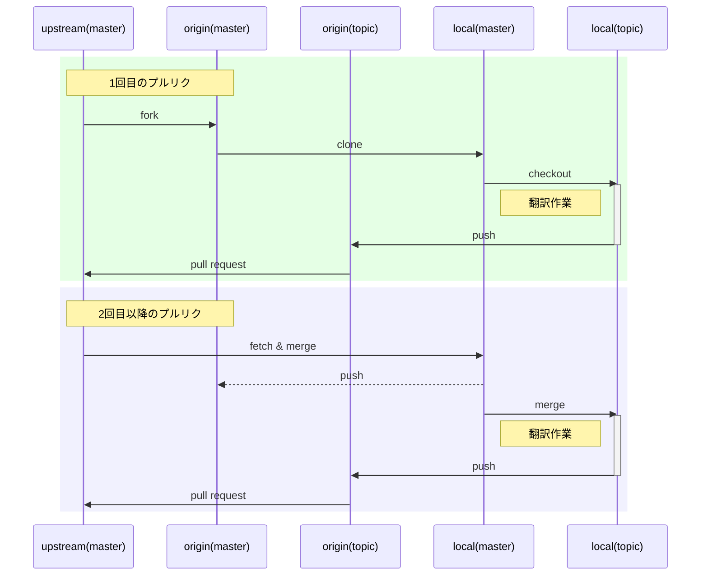

## はじめに

:::details ChangeLog
- 2023-08-16
  - "Fork and pull model" についての記述を追加
  - mermaidダイアグラムの修正と追加
  - 内容のリライト
  - GitHubで完結するモデルについての記述を追加
:::

[Obsidian](https://obsidian.md) というソフトウェアの UI とヘルプドキュメントの翻訳と保守を有志で行っています。翻訳作業を通してプルリクエストのやり方を学び、良い機会だと思ったので git と GitHub の使い方からプルリクエストによって共同で翻訳作業をしていく方法を紹介していこうと思います。

:::message
今回紹介する方法では GitHub での共同開発のモデルの一つである "**Fork and pull model**" を使いますが、このワークフローについては詳細に解説された記事があまりありません。この記事では Obsidian の翻訳だけでなく、Fork and pull model を使った一般的な開発や翻訳のワークフローについての方法を解説します。
:::

### 翻訳から始めるOSS

初学者の観点から git の概念やつまずいたところやコマンドの使い方、プルリクエストまでの流れなどをまとめています。次のような記事もあるので、翻訳作業を通して git の使い方をマスターするのは結構おすすめだと思います。

https://qiita.com/yhay81/items/3773ab2e001a9e39ccc8

次のような OSS(オープンソースコミュニティ) へのプルリクエストに関する記事なども参考になりますが、翻訳での継続的なプルリクエスト (2 回目、3 回目~) についての全体の流れがわかる記事はあまり見たことがありませんでしたので主にその点について書いてみました。

https://qiita.com/y-vectorfield/items/b955617712f3b66359f2

ドキュメントの翻訳作業をしてみたいが、やり方がよく分からないという方、Git 初心者に役立てばよいなと思います。

また、UI ではなくヘルプドキュメントの翻訳作業を念頭において書いています。というのもヘルプドキュメントは大量のファイルを扱うので、GitHub 上ではなくローカル環境でしっかりと作業する必要があります。ローカルでの翻訳作業からプルリクエスト作成を通して Git や GitHub の基本的な使い方がマスターできます。翻訳作業そのものに関しては素人なので注意してください。

実際に翻訳されたヘルプドキュメントが Obsidian の公式サイトで公開されています。

https://publish.obsidian.md/help-ja/

上のドキュメントで表現の向上 (こうしたほうがよい) や誤訳、タイポなどを見つけた場合には公式リポジトリや Fork したリポジトリでもいいので issue かプルリクエストを作成してください。

https://github.com/obsidianmd/obsidian-docs/

### 最低限必要な知識や事前に必要なもの

作業を始めるのに次の最低限必要な知識やアプリケーションなどは準備するようにしてください。

- CLI の使い方の基本
- git のインストール
- GitHub のアカウント作成
- VScode などのテキストエディタ

### 主なソース

- [エンジニアのためのGitの教科書](https://amzn.to/3dcc9h5)
  - 薄くてわかりやすいのでおすすめです。わからなくなったら読むといいです。
- [GitHub で Fork してから Pull Request をするまでの流れ](http://kik.xii.jp/archives/179)
  - 最初のプルリクエストの流れが分かりやい記事ですが、2 回目以降については言及がなかったので補足します。また `rebase` や `push -f` など初心者が使わない方がよいです。
- [初めてのPull Request(プルリクエスト)](https://kaworu.jpn.org/kaworu/2017-10-19-1.php#2017-10-19-1-7a386224b42e28c840ef6ce67c51ca62)
  - OSS でのプルリクエストについての記事で、図はないですが細かく、分かりやすいです。

## 周辺概念

### リポジトリとプルリクエスト

リポジトリとは雑にいうとフォルダです。git を使うとそのリポジトリ内部 (フォルダ) でさまざまな変更を行い特定の時点の状態そのものをある点 (`commit`) として保存管理できます。プルリクエストとはそのように自身のリポジトリ内にて行った変更を、GitHub 上 (ウェブ上) にある他のリポジトリに対して統合 (`merge`) するように申請する仕組みです。

### Fork and pull model

GitHub を利用した共同開発のモデル(collaborative development model)には以下の２種類があります。

- **Fork and pull model** (フォーク&プルモデル)
- **Shared repository model** (共有リポジトリモデル)

オープンソースのプロジェクトでは「**Fork and pull model**」という複数のリポジトリとプルリクエストを使用して開発や翻訳を行うモデルがよく使用されます。逆にクローズドソースのプロジェクトなどでは「**Shared repository model**」がよく使用されます。

これらのモデルについては GitHub 公式ドキュメントの以下のページで概要が解説されていますが、図などが存在せず、解説自体もかなり分かりづらいのでサードパーティで書かれた記事などで情報を補うことになります。

https://docs.github.com/en/pull-requests/collaborating-with-pull-requests/getting-started/about-collaborative-development-models

Fork and pull model については以下の記事などで比較的分かりやすい図や説明が記載されているので、この記事の説明を補う形で参考にしてみるとよいと思います。

- [Github で Fork してから Pull Request をするまでの流れ](http://kik.xii.jp/archives/179)
- [The Git Fork-Branch-Pull Workflow](https://www.tomasbeuzen.com/post/git-fork-branch-pull/)
- [Fork-Based Contribution Model](https://jenkinsci.github.io/templating-engine-plugin/2.5/contributing/fork-based/)
- [Using Gitflow with the GitHub Fork & Pull Model](https://www.dalescott.net/using-gitflow-with-githubs-fork-pull-model/)

Fork and pull model を簡単に説明すると、fork (リポジトリの複製) と pull request (変更のマージリクエスト) を使って安全に他者のリポジトリにコントリビュートできるモデルです。

より具体的には、公式のリポジトリをまず fork して、自分のアカウントに複製されたリポジトリを作成します。その複製した fork リポジトリに自身の変更を反映させていき、一定の変更の塊を元々の公式のリポジトリへと反映させるプルリクエスト(PR)を作成します。このプルリクエストが元々のリポジトリの管理者によってレビューされ、承認、つまりマージされることで自身の行った変更が公式のリポジトリへと実際に反映されます。

簡単なパッチ修正などは実は GitHub や github.dev だけで済ませることが可能です。この際のワークフローではローカルリポジトリを介さない以下のようなモデルとなります。筆者は MDN の翻訳なども最近行っていますが、日本語などの間違いなどを見つけた場合には実際に以下のワークフローで修正して PR を作成します。


継続的な翻訳や開発などでじっくり作業したかったり、npm script などで linter や formatter なども走らせたい場合にはローカル環境にリポジトリを clone して作業を行います。

:::message alert
clone と fork は両者ともに「リポジトリの複製」を行いますが、以下のように異なる概念なので注意してください。

- fork: GitHub 上の他者のリモートリポジトリを自分のアカウントで別のリモートリポジトリとして複製する
- clone: GitHub 上のリモートリポジトリをローカル環境に複製する
:::

この際のワークフローは上記のモデルをローカル作業を追加します。ブランチまで含めて図にすると以下のような感じで、かなり複雑です。簡単なパッチ修正を除いて、オープンソースの開発や翻訳についてローカルでガッツリ作業を行う際にはこのモデルを使った以下のようなフローをまず習得する必要があります。


2021 年頃に追加された GitHub 上での Fork リポジトリの同期機能(**Sync fork**)を使うともう少し分かりやすいフローになります。

https://github.blog/changelog/2021-05-06-sync-an-out-of-date-branch-of-a-fork-from-the-web/


:::message alert
２つのバージョンの違いは単に origin リポジトリの master ブランチの更新をどのようにするかという方法の違いにすぎないのでワークフローに本質的な違いはありません。この記事では伝統的な通常バージョンのフローを解説します。

また、図の "pull" の部分はやっていることは "fetch & merge" であり、"topic" ブランチは任意の作業ブランチのことを示しているので、適宜読み替えてください。
:::

このモデルが利用されているプロジェクトで代表的なのは MDN のドキュメントやその翻訳プロジェクトなどです。

https://github.com/mdn/content

https://github.com/mdn/translated-content

このモデルでのやり方を覚えれば上記のような翻訳やオープンソースの開発プロジェクトなどに参加できるようになりますのでぜひとも覚えておくことを推奨します。

### 必要な３つのリポジトリ

Fork and pull model において、プルリクエストを作成してマージ (変更の統合) を行うまでの流れには、**合計３つのリポジトリを使用します**。この３つというのがなぜ必要なのかが最初分かりづらかったので注意してください。

必要なリポジトリとして、1 つ目は公式のリポジトリ (オリジナルのリポジトリ) で、これを **upstream** (上流) という名前で便宜的に識別します。2 つ目は GitHub の自分のアカウント上に upstream の複製リポジトリを作成します。この行為を fork すると呼びます。この fork によって作成されたリポジトリを **origin** として識別します。origin や upstream はリポジトリの名前として考えてください。この origin と upstream はユーザーにとってはオンライン上に存在するので「**リモートリポジトリ**」と呼びます。

3 つ目は、自分の PC 上での作業のために origin リポジトリから更にローカル環境に複製リポジトリを作成 (clone) します。clone による複製と fork による複製の違いに注意してください。基本的には、この複製されたリポジトリで編集作業を行っていきます。ローカル環境上にあるリポジトリなので先程のリモートリポジトリに対して「**ローカルリポジトリ**」と呼びます。このリポジトリを origin や upstream と同様に **local** という名前で識別します。

これらの３つのリポジトリを使って以下の図のワークフローに従い、プルリクエストを通じて非同期的な共同編集を行います。


なお、upstream は自分が管理するリポジトリではなく、他者が管理するオリジナルのリポジトリです。origin は upstream から複製された自分が管理するリポジトリなので自由に編集できます。しかし、実際に触るのは origin ではなく「**ローカル上のリポジトリである local**」です。このあたりが紛らわしいのですが、オンライン上で作業するよりもローカルで作業するほうが軽く、常にネット接続している必要もありません。ゆえにリポジトリ local で編集作業を行い、その変更をもとのリポジトリ upstream に統合することによって共同で翻訳作業を行っていくわけです。ですが local からいきなり upstream に対して変更を申請することはできません。local から自分の管理するリモートリポジトリ origin に一度変更を反映させる必要があります。その後、origin から upstream に対して変更の統合を申請するというのがプルリクエストの流れになります。

このように、リポジトリの複製の流れや内容変更の反映の流れが複雑になるのでつまづきポイントが結構あります。

表にしてまとめると以下のような３つのリポジトリを使用します。

リポジトリの識別名 | リポジトリの内容 | 備考
--|--|--
**upstream** | オリジナルのリモートリポジトリ | 他人が管理
**origin** | fork して複製した自分のアカウントにあるリモートリポジトリ | 自分が管理
**local** | 自分のローカルマシンに clone したローカルリポジトリ | 自分が管理、ここで編集を行う

### ブランチについて

利用するリポジトリが３つあるわけですが、更にブランチという概念が追加されます。リポジトリでは特定の時点の情報の状態をコミットという形で保存しています。このコミットからさらに変更を加えて意味ある形で再びコミットを作成していくと、コミットが時系列によって連結されたブランチ (枝) ができあがります。枝のある点から全く別の点を派生させることで枝を分岐させることができます。

イメージでまとめると、箱 (リポジトリ) の中に点 (コミット) が時系列に連結した枝 (ブランチ) が存在しているような感じです。分岐して存在する複数の枝の先端の点は枝そのものの名前として扱われます。master ブランチやそこから派生させてつくった作業ブランチなどです。イメージで言うと、プルリクエストというのはリポジトリ upstream の主要な枝 (master ブランチ) の先頭に自分が編集した変更情報を点として (コミットとして) 連結する操作です。

ブランチは各リポジトリごとに存在します。つまり、**upstream の master ブランチ、origin の master ブランチ、local の master ブランチというような感じで重複した名前のブランチが存在**しますが、それぞれは別のものなので注意してください。

結局のところ、翻訳作業で実際に触るのはリポジトリ local ですが、local の master ブランチは基本的には触りません、**master ブランチから派生させた作業ブランチ**(自分で名前をつける) 上で編集します。

結局、言葉で説明しても限界があるので検索して図などで理解するのがよいと思います。また実際に Git を使って**ブランチ操作**をやってみるとわかってくると思います。

参考: [マンガでわかるGit 12話「本家リポジトリに追従する方法」](https://next.rikunabi.com/journal/20180322_t12_iq/)

## (1) 最初のプルリクエストまでの流れ

では、実際にプルリクエスト作成までの流れを説明していきます。最初に流れを時系列順に並べます。その後に具体的な操作について説明していきます。※ブラウザ上での操作とターミナル上での操作があることに気をつけてください。

0. GitHub のアカウントプライバシーを設定し、Git で日本語ファイルが文字化けをしないように設定する
1. 公式リポジトリから自分のアカウントのリポジトリに fork する
2. ローカル環境に fork したリポジトリを clone する
3. コーディングスタイルを確認
4. 作業ブランチを作成してチェックアウト
5. 作業ブランチにて翻訳開始
6. ある程度の作業まとまりで add/commit する
7. origin に push する
8. GitHub にてプルリクエストを作成し、承認を待つ
9.  プルリクエストに修正があれば修正後 origin に再び push する


### 実際のやり方

上の 0〜9 までの流れを説明していきます。

共同で編集するということで、まず GitHub のアカウントプライバシーの設定を行います。デフォルトの状態だと PC のユーザー名と GitHub で登録してアカウントが commit log に表示されてしまいます。このままプルリクエストを出して承認されてしまうと面倒です (表示されてもよいという方はやらなくて結構です)。

参考: [GitHubにホストされているGitからの個人情報流出を防ぐために](https://tkhs0604.hatenablog.com/entry/github-email-exposure)

次に Git で日本語ファイルの文字化けを回避するためにコマンドを打ちます。

```shell
git config --global core.quotepath false
```

それでは最低限準備したので、本格的に作業を開始します。まず upstream を fork して origin を作成します。GitHub のリポジトリページから右上の fork ボタンをクリックすると自分のアカウントにリポジトリが複製されます。


ここまで GitHub でできたら、ターミナルを開き、作業ディレクトリを作成しフォークした自分のアカウントにあるリポジトリをクローンします。

```shell
git clone リポジトリのURL
git clone https://github.com/yo-goto/obsidian-docs.git
# ローカルにリポジトリをclone
git branch translation
# 作業ブランチtranslationの作成
git checkout translation
# 作業ブランチにチェックアウトする
git branch -a
# ブランチの確認
```

作業ブランチにチェックアウトしたら Obsidian や VSCode でリポジトリを開き実際に翻訳作業を開始します。編集するフォルダは日本語用のフォルダのみとして他の言語フォルダを編集しないよう注意してください。

翻訳作業が一通り終わったら `git add` でステージングして、`git commit` して保存します。日本語のフォルダのみ変更を加えるため add するのは日本語フォルダ (Obsidian の場合だと `ja`) 以下となります。つまりフォルダごとに add する場合には `git add ja/FolderName` と打つようになります。`git add -A` などのコマンドを利用してしまうと他の言語フォルダを間違って編集してしまった場合にそれらの間違った変更も追加してしまうことになるので `git add -A` などは使わずにフォルダ単位、ファイル単位で add を行うように気をつけてください。

```shell
git add ja/folderName_1
git add ja/folderName_2
# ファイルごと、フォルダごとにaddする
git committ -m "ja: update"
# コミットメッセージを添えてコミット
git push origin translation
# originの作業ブランチtranslationにpush
```

origin(リモートリポジトリ) の作業ブランチに push したら GitHub にてプルリクエストを作成し送信します。master ブランチではなく作業ブランチ translation からプルリクエストを作成する点に注意してください。「Compare & pull request」ボタンを押して、内容に関するコメントを適度に書き承認を待ちます。


master ではなく push した作業ブランチになっていることを確認してください。作業ブランチになっていれば「Compare & pull request」ボタンをクリックしてください。更新内容について簡単に説明コメントを記載して「Create pull request」ボタンを作成すればプルリクエストの作成完了となります。


プルリクエストが承認されるまでは次のようなページが表示され「open」状態になります。リポジトリの管理者や他のコントリビューターからプルリクエストについてのコメントがあれば下に表示されます。


あとは承認される (マージされる) のを待ちつつ作業するか、作業を中断します。

`git push` した後、時間がたってしまうと「Compare & pull request」が非表示になる場合があります。これであわててしまうことがあるので注意してください。非表示になっている場合には「Pull requests」のセクションに進み、右側にある「New pull request」ボタンをクリックしてください。


フォークを利用したプルリクエストを作成する場合にはデフォルトの状態ではできないので、「compaer across forks」のリンクをクリックして、比較するブランチを upstream ではなく origin の作業ブランチにします。


ここまでやって「Create pull request」ボタンをクリックすることでプルリクエストが作成できるようになります。


プルリクエスト作成後に内容を修正する場合には、そのままの状態でローカルで修正を加えた後で同様に add/commit して origin の作業ブランチ translation に再び push します

```shell
git add ja/修正を加えたフォルダやファイル名
git commit -m "コミットメッセージ"
git push origin translation
# originの作業ブランチに再度pushする
```

これによってプルリクエストの内容が自動修正されます。


プルリクエストが承認されたら (マージされたら)、公式のオリジナルのリポジトリ (upstream) の master ブランチが自分の作成したプルリクエストの内容がマージされた状態となります。


基本的にはこの流れで作業終了となりますが、ヘルプドキュメントでは更新は定期的にあるため、時間が経過したら再び翻訳内容が追加され、再び翻訳作業をしプルリクエストを作成することになります。2 回目以降はいままで流れと若干異なり、ローカルのブランチを更新する作業がでてくるので注意してください。

## (2) 2 回目以降のプルリクエストの流れ

9. upstream の追加と確認
10. ローカルの master ブランチを upstream の最新に追いつかせる
11. origin の master に push
12. 以下のいずれかを行う
  a. master の最新内容を前の作業ブランチに merge して反映してからチェックアウト
  b. 要らない作業ブランチを削除し作業ブランチを作り直しチェックアウト
1.  更新された内容との差分を確認しながら翻訳再開する
2.  add/commit した後に origin に push する
3.  GitHub にてプルリクエストを作成し、承認を待つ
4.  プルリクエストに修正があれば修正後 origin に再び push する


### 実際のやり方

上の 9〜16 までの流れを説明していきます。

#### 翻訳作業再開するまで

作業を再開するために、ローカルリポジトリ (local) の master ブランチの内容をこのオリジナルのリモートリポジトリ (upstream) の master ブランチの状態に追いつかせる必要があります。

まず remote の設定を確認し、upstream として追加します。次のコマンドで upstream という名前でオリジナルのリモートリポジトリを追加します。_この作業は 3 回目以降のプルリクエストからは必要ありません_。

```shell
git remote -v
# fork元の公式オリジナルのリモートリポジトリがremoteのupstreamとして設定しているか確認する。
git remote add upstream fork元のURL
# upstreamとして設定する
git remote add upstream https://github.com/obsidianmd/obsidian-docs.git
```

upstream から最新を fetch して local の master ブランチにマージしてあげます。local の master ブランチが最新になったら自分のリモートブランチ (origin) の master に push して反映させます。上で提示した 9〜16 までの流れの 12(a) になります。

```shell
git checkout master
# masterブランチにチェックアウトする
git fetch upstream
# upstreamから更新情報をとりよせる
# 更新情報は upstream/master に
git merge --ff-only upstream/master
# ファストフォワードマージを行い、リポジトリlocalのmasterブランチを最新にする
git push origin master
# 自分のリモートリポジトリ(origin)のmasterブランチにその最新内容を反映させる
```

`git mrege` コマンドでは、オプション `--ff-only` をつけることでファストフォワードマージでマージを実行します。

#### 翻訳作業再開

```shell
git checkout translation
# 作業ブランチにチェックアウトする
git status
# 作業ブランチに変更がないか調べる(もしなにかあればコミットしたり、stashしたりして退避させる)
git log --all decorate --graph --oneline
# グラフを出してコミットのハッシュ値を確認できる。作業ブランチtranslationのハッシュ値をしらべる。冒頭の数桁のみでよい
git show HEAD
# これでも最新のコミットのハッシュがわかる(あとでハッシュ値を使う)
git merge --no-ff master
# 最新内容であるlocalのmasterを作業ブランチにリカーシブマージさせる(これを行うとマージメッセージの入力画面がvimモードででるので適当なメッセージを書いて終了)
```

マージを `--no-ff` オプションで行うとリカーシブマージになります。これを行うと Vim が立ち上がりマージコミットのメッセージを書くことになります。Vim の使い方 (挿入モードや保存終了の方法) を簡単に調べておくとよいです。

前回から更新された内容を確認するため差分を表示させます。上で調べた前回コミットのハッシュ値と master ブランチとの差分を確認します。

```shell
git diff ハッシュ値 master
# これでも差分を確認できる。ハッシュ値は冒頭の数桁の数字をいれればよい
git diff 78d63a7 master en/
# masterブランチとコミット78d63a7間でenフォルダについての差分を確認できる
git diff 78d63a7 master en/Pulgins/
# Pluginフォルダの内容だけ差分を見る
git diff 78d63a7 master en/Pulgins/test.md
# test.mdのファイルの差分を見る
git diff 作業ブランチ master en/
# ブランチで比較
```

更新内容が複数のファイルや追加内容が多い場合にはターミナルで diff を使うよりも [GitHubのcompare機能](https://docs.github.com/ja/github/committing-changes-to-your-project/comparing-commits) や VSCode などの差分表示機能 (特に [GItLens](https://marketplace.visualstudio.com/items?itemName=eamodio.gitlens) などの拡張機能) を使った方がよいですが、なれるまでは `git diff` を使ってひとつずつやる方が後学のためになると思います。


差分を確認しながら作業ブランチにて追加内容分の翻訳作業をすすめていきます。ターミナル上で `git diff` を使って差分表示させると修正前と修正後が赤と緑で表示されるので、その内容をみながら日本語版での内容を追加修正していきます。Obsidian の場合、英文 (原文) のドキュメントフォルダ (en/) と日本語などの他言語用のフォルダ (ja/など) は別れています。なので diff を使うときには英語のドキュメントフォルダを対象に差分を見ます。その差分から追加された部分を見て、翻訳を開始します。

##### なるべくマージしないで作業する方法

作業ブランチに master をマージするのではなく、作業ブランチを毎回新しく作りなおす方法を行ったほうがわかりやすいことがあります。個人的に慣れるまではこの方法を行っていたので、マージの意味がよくわかっていない場合には、こちらの方法をとるのがよいです。上で提示した 9〜16 までの流れの 12(b) です。(a) を行わない代わりに (b) をやるという感じですね。

プルリクエスト承認後、`git merge --no-ff master` をやらずに次の操作を行います。

```shell
git checkout master
# masterにチェックアウト
git branch -d translation
# プルリクエストが承認されたので作業ブランチを削除してしまう
git branch -a
# ブランチが削除されたことを確認
git branch translation
# 作業ブランチを最新のmasterから作り直す(分岐させる)
git checkout translation
# これで最新内容になった作業ブランチで作業再開できる
```

マージの意味が理解できたら、いちいち作業ブランチを破棄して作り直す方法をとらずに、マージによって作業ブランチの内容を最新にすればよいです。

#### 作業終了後にプルリクエスト作成

初回のプルリクエストまでの流れと同じく add/commit 後に自分のリモートリポジトリ (origin) の作業ブランチに push します。

```shell
git add ja/folderName_1
git add ja/folderName_2
# ファイルごと、フォルダごとにaddする
git committ -m "ja: update"
# コミットメッセージを添えてコミット
git push origin translation
# originの作業ブランチtranslationにpush
```

push を終えたら同じように GitHub で作業ブランチ translation からプルリクエストを作成し承認を待ちます。

### 流れのまとめ

シーケンス図でのまとめです。



:::message alert
`topic` は任意の作業ブランチのことを示しています。
:::

## (3) 慣れたらやってみること

### プルリクエストの分割

別々の意図でプルリクエストを分割できる。ローカルブランチを複数きって別々に `git push` を行い、それぞれでプルリクエストを作成することでプルリクエストの分割を行えます。内容追加と修正でプルリクエストを分割するなどができるようになります。

### Git client の利用

Working Copy などの Git client を利用してモバイルで作業すると暇なときに翻訳作業を行うことができます。こちらでもメールアドレスを GitHub で設定した同一のもにする必要があります。

### vscode の拡張機能で作業効率アップ

GitLens や GitGraph などの拡張機能を入れることで作業効率を上げることができます。


GitLens を利用すればブランチ間 (コミット間) の差分を簡単に確認しながら翻訳作業を行えます。更新された部分のみを見ながら翻訳を追加できます。

## 他によく使うコマンドの概説

```shell
git checkout -b branchName
# ブランチを新規作成した上でチェックアウトする

git merge --no-ff branchName
# non fast-forward(recursiveマージ)
git merge --ff-only branchName
# fast-forwardマージできるならマージする、できない場合にはマージしない

git rm fileName
# git監視下でファイル削除
git mv 旧ファイル名 新ファイル名
# ファイルの名称変更
git mv fileName folderpath
# ファイルの移動

git config --global list
# globalのconfig確認(ユーザー情報などの確認)
git log --graph --oneline
# ログをグラフとして簡易表示
```

リモートブランチ関連

```shell
git push --delete origin branchName
# リモートブランチの削除
git checkout -b branchName origin/branchName
# リモートブランチをローカルにcheckout
```

### fork syncバージョンでやってみる

2021 年頃に追加された GitHub 上での Fork リポジトリの同期機能([Sync fork](https://github.blog/changelog/2021-05-06-sync-an-out-of-date-branch-of-a-fork-from-the-web/))を使うことで origin の master に `push` したり、upstream の master から `pull` しなくてもよくなります。


GitHub 上で fork リポジトリ(`origin`)の "Sync fork" ボタンから "Update branch" ボタンをクリックすることでそのリポジトリの master (あるいは main) ブランチを upstream に追従でき、ローカルで以下のコマンドを実行することで local の master を更新できます。

```sh
git pull origin master
```

## 翻訳そのものについて

### 自由にやると結構楽しい

翻訳の厳密性はプロジェクトごとに色々あると思いますが有志の翻訳であれば、ある程度のゆるさがあっても大丈夫だと思います。あまり気にしすぎずに挑戦してみるとよいと思います。分からない表現や専門用語はどんどんネットで検索しましょう。自分の場合には、不自然な日本語になるくらないなら解釈から相当する自然な言い回しを優先しています。文も切ったりつなげたり、結構自由にやっています。参加者の少ない日本語翻訳のプロジェクトの場合、このように自分の好きなようにできるのも利点だと思います。一方、人数が少ないと校正や、表現性の向上、誤訳やタイポなどの修正があまりできないのが難点です (textlint を使うのがいいかもしれません)。

Obsidian の翻訳プロジェクトでは、翻訳に問題や修正、追加内容があれば誰でもプルリクエストや issue を GitHub に作成できるスタイルでやっているので翻訳作業自体は結構はやいスピードで進みます。もちろんニッチなソフトウェアのベータ版という開発途中のもの故にこのような自由な事ができるわけで、他のメジャーなソフトウェアやサービスではなかなか難しいのではないでしょうか。

他の翻訳プロジェクトってどうやってやっているのかと思って他のサービスなどちょっと調べてみました (スケールによって結構違いますねやはり)。

- [Notion Community Translation Guide](https://www.notion.so/Community-Translation-Guide-d1a37aa2e22f4c9daf2a1efe9ae13bc2)
- [Hugo Docs Japanese | Hugo Documentation の和訳・日本語翻訳プロジェクト](https://hugojapan.github.io/)
- [yohamta/typescript-book-jp: TypeScript Bookの日本語訳です。](https://github.com/yohamta/typescript-book-jp)

### 日本語表現が難しい

英文の解釈よりも日本語の表現が難しいです。英語で理解できても日本語自体の表現や語彙のストックがないので (笑)、どうしても直訳っぽくなってしまい、他のアプリケーションやサービスのドキュメントの日本語訳版などを参考にすることもありました。また、他の言語翻訳者がどのように翻訳しているのか Google 翻訳などを使って見ていました (例えばイタリア語やロシア語など)。

実際のところ、まだ稚拙な表現が多いかもしれませんが、現在は「とりあえず翻訳を完成すること」を念頭にプルリクエストで修正点や校正などをはさみつつクオリティを上げていくようにしています。

### UI とヘルプドキュメントの一貫性

また、自分の場合はヘルプドキュメントから翻訳をはじめましたが途中から UI との整合性を図るためにヘルプドキュメントでは UI をベースとした説明文になるように注力しました。UI の翻訳では json ファイルの文字列を翻訳していく形でしたが、英文の文字列を見てもどういった操作なのかわからないことが多いので、実際に Obsidian の画面を出してどの部分の文字列なのか確認しながらやらないといけませんでした。

Obsidian は Electron ベースで開発されているので developer tool が使えます。翻訳であやしい部分があれば UI にあっているか、developer tool で実際に変えてみて合うかどうかを確認しています。

他に、特段注意すべきことは、句読点やスペースや半角全角などの表記ルールや語彙対応表などを早いうちから作成しておくと良いです。あとから整合性を整えるのは面倒なので最初から表現や単語のルールを統一しておきましょう。UI との整合性もを考える上で重要です。といってもいきなりルールを想定することはできません。その場合は翻訳しているうちに必要なルールがどんどんでてきますので、その都度はやめに追加していくのがよいです。表記のスタイルについては [Wrodpressの翻訳スタイルガイド](https://wordpress.com/ja/support/translation-style-guide/) や [JTF(日本翻訳連盟)](https://www.jtf.jp/tips/styleguide) の翻訳スタイルガイドなどが参考になります。ルールを新たに追加する際には既存のドキュメントに対してルールを追加するためテキストエディタの検索と置換機能を駆使して全体に適応します (これも textlint でできそうです。プリセットルールで JTF-style なるものが存在します)。

## 他参考サイト

[Gitをインストールしたら真っ先にやっておくべき初期設定 - Qiita](https://qiita.com/wnoguchi/items/f7358a227dfe2640cce3)
