## はじめに

お久しぶりです。

今回の記事では、これまで書いてきた以下の TypeScript の型についての話をさらに発展させた内容について語っていきたいと思います。

- [TypeScript における型の集合性と階層性](https://zenn.dev/estra/articles/typescript-type-set-hierarchy)
- [TypeScript の Widening](https://zenn.dev/estra/articles/typescript-widening)
- [TypeScript の Narrowing](https://zenn.dev/estra/articles/typescript-narrowing)

というのも、実はこれまでリサーチしていた TypeScript の型が構成する代数的構造についての知識がある程度の内容としてまとまってきたので、改めて記事にしておきたいと思いました。

なお、部分型を使う型システムを持っている言語は TypeScript だけではないので、Scala や Kotlin といった部分型を使用している他の言語にも応用が効く話となっています。

:::message alert
この記事ではかなり多くの数学概念や用語を使いますが、ここでは数学的な厳密性よりもそれらの諸概念を型について理解するためのツールとして利用しています。

また、筆者の調査能力と数学能力の限界で、かなり危ない議論をしているかと思いますが、これを読んでくれた皆さんによるツッコミやさらなる調査・検証によって TypeScript 型世界の意味論を解き明かしてくれることを期待していますので、ご協力よろしくお願いします。
:::

## 表示的意味論

型についてのメンタルモデルについて考える上で、プログラミング言語の意味論は重要な概念です。

プログラムというのは実際にはただの有限個の記号列ですが、それに対して実行したりなんらかの意味を与えて解釈するための定義することや枠組みそのものをプログラム意味論と言います。

意味論にはいくつかの種類が存在しますが、その一つである「表示的意味論 (denotational semantics)」では、プログラムの実効方法とは関係なく、なんらかの数学的な構造に対応させて意味を定めるようなアプローチであり、項 (変数や値、式など) の意味が数値や関数などの数学的な対象として捉えます。この方法では、メモリや詳細な計算ステップなどについてはすべて捨象して、プログラムの抽象的な本質部分にフォーカスして考えます。

## 型のメンタルモデル

表示的意味論を考える上で、この記事で紹介する型についての見方、あるいはメンタルモデルを構築するための数学的なツール (概念) は以下の４つです。

- 集合論による見方 → 冪集合
- 順序理論による見方 → 有界束
- 環論による見方 → 半環
- 圏論による見方 → 前順序集合の圏

それぞれの数学理論と代数的構造は相互に関連しており、大雑把に行ってしまえば TypeScript の型の集まりは上記のような４つの別々の見方ができます。それぞれのツールを使うことで型が持つ性質や機能についてその見方に立って別々の方向から推論することができるようになります。

それぞれの構造が持つ代数法則に基づいて機能の振る舞いを予測できるので、公式ドキュメントには書いていない裏ルールとして機能するかもしれません。もちろん実装とモデルが正確に一致していないような場合もあるでしょうが、大雑把にはこのような性質を持つ概念に対応すると考えることで機能についての推論 (特に型の互換性についての推論) が可能となります。

:::message
代数的構造というと群 (group) を始めとする演算を備えた集合の数学的構造が一般的には考えられ、その捉え方としては上記の「半環」が最も代数的構造らしいものに相当しますが、ここでは上記すべてについて代数的構造 (あるいはそのような見方) と呼ぶことにしています。
:::

## 代数的構造と代数法則

代数的構造 (Algebraic structure) は、集合上に定まった演算により決まる構造のことであり、形式的には元となる集合 (**台集合**と言います) $S$ とその集合上に定まった演算 $*$ の組 $(S, *)$ のことを言います。

さて、代数的構造というからにはその構造が持つ演算はなんらかの代数法則 (laws of algebra) を満たしています。代数法則は以下のような恒等式 (identity) などによって表現されます。

$$
(a + b) + c = a + (b + c) \quad \forall a,b,c \in S
$$

上記の恒等式は「**結合律** (associative law)」と呼ばれる代数法則で、自然数全体の集合における加法演算 $+$ や乗法演算 $*$ などはこの結合律を満たします。

:::message
$\forall a, b, c \in S$ の $\forall$ は "for all" つまり集合 $S$ 内の任意のあらゆる要素 $a, b, c$ についての言及を表現しており、上記の式では任意の３つの要素について成り立つ恒等式となっています。
:::

代数的構造には様々な種類があり、例えば「半群 (semigroup)」と呼ばれる構造は最もシンプルな代数的構造であるマグマ (magma) に上記の結合律を加えたものです。

マグマ自体は、集合 $M$ とその上に定義された閉じた一つの二項演算 $*$ からなる組 $(M, *)$ のことです。マグマは演算がその集合 $M$ に閉じている (つまり演算結果が元の集合 $M$ に属している) ことのみを要求する構造でその他の追加の代数法則については何も言及しません。

代数法則にも様々な種類があり、集合上の演算が特定の代数法則を満たしていればその法則を満たす代数的構造であると言えます。例えば、「群 (group)」と呼ばれる構造は以下の代数法則を満たします。

- 結合律 (associative) : $(a * b) * c = a * (b * c)$
- 単位元 (unit element) : $a * e = a = e * a$
- 逆元 (inverse element) : $a * b = e = b * a$

例えば、整数全体の集合 $\mathbb{Z}$ 上の加法演算は上記の法則を明らかに満たすので、群と言えるでしょう。
$$
\begin{lgathered}
(a + b) + c = a + (b + c) \\
0 + a = a = a + 0 \\
a + (-a) = a = (-a) + a
\end{lgathered}
$$
もちろん、群は半群やマグマの条件を満たしているので、半群でもありマグマであると言えます。このようにある集合と演算の組は複数の代数的構造をもっているということも言えます。

さて、型の集まりも、集合としてなんらかの演算を持っており、いくつかの代数法則に従って演算が可能な体系になっています。そして、型の集合が構成する体系には数学的なモデルがあり、なんらかの概念的な名前がついています。それらの概念から逆に型の集合が満たす性質について理解を深めることができ、型同士の演算結果を自分自身で推論できるようになります。

## 構造的部分型の基礎

### 部分型関係

代数的構造や代数法則のモデルが頭にあることで型の互換性についての推論が可能になるといいましたが、そもそも型の互換性とはなんでしょうか?

TypeScript は「**構造的部分型** (structural subtyping)」の型システムを持ちますが、構造的であるとは、型の形状 (shape) が同じであれば部分型として扱えるということです。

そもそも部分型関係とは、ある型 $S$ の項が別の型 $T$ の項が期待されている文脈で安全に使用可能であるということを定める関係性のことで、部分型互換性はその部分型関係に基づく**型同士の互換性の概念**です。部分型関係は $S <: T$ と表記して、このときに型 $S$ は型 $T$ の部分型 (subtype) であると言います。

以下のようなオブジェクト型 `A` と `B` について考えてみると、両者の型は `fst` というプロパティの型が同じであり、その箇所についての型の形状が同じです。結論から言えば型 `B` は型 `A` の部分型であり、$A :> B$ と表記できます。

```ts
type A = { fst: number; };

type B = { fst: number; snd: string; };

// A型が期待される文脈でB型の項を割り当てることができる
const b1: B = { fst: 42, snd: "st", };
const a1: A = b;

// その逆はできない(安全に置換できない)
const a2: A = { fst: 42, };
const b2: B = a2;
//    ^^ Error: プロパティ 'snd' は型 'A' にありませんが、型 'B' では必須です。
```

プリミティブ型とリテラル型、そのユニオン型についての互換性について考えてみると以下の３つの型は $Group :> Some :> Unit$ という部分型関係になります。

```ts
type Group = number;
type Some = 1 | 2 | 3;
type Unit = 1;

const u: Unit = 1;
const s: Some = u;
const g: Group = s;
```

`number` や `string` のようなプリミティブ型はその型の具体的な要素となる値を集めた集合的な型 (collective type) といえます。そして `42` や `"st"` のような具体的な値からなるリテラル型は具体的な型 (concrete type) と呼ばれます。部分型関係は集合の包含関係 (inclusion) としてみなすことでうまくイメージがしやすくなり、型 $A$ という集合に型 $B$ が包含されるなら、型 $B$ は型 $A$ の部分型であり、$A \subseteq B$ なら $A :> B$ であると考えることができます。

全体集合と空集合の概念に対応する `unknown` 型 (Top 型) と `never` 型 (Bottom 型) を加えれば更に集合的なイメージに合致します。

```ts
type Universe = unknown;
type Group = number;
type Some = 1 | 2 | 3;
type Unit = 1;
type Empty = never;

declare const e: Empty;
const u: Unit = e;
const s: Some = u;
const g: Group = s;
const u: Universe = g;
```

この場合には部分型関係は以下のようになっています。

$$
Universe :> Group :> Some :> Unit :> Empty
$$

このように型を集合論に扱ったり、考えたりできることは次の記事で書きました。

https://zenn.dev/estra/articles/typescript-type-set-hierarchy

ただし、型が厳密に集合であるかどうかについては話は別です。型理論は素朴集合論についての矛盾として有名な「[ラッセルのパラドックス](https://ja.wikipedia.org/wiki/%E3%83%A9%E3%83%83%E3%82%BB%E3%83%AB%E3%81%AE%E3%83%91%E3%83%A9%E3%83%89%E3%83%83%E3%82%AF%E3%82%B9)」から始まっており、型理論と集合論は明らかに密接な関係がありますが、型と集合がどのように違のうかを説明するのはかなり難しいです。例えば再帰型などの循環的な定義が含またりしたときに「集合全体の集合」は考えられないという上記のパラドックスに行き着くために集合と型を同一視できなくなる場合があります。
※ このような場合に圏論が役立ち、始代数などの概念で再帰を説明できるようになります。

型と集合の違いについては John L. Bell の 「TYPES, SETS AND CATEGORIES」などの文献を参照してください。

### 割当互換性

さて、TypeScript では上記の部分型互換性を拡張した概念である割当互換性 (assignment compatibility) というものがあることに注意してください。

これは大雑把に言えば TypeScript の型システムが漸新的 (gradual) であることから必要となっている `any` 型という静的型付けと動的型付けの世界の境界となる型ついての法則を追加して拡張した部分型互換性です。

細かい法則は公式ドキュメントの次のページのテーブルに記載されていますが、簡単に理解するなら、`any` 型から別のあらゆる型への割当、別のあらゆる型から `any` 型を部分型互換性に追加したものです。※ 厳密には更に `enum` 型から・への割当の関係も追加したものです。

`any` 型は `unknown` 型が導入されるまで TypeScript 世界の唯一の Top 型として機能していましたが、現在はこの二つの型が Top 型として機能しています。

割当可能性 (assignability) は様々なところで機能しており、例えば `extends` を使った条件型の判断や部分型関係の基本的な判断は実際には割当互換性が利用されていることに注意してください。割当可能性については公式ドキュメントにはあまり記載はないですが、古のリファレンスには細かい記載があります。

https://github.com/microsoft/TypeScript-New-Handbook/blob/master/reference/Assignability.md

さて、実際に型同士が部分型関係 (≒割当可能関係) にあるかどうかを判別する最も簡単な「型構築子 (type constructor)」は以下のようなジェネリクス型で定義できます。

```ts
type Assignable<Sub, Super> =
  [Sub] extends [Super] ? true : false;

type E1 = Assignable<1, number>;
//   ^^: true
type E2 = Assignable<string, "st">;
//   ^^: false
type E3 = Assignable<number, string>;
//   ^^: false
```

:::message
「**型構築子** (type constructor)」とは、型から新しい型を構築するための機能のことで、`Array<T>` や `Promise<T>`、`Partial<T>` などのことを指します。関数型の `->` やユニオン型の `|`、インターセクション型の `&` などの型構築子に相当します。
:::

型構築子の名前は `IsSubtypeOf` などでもよいですが、条件型での判定には割当互換性が利用されているので `Assignable` (あるいは `IsAssignableTo` など)としています。

なお、`[Sub] extends [Super]` のようにタプルに一度変換しているのは、分配条件型 ([Distributive conditional type](https://www.typescriptlang.org/docs/handbook/2/conditional-types.html#distributive-conditional-types)) という条件型をジェネリクスで使った場合に発生する機能を利用しないようにしているためです。

変性 (variance) の概念については圏論のところで後述しますが、タプル型の型構築子の変性は共変 (covariant) なので、タプル型に変換したとしても元々の型同士の部分型関係は保存されており、元々の型同士の部分型関係について判断することができる、というロジックで上記の判別式が任意の型について利用できます。

### 順序関係

さて、ここからはまた数学の話になります。部分型関係 $:>$ は、型を集めて作った集合における「二項関係 (binary relation)」の一種であり、ある種の順序関係 (order relation) を構築します。順序関係は後述する順序理論 (order theory) のコアとなる重要な概念であり、圏論においても活用されます。

順序関係とは簡単に言えば、数値の大小関係のような文字通りの対象間の順序の関係のことで、一般的には集合上の二項演算として定義され、いくつかの種類が存在します。そして、そのような要素同士で順序関係を持つような集合を順序集合 (ordered set) などと呼びます。

二項関係においても、代数法則のような法則 (law) があり、例えば以下の二つの法則を満たす関係 $\prec$ を持つ集合 $S$ とその関係の組 $(S,\prec)$ は「**前順序集合** (pre-ordered set)」と呼ばれます。

- 反射律 (reflexive) : $a \prec a$
- 推移律 (transitive) : $a \prec b \land b \prec c \Rightarrow a \prec c$

:::message
それぞれの記号について、$\land$ は「かつ」、$\lor$ は「または」、$\Rightarrow$ は「ならば」の意味で使っています。$\prec$ は prec (precedes) 記号といい、一般的な順序を表現するときなどに使えます。また、任意を表す記号である $\forall$ については冗長となるので省略しています。
:::

記号 $\prec$ を整数の大小関係 $\le$ で置き換えてみるとイメージがしやすいです。まず、反射律は英語 reflexive から想像される再帰的 (自己言及的) な性質であり、$1 \le 1$ が成り立ちます。推移律は関係が要素間で伝播するような性質で、数値の大小関係なら $1 \le 2 \land 2 \le 4 \Rightarrow 1 \le 4$ というような感じです。

上記二つの法則を満たす「前順序関係 (pre-order relation)」においては、まったくその関係が成り立たないような要素が集合内にあってもよいことに注意してください。

前順序関係の二つの法則に加えて以下の法則を満たす関係は「**半順序関係** (partial order relation」とよばれ、そのような二項関係を備えている集合を「**半順序集合** (partial ordered set)」と呼びます。

- 反対称律 (asymmetric) : $a \prec b \land b \prec a \Rightarrow a = b$

これは双方向に関係が成り立つなら、両者に等価関係 (equality) が成り立つ、つまり同一の数学的対象であることを示しています。

さらに、半順序関係に加えて以下の法則を満たす関係は「**全順序関係** (total order relation)」と呼ばれ、そのような二項関係を備えている集合を「**全順序集合** (total ordered set)」と呼びます。

- 完全律 (total) : $a \prec b \lor b \prec a$

これは集合内の任意の要素 $a, b$ について必ず関係があるということを言っています。逆に、この法則を満たしていない前順序集合や半順序集合には関係を持たない要素同士があるということになります。

前順序集合のところで、整数の大小関係について考えましたが、実は整数全体の集合 $\mathbb{Z}$ は全順序集合となります。もちろん、$\mathbb{Z}$ は前順序でも半順序でもあります。

### 同値関係

さて、基本的な順序関係について説明したので、次は同値関係について説明しておきましょう。

「**同値関係** (equivalence relation)」とは、二項関係の一種であり、以下の３つの法則を必要十分で満たす二項関係 $\sim$ です。

- 反射律 (asymmetric) : $a \sim a$
- 対称律 (symmetric) : $a \sim b \Rightarrow b \sim a$
- 推移律 (transitive) : $a \sim b \land b \sim c \Rightarrow a \sim c$

上記３つをまとめて**同値律**とよび、同値関係そのものを $a \equiv b$ などと表記します。

同値関係はオペランド同士が同一の対象であることや同じ値を持つことを示す等価関係 (equality) $=$ とは異なる概念であることに注意してください。

同値関係について説明したのは、それが満たす対称律と半順序関係が満たした反対称律についての違いに注意する必要があるからです。関係の記号を同じ $\prec$ にして比べてみましょう。

- 対称律 (symmetric) : $a \prec b \Rightarrow b \prec a$
- 反対称律 (asymmetric) : $a \prec b \land b \prec a \Rightarrow a = b$

対称律では、要素 $a, b$ についていずれかの方向で関係が定まるなら逆方向についても関係が定まるという関係ですが、反対称律では、両方の方向で関係が成り立つ場合に限り二つの対称は等価関係にある (つまり同一の対象である) と言えるということになります。

等価関係 (`=`) と同値関係 (`≡`) は関連していますが、異なる概念なので注意してください。

### 部分型関係の順序

さて、ここまで順序関係について説明してきたのは、実は部分型関係 $<:$ は実は順序関係と同じ法則をいくつか満たしているからです。部分型関係は以下の法則を満たします (むしろこの法則を満たすように部分型関係は定義されます)。

- 反射律 (reflexive) : $A <: A$
- 推移律 (transitive) : $A <: B \land B <: C \Rightarrow A <: C$

型の集合内の任意の型 $A, B$ についてこれは成り立ちます。実際に確認してみます。

```ts
type Assignable<Sub, Super> =
  [Sub] extends [Super] ? true : false;

type Unit = 1;
type Some = 1 | 2 | 3;
type Group = number;

// 反射律: A <: A
type R1 = Assignable<Unit, Unit>;
// => true
type R2 = Assignable<Some, Some>;
// => true

// 推移律: A <: B かつ B <: C なら A <: C
type T1 = Assignable<Unit, Some>;
// => true
type T2 = Assignable<Some, Group>;
// => true
type T3 = Assignable<Unit, Group>;
// => true
```

ということで、部分型関係は前順序関係の法則を満たしていると言えます。

それでは以下の法則についてはどうでしょうか?

- 反対称律 (asymmetric) : $A <: B \land B <: A \Rightarrow A = B$

実は部分型関係が半順序 (partial order) であると嬉しいことがあるのでこれは成り立っていてほしいところなのですが、本当に成り立つかは正直微妙なところですね。

等価関係 (equality) が成り立つかどうかですが、等価関係とは二つのオペランドが同一の対象であることでした。ここでは $A$ と $B$ の型が同一 (identical) の型であることを言うと考えられますが、そもそも「型の同一性 (type identity)」とは何かを考える必要がありそうです。

### 型の同一性

型の同一性 (identity) の概念は公式ドキュメントには記載されていませんが、古の仕様書には記載されている概念です。

https://github.com/microsoft/TypeScript/blob/3c99d50da5a579d9fa92d02664b1b66d4ff55944/doc/spec-ARCHIVED.md#3112-type-and-member-identity

仕様書においては、そもそも TypeScript には型の関係性 (type relationship) として同一性、部分型、上位型、割当互換性という４つの関係があることが語られています。

> Types in TypeScript have **identity**, **subtype**, **supertype**, and **assignment** compatibility relationships as defined in the following sections.

関係性の定義は実装だと `checker.ts` の以下のように定義されているところですね。仕様書の頃よりもいくつか関係が増えていますね。

https://github.com/microsoft/TypeScript/blob/7d9399e353c1b770ab1b5c859c98e014cd3fda03/src/compiler/checker.ts#L2222-L2227

話を戻すと、この古の仕様書の時点においては、二つの型は以下の条件を満たしたときに同一 (identical) であると言えます。

- 二つの型が両方とも `any` 型
- 二つの型が両方とも同じプリミティブ型
- 二つの型が同じ型パラメータ
- 二つの型が同一の構成要素から成るユニオン型
- 二つの型が同一の構成要素からなるインターセクション型
- 二つの型が同一のメンバーセットを持つオブジェクト型

同一性の判定は以下の実装の箇所でしょう。
https://github.com/microsoft/TypeScript/blob/7d9399e353c1b770ab1b5c859c98e014cd3fda03/src/compiler/checker.ts#L19663-L19665

例えば、ユニオン型の `A | B` と `B | A` は同一の構成要素 `A, B` からなるユニオン型なので両者の型は同一 (identical) であると言えます。

型の同一性の概念が (部分的に) 定義されましたが、`checker.ts` などの TypeScript のソースコードを見ることなく型の等しさ (同じさ) についてプログラマーが語りたいときに本当に両者の型が同一の対象、つまり $A = B$ であるといいきれるでしょうか?

一方、ユニオン型やインターセクション型などの記述では、同値関係 (equivalence) の概念かどうはわかりませんが、`A | B` と `B | A` は同等 (equivalent to) であると記載されていますが、構成要素の型の順序も情報として保持されており、ユニオン型の呼び出しや構築シグネチャにおいて問題となる場合があるとも語られています。

> A union type encompasses an ordered set of constituent types. While it is generally true that _A_ | _B_ is equivalent to _B_ | _A_, the order of the constituent types may matter when determining the call and construct signatures of the union type.
> ([spec](https://github.com/microsoft/TypeScript/blob/3c99d50da5a579d9fa92d02664b1b66d4ff55944/doc/spec-ARCHIVED.md#34-union-types) より引用)

つまり、二つの型が対象として完全に同一であるかは明らかではないですし、ソースコードに立ち入らず、既存のシンタックスをつかって同一性を証明することは難しいということです。

現在自分たちの手にあるのは条件型を駆使した割当可能性を検証できる以下のような型構築子のみです。

```ts
type Assignable<Sub, Super> =
  [Sub] extends [Super] ? true : false;
```

さて、問題にしていた反対称律 ($A <: B \land B <: A \Rightarrow A = B$) についてですが、`Assignable` 型構築子では**二つの型が相互に部分型であるとしか言えません**。つまり、$A <: B \land A :> B$ のみが以下のように言えます。

```ts
type A = { fst: number };
type B = { fst: number };

type E1 = Assignable<A, B>;
// => true
type E2 = Assignable<B, A>;
// => true
```

$A <: B \land A :> B$ が言えたとしても $A = B$ は言えません。

一般に部分型関係は前順序 (pre-order) になると決まっています。型システムにもよってレコード型 (簡易的なオブジェクトといえる) のプロパティ (あるいはメンバー) の順序 (order) などが変わることで同一の型ではなくなります。

その他にも TypeScript でいえば、`Object` と `object` と `{}` という３つのオブジェクトを表現する型は相互に部分型 (相互に割当可能) ですが、完全に同一の型ではありません。それぞれの型は振る舞いや役割が異なるからです。

```ts
type E1 = Assignable<object, Object>;
// => true
type E2 = Assignable<Object, {}>;
// => true
type E3 = Assignable<{}, object>;
// => true
type E4 = Assignable<object, {}>;
// => true
type E5 = Assignable<Object, object>;
// => true
type E6 = Assignable<{}, Object>;
// => true
```

$A <: B \land A :> B$ となっても常に $A = B$ が成り立たないなら、反対称律は成り立たないということになります。

ここまで型の同一性を調べるのは困難であるということを述べてきましたが、実際には型の同一性を調べる方法として有名なハックが存在しています。公式ドキュメントにも載っておらず、いくつかのケースでは例外的にうまくいかない場合もあるとのことですが、大抵は以下の型構築子 `Identical` で検証することが可能です。

```ts
type Identical<Fst, Snd> =
  (<T>() => T extends Fst ? 1 : 2) extends
  (<T>() => T extends Snd ? 1 : 2)
    ? true
    : false;

// エイリアスとして Equals とも呼ぶようにする
type Equals<Fst, Snd> = Identical<Fst, Snd>;
```

実際にいくつかの型が同一であることを確認してみます。

```ts
type I0 = Identical<string, string>;
// => true

// 相互に割当可能な Object, object, {} は同一ではない
type I1 = Identical<Object, object>;
// => false
type I2 = Identical<object, {}>;
// => false

// ユニオン上のインターセクションの分配法則が同一性レベルで成り立つ
type A = { fst: number };
type B = { snd: string };
type C = { trd: boolean };
type I3 = Identical<A & (B | C), (A & B) | (A & C)>;
// => true

// オブジェクトのプロパティ順序によらず同一
type O1 = { fst: string; snd: number; };
type O2 = { snd: number; fst: string; };
type I4 = Identical<O1, O2>;
// => true
```

`Identical` の型構築子が型の同一性チェックとして機能するのは、二つの条件型の条件型 (比較) では `Fst` と `Snd` の二つの型パラメータが同一 (identical) であるときに限ってこの型が `true` ブランチの型を生成するからです。そして、条件型は通常は比較することができませんが、型引数として与えられない型パラメータ `T` によって条件型の解決が遅延することで条件型同士の比較が可能となっているというハックです。

実際に、`Object, object, {}` の同一性を検証するといずれの組み合わせも `false` になり、同一の型ではないことが分かります。

:::message
元ネタは、TypeScript リポジトリの [このissueのコメント](https://github.com/microsoft/TypeScript/issues/27024#issuecomment-421529650) で、型の名前は `Equals` として紹介されており、Type Challenge の [Utils](https://github.com/type-challenges/type-challenges/blob/main/utils/index.d.ts#L7-L9) としても実装されています。

この型についての解説は[リポジトリにあったこの解答](https://github.com/type-challenges/type-challenges/discussions/9100#discussioncomment-6896958)が詳しいので参照してください。
:::

### 同値類と商集合

型の同一性について紹介しましたが、型の集合において反対称律が成り立っていると色々構造として綺麗になるので、ここで無理やり反対称律を成り立たせるために同値類と商集合の概念を導入して、反対称律の等価関係を同値関係に置き換えます。

まずは、我々が二つの型における「同じさ」については言えるのは型同士の同一の対象であるという同一性と、相互に部分型関係であるという同値関係の二つです。

ここで思い出してほしいのは、同値関係が満たす法則の一つに対称律というものがありました。対称律は記号を $\prec$ から $\equiv$ に置き換えて書くと以下のようなものです。

$$
A \equiv B \Rightarrow B \equiv A
$$

ここで、二つの型 $A$ と $B$ について相互に部分型関係が成り立つ場合に限って二つの型が同値関係にあると定義して、$A \equiv B$ と表記するようにしましょう。

つまり、型同士に相互に部分型関係がなりたつことを同値関係と呼ぶなら以下のように同値関係が満たすべき同値律も成り立ちます。

- 反射律 (asymmetric) : $A \equiv A$
- 対称律 (symmetric) : $A \equiv B \Rightarrow B \equiv A$
- 推移律 (transitive) : $A \equiv B \land B \equiv C \Rightarrow A \equiv C$

:::message
TypeScript ではハックして型の同一性の概念検証を手に入れることができましたが、別の言語ではそのようなことができない場合もあるかもしれません。

二つの型が相互に部分型であるときにそれらの型を同値関係($\equiv$)として扱うというのは、筆者のアイデアなどでなく、例えば Kotlin 言語の仕様書にある[部分型のセクション](https://kotlinlang.org/spec/type-system.html?paragraph=,subtyping,3#subtyping-rules)などに見られます。

> Two types $A$ and $B$ are equivalent ($A \equiv B$), iff $A <: B \land B <: A$.
:::

これまで部分型関係 (割当可能性) についての検証を行うために使ってきた型構築子 `Assignable` の代わりに、型の同値関係を調べるための新しい型構築子 `Equivalent` と型の関係を調べる `Compat` を以下のように定義して導入します。

```ts
type Equivalent<Fst, Snd> =
  Assignable<Fst, Snd> extends true
    ? Assignable<Snd, Fst> extends true
      ? true
      : false
    : false;

type Compat<Fst, Snd> = Equivalent<Fst, Snd> extends true
  ? "Equivalent"       // Fst ≡ Snd
  : Assignable<Fst, Snd> extends true
      ? "Subtype"      // Fst <: Snd
      : Assignable<Snd, Fst> extends true
        ? "Supertype"  // Fst :> Snd
        : "Unrelated"; // Incomparable
```

これらの型構築子を使うことで、第一型パラメータと第二型パラメータについての部分型関係および同値関係を調べることができます。

```ts
type E1 = Equivalent<1, number>;
// => false
type E2 = Equivalent<object, {}>;
// => true
type C1 = Compat<1, number>;
// => Subtype: 1 <: number
type C2 = Compat<number, string>;
// => Unrelated

// 反射律: A ~ A
type R = Compat<string, string>;
// => Equivalent

// 対称律: A ~ B iff B ~ A
type S1 = Compat<object, Object>;
// => Equivalent
type S2 = Compat<Object, {}>;
// => Equivalent

// 推移律: A ~ B and B ~ C then A ~ C
type T = Compat<object, {}>;
// => Equivalent
```

:::message
一応、型の関係性についてすべてを網羅するための型構築子 `Relation` も導入しておきます。

```ts
type Relation<Fst, Snd> =
  Identical<Fst, Snd> extends true
    ? "Identical"
    : Compat<Fst, Snd>;
```

同一でない場合には同値かどうかをフォールバックとして検証できます。
:::

さて、型について同値関係を導入できたので、次に同値類の概念を導入します。

同値関係を備えた集合 $S$ において、同値関係にある要素同士を一つにまとめてその中の一つの代表となる要素として扱うように集合 $S$ を再構成した集合です。

上で定義した同値関係 (つまり相互に部分型関係あるいは相互に割当可能) を使い、例えば型の集合 $Types$ において `Object`、`object`、`{}` は同値関係があるので、`{}` をその３つの代表となる要素として扱いましょう。このような代表となる要素は代表元 (representative) と呼ばれます。そして、この３つの型について `{}` を代表元として構成しなおしてた集合を `{}` を代表元とする「**同値類** (equivalence class)」と言います。

さらに、オブジェクト型の３つの表現以外にも同値関係 $\equiv$ が定義された同値類をすべてかき集めて新しい型の集合を $Types$ からつくりなおします。このような集合は「商集合 (quotient set)」と呼ばれます。集合 $S$ が同値関係 $\sim$ による同値類から作った集合は $S/{\sim}$ と表記されます。

それでは、型の集合 $Types$ から同値関係 $\equiv$ による同値類から作った商集合 $Types/{\equiv}$ として、この集合を新しく $TYPES$ と呼ぶことにします。

これで面倒な型の同一性 (identity) について考える必要がなくなり、その代わりにゆるい同値関係で型の同じさと違いについて考えることができます。実際、以下のようなかなり面倒な型同士の比較は同値で表現でき、同じものとして考えることができます。

```ts
type I1 = object & Object;
type I2 = Object & {};

type U1 = object | Object;

type C1 = Relation<I1, I2>;
// => Equivalent
type C2 = Relation<I1, U1>;
// => Equivalent
```

$TYPES$ においては、同値関係に基づき反対称律が成り立っています。

- 反対称律 (asymmetric) : $A <: B \land B <: A \Rightarrow A \equiv B$

:::message
ここで $\equiv$ は核 (kernel) と呼ばれるもので、半順序関係における核は等価関係 $=$ となります。
:::

これで型の集合は半順序集合 (partial ordered set) となりました。

## 冪集合としての構造

ここからが型の代数的構造についての説明となります。これまで半順序 (partial order) にこだわっていたのは、半順序を使うことで型の集合がいくつかの付加的な構造を持つものとしてみなすことができ、様々な名前を持つ概念が利用できるようになるからです。半順序が役に立つのは主に次の束論のところですが、まずは集合論から行きましょう。

さて、商集合 $TYPES$ について考えますが、関数型について除いた部分集合 $TYPES'$ を考えることにしましょう (もちろん再帰型についても除きます)。なぜかと言えば、関数型はこれから話す集合論的なモデルの都合上うまく解釈ができないからです。

:::message
関数型 (関数値) を対象として含めた部分型について、よりうまく集合論的に考えることができる「意味論的部分型 (semantic subtyping)」という型システムの分野があります。
:::

型が厳密には集合ではないことを考慮しても、そもそも型の集まりについて集合論的に扱えるかどうかは一般的に言えることではありません。

一方で、TypeScript は公式ドキュメントの「[Types as Sets](https://www.typescriptlang.org/docs/handbook/typescript-in-5-minutes-oop.html#types-as-sets)」にも記載してあるとおり、かなり集合論的に扱えるようにデザインされています。ということで、直感的な集合論で型についてのメンタルモデルを構築することに大きな問題はありません。集合論で扱えきれない部分については後述する圏論などを使って補います。

集合論的に扱えるとは、例えば、ユニオン型やインターセクション型が集合の演算としての和集合や交差などに相当する概念として使えることや、リテラル型とプリミティブ型の関係や、空集合や全体集合に相当する `never` 型や `unknown` 型が存在しているということです。

型の演算として否定もあればさらに、より集合に近づくこともありまえますね。
https://github.com/microsoft/TypeScript/issues/4196

さて、型の集合はいったいどんな集合であるかと言えば、そもそもリテラル型がプリミティブ型の部分型であり、プリミティブ型がトップ型 (`unknown`) の部分型であったように、それぞれの型を集合として解釈して、さらに部分型関係を集合の「包含関係 (inclusion)」として解釈できます。

:::message alert
部分型関係は厳密には包含関係ではなく、「型 $S$ が型 $T$ の部分型であるとき ($S <: T$ と表記する)、$T$ 型の値が期待される場所で安全に型 $S$ の値を使用できる」というような型の(順序)関係です。関数型になるとそのような関係についての本質的な理解が必要となり、変性の概念と相まってシンプルな包含関係で捉えきれなくなります。
:::

つまり、型 $S$ と $T$ の間に部分型関係 $S <: T$ があったときにはそれぞれが対応する集合として $S \subseteq T$ ($S$ が $T$ の部分集合である) が成り立ちます。ここでは更に二つの型が同値 (equivalent) であるならば、同じ集合であるとしましょう。

// ここに集合の包含関係の図を入れる

このように考えると型の集合 $TYPES'$ は「**冪集合** (power set)」と呼ばれる構造になります。冪集合は集合の部分集合をかき集めて作った集合です。冪集合のような集合が要素であるような集まりを一般には「集合族 (family of sets)」とよびます。例えば集合 $A = \lbrace 1, 2, 3 \rbrace$ の冪集合は以下のようにハッセ図で表現できます。

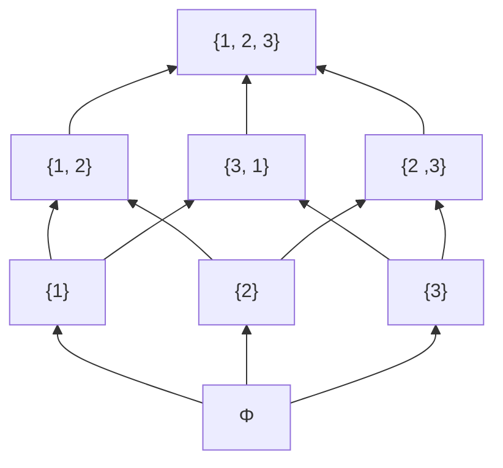

冪集合は集合の包含関係を半順序関係とする半順序集合を作ることが知られています。つまり上記の冪集合は矢印の方向に対して $a \subseteq b$ (例えば $\lbrace 1 \rbrace \subseteq \lbrace 1, 2 \rbrace$)のような関係があり、これは半順序関係となります。

$$
\begin{aligned}
&\text{reflexive:} && a \subseteq a \\
&\text{antisymmetric:} && a \subseteq b \land b \subseteq a \Rightarrow a = b \\
&\text{transitive:} && a \subseteq b \land b \subseteq c \Rightarrow a \subseteq c
\end{aligned}
$$

集合 $A$ の冪集合は $P(A)$ や $2^A$ とも表現されます。集合の要素を考える上で要素ごとにそれを集合に含めるか含めないの2通りがあるため、冪集合の要素の個数(部分集合の個数)は2を元の集合の個数でべき乗した値となります。つまり、上記の集合 $A$ なら要素の個数は3個なので、$2^3 = 8$ 個の要素を持つことになります。なおすべての要素を含めない場合(空集合)も要素として数えていることに注意してください。

実際、`number`型が数値リテラル型から作成できる型を要素とした冪集合として考えることもできます。例えば３つのリテラル型の集合 $A = \lbrace 1, 2, 3 \rbrace$ についての冪集合を考えるとき、上記の冪集合のハッセ図以下のように表現できます。空集合が `never` 型に相当していることに注意してください。

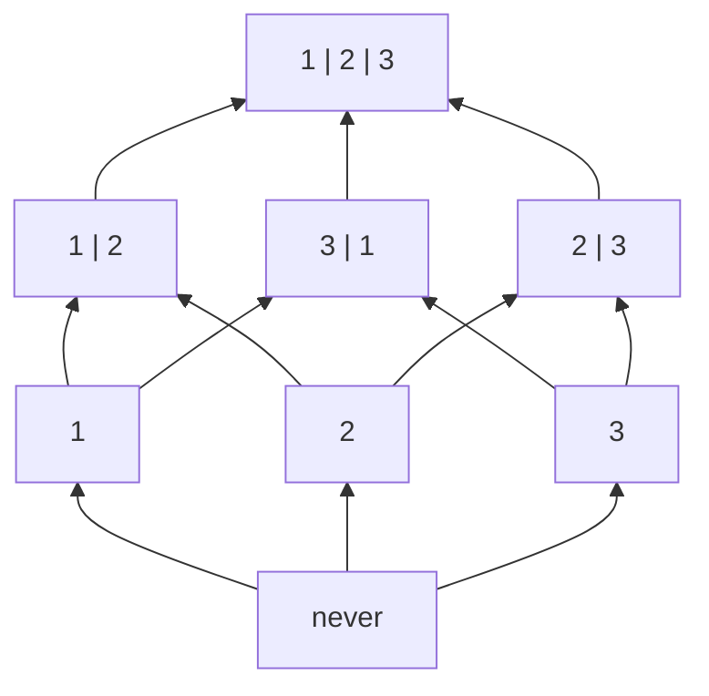

この型の冪集合においては、包含関係が部分型関係と一致しています。実際に、部分型関係を調べれば包含関係と一致していることがわかります。

```ts
type T0 = never;
type T1 = 1;
type T2 = 2;
type T3 = 3;
type T12 = 1 | 2;
type T31 = 3 | 1;
type T23 = 2 | 3;
type T123 = 1 | 2 | 3;

type R_0_1 = Relation<T0, T1>;
// => Subtype (T0 <: T1 => T0 ⊆ T1)
type R_31_2 = Relation<T31,T2>;
// => Unrelated
type R_3_23 = Relation<T3, T23>;
// => Subtype (T3 <: T23 => T3 ⊆ T23)
type R_12_123 = Relation<T12, T123>;
// => Subtype (T12 <: T123 => T12 ⊆ T123)
```

`number` 型だけでなく、オブジェクト型についても考えてみましょう。プロパティとその型の組からなるオブジェクト型を要素として考えると以下のような集合族をつくります。オブジェクト型の場合にはより情報量の多い(制約が多い)型が部分型になるため、数理リテラル型とは方向が配置が逆転していることに注意してください。制約が無い集合がより詳細な制約を持つ集合を包含すると考えれば数理リテラル型のときと同じ話になり、この集合族は冪集合とみなせます。

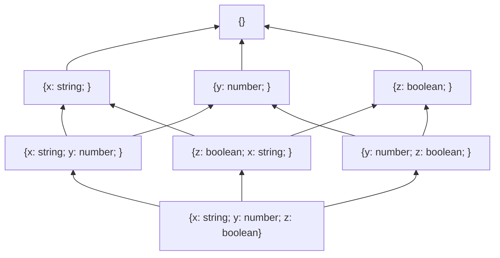

上記の３つの型を `X, Y, Z` と置き換えて、更に共通部分の集合演算に相当するインターセクション型の型構築子(`&`)を使って表現するようにします。

```ts
type X = { x: string; };
type Y = { y: number; };
type Z = { z: boolean; };
```

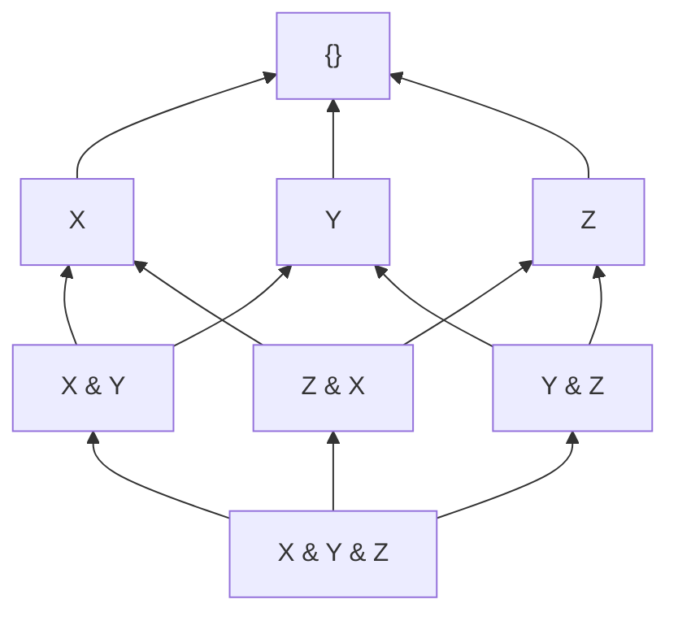

この冪集合の包含関係をベン図で表現すると以下のようになります。


## 有界束としての構造

型の集合は一見すると階層的な構造(あるいはツリー構造)を持っているように見えますが、実は階層構造というよりも適切な構造の見方があります。それが「束」とよばれる構造です。

束(lattice)は特殊な半順序集合であり、集合内の任意の二つの要素についてそれぞれユニークな最小上界(least upper bound)と最大下界(greatest lower bound)を持つような構造で、定義的には単一のルート要素(top)とリーフ要素(bottom)を常に持ちます。

例えば $S = \lbrace 1, 2, 3, 4, 5 \rbrace$ という自然数の集合と大小関係 $\le$ による全順序集合 $(S, \le)$ は以下の図のように分岐なく一直線になるため、線形順序(linear order)や鎖(chain)とも呼ばれます。全順序集合はまず半順序集合である必要がありましたが、全順序集合の場合には常にその集合は束になり、任意の二つの要素を選んで最小上界と最大下界があることが直感的にわかります。

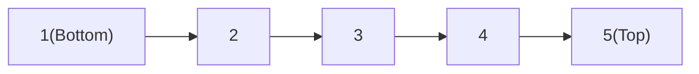

全順序ではない半順序でのシンプルな束は以下のようになります。$Right$ と $Left$ は比較不能な関係であり、完全律を満たしませから全順序ではないことが明らかです。

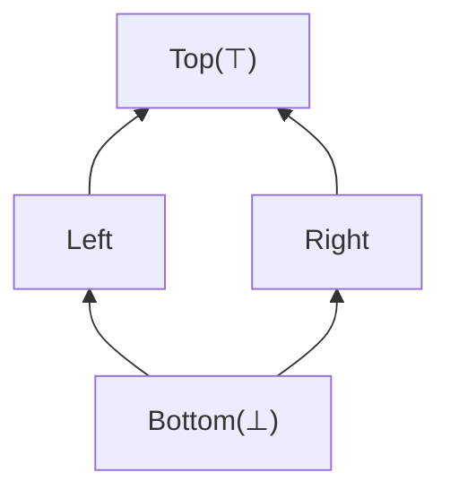

さて、束は半順序集合だったので、要素間には順序関係が存在します。上図で矢印の方向が半順序関係 $\le$ を表すとして、$Bottom \le Left \le Top$ や $Bottom \le Right \le Top$ のような順序があるわけです。

半順序や前順序では反射律という自己言及的な法則($A \le A$)がありました。これも図で表現すると以下のようになりますが、図が汚くなるので以後は省略します(上の全順序集合の図においても省略しています)。

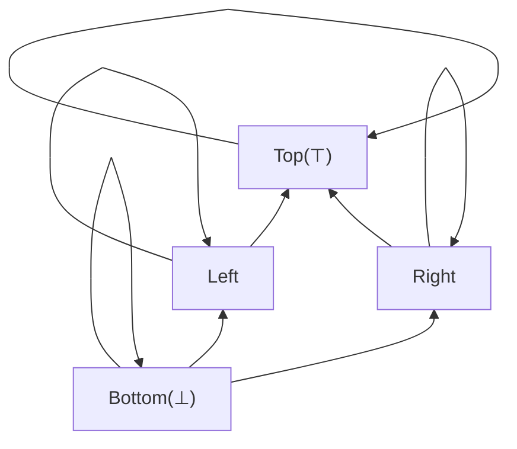

TypeScript の型には集合演算に相当する `|` と `&` がありましたが、束論の文脈では和集合(or: `|`)は結び(join: $\lor$)と呼ばれ、共通部分(and: `&`)は交わり(meet: $\land$)と呼ばれ、結びは最小上界に、交わりは最大下界に対応します。

もう少し複雑な例を挙げます。冪集合において部分集合の包含関係は半順序を形成すると述べましたが、以下のようにハッセ図を作ってみると冪集合は束を形成することが分かります。

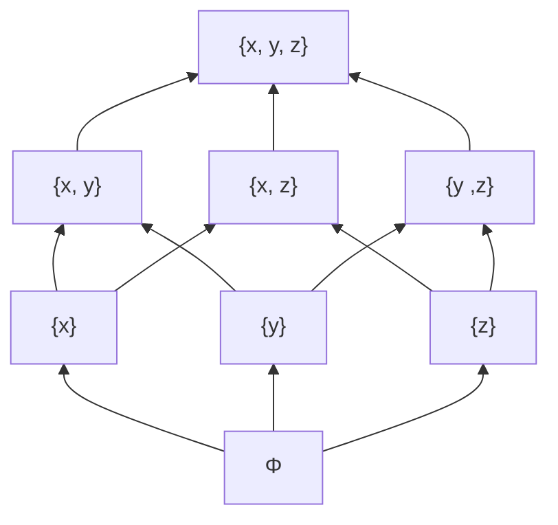

さて、`Object, {}, object` などの相互に部分型関係となる、すなわち同値関係となるような型同士を同値類としてまとめた商集合は半順序集合になりました。このような型の集合 $TYPES'$ は半順序集合であり、以下のような基本構造を構築します。

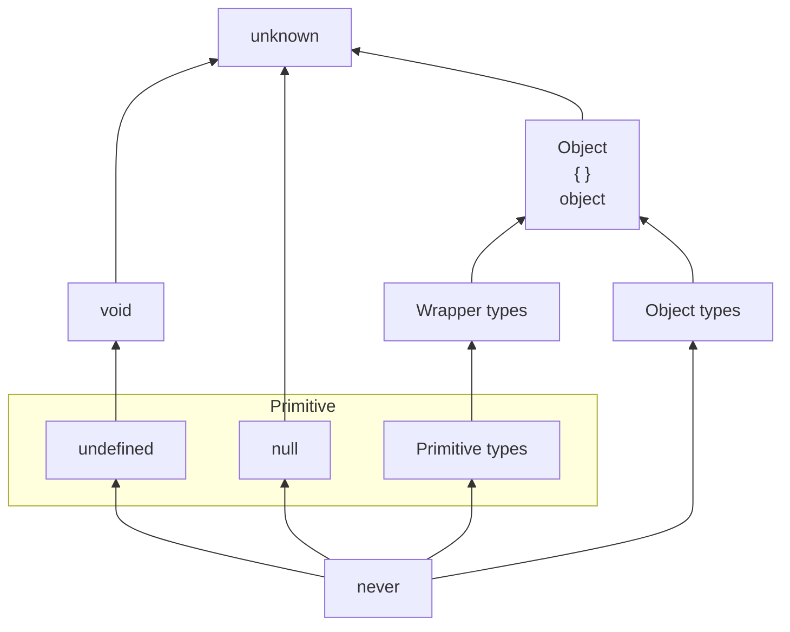

join演算とmeet演算では任意の二つの型についてユニークな最大下界と最小上界を生成できるため、TypeScriptの型の集合は上記の配置を基本とした束を形成します。

部分型関係によって構成される束は Scala などの言語では型束(type lattice)あるいはそのまま部分型束(subtype lattice)などと呼ばれます。ここでは型の形成する束を型束と呼ぶことにしましょう。

### Scala

Scala 3 は束を持つと言われ、[公式ドキュメント](https://docs.scala-lang.org/tour/unified-types.html)では以下のような束構造が図示されています。

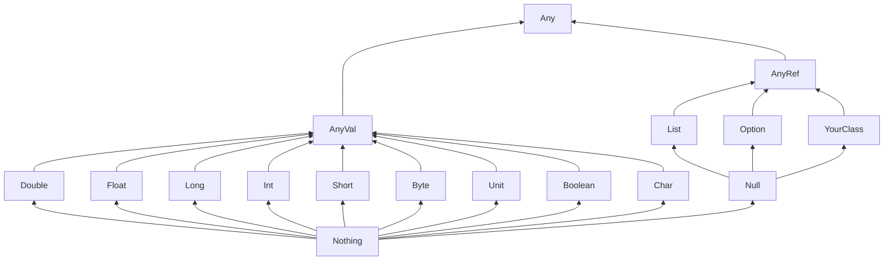

Scala が束を持つことは以下の動画で解説されています。束の他にも pre-order や Category を形成することが語られているので参考に視聴することをおすすめします。

https://www.youtube.com/watch?v=vuTFg5g_f6w

### Kotlin

Kotlin も束を持ちます。

http://natpryce.com/articles/000818.html

Non-Nullable の型は以下のような順序関係が構成されます。

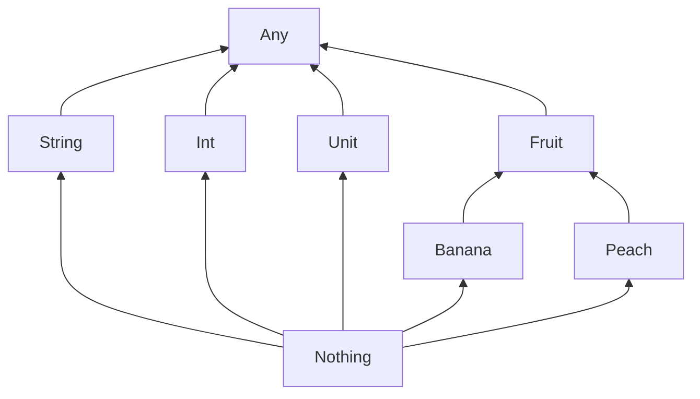

Nullable の型は以下のような型の順序関係が構成されます。

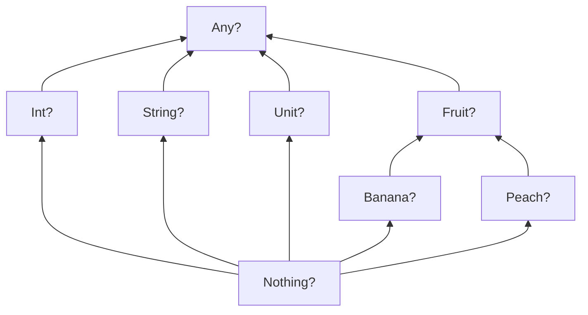

Nullableと Non-Nullable を組み合わせると以下のような複雑な型の順序関係が構築されます。

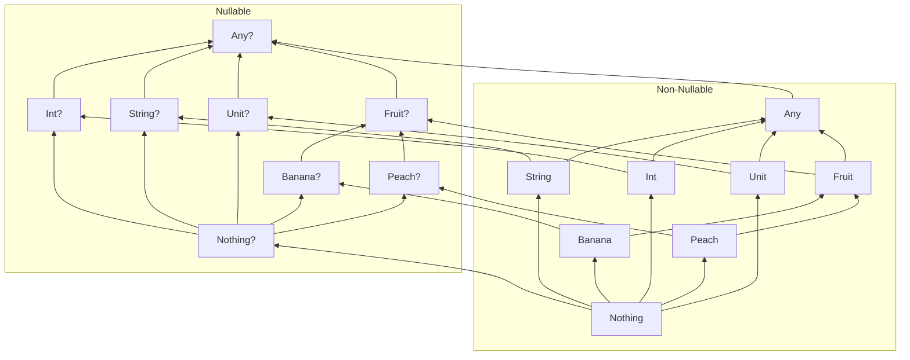

### CUEは束を持つ

部分型を持つ言語で、トップ型とボトム型を持っているなら束を考えることができますが、そのような言語とは別に、束を持つ言語の例として CUE が挙げられます。

https://cuelang.org

CUE (Configure Unify Execute) は構成記述言語と呼ばれ、データバリデーション機能と強力な推論エンジンを搭載してます。

CUE では型が値であるというコンセプトの元で、型と値の境界をなくし、さらに更に値(と型)を束として順序付けることで柔軟な制約条件を表現することができます。

以下のドキュメントで束(lattice)とはなにか、CUE で束の構造がどのように役立つかが細かに解説されています。

https://cuelang.org/docs/concepts/logic/

TypeScript よりも束としての機能的振る舞いがわかりやすいので参考にしてください。

## 半環としての構造

環論 (Ring theory) において、「半環 (Semi-ring あるいは Rig)」とは、環の公理から加法的逆元 (additive inverse) を除いた代数的構造であり、具体的には半環は台集合 $R$ と以下の公理を満たす加法演算 $+$ と乗法演算 $*$ の二つの二項演算を備えた構造 $(R, +, *)$ です。

- 演算の閉性 (closed)
    - $a + b \in R$
    - $a * b \in R$
- 結合律 (associative)
    - $a + (b + c) = (a + b) + c$
    - $a * (b * c) = (a * b) * c$
- 単位元 (identity element) の存在性
    - $a + 0 = a$ (加法単位元)
    - $a * 1 = a$ (乗法単位元)
- 吸収元 (annihilating element) の存在性
    - $a * 0 = 0 = 0 * a$
- 分配律 (distributive)
    - (乗法が加法上に分配的)
        - $a * (b + c) = (a * b) + (a * c)$
        - $(b + c) * a = (b * a) + (c * a)$

加法演算と乗法演算をそれぞれ別々に考えると、$(R, +)$ と $(R, *)$ はそれぞれ単位元 $0$ と $1$ を持つモノイド (monoid) と呼ばれる構造となります。

:::message
モノイド (monoid) とは、台集合 $S$ 上の演算 $・$ が結合律と単位律を満たすだけのマグマ $(S, ・)$ であり、とてもシンプルな代数的構造です。
:::

なお加法と乗法に相当する演算を持つ型の体系が半環であることは、Bartosz Milewski 氏の以下の記事などで語られています。

> Mathematicians have a name for such two intertwined monoids: it’s called a _semiring_. It’s not a full _ring_, because we can’t define subtraction of types. That’s why a semiring is sometimes called a _rig_, which is a pun on “ring without an _n_” (negative).
> ([Simple Algebraic Data Types |   Bartosz Milewski's Programming Cafe](https://bartoszmilewski.com/2015/01/13/simple-algebraic-data-types/) より引用)

TypeScript の型の集合において、加法演算と乗法演算はユニオン型 (`|`) とインターセクション型 (`&`) の型構築子による**型の合成**が相当します。実際に、それぞれの代数法則を $TYPES'$ に置き換えて、核を同値関係として考えます。

- 演算の閉性 (closed)
    - $A\ |\ B \in TYPES'$
    - $A\ \&\ B \in TYPES'$
- 結合律 (associative)
    - $A\ |\ (B\ |\ C) \equiv (A\ |\ B)\ |\ C$
    - $A\ \&\ (B\ \&\ C) \equiv (A\ \&\ B)\ \&\ C$
- 単位元 (identity element) の存在性
    - $A\ |\ never \equiv A$ (加法単位元)
    - $A\ \&\ unknown \equiv A$ (乗法単位元)
- 吸収元 (annihilating element) の存在性
    - $A\ \&\ never \equiv never \equiv never\ \&\ A$
- 分配律 (distributive)
    - (乗法が加法上に分配的)
        - $A\ \&\ (B\ |\ C) \equiv (A\ \&\ B)\ |\ (B\ \&\ C)$
        - $(A\ |\ B)\ \&\ C \equiv (A\ \&\ C)\ |\ (B\ \&\ C)$

具体的に TypeScript の型の集まりが半環となっているか、つまり上記の代数法則を満たしているかどうかを検証してみると、実際に成り立っていることが分かります。※ もちろん厳密な証明などではないので注意してください。

```ts
type A = { fst: number };
type B = { snd: string };
type C = { trd: boolean };

// 結合律
type A1 = Compat<A | (B | C), (A | B) | C>;
// => Equivalent
type A2 = Compat<A & (B & C), (A & B) & C>;
// => Equivalent
type A3 = Compat<A | B | C, C | A | B>

// 単位元の存在性
// 乗法(&)単位元 1 : unknown
type R1 = Compat<A, A & unknown>;
// => Equivalent
// 加法(|)単位元 0 : never
type R2 = Compat<A, A | never>;
// => Equivalent

// 吸収元の存在性
type H1 = Compat<A & never, never>;
// => Equivalent

// 分配律
type D1 = Compat<A & (B | C), (A & B) | (A & C)>;
// => Equivalent
type D2 = Compat<(A | B) & C, (A & C) | (B & C)>;
// => Equivalent
```

なお、`Identical<Fst, Snd>` を使っても同一性レベルで成り立つことが分かります。

さて、TypeScript の型の集合 $TYPES'$ は更に、可換律と冪等律を満たします。

- 可換律 (commutative)
    - $a + b = b + a$
    - $a * b = b * a$
- 冪等律 (idempotent)
    - $a + a = a$
    - $a * a = a$

またもや対象を型に、核を同値で置き換え、それが成り立つか確認してみます。

- 可換律 (commutative)
    - $A\ |\ B \equiv B\ |\ A$
    - $A\ \&\ B \equiv B\ \&\ A$
- 冪等律 (idempotent)
    - $A\ |\ A \equiv A$
    - $A\ \&\ A \equiv A$

```ts
// 可換律
type C1 = Compat<A | B, B | A>;
// => Equivalent
type C2 = Compat<A & B, B & A>;
// => Equivalent

// 冪等律
type I1 = Compat<A & A, A>;
// => Equivalent
type I2 = Compat<A | A, A>;
// => Equivalent
```

可換律と冪等律を満たす半環をそのまま「**可換冪等半環**」と呼びます。TypeScript の型の集合は可換冪等半環としてみなせることがわかりました。

## 圏としての構造

「圏論 (category theory)」とは「対象 (object)」の集まりとそれらの間の関係を表す「射 (morphism あるいは arrow)」の集まりからなる構造である「圏 (category)」を研究する学問分野です。

考えているものが以下の「圏の公理」さえ満たせばそれは圏と言えるので、様々なものが圏という構造であるとみなせます (あるいは圏を構築できます)。

- 結合律 $h \circ (g \circ f) = (h \circ g) \circ f$
- 単位律 $1 \circ f = f$

圏論の概念は特に [Haskell](https://www.haskell.org) という言語で利用されていますが、Haskell 以外でも圏論は使えますし、実はオブジェクト指向言語の部分型関係においても一部の概念 (変性) は圏論由来のものです。圏論は上で述べたように圏の公理さえ満たせば圏としてみなせるので、TypeScript が持つような型システムについても圏を考えることができます。

### 部分型関係(前順序関係)の圏

ここで考える圏は、Haskell における対象が型で射が関数の圏である [Hask](https://ja.wikibooks.org/wiki/Haskell/%E5%9C%8F%E8%AB%96) とは異なるものであることに注意してください。

ここでは「**対象を型、射を部分型関係とする圏**」を考えます。部分型関係は少なくとも前順序 (pre-order) でしたので、型と前順序関係の圏と置き換えてもいいでしょう。

// 前順序の圏の図

任意の前順序集合は台集合 $P$ の要素を圏の対象とし、要素間の前順序関係 $<$ を射とした圏を構成します。基本的に圏の対象間の射は一つとはかぎりませんが、前順序の圏では対象と対象の間の射はあってもただ一つとなります。もちろん前順序では要素間が比較不能である場合(関係がない場合)もあるので、そのような二対象間では射が無いということになります。

恒等射は前順序関係の反射律($A < A$)による自分自身との関係が相当し、射の合成は推移律($A < B \land B < C \Rightarrow A < C$)によって保証されて、圏の公理を満たします。

さて、今までの議論は前順序関係を部分型関係に置き換えても成り立つわけですから、ここからはそのまま「部分型関係の圏」を考えていきます。

### 変性と自己関手

圏論の概念を導入することでやっかいな変性(variance)の概念をかなりスッキリと理解できるようになります。

変性は圏論由来の概念であり、具体的には変性の種類である共変性(covariance)や反変性(contravariance)は圏の関手(functor)という概念から来ています。

関手とは、圏から別の圏への対応付け(mapping)であり、ある圏内の対象と射をそれぞれ別の圏内の対象と射へと写すというものです。

このとき、圏の構造(恒等射と射の合成や向き)をそのまま保ったまま別の圏へつ写す関手は共変関手(covariant functor)と呼ばれます。逆に、射の方向(合成)を逆転させるような関手は反変関手(contravariant functor)と呼ばれます。

自己関手(endofunctor)とは、特殊な関手であり、圏から同じ圏へと対応付けするような関手のことです。もっともわかりやすい自己関手は恒等関手(identity functor)であり、圏の恒等射と同じように、自分自身についてなにも特別なことをしないでそのまま写します。つまり、それぞれの対象と射をそのまま同じ対象と射に写します。

自己関手はもちろん恒等関手だけでなく、様々なものが存在し、共変であったり反変であったりします。

さて、型と部分型関係の圏において、自己関手に相当するものはどのようなものが考えられるでしょうか？勘の良い人は変性の概念からなんとなく気づくかもしれませんが、型構築子が自己関手に相当します。

型構築子(type constructor)とは、型から新しい型を構築するものであり、ユニオン型を構築する `|` インターセクション型を構築する `&` などであり、更に関数型を構築する `=>` や、ジェネリクス型 `Promise<T>` や `Identical<T>` なども相当します。

例えば、単一要素のタプル型 `[T]` の構築子を考えてみましょう。例えばこの構築子は圏内の対象である任意の型 `A` を引数にとって、新しい型 `[A]` を構成します。このとき新しい型 `[A]` は同じ「型と部分型関係の圏」の対象であることはあらかですね。つまり圏内の対象を別の対象にマッピングしています。

関手は対象だけでなく射もマッピングする必要がありますが、この圏における射は部分型関係でした。型と関数の圏(Hask)では射のマッピングなどは自分で定義したりする必要がありますが、部分型関係は部分型付け規則によって定められているので射の対応が自動的に決まります。

配列型の構築子は以下のような部分型付け規則(subtyping rule)を持っているので、二つの型間の部分型関係(つまり対象間の射)は関係を保って移されます。

$$
{S <: T}
\over
{[S] <: [T]}
$$

:::message
上記のようなものは推論規則と呼ばれ、線上に列挙した前提が成立するなら下の結論を導出できる」ということを表現しています。上記の推論規則なら、二つの型 $S, T$ について部分型関係 $S <: T$ が前提として成り立つなら、そのタプル型 $[S], [T]$ についての部分型関係 $[S] <: [T]$ が成り立つということを表現しています。
:::

例えば、数値リテラル型である `1` とその集合的なプリミティブ型 `number` についての部分型関係は `1 <: number` ですが、この二つの型をタプル型の構築子で写して新しい型を構成した場合にの部分型関係は保持されて `[1] <: [number]` となります。

```ts
type Unit = 1;
type Primitive = number;
type C1 = Compat<[Unit], [Primitive]>;
// => Subtype ([Unit] <: [Primitive])
```

さて、部分型関係は考えている圏での射だったわけで、このように射(関係性)の方向を保持する関手は共変関手と呼ばれていました。これがまさに変性の概念であり、型を型構築子によって写して新しい型を構成したときに部分型関係が保持される場合のときに共変(covariant)であると言い、部分型関係が逆転される場合のときに反変(contravariant)と言います。

タプル型に限らずそれぞれの型構築子は独自に変性を持ちます。変性は部分型付け規則によって支配されていますが、多くの場合には共変性を持っています。例えば `Promise<T>` 型構築子も共変であり、以下のような部分型付け規則を持っていると推論されます。

$$
{S <: T}
\over
{Promise \langle S \rangle <: Promise \langle T \rangle}
$$

実際に確かめてみると共変であることが分かります。

```ts
type C2 = Compat<Promise<string>, Promise<string | number>>;
// => Subtype: Promise<string> <: Promise<string | number>
```

### 関数型と双関手

各型構築子は独自に変性を持っていますが、顕著なのが関数型の構築子 `=>` でしょう。これまで見てきた型構築子は型引数が一つのものでしたが、関数型では引数と返り値の型の二つが必要となります。分かりやすくジェネリクスを使って定義すると以下のようになります。

```ts
type F<Fst, Snd> = (param: Fst) => Snd;
```

このように二つの型パラメータを持つ関手は双関手(bifunctor)と呼ばれます。

$$
{P_1 :> P_1 \quad R_1 <: R_2}
\over
{P_1 \rightarrow R_1 <: P_2 \rightarrow R_2}
$$

### 型と関数の圏

副作用などをなくした純粋関数と型の世界を作り、様々な理想的な条件を考えることで TypeScript においても Hask のような型を対象、射を関数の圏を考えることができます。

そのような圏はカルテシアン閉圏(Cartesian closed category)と呼ばれ、直積(タプル型)や冪対象(関数型)といった型の対象について多くの考察(カリー化や随伴など)を考えることができます。

筆者は圏論をそこまで理解していないので、正直手が余ります。そのような圏については Haskell や Scala を中心にして種々の資料がインターネット内外で手に入りますので探してみてください。

## 参考文献

### Algebraic Subtyping

部分型を型システムに持つ言語の代数的構造については Stephen Dolan 氏の ["Algebraic Subtyping"](https://www.bcs.org/media/2128/algebraic-subtyping.pdf) という PhD 論文が非常に参考になります。この論文は英国コンピュータ協会が[2017年に開いたコンペ](https://www.bcs.org/events/awards-and-competitions/distinguished-dissertations/previous-winners/2017-competition/)で優勝した論文であり、部分型の型システムに ML-like な型推論を組み込むという内容です。

メインの内容はかなり難しめで長く、筆者も読めていないですが、書き方はわかりやすく、最初の方には部分型関係が構築する代数的構造についての様々な数学的な概念が語られており、それらの代数法則を公理として言語を構築するというような手法を行っています。

部分型が持つ代数的構造の背景として、ここで語ったような順序理論や Kleene 代数を始めとする環論や圏論などの概念に比較的簡単にアクセスできるのでおすすめです。

### 文献一覧

- [圏論の歩き方](https://www.nippyo.co.jp/shop/book/6936.html)
- [圏論の道案内 ～矢印でえがく数学の世界～](https://gihyo.jp/book/2019/978-4-297-10723-9)
- [型システム入門 プログラミング言語と型の理論](https://www.ohmsha.co.jp/book/9784274069116/)
- [Stephen Dolan, "Algebraic Subtyping"](https://www.bcs.org/media/2128/algebraic-subtyping.pdf)
- [Akihiko Koga, "順序集合や束などに関する基本的な概念の説明"](https://www.cs-study.com/koga/lattice/explanations_on_concepts_of_posets.html)
- [Steve Awodey, "Category Theory"](https://global.oup.com/ukhe/product/category-theory-9780199237180?cc=gb&lang=en&)
- [Scala で始める圏論入門](https://criceta.com/category-theory-with-scala/)
