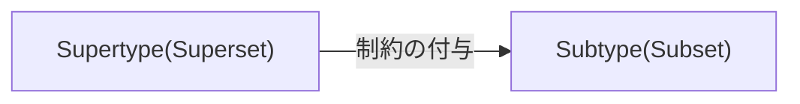

# はじめに

この記事では、Widening(型の拡大) の対となる Narrowing(型の絞り込み) について解説します。

Narrowing は多くの記事や解説において **型ガード(type guard)** と呼ばれる用語に基づいて解説されますが、Narrowing のキーワードで包括的に解説するのが公式ドキュメントでも行われているやり方です。

実際、型ガードよりも対概念である『[Widening(型の拡大)](https://zenn.dev/estra/articles/typescript-widening)』や『[型の集合性](https://zenn.dev/estra/articles/typescript-type-set-hierarchy)』などを加えて Narrowing として考えた方がそれぞれについてよりスッキリと理解することが可能になります(特に判定可能なユニオン型などについてはそうです)。

:::message alert
Narrowing のパターンそのものについては、一緒に解説すると長くなるので[別の記事](https://zenn.dev/estra/articles/typescript-narrowing-patterns)にしてまとめることにしました。この記事は集合的に Narrowing がどのようなものであるかを解説します。こちらのほうが本質的な理解ができると考えています。
:::

# 型集合

おさらいとなりますが[前回の記事](https://zenn.dev/estra/articles/typescript-type-set-hierarchy)では、型は以下の図(*fig 1*)のように具体的な値の集合であると解説しました。単位型(Unit type)である具体的な値から作られるリテラル型の集合によって集合型(Collective type)たる `string` 型や `number` 型、`boolean` 型などのプリミティブ型が構成されます。

そして、あらゆる型は、図(*fig 2*)のように全体集合となる `unknown` 型の部分集合であり、`never` 型は空集合としてみなすことができました。

fig 1 (型は値の集合) | fig 2 (全体集合と部分集合)
--|--
 | 

各リテラル型の積集合や異なる集合型(Collective type)の積集合をインターセクション型で作ろうとすると共通要素が全く無いので `never` 型となりました。また、`never` 型は空集合ということで、`never` 型そのものと他の型との和集合をユニオン型で作成すると `never` 型は無かったかのようにユニオン型の構成要素として使用した要素の型そのものとなります。

```ts
type StrOrNever = string | never;
// type StrOrNever = string; と同じ
```

`string` 型や `number` 型などのプリミティブ型を合成してユニオン型を作ると以下の図のようにそれぞれの構成要素の型(集合)を合成した和集合を作ります。包含されている部分集合(subset)はそれを包含している上位の集合(superset)に対して subtype-supertype の関係にあります。


`S` 型が `T` 型の subtype であるとき $S <: T$ と表記します。`S` は `T` によって包摂([subsumption](https://en.wikipedia.org/wiki/Subtyping#Subsumption))されています。集合としては `S` が `T` に包含されるので $S \subset T$ で表記できます(もちろん厳密には型 `S` と値の集合 `S` は異なるものです)。

この記事のテーマである **Narrowing** とは「型の絞り込み」のことですが、「型を絞り込む」というのは特定の変数が上記のようなユニオン型からより扱いやすい具体的なプリミティブ型や特定のオブジェクトリテラルの型へと範囲を絞り込んでいくプロセスや行為のことを指します。

:::message
TypeScript ではこのように「**型を集合として扱う**」ことが重要な考え方となります。公式でも推奨されている考え方です。

>In TypeScript, **it’s better to think of a type as a set of values that share something in common**. Because types are just sets, a particular value can belong to many sets at the same time.
>([TypeScript: Documentation - TypeScript for Java/C# Programmers](https://www.typescriptlang.org/docs/handbook/typescript-in-5-minutes-oop.html#types-as-sets) より引用、太字は筆者強調)

そもそも型を集合論的に扱いやすくする機能を提供するように TypeScript 自体がデザインされていると公式ドキュメントで明言されていますが、その中でもユニオン型は非常に重要な機能です。

Widening はプルリクエストなどを見ないと詳細を確認できませんが、Narrowing については冒頭で紹介したように公式ドキュメントで[わざわざ１ページもさかれて](https://www.typescriptlang.org/docs/handbook/2/narrowing.html)包括的に解説されており、特にユニオン型から特定の型へと絞り込む方法が丹念に解説されているのでどれだけ重要かは想像が付きます。
:::

# Narrowing の必要性

具体的に Narrowing がどのようなものかを見てみます。`number | string` という２つのプリミティブ型から構成されるユニオン型を引数として受け入れる関数を考えます。関数内では、例えば次のような `if` 文などで条件判定して特定のブランチ内でユニオン型よりも具体的な特定のプリミティブ型であると絞り込むことができます。

```ts
// number | string 型のみを引数として受け入れる関数
function narrowUnion(
  param: number | string
): void {
  if (typeof param === "string") {
    // param はこのブランチで string 型であると絞り込まれた
    console.log(param.toUpperCase());
    //          ^^^^^: string 型
  }
  else if (typeof param === "number") {
    // param はこのブランチで number 型であると絞り込まれた
    console.log(Math.floor(param));
    //                     ^^^^^: number 型
  }
}
```

`if` や `else if` の各ブランチで変数の型をユニオン型ではなく具体的なプリミティブ型として絞込んでいるのでその型で使えるプロトタイプメソッドや静的メソッドを利用できるようになります。

このような型の絞り込みを行わなかった場合にどうなるか見てみましょう。絞り込みのための if 文を無くしてそれぞれのメソッドを利用しようとすると型エラーとなります。

```ts
function narrowUnion(
  param: number | string
): void {
  console.log(param.toUpperCase())
  //                ^^^^^^^^^^^ [Error]
  // Property 'toUpperCase' does not exist on type 'string | number'.
  // Property 'toUpperCase' does not exist on type 'number'.

  console.log(Math.floor(param));
  //                     ^^^^^ [Error]
  // Argument of type 'string | number' is not assignable to parameter of type 'number'.
  // Type 'string' is not assignable to type 'number'
}
```

`string | number` というユニオン型は `string` 型と `number` 型の和集合であり、この関数はそれぞれの型の変数を受け入れます。そして、この関数の引数として渡す変数が具体的な値であるときには結局は `string` 型の値か `number` 型の値のどちらかです。

渡した変数が `string` 型であったときには `Math.floor()` は使えませんし、逆に `number` 型であったときには `toUpperCaser()` メソッドは使えません。静的メソッドである `Math.floor()` に `string` 型を渡した場合には `NaN` が得られますが、`number` 型に対して `toUpperCase()` メソッドを呼び出そうとすると確実にエラーとなります。

これは JavaScript として記述して実行すれば分かることです。JavaScript だと TypeScript の時にエディタ上で得られた上記のような型エラーがでてこないので実行するまでエラーになるかどうかわかりません。

```js:JavaScript
function cantNarrowUnion(param) {
  console.log(param.toUpparCase());
  console.log(Math.floor(param));
}

cantNarrowUnion(42.3);
cantNarrowUnion("str");
```

TypeScript での型の利便性を知っている状態だとこれは非常に恐ろしいですね。文字列型も数値型も引数として受け入れる場合には型を絞込んでからその型で利用できるメソッドを使うようにしないとエラーになります。

型の絞り込む必要があるのは、上記だと `string | number` というそれぞれで違う操作体系を持つ集合の和集合として型をつくってしまっているためです。`string` 型と `number` 型では扱えるプロトタイプメソッドやその型の変数に対して加えることのできる操作などが変わってくるために場合分けをする必要がでてきます。

`string | number` という和集合をつくった時に共通して利用できるプロトタイプメソッドは `toString()` や `toLocaleString()`、`valueOf()` などの限定されたものしかありません。これらのメソッドは `String.prototype.toString()` と `Number.prototype.toString()` のようにそれぞれが「同じ名前のプロトタイプメソッド」として定義されているので共通して利用できます。そのような同じ名前のメソッドではないものを使いたい場合(大半の場合)には型の絞り込みを行って場合分けする必要があるわけです。

分かりやすい上記のようなプリミティブ型のユニオン型だけではなく、TypeScript では `undefined` とのユニオン型がよく出現します。オプション引数やオプショナルプロパティなどを使うことで強制的に型注釈した型と `undefined` 型とのユニオン型としてみなされます。

```ts
// オプション引数を使った関数定義
function acceptOptionalStr(
  str?: string // string | undefined となる
) {
  // ...
}

acceptOptionalStr("text"); // string 型を渡せる
acceptOptionalStr(); // 引数は省略可能
```

:::message alert
オプション引数ではなく、引数の型注釈を直接的に `string | undefined` というように注釈すると引数が省略できなくなるという違いがあるので注意してください。
:::

`string | undefined` というユニオン型は `string` 型よりも広い集合(superset)を表現しており、`string` 型や `undefined` 型の supertype となります。広いといっても実際には具体的な `undefined` リテラルから構成される Unit type である `undefined` 型を `stirng` 型に加えただけです。

この場合に `string` 型で利用できるプロトタイプメソッド `toUpperCase()` を関数内で利用しようとすると型エラーになります。もちろん、`undefined` にはプロパティとして `toUpperCase()` というようなメソッドを持たないからです。

```ts
function acceptOptionalStr(
  str?: string // string | undefined となる
) {
  console.log(str.toUpperCase());
  //          ^^^ [Error]
  // Object is possibly 'undefined'.
}

acceptOptionalStr("text"); // string 型を渡せる
acceptOptionalStr(); // 引数省略した際には自動的に undefiend となりエラーとなる
```

このコードは実行時にエラーとなります。これを回避するにはいくつか方法はあると思いますが、例えば ES2020 で ECMAScript の新機能として導入された [Optional chaining 演算子](https://developer.mozilla.org/ja/docs/Web/JavaScript/Reference/Operators/Optional_chaining)(`?.`)を使うことで回避できます。これを使うことで `undefined.toUpperCase()` のような存在しないプロパティアクセスによる例外発生を回避して `undefined` を返すことができます。

```ts
function acceptOptionalStr(
  str?: string // string | undefined となる
) {
  console.log(str?.toUpperCase());
  //             ^^ optional chaining 演算子
}

acceptOptionalStr("text"); // string 型を渡せる
//  => "TEXT"
acceptOptionalStr(); // 引数省略可能
//  => undefined
```

Optional chaining 演算子を使わずに、`number | string` ユニオンで利用したように `typeof` 演算子を `if` 文の条件として利用して型の絞り込みするなどももちろん可能です。あるいはオプション引数ではなくデフォルト引数とすることででそもそも `undefined` が入り込まないようにするなどの方法もありえます。

```ts
function acceptOptionalStr1(
  str?: string // string | undefined
) {
  if (typeof str === "string") {
    console.log(str.toUpperCase());
  }
};

function acceptOptionalStr2(
  str?: string // string | undefined
) {
  if (typeof str === "undefined") {
    console.log(undefined);
  } else {
    console.log(str.toUpperCase());
  }
};

function acceptOptionalStr3(
  str = "str" // デフォルト引数
) {
  console.log(str.toUpperCase());
};
```

とにかく、ユニオン型となる場合には構成要素となる複数の型同士で共通して使えるメソッドはかなり限定的になるため関数内部では受け取る引数の型を絞り込んで場合分けする必要がでてきます。

オプション引数のように明示的にユニオン型としなくてもユニオン型となる場合があるので型の絞り込み(Narrowing)が重要であることが理解できたと思います。

# 型範囲の拡大縮小

ユニオン型(Union type)は複数の型を合成した型です。集合論的には複数の集合の和集合(合併: Union)となります。逆にインターセクション型(Intersection type)は集合論的には積集合(共通部分、交差: Intersection)となります。

例えば `string | number` などがユニオン型ですが、これは `string` 型または `number` 型という２つの型を受け入れる合成された型です。このように２つの型を組み合わせることを「**型の合成(Composing Types)**」と呼びました。

```ts
// let 宣言して型定義
let strornum1: string | number;
strornum1 = Math.random() < 0.5 ? "文字列" : 42; // 三項演算子

// type で型作成
type StrOrNum = string | number;
let strornum2: StrOrNum;
strornum2 = 42; // number 型の値も代入できるし
strornum2 = "文字列"; // string 型の値も代入できる
```

ここで Widening の復習をしておきますが、次のように三項演算子を使った上で変数の初期化を行った場合には、`const` 宣言なら具体的なリテラル型のユニオン型として型推論され、`let` 宣言なら一般的な `string` や `number` 型のユニオン型として拡大(Widening)されて型推論されます。

```ts
const unionValConst = Math.random() < 0.5 ? "text" : 42;
//   ^^^^^^^^^: "text" | 42 という具体的なリテラル型のユニオン型として型推論される

let unionValLet = Math.random() < 0.5 ? "text" : 42;
//  ^^^^^^^^^^^ string | number というユニオン型に Widening されて型推論される

unionValLet = unionValConst;
// リテラル型は Widening した結果の型の subtype なので代入可能
```

型アサーションのために、`as const` で const アサーションすることによって Widening を抑制できました。

```ts
//    _______________: "text" | 42 というリテラル型のユニオン型として型推論される
const unionValConstAs = Math.random() < 0.5
  ? "text" as const
  : 42 as const;
// (const アサーションでそれぞれ Widening を抑制)

let unionValLetAs = unionValConstAs;
//  ^^^^^^^^^^^^^ "text" | 42 という具体的なリテラル型のユニオン型として型推論される(Widening の抑制が継続)
```

Literal Wideing ではこのように具体的な文字列リテラル型(Unit type)から一般的なプリミティブ型である `string` 型(Collective type)へと型が拡大されました。

集合論的には各文字列リテラル型はその特定の文字列リテラル値によって成る単集合(singleton)あるいは単位集合(unit set)であり、その文字列リテラル型の集合が `string` 型を構成しています。

従って Widening では、対象となる集合が subset から superset へと範囲が拡大されることになります。supertype-subtype の関係性で考えると、subtype である文字列リテラル型から supertype である `string` 型へと拡大されます。逆に Narrowing では、対象となる集合を superset から subset へと絞り込むことになります。supertype-subtype の関係性で考えると、supertype であるユニオン型から subtype である `string` 型や `number` 型へと絞り込みます。

集合論的に図示すると以下のような関係となります。


Widening では基本的にリテラル型から一般的なプリミティブ型への拡大を考え、Narrowing ではユニオン型から特定のプロトタイプメソッドなどが使えるようになるプリミティブ型への絞り込みを考えます。

Narrowing では、例えば `toUpperCase()` というメソッドは `string` 型でしか使えないので `string | number` などのユニオン型から型の候補を減らし(reduce)て、型を `string` 型まで絞り込みます。`number` 型でしか使えないメソッドを使いたいなら `number` 型まで絞り込みます。

# 制御フロー解析(CFA)

ということで、ユニオン型が関数の引数となることで、関数内部で引数に対して利用できるメソッドがそのユニオン型に含まれる型によって変わってくるので場合分けをする必要がでてきます。

```ts
// string 型または number 型 やそのユニオン型で注釈された変数を受け入れる(それ以外は受け入れない)
function strOrNum(
  param: string | number
): void {
  if (typeof param === "string") {
    // string 型のプロトタイプメソッド
    console.log(param.toUpperCase());
  } else { // string 型でないなら number 型
    // number 型の値に使える静的メソッド
    console.log(Math.floor(param));
  }
}
```

こういったコードの構造に基づいて値の型をより具体的に推定できるようにすることを(型の範囲をより具体的なものに狭めることから) Narrowing(型の絞り込み)と呼びました。

そして実際には、上のコードでの `if` 節や `switch` や `while` などのコードの構造によって各場所での変数の型を絞り込みます。このようなコードを書くと TypeScript (コンパイラやエディタの拡張機能)はある変数が特定のブランチなどに到達した時点でその型がなんであるか解析をしています。この解析を「[制御フロー解析(Control flow analysis: CFA)](https://www.typescriptlang.org/docs/handbook/2/narrowing.html#control-flow-analysis)」と呼びます。

ちなみに CFA ですが、TypeScript 公式の[チートシートの１つ](https://www.typescriptlang.org/static/TypeScript%20Control%20Flow%20Analysis-8a549253ad8470850b77c4c5c351d457.png)としてまとめられているのでそちらも確認しておくと良いです。

CFA ではユニオン型の変数の型をいくつかの真偽値のロジックパターンに基づいて型を絞り込んでいきます。基本的には、`if` 節で条件判定しますが、`switch` などを使う場合もあります。

```ts
// このブランチ内で変数を string 型として絞り込む
if (typeof input === "string") {
  console.log(input);
  //          ^^^^^^ string 型として CFG で解析される
  console.log(input.toUpperCase());
  // このブランチでは string 型データのプロトタイプメソッドなどが利用できる
} else {
  // このブランチ以降は型の候補から string 型が外される
}
```

実際にユニオン型からプリミティブ型を reduce してみます。３つのプリミティブ型と１つのリテラル型(Unit type) `undefined` の計４つの型から構成されるユニオン型から１つずつ型をへらすには以下のようなコードが書けます。

```ts
// 即時実行して確率で分岐して特定の型の値を取得させる
const st: undefined | string | number | boolean = (() => {
  const r = Math.random() * 100;
  if (r < 30) {
    return 42;
  } else if (r < 60) {
    return "B";
  } else if (r < 90) {
    return false;
  } else {
    return undefined;
  }
})();

// ユニオン型からプリミティブ型を１つずつ reduce して Narrowing する
if (typeof st === "boolean") {
  st; // boolean
} else {
  st; // string | number | undefined
  if (typeof st === "undefined") {
    st; // undefined
  } else {
    st; // string | number
    if (typeof st === "string") {
      st; // string
    } else if (typeof st === "number") {
      st; // number
    } else {
      st; // never (空集合)
    }
  }
}
```

CFA による解析によってエディタ上で変数にホバーすると実際に型が絞り込まれていることが分かります。

これを集合論的に図示すると以下のようになります。型の候補から構成要素となる具体的な型を減らしていって、`undefined` 型も減らすと型の候補にはなにも具体的な型が残っておらず、最終的には空集合 `never` 型になります。


Narrowing とはこのように広域な型の集合から条件判定によってより範囲の狭い型の集合へと具体的に候補を絞り込んでいくことに他なりません。図のように `string` 型といったプリミティブ型まで絞り込めばその型のプロトタイプメソッドなどが利用できるようになります。

# 判別可能なユニオン型

判別可能なユニオン型(Discriminated union type)あるいはタグ付きユニオン型(Tagged union type) は型システム一般では [Sum 型](https://www.wikiwand.com/en/Sum_type)と呼ばれる類のものであり、$\sigma+\tau$ として表記されます。

*[Type system - Wikipedia](https://en.wikipedia.org/w/index.php?title=Type_system#Specialized_type_systems) より引用*

具体的には「特殊なユニオン型」であり、オブジェクトの型を合成する際にこの「判別可能なユニオン型」として定義しておくことで Narrowing がしやすくなるものです。

集合論で考えると、判別可能なユニオン型は [Disjoint union(非交和)](https://ja.wikipedia.org/wiki/%E9%9D%9E%E4%BA%A4%E5%92%8C) と呼ばれるものになります。非交和(Disjoint union)は２つの集合の和集合をつくった時に共通部分がない、つまり交差(intersection)を持たない和集合のことを指します。"disjoint" とは「互いに素」であることを意味します。


:::message
より広域な概念としては直和(direct sum)とも呼ばれるもので、直和は実際には次の２つの概念を指し示します。

- Discriminated union(識別された和)
- Disjoint union(非交和)

Discriminated union は集合論では和集合を合成元の集合を特定(判別: *discriminate*)できるように添字などのタグをつけたものです。判別可能なユニオン型は実際にはこの Discriminated union という集合に基づいています。Discriminated union は Disjoint union でもあるので、型の文脈では両者はほとんど同じものとして考えても大丈夫です(もちろん厳密には違います)。

「直和型」はこの直和から来ています。「TypeScript のユニオン型は直和型ではない」という文言も実は Discriminated union と Disjoint union の話に繋がります。
:::

型は具体的な値の集合で、特にプリミティブ型は具体的なリテラル型の集合としてみなせました。`string` 型と `number` 型は共通の具体的な値が存在しないため、和集合をつくった際には共通部分が無く自動的に Disjoint union となります。積集合(交差)を作り出そうとインターセクション型で `string` 型と `number` 型を合成しようとすると空集合で値を持たないことを表現する `never` 型となります。

ということで、実は今までの左ようなユニオン型の図は正しくなく、２つのプリミティブ型から成るユニオン型は交差や他の要素を持たないため `string & number` が `never` となることから、より正確に図示すると右のようになります。


上記の `string | number` のようなプリミティブ型のユニオン型を Narrowing する際にはすでに知っている `typeof` 演算子で判別すればよいので特に問題はありません。

```ts
type StrOrNum = string | number;
// Disjoint union を作成する

function padLeft(pad: StrOrNum) {
  if (typeof pad === "string") {
    // string 型として CFA で絞り込まれる
  } else {
    // number 型として CFA で絞り込まれる
  }
}
```

実は、判別可能なユニオン型として知られているのはオブジェクトの型についてのユニオン型を考えるときのものです。要するにオブジェクトの型でのユニオン型の作り方のプラクティスの話となります。

異なるプリミティブ型同士をユニオン型として合成すると自動的に Disjoint union になりましたが(正確には Disjoint union ではあるが Discriminated union ではない)、オブジェクト型をユニオン型として合成すると Disjoint union になるとは限りません。例えば、`{ a: "st" }` と `{ b: 42 }` というオブジェクトの型を合成すると以下の図のように両方のプロパティを持つ型が交差として出現します。オブジェクトリテラルによる型の表現は実際にはそのプロパティと値の型を条件として満たすあらゆるオブジェクトの集合を表現します(他のプロパティを持っていたとしてもその型の範疇となるのは TypeScript が**構造的部分型**のシステムを採用しているからです)。


ということで、オブジェクト型を Disjoint union として合成してタグ付きユニオン型とするにはある方法を取る必要がでてきます。そして、オブジェクト型の合成で交差(intersection)が出現しないなら、それは Disjoint union であり、Discriminated union です。逆に Disjoint union ではないならそれは Discriminated union ではないことになります。

例えばよくある例として図形情報を表現するオブジェクトの型を考えます。具体的には四角形(square)、三角形(triangle)、円(circle)の３つの種類の図形について考えます。図形オブジェクトを受け取ってプロパティとして持たせた属性情報から何かしらの計算をして値を返すような関数を作りたいとします。

この場合、引数の型 `Shape` をどのように定義するかというのが問題になります。

まずは悪い例として、次のように１つのオブジェクトの型の中にオプションプロパティを入れてたりする方法がありえます。`kind` プロパティに図形種類を文字列リテラル型のユニオン型で指定できるようにして、それぞれの図形でプロパティが指定できるようにオプションプロパティとしていますが、この方法は型の精度がよくなく、無駄に広い型となってしまっています。"square" タイプの図形が本来持たなくても良いプロパティをもたせてしまうことができますし、関数の引数にとって Narrowing する際に不都合がでてきます。

また、この方法だと図形の種類を追加したいときなどにも実は不便です。

```ts
type Shape = {
  kind: "square" | "triangle" | "circle";
  radius?: number; // "circle" の図形が持つべきプロパティ
  length?: number; // "square" の図形が持つべきプロパティ
  angle?: number;  // "triangle" の図形が持つべきプロパティ
};

const sORt: Shape = {
  kind: "square",
  lenth: 100,
  radius: 50, // "square" では無駄なプロパティ
};
```

一応後で説明しやすいようにこの `Shape` 型を次のように分解して定義しなおしておきます。ユーティリティ型 `Partical<Type>` を使えば型引数に指定したオブジェクト型のプロパティを optional にできますので、それをインターセクション型で合成して型を作成します。また、オプショナルプロパティではなくすべてのプロパティが必須となるような型 `Strict` も定義しておきます。

:::message
図示する関係上 `kind` プロパティの値の型名などを短くしたいので以下のように書き換えます。適宣読み替えてください。

- `"circle"` → `"A"`、`radius` → `r`
- `"square"` → `"B"`、`length` → `l`
- `"triangle"` → `"C"`、`angle` → `a`
:::

```ts
type Kind = {
  kind: "A" | "B" | "C",
};

type Props = {
  r: number;
  l: number;
  a: number;
};

type Shape = Kind & Partial<Props>;
/*
type Shape =
  { kind: "A" | "B" | "C"; } &
  { r?: number; l?: number; a?: number; }
----------------------------------------
= {
  kind: "A" | "B" | "C";
  r?: number;
  l?: number;
  a?: number;
}
*/

type Strict = Kind & Props;
/*
type Strict =
  { kind: "A" | "B" | "C"; } &
  { r: number; l: number; a: number; }
--------------------------------------
= {
  kind: "A" | "B" | "C";
  r: number;
  l: number;
  a: number;
}
*/
```

この `Shape` 型と `Strict` 型は制約の強さとしては `Strict` 型の方が強く、集合的に考えても `Shape` 型の方が広い集合であり、`Strict` 型を包含します。したがって、`Shape` 型は `Strict` 型の supertype(superset) です(あとでまとめて図示します)。ちなみにこれは条件型を使っても判別できます。

```ts
type FirstIsSubType<T, U> = T extends U ? true : false;
type StrictIsSubTypeOfShape = FirstIsSubType<Strict, Shape>;
// true
```

`Shape` 型は良くない例ですが、このような型は次のようにオブジェクトの型をそれぞぞれの図形の型として分割定義した上でユニオン型として合成したほうが使いやすくなります。この方法で合成した型は `Sum` 型という名前にしておきます。

```ts
type A = {
  kind: "A"; // "circle"
  r: number;
};
type B = {
  kind: "B"; // "square"
  l: number;
};
type C = {
  kind: "C"; // "triangle"
  a: number;
};

type Sum = A | B | C;
```

`kind` という共通のプロパティを持つオブジェクト型でユニオン型を合成している点が重要です。ここでは `kind` プロパティの値の型がそれぞれ異なる文字列リテラル型として定義しています。これによってユニオン型として `A`、`B`、`C` の３つの型を合成すると、集合的には型は交差を持たない互いに素である和集合(Disjoint union)となります。共通部分が無いことから、この型に代入可能なのはユニオン型の構成要素そのもののいずれかとなります。

`Shape` と `Sum` の２つの型は明確に違いますので注意してください。`Sum` 型はタグ付きユニオン型(判別可能なユニオン型)です。

```ts
type Shape = {
  kind: "A" | "B" | "C";
  r?: number; // => number | undefined
  l?: number; // => number | undefined
  a?: number; // => number | undefined
};

// タグ付きユニオン型(判定可能なユニオン型)
type Sum =
  | { kind: "A"; r: number; }
  | { kind: "B"; l: number; }
  | { kind: "C"; a: number; };
```

この `Sum` というユニオン型が Disjoint union になっているかどうかは構成要素となる型の交差(インターセクション型)を取ってみればわかります。`A`、`B`、`C` の型は互いに素で共通要素となる具体的な値が存在しないのでそれぞれインターセクション型で交差を取ると `never` 型となります。

```ts
type NeverAB = A & B;
//   ^^^^^^^: never 型
type NeverAC = A & C;
//   ^^^^^^^: never 型
type NeverBC = B & C;
//   ^^^^^^^: never 型
type NeverABC = A & B & C;
//   ^^^^^^^^: never 型
```

共通のプロパティの値の型が異なっているので交差が空集合となるようになっています(そうでないオブジェクトの型同士で合成すれば交差がでてきます)。ということで `Sum` 型がタグ付きユニオン型であることが確認できました。

このタグ付きユニオン型は「判別可能なユニオン型」とも呼ばれますが、特定のプロパティの値(リテラル型)から元の型(あるいは集合)を特定することができるので、「判別可能」というわけです。

実際、これを使うことによってユニオン型から構成要素の型へと Narrowing して絞り込むことができます。

```ts
function handleShape(shape: Sum) {
  if (shape.kind === "A") {
    // A 型として絞り込まれる
    console.log(shape.r);
    //          ^^^^^^^: それぞれの型に存在するプロパティにアクセスができる
  } else if (shape.kind === "B") {
    // B 型として絞り込まれる
    console.log(shape.l);
    //          ^^^^^^^: それぞれの型に存在するプロパティにアクセスができる
  } else if (shape.kind === "C") {
    // C 型として絞り込まれる
    console.log(shape.a);
    //          ^^^^^^^: それぞれの型に存在するプロパティにアクセスができる
  }
}
```

これが元の `Shape` 型でも Narrowing できますが、その型定義から `kind` の値が `"A"` だったとしても `r` プロパティはオプショナルであり必ず存在しているとは限りませんので、プロパティアクセス時に `undefined` となる可能性があります。従って型の安全性としては `Sum` 型よりも低くなります。

それぞれの型を集合論的に図示すると以下のようになります。


集合の包含関係は図を見ればわかりますが、部分集合(subset)となる型がそれを包含している上位の集合(superset)に対して subtype となります。

`Kind` 型が最も条件が緩いので集合としての範囲が大きく、更に条件制約を付けていくとより詳細な型となり subtype へと派生していきます。`Shape`、`Strict`、`Sum` の３つ型を比較してみると、最初に定義した `kind` 以外のプロパティがオプショナルな `Shape` 型は集合としてはかなり大きいことがわかります。つまり制約が緩いわけです。逆にすべてのプロパティを必須にした `Strict` 型は制約が非常に強く集合が小さいことがわかります。そして `Sum` 型はその中間に位置しており、条件としては `Shape` よりも強く、`Strict` よりも緩くなっています。



図から `Strict` も判別可能なユニオン型であると言えます。実際 `Strict` 型は `Sum` 型の subtype であり、どちらの型も交差(共通要素がないことがわかります。`Sum` 型を抜いて図示すると `Strict` 型は次のように Disjoint union であり交差を持ちません。


`Strict` 型は実は次のように変形でき、それぞれ異なる文字列リテラル型である共通の `kind` プロパティを持つオブジェクト型の合成であることから、タグ付きユニオン型であることが明らかです。

```ts
type Strict =
  | { kind: "A", r: number; l: number; a: number; }
  | { kind: "B", r: number; l: number; a: number; }
  | { kind: "C", r: number; l: number; a: number; };
```

ですが、`r`、`l`、`a` の３つのプロパティがすべて必須となっているので、そもそも Narrowing しなくてもプロパティアクセスが可能です。ということは、図形の種類としてもつべきではないプロパティを必ず持たなくてはならないことになるので冗長で無駄ですし、モデルとしてもこの型は不適当です。

また `Sum` 型のような定義方法を使うことで別の種類の図形の型をユニオン型の要素として追加したいときに簡単に追加できます。

```ts
type D = {
  kind: "D"; // 例えば "star" という図形として想定
  s: number; // 中心店から端点までの距離
};

type Sum =
  | A // { kind: "A"; r: number; }
  | B // { kind: "B"; l: number; }
  | C // { kind: "C"; a: number; }
  | D // { kind: "D": s: number; }
```

関数内で Narrowing する際にも対応するブランチを増やせばよいだけです。

# Exausitve check

タグ付きユニオン型でそのように要素を増やした時に上の例では４つしかユニオン型の構成要素がないので見た目ですべてを網羅していることが理解できますが、構成要素が例えば１０を超えると見た目で判別するのは難しいですし面倒でしょう。

そこで `never` 型(集合的には空集合)を利用することでタグ付きユニオン型の構成要素となる型すべてを関数内で利用しているかどうかを見た目に頼らずチェックすることができます。

というのも、先程述べたとおり Narrowing はユニオン型という和集合から合成元の型(集合)を取り除いていく行為でもあります。すべての構成要素となる型を取り除くと空集合、つまり何も要素が無い集合となるので最終的には `never` 型となります。構成要素をすべて列挙しないと `never` 型にすることはできないので、この性質を利用してあえてエラーを起こして網羅しているかのチェックをするのが網羅性チェック(Exaustive check)です。

再度、タグ付きユニオン型である `Sum` 型を考えてみます。更に `E` 型を加えて見ましょう。

```ts
type E = {
  kind: "E";
  x: number;
};

// ５つの型から構成されるタグ付きユニオン型
type Sum = A | B | C | D | E;
```

この `Sum` 型を引数に取る関数無いで網羅性チェックをしてみます。`if` だと文字数が多くなるので `switch` でやってみます。

```ts
function handleShapeX(shape: Sum) {
  switch (shape.kind) {
    case "A": {
      // A 型として絞り込まれる
      console.log(shape.r);
      return;
    }
    case "B": {
      // B 型として絞り込まれる
      console.log(shape.l);
      return;
    }
    case "C": {
      // C 型として絞り込まれる
      console.log(shape.a);
      return;
    }
    case "D": {
      // D 型として絞り込まれる
      console.log(shape.s);
      return;
    }
    default: {
      const _exhaustiveCheck: never = shape;
      // Type 'E' is not assignable to type 'never'
      return _exhaustiveCheck;
    }
  }
}
```

`never` 型はすべての型の subtype であり Bottom type ですから自身以外の型から代入することはできません。従って、タグ付きユニオン型の変数に対して Narrowing の過程で型の候補を減らしていった時にすべての型候補を網羅していない場合には型エラーとなります。上の例では `E` 型を候補からへらしていないので `never` 型になっておらず型エラーが起きています。つまり、**すべての型の候補を網羅できていない**ことがわかります。

このように型エラーによってユニオン型の構成要素を網羅できていないことに気づくことでできます。次のように修正した結果、網羅していれば型エラーとなりません。

```ts
function handleShapeY(shape: Sum) {
  switch (shape.kind) {
    case "A": {
      console.log(shape.r);
      return;
    }
    case "B": {
      console.log(shape.l);
      return;
    }
    case "C": {
      console.log(shape.a);
      return;
    }
    case "D": {
      console.log(shape.s);
      return;
    }
    case "E": {
      console.log(shape.x);
      return;
    }
    default: {
      // ユニオン型の構成要素をすべて網羅しているので型エラーとはならない
      const _exhaustiveCheck: never = shape;
      return _exhaustiveCheck;
    }
  }
}
```

# Narrowing のパターン

この話題は実用的(実践的)な話ではありますが、Narrowing については本質的な話ではないと感じたので、別の記事にしてまとめることにしました(未完成な部分も多かったので)。

https://zenn.dev/estra/articles/typescript-narrowing-patterns
