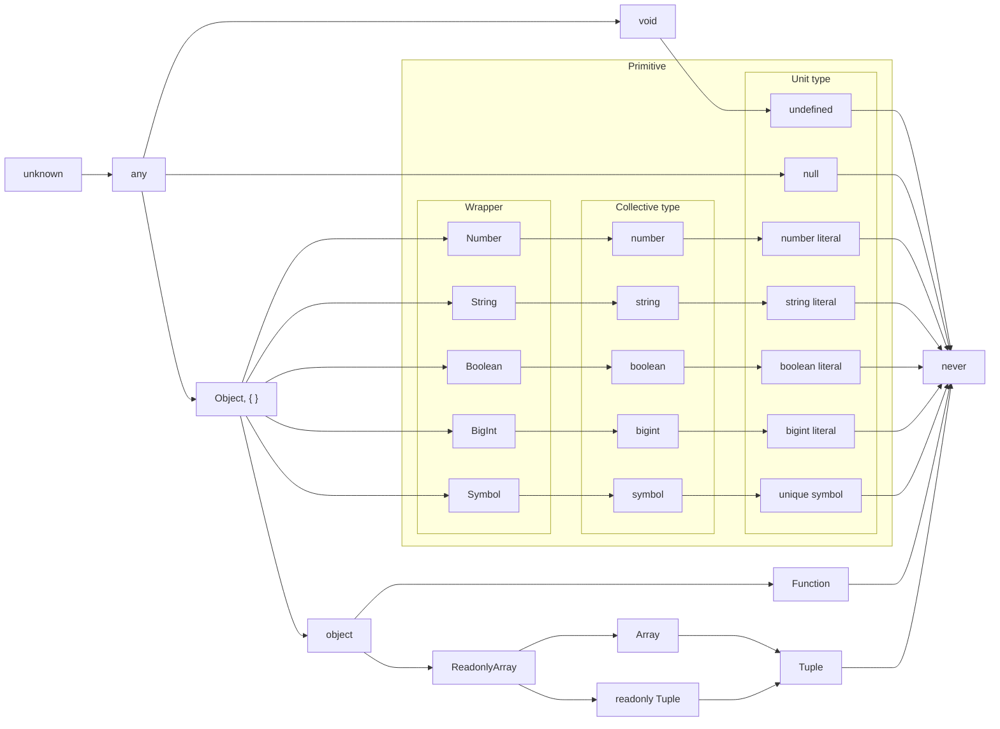

# はじめに

前回の記事では TypeScript における型の拡大(Widening)について解説しました。

https://zenn.dev/estra/articles/typescript-widening

Narrowing の解説に入る前に(Widening を深く理解するためにも)必要な知識や考え方がいくつかあると思ったので、今回は型の集合性と階層性について見ていきたいと思います(短いですが内容的に切り出しても興味深いので)。ただ、集合論や圏論、型理論については詳しくないので間違っているところがあるかもしれません(調べられた範囲で解説しています)。

# Collective type と Unit type

前回記事で解説した "Literal Widening" は `"text"` や `42`、`true` などのリテラルから作られるリテラル型は、変数が mutable になる場所では `string` 型といった一般的な型に拡大されて型推論されるという話でした。

```ts
const strConst = "text";
//    ^^^^^^^^: "text" 文字列リテラル型として型推論される
let strLet = "text";
//  ^^^^^: string 型として拡大されて型推論される

let mutable = strConst;
//  ^^^^^^^: string 型として拡大される
```

実は `"text"` や `42`、`true` といった具体的なリテラルの値から作られるリテラル型に対して、通常はプリミティブ型(Primitive type)と呼ばれる `string` や `number`、`boolean` といった一般的な型は **集合型(Collective type)** と呼ばれることがあります。

https://www.freecodecamp.org/news/typescript-literal-and-collective-types/

現時点最新の公式ドキュメントには記載されていませんが、古いバージョンでは Collective type について言及されています。あるいは Playground の [Literals のサンプル](https://www.typescriptlang.org/play/?q=69#example/literals)にも記載されています。

>**A literal is a more concrete sub-type of a collective type**. What this means is that "Hello World" is a string, but a string is not "Hello World" inside the type system.
>([TypeScript: Handbook - Literal Types](https://www.typescriptlang.org/docs/handbook/literal-types.html) より引用)

リテラル型は集合型の具体的な subtype である旨が記載されていますね。

ちなみに **subtype(部分型、派生型、下位型)** とは型の親子関係のようなもので、ある型の下位の型、つまり子の型として定義されたものを subtype と呼びます。suptype の派生元、つまり親の型となるものは **supertype(基本型、上位型)** と呼ばれます。オブジェクト指向における継承のようなものです。TypeScript で採用されているこういった型の仕組みは Subtyping と呼ばれるそうです。

https://ja.wikipedia.org/wiki/%E3%82%B5%E3%83%96%E3%82%BF%E3%82%A4%E3%83%94%E3%83%B3%E3%82%B0_(%E8%A8%88%E7%AE%97%E6%A9%9F%E7%A7%91%E5%AD%A6)

実際、型は値(各リテラル)の集合であり、具体的な文字列の値はすべての文字列を集めた `string` 型の要素として考えることができます。つまり、具体的な文字列リテラルによってつくられる１つの文字列リテラル型は `string` 型という集合の要素としてみなせます。

>Type 型とは：型とは、値の集合であり、その集合に対して実行できることの集合である。
>少しわかりにくいと思うのでいくつか例を示しましょう。
>
>- boolean type は、全ての boolean 値（といっても二つしかないが。true と false の二つである）の集合であり、この集合に対して実行できる操作の集合である。
>- number type は全ての数値の集合であり、この集合に対して実行できる操作の集合である(例えば `+, -, *, /, %, ||, &&, ?`)である。これらの集合に対して実行できる操作には、.toFixed, .toPrecision, .toString といったものも含まれる。
>- string type は全ての文字列の集合であり、それに対して事項できる操作の集合である。(例えば `+ , || , や &&` ) .concat や .toUpperCase などが含まれる。
>
>([合法 TypeScript 第3章 Type の全て](https://uncle-javascript.com/valid-typescript-chapter3) より引用)

そして、集合型(Collection type)に対して、単位型(Unit type)という概念もあることが数値リテラル型などのプルリクエストで言及されています。

>All literal types as well as the `null` and `undefined` types are considered **unit types**. **A unit type is a type that has only a single value**.
>([Number, enum, and boolean literal types by ahejlsberg · Pull Request #9407 · microsoft/TypeScript](https://github.com/microsoft/TypeScript/pull/9407) より引用、太字は筆者強調)

単位型(Unit type)は、**単一の値のみを持つ型**であり、すべてのリテラル型は `null` 型や `undefined` 型と同じく単位型であると見なされるとのことです。

https://en.wikipedia.org/wiki/Unit_type

`string` 型は単位型である文字列リテラル型の集合型であり、各文字列リテラル型は `string` 型の subtype ということです。これは他のリテラル型とその型を Widening した集合型にも言えます。実際、`boolean` 型は `true` と `false` という真偽値リテラル型のユニオン型、つまり `true | false` という型と等しいことも明言されています。

>The predefined `boolean` type is now equivalent to the union type `true | false`.
>([Number, enum, and boolean literal types by ahejlsberg · Pull Request #9407 · microsoft/TypeScript](https://github.com/microsoft/TypeScript/pull/9407) より引用)

あるいは Handbook の『[TypeScript for Functional Programmers](https://www.typescriptlang.org/docs/handbook/typescript-in-5-minutes-func.html#unit-types)』の項目にも記載されていました。

>**Unit types are subtypes of primitive types that contain exactly one primitive value**. For example, the string "foo" has the type "foo".
>(中略)
>When needed, the compiler widens — **converts to a supertype** — the unit type to the primitive type, such as "foo" to string. This happens when using mutability, which can hamper some uses of mutable variables:
>([TypeScript: Documentation - TypeScript for Functional Programmers](https://www.typescriptlang.org/docs/handbook/typescript-in-5-minutes-func.html#unit-types) より引用)

Unit type は単一のプリミティブ値を持つプリミティブ型の subtype であり、文字列リテラル型 `"foo"` は `string` 型の subtype である旨が記載されていますね。そして、mutable な場所で Widening が起きるときには subtype から派生元の supertype へと変換されるとも書いてあります。

# 型の集合性

Unit type の集合が Collective type(具体的には `string` などのプリミティブ型) であったわけですが、型が具体的な値の集合であるということは、Microsoft Developers の以下の Youtube の動画にて TypeScript の開発者である Anders Hejlsberg 氏(この記事や前の記事で参照しているプルリクエストは大体この方の作成)による公演でも説明されていました(26:32~あたりから)。

https://www.youtube.com/watch?v=hDACN-BGvI8&t=1592s

公演の解説を参考に図を作成してみました。

まず、型は各リテラル値によって作られるリテラル型(Unit type)によって構成されています。これが集合の元となります。`null` 型や `undefined` 型も単一の値によって作られるので Unit type です。そして同じ種類のリテラル型の集合が Collective type たる `string` 型や `number` 型を構成します。


`string` や `number` は無限に要素があるから分かりにくいですが、 `boolean` 型は `true` と `false` というたった２つのリテラル型から構成されたユニオン型なので集合が非常に分かりやすいですね。

`boolean` 型がそうであるように、ユニオン型によって型の和集合を作成できます。例えば `0 | 1 | true | "a"` のような数値リテラル型と真偽値リテラル型と文字列リテラル型によるユニオン型は以下のような集合を作成します。


`number | string | undefined` のようにいくつかの Collective type や Unit type の和集合を作ることもできます。


空集合は `never` 型であり、各リテラル型の積集合や異なる集合型の積集合をインターセクション型で作ろうとすると `never` 型となります。そして型の全体集合は `unknown` 型となります(`unknown` 型がなぜ全体集合になるかは後述する階層性で見れば分かります)。


和集合(Union type)と積集合(Intersection type)はオブジェクトの型で考えると分かりやすいです。以下のような分かりやすいベン図になります。


図にあるように、`{ a: "st" }` という型と `{ b: 42 }` という型について考えたとき、`{ a: "st" }` 型は `a` というプロパティの値の型が文字列リテラル型 `"st"` であるという条件を満たしたあらゆるオブジェクトの集合を表し、`{ b: 42 }` 型は `b` というプロパティの値の型が数値リテラル型 `42` であるという条件を満たしたあらゆるオブジェクトの集合を表します。

そして、`{ a: "st" }` 型と `{ b: 42 }` 型の和集合(Union type)と積集合(Intersection type)が上の図のようになるのは実際にコードを書くことで分かります。ユニオン型が和集合なのでそれぞれの集合を受け入れますが、インターセクション型は共通要素のみしか受け入れません。

```ts
type A = { a: "st" };
type B = { b: 42 };

type Union = A | B;
type Intersection = A & B;

const v_AandB: Intersection = { a: "st", b: 42 };
const v_AOrB1: Union = { a: "st" };
const v_AOrB2: Union = { b: 42 };
const v_AOrB3: Union = { a: "st", b: 42 };
```

ちなみに `{ a: "st" }` という型が `{ a: "st"; c: number }` など任意の他のプロパティを持つ型の集合であることは図で考えれば分かりやすいのですが、実際にコードで書こうとするとエラーがでてしまうので違うのではないかと疑問に思ってしまうことがあります。

```ts
type A = { a: "st" };

// A 型は a 以外のプロパティを持つオブジェクトを受け入れない?
const vA: A = { a: "st", c: "anything" };
//                       ^^^^^^^^^^^^^: [Error]
// Object literal may only specify known properties, and 'c' does not exist in type 'A'.
```

実はこれは型システムにおける違反検知の型チェックエラーではなくて、**余剰プロパティチェック(excess property cehecks)** という別のエラーです。TypeScript の型システム的には問題なくても、エラーとして検知してくれるものです。型システム上は問題ないので、別の変数を経由させることでエラーとならなくなります。

```ts
type A = { a: "st" };

const obj = { a: "st" as const, c: "anything" };
const vA: A = obj; // エラーとならないで受け入れられる
```

ということで、`{ a: "st" }` という型は `{ a: "st"; c: number; d: string }` など `a: "st"` 以外の任意のプロパティを持つオブジェクトの型の集合であることが分かります。実際にこれが可能なのは、TypeScript が [Structural Type System(構造的部分型)](https://www.typescriptlang.org/docs/handbook/typescript-in-5-minutes.html#structural-type-system) というシステムを採用しているからです。

余剰プロパティチェックについては uhyo さんの以下の記事で非常に分かりやすく解説されていたので参考にしてください。ユニオン型が OR 演算によって生成されるということについても解説されています。

https://qiita.com/uhyo/items/b1f806531895cb2e7d9a

# 型の階層性

subtype や supertype という関係から分かる通り、型には親と子の関係があり、階層性があります。すべての型の最上位となる親の型は TypeScript では `unknown` 型であり、[型理論(Type theory)](https://en.wikipedia.org/wiki/Type_theory)ではこのような型を **Top type(トップ型)** と呼ぶそうです。

https://en.wikipedia.org/wiki/Top_type

逆に最下位となる型は TypeScript では `never` 型であり、型理論ではこのような型を **Bottom type(ボトム型)** と呼ぶそうです。

https://en.wikipedia.org/wiki/Bottom_type

公式 Handbook の『[TypeScript for Functional Programmers](https://www.typescriptlang.org/docs/handbook/typescript-in-5-minutes-func.html#other-important-typescript-types)』の項目でも `unknown` 型が top type で `never` 型が bottom type であると明示されています。

*[TypeScript for Functional Programmers](https://www.typescriptlang.org/docs/handbook/typescript-in-5-minutes-func.html#other-important-typescript-types) より引用*

型の集合性で見たとおり、型は値の集合なので、TypeScirpt のリテラル型は単一の値からなる単集合で、`never` 型は値を持たないので空集合です。全体集合を `unknown` 型としてみなすと以下のような図が書けました。


それぞれの型は `unknown` 型という全体集合の部分集合です。

参考文献
https://blog.logrocket.com/when-to-use-never-and-unknown-in-typescript-5e4d6c5799ad/

そして、subtype と supertype の関係を辿ると以下のような型の階層図(Type hierarchy)もできあがります。ただし、以下の図は mermaid で記述したものですが、全貌図としては正確ではないと思うので注意してください(複数の文献を参考にして作成してますが、TypeScript のバージョン更新によって古い階層図と変わっているところなどもあるので、大体はこんな感じという程度です)。また、`enum` などの型は JS に存在しない TS の独自機能なので意図的に排除しており、Promise 型や Iterable 型などの型も省略しています(それらの型は `object` 型傘下の subtype です)。



左が supertype で、右が suptype の方向となります。一番左に位置している `unknwon` 型がすべての型の supertype であり Top type です。逆に一番右に位置している `never` 型がすべての型の subtype であり Bottom type です。

そして subtype の型の変数は supertype の型の変数へ代入可能です。

>スーパータイプは、そのサブタイプの数々によって代替/代入可能とされており、これは代入可能性（substitutability）と呼ばれる。そのスーパータイプとサブタイプの関係は、[is-a](https://ja.wikipedia.org/wiki/Is-a)とも言われる。記号 `<:` を用いて `subtype <: supertype` と表記される。
>([サブタイピング (計算機科学) - Wikipedia](https://ja.wikipedia.org/wiki/%E3%82%B5%E3%83%96%E3%82%BF%E3%82%A4%E3%83%94%E3%83%B3%E3%82%B0_(%E8%A8%88%E7%AE%97%E6%A9%9F%E7%A7%91%E5%AD%A6)?oldformat=true) より引用)

Widening(型の拡大) が起きる方向は子から親、つまり subtype → supertype の方向であり、代入可能となるのも subtype → supertype の方向で、その逆は型エラーとなります。

```ts
const literal = "text" as const;
let str: string;
let Str: String;
let Obj: Object;
let an: any;
let unk: unknown;

// subtype → supertype で代入していくと型エラーにならない
str = literal;
Str = str;
Obj = Str;
an = Obj;
unk = an;
```

この図と Handbook の『[Type Compatibility](https://www.typescriptlang.org/docs/handbook/type-compatibility.html#any-unknown-object-void-undefined-null-and-never-assignability)』の図を見比べると subtype → supertype で代入可能である一方で、supertype → subtype で代入できないというのが上の階層図と一致しているので納得できます(`any` 型は例外)。

*[Type Compatibility](https://www.typescriptlang.org/docs/handbook/type-compatibility.html#any-unknown-object-void-undefined-null-and-never-assignability) より引用*

代入可能であることや subtype の関係性は型の互換性(compatibility)として定められています。代入可能であることと subtype であることは近似していますが、微妙に異なるということが Handbook の以下の箇所に記載されています。

>So far, we’ve used “compatible”, which is not a term defined in the language spec. In TypeScript, **there are two kinds of compatibility: subtype and assignment**. These differ only in that **assignment extends subtype compatibility with rules to allow assignment to and from any**, and to and from enum with corresponding numeric values.
>([TypeScript: Documentation - Type Compatibility](https://www.typescriptlang.org/docs/handbook/type-compatibility.html#subtype-vs-assignment) より引用、太字は筆者強調)

subytype 互換性を拡張したものが代入(assignment)可能性であり、具体的には、`any` 型から様々な型に代入できることと `any` 型に様々な型を代入できるというルールが追加されていることが記載されていますね(`enum` についての言及は無視しています)。

:::message
他にも Handbook には次のようなルールが記載されていますが、上のような階層図で考えれば細かいルールを覚えなくても理解できます。

- すべての型は自身の型へ代入可能
- `any` 型と `unknown` 型はそれら自身への代入可能な型は同じだが、`unknown` 型は `any` 型の除いて他の型へ代入することはできない
- `unknown` 型と `never` 型はお互いに逆の関係性となっており、`unknown` 型にはあらゆる型が代入可能であり `any` 型を除くあらゆる型に代入できない一方、`never` 型にはあらゆる型が代入できず、あらゆる型に代入可能である
- `void` 型は `any` 型や `unknown` 型、`never` 型、`null` 型を除くあらゆる型が・に代入できない
- `strictNullChecks` を無効化すると、`null` 型と `undefined` 型は `never` 型に近似して、大抵の型に代入可能、大抵の型が代入不可能となり、お互いに代入可能となる
- `strictNullChecks` を有効化すると、`null` 型は `void` 型のように振る舞い、`any` 型や `unknown` 型、`never` 型そして `void` 型を除くすべての型が・に代入できない(`undefined` 型は常に `void` 型)へ代入できる。
:::

実際、`any` 型は型チェックを放棄するので、例外的にすべての型に代入可能であり、自身の subtype である型にも代入できます(上の代入可能であるかの図でもそうなっていますね)。ただし Bottom type である `never` 型には `never` 型以外は何も代入できないので `any` 型でも代入することはできません。

```ts
// any 型は型チェックしなくなるので assignable の概念もなくなってすべての型の変数に代入できてしまう
const numAsAny = 42 as any;

const und: undefined = numAsAny;
const str: string = numAsAny;
// ただし Bottom type である never 型には代入できない
const nev: never = numAsAny; // [Error]
// Type 'any' is not assignable to type 'never'
```

`never` 型は本来は「値を持たない」ということを表現する型なので、`never` 型には `never` 型しか代入できないということを検証するには型アサーションで `never` 型としてあげることで可能です。また、`never` 型は最下層の subtype つまり Bottom type なので `never` 型からみればあらゆる型が supertype となり代入可能です(各リテラル型も supertype です)。

```ts
// 通常 never 型は値を持たないはずだが、型アサーションで never 型にできて、never 型に代入できる
const nev: never = 1 as never;

// never 型はどんな型にも代入できる
const str: string = nev;
const strArray: string[] = nev;
const strLiteral: "text" = nev; // リテラル型にも代入可能
const an: any = nev;
const nev2: never = nev; // never 型(自身)に代入可能
```

ちなみに関数の返り値がないことを表現する `void` 型ですが、`return` 文を持たない関数の返り値の型は自動で `void` 型であると型推論されます。そういった関数から返り値を得ようとして返ってくるのは `undefined` という値です。この２つも supertype と subtype の関係です(階層図を参照)。`void` 型が supertype で、`undefined` 型が subtype なので、`void` 型に `undefined` 型は代入可能です(逆はできない)。

```ts
const u: undefined = undefined;
const v: void = u;
```

ただ、Handbook の『[TypeScript for Functional Programmers](https://www.typescriptlang.org/docs/handbook/typescript-in-5-minutes-func.html#other-important-typescript-types)』の項目では `void` 型の説明が "a subtype of `undefined` intended for use as a return type." となっているのですが、古い仕様書を見ると `void` 型は `undefined` 型の supertype として明記してあるのでこれは公式ドキュメントのミスだと思われます。たぶんミスだろうということでプルリクエストを作成しました(バージョン更新によって supertype が subtype になるような仕様変更は流石にないと思います)。

https://github.com/microsoft/TypeScript-Website/pull/2470

参考文献
- [TypeScriptのコンパイルプロセス / 型の階層構造 - knmts.com](https://knmts.com/as-a-engineer-52/)
- [TypeScriptの型メモ - Qiita](https://qiita.com/dico_leque/items/06ac5837b7a333c5c8da)
- [Diagram of every possible TypeScript type](https://gist.github.com/laughinghan/31e02b3f3b79a4b1d58138beff1a2a89)
- [2章 型と関数の圏 · Scala で始める圏論入門](https://criceta.com/category-theory-with-scala/02_Types_and_functions.html)
- [集合としての型 · An Introduction to Elm](https://guide.elm-lang.jp/appendix/types_as_sets.html)

