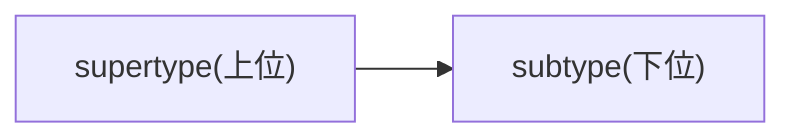
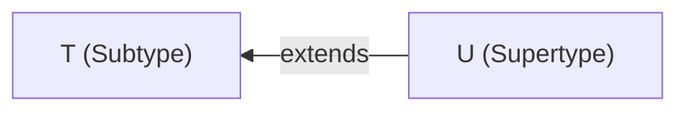
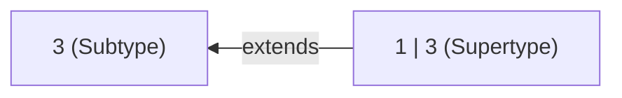
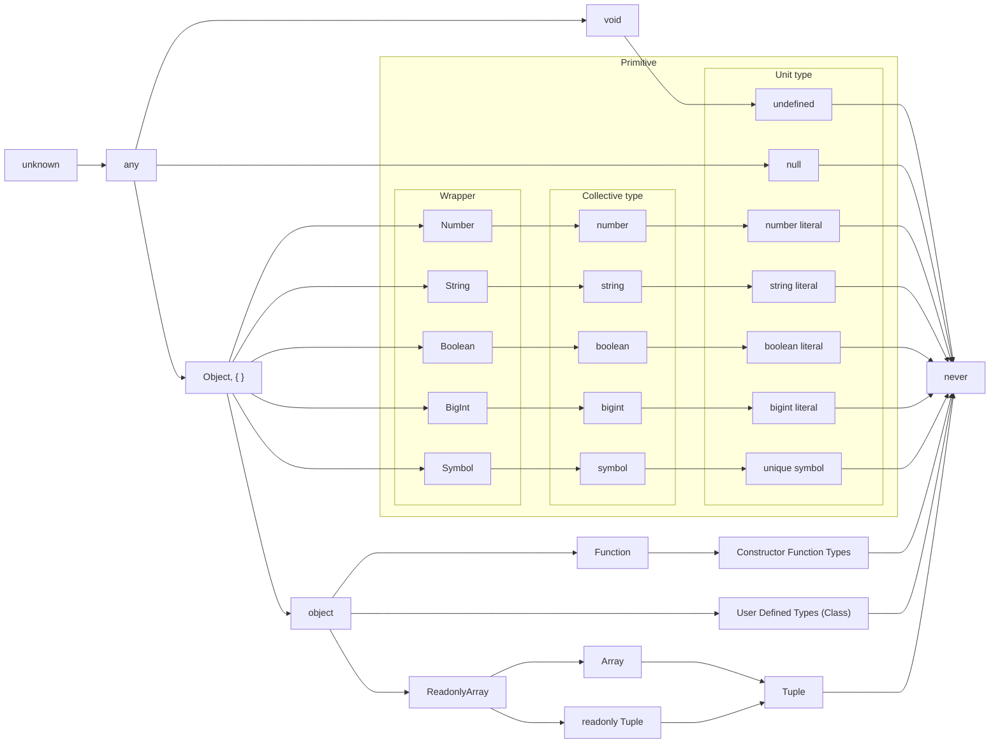
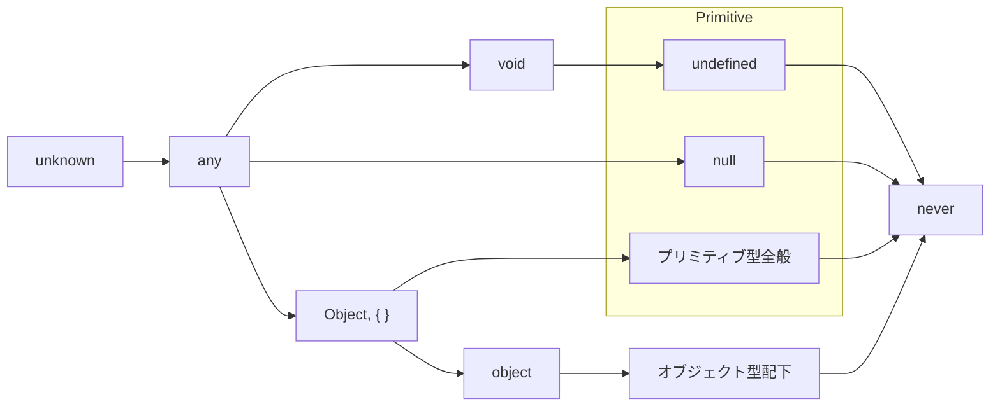

## はじめに

前回の記事では TypeScript における型の拡大 (Widening) について解説しました。

https://zenn.dev/estra/articles/typescript-widening

Narrowing の記事を書く前に (Widening を深く理解するためにも) 必要な知識や考え方がいくつかあると思ったので、今回は型の集合性と階層性について見ていきたいと思います (短いですが内容的に切り出しても興味深いので)。

:::message alert
ただし、集合論や圏論、型理論については全然詳しくないので間違っているところがあるかもしれません。調べられた範囲で解説していますが、厳密性などについても目をつぶっていただけると助かります。
:::

この記事の最後で別の型の変数同士で代入できるかどうかを示す「assignability (代入可能性あるいは割当可能性)」について解説しますが、**集合と階層の概念で考えることで見通しが非常によくなり、型一般についてもスッキリと理解できることが多くなります**。また、`never` や `unknown` といったいまいち分かりづらい型についても、なぜ存在しているのか、どういった位置にあるのかが理解しやすくなります。

:::details ChangeLog
大きな変更のみトラッキングしています。

- 2023-02-27
  - 関数の型についての情報を記載
- 2023-02-24
  - いくつかの内容について修正
- 2022-08-30
  - 見出し構成を変更
  - extends についての記述を追加
:::

## 型の集合性

### Collective type と Unit type

前回記事で解説した "Literal Widening" は `"text"` や `42`、`true` などのリテラルから作られるリテラル型は、変数が mutable になる場所では `string` 型といった一般的な型に拡大されて型推論されるという話でした。

```ts
const strConst = "text";
//    ^^^^^^^^: "text" 文字列リテラル型として型推論される
let strLet = "text";
//  ^^^^^: string 型として拡大されて型推論される

let mutable = strConst;
//  ^^^^^^^: string 型として拡大される
```

実は `"text"` や `42`、`true` といった具体的なリテラルの値から作られるリテラル型に対して、通常はプリミティブ型 (Primitive type) と呼ばれる `string` や `number`、`boolean` といった一般的な型は **集合型 (Collective type)** と呼ばれることがあります。

https://www.freecodecamp.org/news/typescript-literal-and-collective-types/

現時点最新の公式ドキュメントには記載されていませんが、古いバージョンでは Collective type について言及されています。あるいは Playground の [Literals のサンプル](https://www.typescriptlang.org/play/?q=69#example/literals) にも記載されています。

> **A literal is a more concrete sub-type of a collective type**. What this means is that "Hello World" is a string, but a string is not "Hello World" inside the type system.
> ([TypeScript: Handbook - Literal Types](https://www.typescriptlang.org/docs/handbook/literal-types.html) より引用)

リテラル型は集合型の具体的な subtype である旨が記載されていますね。

ちなみに **subtype(部分型、派生型、下位型)** とは型の親子関係のようなもので、ある型の下位の型、つまり子の型として定義されたものを subtype と呼びます。subtype の派生元、つまり親の型となるものは **supertype(基本型、上位型)** と呼ばれます。オブジェクト指向での継承によって作成される子クラスと親クラスの関係のようなものです。



２つの型の関係を簡易的に判別するには、受け入れる値の範囲が広く型の制約 (条件) が緩いものが supertype で、受け入れる値の範囲が狭く型の制約がより厳しいものが subtype です。もちろん、supertype と subtype の関係性にない場合もありえます (`number` と `string` を比較した場合など)。

TypeScript で採用されているこういった型の仕組みは Subtyping と呼ばれるそうです。より具体的には [Structural subtyping system](https://en.wikipedia.org/wiki/Structural_type_system) (property-based type system) です。

https://en.wikipedia.org/wiki/Subtyping

:::message
Subtyping の概念自体は、1960 年代までさかのぼり、[Simula](https://en.wikipedia.org/wiki/Simula) というプログラミング言語によって初めて導入され、その概念が脚光を浴びたのはオブジェクト指向プログラミング (OOP: Object-Oriented Programming) でそれが主流になったためであるとのことです。

> The notion of subtyping in programming languages dates back to the 1960s; it was introduced in Simula derivatives. The first formal treatments of subtyping were given by John C. Reynolds in 1980 who used category theory to formalize implicit conversions, and Luca Cardelli (1985).
> ([Subtyping - Wikipedia](https://en.wikipedia.org/wiki/Subtyping) より引用)

「オブジェクト指向での継承によって作成される子クラスと親クラスの関係のようなもの」と言いましたが、ややこしいことに OOP の文脈では、型 (interface) 同士の関係を指す Subtyping による継承と、既存のオブジェクトから新しいオブジェクトを作成するための言語機能から来る実装間の継承があります。Inheritance (継承) というときにはこの２つの異なる概念があることに注意してください。

- Subtyping: Interface inheritance
- Inheritance: Implementation inheritance

実際にインターフェース型を継承させて subtype を作り出すことができます。

```ts
interface Animal {
  name: string;
  age: number;
}

interface Dog extends Animal {
  bread: string;
  bark(): void;
}

const myDog: Dog = {
  name: "John",
  age: 2,
  bread: "Labrador Retriever",
  bark: () => console.log("Woof"),
}

const myAnimal: Animal = myDog;
```
:::

実際、型は値の集合 (より厳密に言えば値と利用できる操作の集合) であり、具体的な文字列の値はすべての文字列を集めた `string` 型の要素として考えることができます。逆に、具体的な文字列リテラルによってつくられる１つの文字列リテラル型は `string` 型という集合の部分集合としてみなせます (一つの具体的な値からそれに対応するリテラル型という単集合ができる)。

> Type 型とは：型とは、値の集合であり、その集合に対して実行できることの集合である。
> 少しわかりにくいと思うのでいくつか例を示しましょう。
>
> - boolean type は、全ての boolean 値（といっても二つしかないが。true と false の二つである）の集合であり、この集合に対して実行できる操作の集合である。
> - number type は全ての数値の集合であり、この集合に対して実行できる操作の集合である (例えば `+, -, *, /, %, ||, &&, ?`) である。これらの集合に対して実行できる操作には、.toFixed, .toPrecision, .toString といったものも含まれる。
> - string type は全ての文字列の集合であり、それに対して事項できる操作の集合である。(例えば `+ , || , や &&` ) .concat や .toUpperCase などが含まれる。
>
> ([合法 TypeScript 第3章 Type の全て](https://uncle-javascript.com/valid-typescript-chapter3) より引用)

そして、集合型 (Collection type) に対して、単位型 (Unit type) という概念もあることが数値リテラル型などのプルリクエストで言及されています。

> All literal types as well as the `null` and `undefined` types are considered **unit types**. **A unit type is a type that has only a single value**.
> ([Number, enum, and boolean literal types by ahejlsberg · Pull Request #9407 · microsoft/TypeScript](https://github.com/microsoft/TypeScript/pull/9407) より引用、太字は筆者強調)

単位型 (Unit type) は、**単一の値のみを持つ型** であり、すべてのリテラル型は `null` 型や `undefined` 型と同じく単位型であると見なされるとのことです。

https://en.wikipedia.org/wiki/Unit_type

`string` 型は単位型である文字列リテラル型の集合型であり、各文字列リテラル型は `string` 型の subtype ということです。これは他のリテラル型とその型を Widening した集合型にも言えます。実際、`boolean` 型は `true` と `false` という真偽値リテラル型のユニオン型、つまり `true | false` という型と等しいことも明言されています。

> The predefined `boolean` type is now equivalent to the union type `true | false`.
> ([Number, enum, and boolean literal types by ahejlsberg · Pull Request #9407 · microsoft/TypeScript](https://github.com/microsoft/TypeScript/pull/9407) より引用)

あるいは Handbook の『[TypeScript for Functional Programmers](https://www.typescriptlang.org/docs/handbook/typescript-in-5-minutes-func.html#unit-types)』の項目にも記載されていました。

> **Unit types are subtypes of primitive types that contain exactly one primitive value**. For example, the string "foo" has the type "foo".
> (中略)
> When needed, the compiler widens — **converts to a supertype** — the unit type to the primitive type, such as "foo" to string. This happens when using mutability, which can hamper some uses of mutable variables:
> ([TypeScript: Documentation - TypeScript for Functional Programmers](https://www.typescriptlang.org/docs/handbook/typescript-in-5-minutes-func.html#unit-types) より引用)

Unit type は単一のプリミティブ値を持つプリミティブ型の subtype であり、文字列リテラル型 `"foo"` は `string` 型の subtype である旨が記載されていますね。そして、mutable な場所で Widening が起きるときには subtype から派生元の supertype へと変換されるとも書いてあります。

### Types as Sets

Unit type の集合が Collective type(具体的には `string` などのプリミティブ型) であったわけですが、型が具体的な値の集合であるということは、公式ドキュメントの『TypeScript for Java/C## Programmers』のページの『[Types as Sets](https://www.typescriptlang.org/docs/handbook/typescript-in-5-minutes-oop.html#types-as-sets)』の項目で明言されています。

> In TypeScript, it’s better to think of **a type as a set of values that share something in common**. **Because types are just sets**, a particular value can belong to many sets at the same time.
> ([TypeScript: Documentation - TypeScript for Java/C## Programmers](https://www.typescriptlang.org/docs/handbook/typescript-in-5-minutes-oop.html#types-as-sets) より引用、太字は筆者強調)

(可能な操作や演算などの体系などが) 共通している値の集合が型であり、それぞれの値は複数の集合 (型) に属すことができることが言及されていますね。

TypeScript ではこのように型を集合として考えることで直感的に理解することができるとも記載されています。

> **TypeScript provides a number of mechanisms to work with types in a set-theoretic way**, and you’ll find them more intuitive if you think of types as sets.
> ([TypeScript: Documentation - TypeScript for Java/C## Programmers](https://www.typescriptlang.org/docs/handbook/typescript-in-5-minutes-oop.html#types-as-sets) より引用、太字は筆者強調)

TypeScirpt 自体は型を集合論的に扱える仕組みを提供するようにデザインされているわけです。実際、ある値が特定の型の変数に代入可能であるかどうかは、その集合 (型の範疇) に属しているかで決まります。

:::message
公式ドキュメントの『Get Started』にリストされている『TS for ~』のドキュメントには実はそこにしか記載されていない内容がいくつかあるので関係無いと思わずに読む必要があります。

- [TypeScript for Java/C# Programmers](https://www.typescriptlang.org/docs/handbook/typescript-in-5-minutes-oop.html)
- [TypeScript for Functional Programmers](https://www.typescriptlang.org/docs/handbook/typescript-in-5-minutes-func.html)
:::

そして、型が集合であること (あるいはそのように扱えること) は、Microsoft Developers の以下の動画にて TypeScript の開発者である Anders Hejlsberg 氏 (この記事や前の記事で参照しているプルリクエストは大体この方の作成) が直々に説明していました (26:32~あたりから)。

https://www.youtube.com/watch?v=hDACN-BGvI8&t=1592s

実際に型が集合であることを説明するために、この公演の解説を参考に図を作成してみました。

まず、型は各リテラル値によって作られるリテラル型 (Unit type) によって構成されています。これが集合の元となります。`null` 型や `undefined` 型も単一の値によって作られるので Unit type です。そして同じ種類のリテラル型の集合が Collective type たる `string` 型や `number` 型を構成します。


`string` や `number` は無限に要素があるから分かりにくいですが (`number` 型の要素は実際には [有限で表現可能範囲に限界がある](https://qiita.com/uhyo/items/f9abb94bcc0374d7ed23))、 `boolean` 型は `true` と `false` というたった２つのリテラル型から構成されたユニオン型なので集合が非常に分かりやすいですね。

`boolean` 型がそうであるように、ユニオン型によって型の和集合を作成できます。例えば `0 | 1 | true | "a"` のような数値リテラル型と真偽値リテラル型と文字列リテラル型によるユニオン型は以下のような集合を作成します。


`number | string | undefined` のようにいくつかの Collective type や Unit type の和集合を作ることもできます。


空集合 (Empty set) となる値を持たない型は `never` 型であり、各リテラル型の積集合や異なる集合型の積集合をインターセクション型で作ろうとすると `never` 型となります。図にあるように `number & string` という異なるプリミティブ型同士のインターセクションによる積集合は共通部部分が存在しないため、型の合成結果として `never` 型が返ってきます。ちなみに空の交差が `never` 型になるというこの機能は以下の PR で実装されました。

https://github.com/microsoft/TypeScript/pull/31838

そして型の全体集合 (Universal set) は `unknown` 型となります (`unknown` 型がなぜ全体集合になるかは後述する階層性で見れば分かります)。


和集合 (Union type) と積集合 (Intersection type) についてはオブジェクトの型で考えると分かりやすいです。`{ a: "st" }` という型と `{ b: 42 }` という型について考えたときのユニオン型とインターセクション型を図示すると以下のような分かりやすいベン図になります。


図にあるように、`{ a: "st" }` 型は `a` というプロパティの値の型が文字列リテラル型 `"st"` であるという **条件を満たしたあらゆるオブジェクトの集合** を表し、`{ b: 42 }` 型は `b` というプロパティの値の型が数値リテラル型 `42` であるという **条件を満たしたあらゆるオブジェクトの集合** を表します。

そして、`{ a: "st" }` 型と `{ b: 42 }` 型の和集合 (Union type) と積集合 (Intersection type) が上の図のようになるのは実際にコードを書くことで分かります。ユニオン型が和集合なのでそれぞれの集合の要素を受け入れますが、インターセクション型は共通要素のみしか受け入れません。

```ts
type A = { a: "st" };
type B = { b: 42 };

type Union = A | B;
type Intersection = A & B;

const v_AOrB1: Union = { a: "st" };
const v_AOrB2: Union = { b: 42 };
const v_AOrB3: Union = { a: "st", b: 42 };

const v_AandB: Intersection = { a: "st", b: 42 };

// インターセクション型はユニオン型に含まれる部分集合なので代入可能
const v_AOrB: Union = v_AandB;
```

型システム一般においてもインターセクション型 (Intersection type) は $\sigma\cap\tau$ として、ユニオン型 (Union type) は $\sigma\cup\tau$ として表記されます。集合の積と和の表現と同じですね。

*[Type system - Wikipedia](https://en.wikipedia.org/w/index.php?title=Type_system#Specialized_type_systems) より引用*

ちなみに `{ a: "st" }` という型が `{ a: "st"; c: number }` など任意の他のプロパティを持つあらゆるオブジェクト (あるいはオブジェクトリテラル型) の集合であることは図で考えれば直感的に分かりやすいのですが、実際にコードで書こうとするとエラーがでてしまうので違うのではないかと疑問に思ってしまうことがあります。

```ts
type A = { a: "st" };

// A 型は a 以外のプロパティを持つオブジェクトを受け入れない?
const vA: A = { a: "st", c: "anything" };
//                       ^^^^^^^^^^^^^: [Error]
// Object literal may only specify known properties, and 'c' does not exist in type 'A'.
```

実はこれは型システムにおける違反検知の型チェックエラーではなくて、**余剰プロパティチェック (excess property checks)** という別のエラーです。TypeScript の型システム的には問題なくても、エラーとして検知してくれるものです。型システム上は問題ないので、別の変数を経由させることでエラーとならなくなります。

```ts
type A = { a: "st" };

const obj = { a: "st" as const, c: "anything" };
const vA: A = obj; // エラーとならないで受け入れられる
```

ということで、`{ a: "st" }` という型は `{ a: "st"; c: number; d: string }` など `a: "st"` 以外の任意のプロパティを持つオブジェクト (あるいはオブジェクトリテラル型) の集合であることが分かります。

このことからも上図だとインターセクション型として表現されている `{ a: "st"; b: 42 }` という型はより制約 (条件) が緩い `{ a: st }` 型や `{ b: 42 }` 型の部分集合であることが分かります。

```ts
type A = { a: "st" };
type B = { b: 42 };
type AB = { a: "st"; b: 42 }; // A & B (A と B の条件を満たす)

const ab: AB = { a: "st", b: 42 };
const a: A = ab; // A という型の範疇
const b: B = ab; // B という型の範疇
```

実際にこのような代入が可能なのは、TypeScript が [構造的部分型(Structural Type System)](https://www.typescriptlang.org/docs/handbook/typescript-in-5-minutes.html#structural-type-system) というシステムを採用しているからです。

オブジェクト型のユニオンやインターセクションを見ればわかるように、合成などの型操作は集合の領域に対しての操作と同じことになります。オブジェクト型でなくても例えば `string | number` と `string | boolean` という２つのユニオン型を合成すれば、積集合 (インターセクション) は `string` 型となり、和集合 (ユニオン) は `string | number | boolean` 型となります。

余剰プロパティチェックについては uhyo さんの以下の記事で非常に分かりやすく解説されていたので参考にしてください。ユニオン型が OR 演算によって生成されるということについても解説されています。

https://qiita.com/uhyo/items/b1f806531895cb2e7d9a

### extends での判別

話は少し変わりますが、`extends` キーワードでの型の集合性について考えてみたいと思います。

`extends` はインタフェース型の継承に利用するキーワードで、構造的部分型においてプロパティが増えるたびに継承元に対して subtype となっていくことがわかりやすいでしょう。

```ts
interface Animal {
  name: string;
}

interface Duck extends Animal {
  sound: string
}
// { name: string; sound: string; }

interface Donald extends Duck {
  color: string;
}
// { name: string; sound: string; color: string; }

const don: Donald = {
  name: "ドナルド",
  sound: "guwa",
  color: "blue",
};
const duc: Duck = don;
const ani: Animal = duc;
```

`Donald` は `Duck` の subtype であり、`Duck` は `Animal` の subtype です。

`extends` の基本が分かったところで、少し応用的な話に移ります。

ユーティリティ型である `Exclude<UnionType, ExcludedMembers>` 型などを [自分で実装すると](https://github.com/type-challenges/type-challenges/blob/main/questions/00043-easy-exclude/README.ja.md) 理解できるのですが、`extends` キーワードを使った条件型 (Conditional type) は型変数がユニオン型だと分配法則によって条件判定をユニオン型を構成する各要素に対してイテレーションします。

```ts
type MyExclude<T, U> = T extends U ? never : T;

type Test = MyExclude<1 | 2 | 3, 2>;
// = 1 | 3

/* イテレーション
T extends U ? never : T
-----------------------
1 extends 2 =>(false) 1
2 extends 2 =>(true) never
*/
// MyExclude<1,2> | MyExclude<2,2>
// 1 | never => 1
```

- 参考:
  - [Exclude<UnionType, ExcludedMembers> | TypeScript: Documentation](https://www.typescriptlang.org/docs/handbook/utility-types.html#excludeuniontype-excludedmembers)
  - [Distributive Conditional Types | TypeScript: Documentation](https://www.typescriptlang.org/docs/handbook/2/conditional-types.html#distributive-conditional-types)

次のように `U` もユニオン型になった場合はどうでしょうか?

もちろん、`1 | 2 | 3 | 4` というユニオン型から `1 | 3` というユニオン型が除外されるので生成される型としては `2 | 4` となりますが、内部的にどのようなことが起きているかは分かりづらいです。

```ts
type Uni1 = 1 | 2 | 3 | 4;
type Uni2 = 1 | 3;
type Test2 = MyExclude<Uni1, Uni2>;
//             1|2|3|4 ^^^^  ^^^^ 1|3
// = 2 | 4

/* イテレーション
T extends U ? never : T
-----------------------
1 extends 1|3 => ???
2 extends 1|3 => ???
3 extends 1|3 => ???
4 extends 1|3 => ???
*/
```

`T extends U` では型パラメータ `T` を `U` という型パラメータで制約をかけるので、`U` が supertype で `T` が subtype となるか、あるいは `T` が `U` そのものとなります。この制約は `T` 型が `U` 型の条件を満たせばよいだけです。



プリミティブ型だと分かりづらいですが、オブジェクト型だと `extends` で型を制約 (constrain) することが分かりやすくなります。`extends` キーワードによる型パラメータの制約は条件型以外にもジェネリック型やジェネリック関数などでも利用できるので、次のように型パラメータ `Type` を `{ length: number }` というプロパティを持つオブジェクトの型で制約すると、その制約条件を満たす値しか引数として受け付けません。制約を設けずに `Type` だけにしてしまうと型の範囲が広すぎて引数に渡す変数が `length` プロパティを持つことを保証できませんが、逆に制約を設けることで関数内の変数が `length` プロパティを持つことを保証できます。

```ts
// 制約条件 { length: number } を満たす値のみを引数として受け取る(満たさなければ型エラー)
function longer<Type extends { length: number }> (
  a: Type,
  b: Type
): Type {
  if (a.length > b.length) {
    // length プロパティを持っていることが保証されている
    return a;
  } else {
    return b;
  }
};
```

`length` プロパティは少し特殊で、文字列や配列などの値はこのプロパティをもともと持っており引数として渡すことができるので、以下のようなコードが有効となります。

```ts
longer("st", "str"); // 文字列は length プロパティを持つ
// => "str"
longer([1, 2], [1, 2, 3]); // 配列は length プロパティを持つ
// => [1, 2, 3]
longer({ length: 42 }, { length: 53, name: "obj" });
// => { length: 53, name: "obj" }
```

話を条件型に戻すと、`extends` での条件部がユニオン型に関するものだと `true` になるか `false` になるかは一見分かりづらいですが、集合で考えることでスッキリと理解できます。subtype は supertype の部分集合です。特にユニオン型では、それを構成する各メンバーはユニオン型自体の部分集合 (subset) となります。


`1 | 3` というユニオン型は `1` と `3` という２つの数値リテラル型の和集合です。従って、`1` という数値リテラル型はこの和集合に含まれるため、`1 extends 1 | 3` は true であり、条件型からは `never` 型が返されます。



`1 | 3` のユニオン型の集合には `2` や `4` といった数値リテラル型は含まれないため、`2 extends 1 | 3` と `4 extends 1 | 3` の条件判定は false となりそれぞれで `2` と `4` という数値リテラル型が返されます。

表にまとめると次のようになります。

条件部 | 判定 | 返却される型
--|--|--
1 extends 1 &#124; 3 | true  | never
2 extends 1 &#124; 3 | false | 2
3 extends 1 &#124; 3 | true  | never
4 extends 1 &#124; 3 | false | 4

ということで、`MyExclude<Uni1, Uni2>` で最終的に返される型はイテレーション結果を合成したユニオン型となるので、`never | 2 | never | 4` つまり `2 | 4` というユニオン型が返されます。

単純なジェネリクスの利用時に型引数そのものに `extends` キーワードで制約をかける際にも集合で考えると、制約元の型集合内で条件を満たす部分集合であると理解できます (条件を満たしていれば良いので、制約元の型そのものでもよいです)。

この `extends` による型パラメータの制約機能は [TypeScript 1.8 で導入された機能](https://www.typescriptlang.org/docs/handbook/release-notes/typescript-1-8.html#type-parameters-as-constraints) であり、型理論では一般に F- 有界量化 ([F-bounded quantification](https://en.wikipedia.org/wiki/Bounded_quantification#F-bounded_quantification)) と呼ばれる類のものだそうです。

有界量化 (Bounded quantification) 自体は Wikipedia だと以下のような概念として解説されています。公式 Handbook でも Wikipedia の記事自体が言及されているので基本的にはあっているはずです。

> In type theory, bounded quantification (also bounded polymorphism or constrained genericity) refers to universal or existential quantifiers **which are restricted ("bounded") to range only over the subtypes of a particular type**. Bounded quantification is **an interaction of parametric polymorphism with subtyping**.
> ([Bounded quantification - Wikipedia](https://en.wikipedia.org/wiki/Bounded_quantification) より引用、太字は筆者強調)

専門用語が多すぎるので分かりづらいですが、簡易的に意訳すると特定の型の subtype の領域にのみ制限する記法のことです (間違ってたらすみません)。これでジェネリクスとサブタイピングの相互作用を表現します。

考え方としては、考慮すべき型の領域として境界 (boundary) を設けることでジェネリクスなどでの型パラメータがとり得る型 (値) の範囲を制限して使いやすくしているだけです。そして型が値の集合であることを知っていると、境界内の領域はすなわち集合の領域そのものとなります。`T extends U` という条件を図で表現すると次のような感じです。


型パラメータ `T` は境界 (制約) を規定する `U` 型の領域内のあらゆる範囲を動くことができ、その範囲であればどのような subtype でも良いわけです (もちろん `U` そのものでもよい)。１つの supertype に対して subtype は複数ありえるので上のような図となります。

図では `U` も型パラメータにしていますが、例えば `unknown[]` などをいれて `T extends unknown[]` というように配列型などの具体的な型で拘束して考えてみると良いでしょう。

### 関数の型

型は具体的な値の集合であると述べましたが、型を集合として捉える時、具体的な関数も型の要素となります。そもそも関数はオブジェクトであり値ですから、関数の型も具体的な関数実装の集合であるわけです。

TypeScript では以下のように関数の型を定義できます。

```ts
// 関数の型を定義
type NumberOp = (num: number) => number;

// 関数の型で注釈して具体的な関数を実装する
const increment: NumberOp = (param) => {
  //                         ^^^^^^ number 型の引数
  return param + 1;
  //     ^^^^^^^^^ number 型の返り値
};

console.log(increment(42)); // => 43
```

上記コードで定義した具体的な関数 `increment` は関数の型である `NumberOp` という集合内の一つの要素となります。`NumberOp` 型、つまり `(num: number) => number` という関数型の集合には他にも以下のような具体的な関数の要素が含まれています。

```ts
// (num: number) => number 型の関数値
const double: NumberOp = (param) => {
  return param * 2;
};

// (num: number) => number 型の関数値
const sqrt: NumberOp = (param) => {
  return Math.sqrt(param);
};
```

このようにある関数の型定義を満たすような具体的な関数の実装がその関数型の集合についての要素となります。

ただし、プリミティブ型やオブジェクト型の値 (value) のように関数の型を集合として捉えて、型の合成やサブタイプ互換性について考えるにはいくつか難しいことがあるので、素朴な集合論よりも対象 (object) と射 (arrow, morphism) を扱う圏論の方が適しているようです。

https://criceta.com/category-theory-with-scala/01_Category.html

また、関数の型はシグネチャ (引数の数、引数の型、返り値の型) について考慮しなくてはなりません。このときにそれぞれの要素についてサブタイプ互換性の変性 (variance) という概念も必要になります。特に関数の型は引数の型については双変 (bivariant) あるいは反変 (contravariant) になります。

https://www.typescriptlang.org/docs/handbook/type-compatibility.html#function-parameter-bivariance

長くなるのでここでは解説しません。

## 型の階層性

### Top type と Bottom type

subtype や supertype という関係から分かる通り、型には親と子の関係があり、階層性があります (集合性について見方を変えるだけですが階層性で考える方が都合のよい場合があります)。すべての型の最上位となる親の型は TypeScript では `unknown` 型であり、[型理論(Type theory)](https://en.wikipedia.org/wiki/Type_theory) ではこのような型を **Top type(トップ型)** と呼ぶそうです。

https://en.wikipedia.org/wiki/Top_type

逆に最下位となる型は TypeScript では `never` 型であり、型理論ではこのような型を **Bottom type(ボトム型)** と呼ぶそうです。

https://en.wikipedia.org/wiki/Bottom_type

公式 Handbook の『[TypeScript for Functional Programmers](https://www.typescriptlang.org/docs/handbook/typescript-in-5-minutes-func.html#other-important-typescript-types)』の項目でも `unknown` 型が Top type で `never` 型が Bottom type であると明示されています。

*[TypeScript for Functional Programmers](https://www.typescriptlang.org/docs/handbook/typescript-in-5-minutes-func.html#other-important-typescript-types) より引用*

Top type としての `unknown` 型自体の実装は以下の PR で行われました。

https://github.com/microsoft/TypeScript/pull/24439

Bottom type としての `never` 型自体の実装は以下の PR で行われました。

https://github.com/microsoft/TypeScript/pull/8652

:::message
記事内で PR を提示しているのはハンドブックに記載されていない細かい情報を追うには PR の説明が一番詳しいからです。
:::

型の集合性で見たとおり、型は値の集合なので、TypeScirpt のリテラル型は単一の値からなる単集合で、`never` 型は値を持たないので空集合 (Empty set) です。全体集合 (Universal set) を `unknown` 型としてみなすと以下のような図が書けました。


それぞれの型は `unknown` 型という全体集合の部分集合です。

参考文献
https://blog.logrocket.com/when-to-use-never-and-unknown-in-typescript-5e4d6c5799ad/

### Type hierarchy

そして、subtype と supertype の関係を辿ると以下のような型の階層図 (Type hierarchy) もできあがります。

ただし、以下の図は [mermaid](https://mermaid-js.github.io/mermaid/#/) で記述したものですが、全貌図としては正確ではないと思うので注意してください (複数の文献を参考にして作成してますが、TypeScript のバージョン更新によって古い階層図と変わっているところなどもあるので、大体はこんな感じという程度です)。また、`enum` などの型は JS に存在しない TS の独自機能なので意図的に排除しており、Promise 型や Iterable 型などの型も省略しています (それらの型は `object` 型傘下の subtype です)。



左が supertype で、右が subtype の方向となります。一番左に位置している `unknwon` 型がすべての型の supertype であり Top type です。逆に一番右に位置している `never` 型がすべての型の subtype であり Bottom type です (より正確に書こうとするとすべての型から `never` 型に矢印が必要となり図が汚くなるので省略しています)。

そして subtype の型の変数は supertype の型の変数へ代入可能です。

> スーパータイプは、そのサブタイプの数々によって代替/代入可能とされており、これは代入可能性（substitutability）と呼ばれる。そのスーパータイプとサブタイプの関係は、[is-a](https://ja.wikipedia.org/wiki/Is-a) とも言われる。記号 `<:` を用いて `subtype <: supertype` と表記される。
> ([サブタイピング (計算機科学) - Wikipedia](https://ja.wikipedia.org/wiki/%E3%82%B5%E3%83%96%E3%82%BF%E3%82%A4%E3%83%94%E3%83%B3%E3%82%B0_(%E8%A8%88%E7%AE%97%E6%A9%9F%E7%A7%91%E5%AD%A6)?oldformat=true) より引用)

Widening(型の拡大) が起きる方向は子から親、つまり subtype → supertype の方向であり、代入可能となるのも subtype → supertype の方向で、その逆は型エラーとなります。

```ts
const literal = "text" as const;
let str: string;
let Str: String;
let Obj: Object;
let an: any;
let unk: unknown;

// subtype → supertype の方向で代入していくと型エラーにならない
str = literal; // str が supertype(string型) で literal が subtype(文字列リテラル型)
Str = str;
Obj = Str;
an = Obj;
unk = an;
```

階層図の中間を省略して拡大するとこんな感じになっています。



`Object` 型、`{}`(empty object type: 空オブジェクト型)、`object` 型はそれぞれ違いがあるので気をつけてください。図では `Object` 型と `{}` 型を同じ階層に置いていますが厳密にはどちらが親なのかは分かりませんでした (相互に代入可能であるため)。

```ts
const obj1: {} = {};
const OBJ1: Object = obj1;

const obj2: Object = {};
const OBJ2: {} = obj2;
```

公式で明言されている箇所が見つからないので個人予測ですが、`Object` 型は `{}` 型よりも厳密な振る舞いをするのでより制約が強いということで `Object` 型が subtype かと思います。

参考
https://stackoverflow.com/questions/49464634/difference-between-object-and-object-in-typescript

これらの `Object` 型、`{}` 型、`object` 型は通常使うことはほとんど無いと思いますが、明示的にそれらの型で型注釈しようとすると Deno 環境だとリンタールールの１つである "[ban-types](https://lint.deno.land/?q=ban-types#ban-types)" に別の型注釈をするように注意されます。

具体的にそれぞれがどんか型かを説明すると、`Object` 型は `null` と `undefined` 以外のすべての値 (プリミティブ型とオブジェクト型に含まれるあらゆる型) が代入可能な型です。`unknown` 型と `any` 型の subtype であり、それら以外のすべての型の supertype です。この型で型注釈するとエディタで Deno のリンターによって次のように注意されます。

> This type may be different from what you expect it to be
If you want a type meaning "any object", use `Record<string, unknown>` instead. Or if you want a type meaning "any value", you probably want `unknown` instead.

`{}` は空オブジェクト型 (empty object type) で、そのまま空のオブジェクトの型です。"ban-types" のリンタールールで注意される文には `null` と `undefined` 以外を表現するための型であると記載されています。

> `{}` doesn't mean an empty object, **but means any types other than `null` and `undefined`**
> If you want a type that means "empty object", use `Record<never, never>` instead.

`object` 型 (小文字から始まる方) は [TypeScript v2.2 から導入された型](https://www.typescriptlang.org/docs/handbook/release-notes/overview.html#object-type) で、"**non-primitve type**" (プリミティブ型ではない型) ということを表現するための型であり、`number | string | boolean | symbol | null | undefined` の否定を満たす型です。この型も Deno 環境で明示的に型注釈しようとすると、可能な限り使わないようにと "ban-types" のリンタールール以下のように注意されます。

> This type is tricky to use so should be avoided if possible
Use `Record<string, unknown>` instead.

空ではないオブジェクトリテラル型 (一般的なオブジェクトの型) はこの `object` 型の傘下の subtype であり、`interface` を使ったユーザー定義の型などもすべて `object` 型傘下の subtype となります。

```ts
interface I { prop: string }
const i: I = { prop: "val" };
const obj: object = i;
```

関数の型も `object` 型傘下の subtype です。より具体的に言えば、`object` 型の subtype であるグローバルインターフェース `Function` 型傘下の subtype です。

```ts
type FT<T> = (arg: T) => T;
const ft: FT<string> = (arg: string) => arg.toUpperCase();
const fc: Function = ft;
const obj: object = ft;
```

話は変わって、`null` 型と `undefined` 型についてですが、`unll` と `undefined` はぞれぞれプリミティブ型の値であり、それぞれの型はプリミティブ型の範疇です。また、単一の値からなる型なので Unit type として見なされます。それぞれの型は階層図にあるように `any` 型の subtype です。

そして、`--strictNullChecks` のオプションを無効化している場合は、変数が mutable となる場所で `null` 型と `undefined` 型は [Widening](https://www.typescriptlang.org/docs/handbook/release-notes/overview.html#type-widening)(Literal widening ではなく一般の Widening) によって supertype である `any` 型へと拡大されます。`undefined` 型は一階層上の `void` 型ではなく、その上の `any` 型へと拡大されます。

```ts
const nullConst = null;
//    ^^^^^^^^^: null 型として型推論
const undefinedConst = undefined;
//    ^^^^^^^^^^^^^^: undefined 型として型推論

let nullLet = nullConst;
//  ^^^^^^^: any 型として拡大されて型推論
let undefinedLet = undefinedConst;
//  ^^^^^^^^^^^^: any 型として拡大されて型推論
```

ただし、`--strictNullChecks` があろうとなかろうと、Literal Widening と同じ様に mutable な場所で直接値を代入すると `any` 型として拡大されて型推論されます。

```ts
let n = null;
//  ^: any 型として拡大されて型推論される
let u = undefined;
//  ^: any 型として拡大されて型推論される
```

### Compatibility

さて、上記の階層図と Handbook の『[Type Compatibility](https://www.typescriptlang.org/docs/handbook/type-compatibility.html#any-unknown-object-void-undefined-null-and-never-assignability)』の図を見比べると subtype → supertype で代入可能である一方で、supertype → subtype で代入できないというのが上の階層図と一致しているので納得できます (ただし、`any` 型は例外で、[strictNullChecks](https://www.typescriptlang.org/docs/handbook/2/basic-types.html#strictnullchecks) によって `null` 型と `undefined` 型の挙動も変動します)。

*[Type Compatibility](https://www.typescriptlang.org/docs/handbook/type-compatibility.html#any-unknown-object-void-undefined-null-and-never-assignability) より引用*

代入可能であることや subtype の関係性は型の compatibility (互換性) として定められています。assignable (代入可能または割当可能) であることと subtype であることは近似していますが、微妙に異なるということが Handbook の以下の箇所に記載されています。

> So far, we’ve used “compatible”, which is not a term defined in the language spec. In TypeScript, **there are two kinds of compatibility: subtype and assignment**. These differ only in that **assignment extends subtype compatibility with rules to allow assignment to and from any**, and to and from enum with corresponding numeric values.
> ([TypeScript: Documentation - Type Compatibility](https://www.typescriptlang.org/docs/handbook/type-compatibility.html#subtype-vs-assignment) より引用、太字は筆者強調)

subytype 互換性を拡張したものが代入 (assignment) 互換性であり、具体的には、`any` 型から様々な型に代入できることと `any` 型に様々な型を代入できるというルールが追加されていることが記載されていますね (`enum` についての言及は無視しています)。

:::message
他にも Handbook には次のようなルールが記載されていますが、上のような階層図で考えれば細かいルールを言葉で覚えなくても理解できます (これらのルールは any 型についてのルールが追加された subtype-supertype 関係性の部分的な言い換えにすぎないからです)。

- すべての型は自身の型へ代入可能
- `any` 型と `unknown` 型はそれら自身への代入可能な型は同じだが、`unknown` 型は `any` 型の除いて他の型へ代入することはできない
- `unknown` 型と `never` 型はお互いに逆の関係性となっており、`unknown` 型にはあらゆる型が代入可能であり `any` 型を除くあらゆる型に代入できない一方、`never` 型にはあらゆる型が代入できず、あらゆる型に代入可能である
- `void` 型は `any` 型や `unknown` 型、`never` 型、`null` 型を除くあらゆる型が・に代入できない
- `strictNullChecks` を無効化すると、`null` 型と `undefined` 型は `never` 型に近似して、大抵の型に代入可能、大抵の型が代入不可能となり、お互いに代入可能となる
- `strictNullChecks` を有効化すると、`null` 型と `undefined` 型は `void` 型のように振る舞い、`any` 型や `unknown` 型、`never` 型そして `void` 型を除くすべての型が・に代入できない (`undefined` 型は常に `void` 型) へ代入できる。
:::

ちなみに assignability についての基本的な仕組みについての説明はアーカイブされている古いハンドブックの方に記載されているので気になる方はこのドキュメントを見るとよいです。

https://github.com/microsoft/TypeScript-New-Handbook/blob/master/reference/Assignability.md

#### any 型

上で述べたように `any` 型は型チェック自体を放棄するので、例外的にすべての型に代入可能であり、自身の subtype である型にも代入できます (上の代入可能であるかの図でもそうなっていますね)。ただし Bottom type である `never` 型には `never` 型以外は何も代入できないので `any` 型でも代入することはできません。

```ts
// any 型は型チェックしなくなるので assignable の概念もなくなってすべての型の変数に代入できてしまう
const numAsAny = 42 as any;

const und: undefined = numAsAny;
const str: string = numAsAny;
// ただし Bottom type である never 型には代入できない
const nev: never = numAsAny; // [Error]
// Type 'any' is not assignable to type 'never'
```

#### never 型

`never` 型は本来は「値を持たない」ということを表現する型なので、`never` 型には `never` 型しか代入できないということを検証するには型アサーションで `never` 型としてあげることで可能です。また、`never` 型は最下層の subtype つまり Bottom type なので `never` 型からみればあらゆる型が supertype となり代入可能です (各リテラル型も supertype です)。

```ts
// 通常 never 型は値を持たないはずだが、型アサーションで never 型にできて、never 型に代入できる
const nev: never = 1 as never;

// never 型はどんな型にも代入できる
const str: string = nev;
const strArray: string[] = nev;
const strLiteral: "text" = nev; // リテラル型にも代入可能
const an: any = nev;
const nev2: never = nev; // never 型(自身)に代入可能
```

#### void 型と undefined 型

関数の返り値がないことを表現する `void` 型ですが、`return` 文を持たない関数の返り値の型は自動で `void` 型であると型推論されます。そういった関数から返り値を得ようとして返ってくるのは `undefined` という値です。この２つも supertype と subtype の関係です (階層図を参照)。`void` 型が supertype で、`undefined` 型が subtype なので、`void` 型に `undefined` 型は代入可能です (逆はできない)。

```ts
const u: undefined = undefined;
const v: void = u;
```

このような代入関係から明らかに `void` 型が supertype であり、`undefined` 型が subtype なのですが、Handbook の『[TypeScript for Functional Programmers](https://www.typescriptlang.org/docs/handbook/typescript-in-5-minutes-func.html#other-important-typescript-types)』の項目では `void` 型の説明が "a subtype of `undefined` intended for use as a return type." となっています。ただし、[アーカイブされた古い仕様](https://github.com/microsoft/TypeScript/blob/main/doc/spec-ARCHIVED.md#325-the-void-type) を見ると `void` 型は `undefined` 型の supertype として明記してあるのでこれは現在の公式ドキュメントのミスだと思われます。おそらくミスだろうということでプルリクエストを作成しました (バージョン更新によって supertype と subtype が入れ替わってしまうような仕様変更は流石にないと思います)。

https://github.com/microsoft/TypeScript-Website/pull/2470

ちなみに、Subtyping 一般においては subtype であるかの評価や定義には包摂 ([subsumption](https://en.wikipedia.org/wiki/Subtyping#Subsumption)) という概念が利用されるそうです。

## 参考

型の集合性についての参考文献
- [1章 圏とは · Scala で始める圏論入門](https://criceta.com/category-theory-with-scala/01_Category.html)
- [2章 型と関数の圏 · Scala で始める圏論入門](https://criceta.com/category-theory-with-scala/02_Types_and_functions.html)
- [集合としての型 · An Introduction to Elm](https://guide.elm-lang.jp/appendix/types_as_sets.html)
- [TypeScript and Set Theory | Iván Ovejero](https://ivov.dev/notes/typescript-and-set-theory)

型の階層性についての参考文献
- [TypeScriptのコンパイルプロセス / 型の階層構造 - knmts.com](https://knmts.com/as-a-engineer-52/)
- [TypeScriptの型メモ - Qiita](https://qiita.com/dico_leque/items/06ac5837b7a333c5c8da)
- [Diagram of every possible TypeScript type](https://gist.github.com/laughinghan/31e02b3f3b79a4b1d58138beff1a2a89)

書籍

https://www.oreilly.com/library/view/programming-typescript/9781492037644/
https://www.oreilly.com/library/view/effective-typescript/9781492053736/

### 関連情報について

TypeScript の型階層図はネットで探してそこまで見つからないので、代わりに別の言語を使って「[Scala type hierarchy](https://www.google.com/search?q=Scala+type+hierarchy&tbm=isch)」などでググると型の階層図の画像が多く見れます。集合についても他の言語で調べた方が詳しい情報が得られます。

型理論等は専門用語や数学的な記法が多くてとっつきづらいのですが、触りだけでも有用な知識 (あるいは必要不可欠な知識) がいくつかあるみたいなので初心者向けに解説されているもの等あるといいなと思いますね🤔

公式 Handbook も『Types as Sets』の項目では型を集合論的に考えることを推奨している感じがあるので、型理論とはいかずとも集合論をベースにした上でクラスじゃなくてプリミティブ型と普通のオブジェクト型を中心とした型システムの解説書などがあるといいなとも思います。

目次を見る限り [Effective TypeScript](https://effectivetypescript.com) がその辺良さそうな感じな気がしていたので購入してみたのですが、第二章の「Item 7: Think of Types as Sets of Values」に解説してきたような内容が記載されていました。結構分かりやすく解説されていましたが、図や踏み込んだ解説が多くはなかったので、これ以上調べるには Benjamin C. Pierce 氏による『[Types and Programming Languages](https://amzn.asia/d/gC1n3Jv)』通称 TAPL と呼ばれる型システムについての専門書などを見た方がいいのかもしれません (購入を検討しています)。

というか TypeScript について上記のような読み物が世の中に無いならいっそのこと自分で作ってやろうと思って本を作りました。まだ未完成ですが、関連使用の調査や自分の理解などを追記して完成させるつもりです。

https://zenn.dev/estra/books/ts-the-minimum
