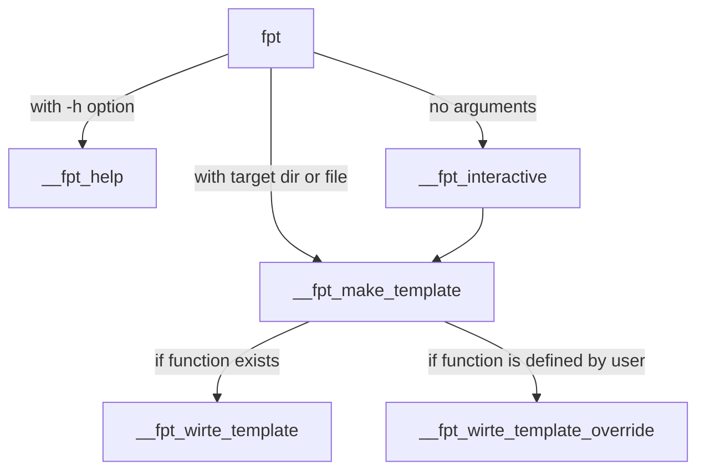

## モチベーション

[前回の記事](https://zenn.dev/estra/articles/zenn-source-fish-plugin)では、プラグイン開発用ディレクトリにある複数の fish ファイルを一気に `soruce` するプラグインの開発について解説しました。

プラグインを開発することで、そろそろ fish shell script に慣れてました。プラグインの構造や公開に必要なファイル郡がテンプレート化してきたので、高速に開発できるようにそれらのプラグインテンプレートをディレクトリに展開するプラグインを開発してみました。今回、解説する `fish-plugin-template` を使えば、５秒で fish プラグインの開発をスタートできます笑。

https://github.com/yo-goto/fish-plugin-template

例のごとく、[fisher](https://github.com/jorgebucaran/fisher)を使ってインストールできます。

```console
fisher install yo-goto/fish-plugin-template
```

## ディレクトリ構造
今回のディレクトリ構造はこんな感じです。関数の数がすこし多いのでメインとなる `fish-plugin-template.fish` から分離させて別個で定義しています。ファイル数が多いので、前回解説した[source-fish](https://github.com/yo-goto/source-fish)を使って開発しました。

```shell
❯ tree
.
├── CHANGELOG.md
├── LICENSE.md
├── README.md
├── completions
│   └── fish-plugin-template.fish
├── conf.d
│   └── fish-plugin-template.fish
├── functions
│   ├── __fish-plugin-template_interactive.fish
│   ├── __fish-plugin-template_make_template.fish
│   ├── __fish-plugin-template_write_template_LICENSE.fish
│   ├── __fish-plugin-template_write_template_README.fish
│   ├── __fish-plugin-template_write_template_completions.fish
│   ├── __fish-plugin-template_write_template_functions.fish
│   └── fish-plugin-template.fish
└── tests
    ├── __fish-plugin-template_write_template_override_README.fish
    ├── __fish-plugin-template_write_template_override_functions.fish
    └── argtest.fish
```

こんな感じで、必要なファイル(`README.md`, `LICENSE.md`, `CHANGELOG.md`)をディレクトリのトップレベルに、fish shell plugin の本体になる `functions`、`completions`、`conf.d` ディレクトリと、それぞれプラグイン名が付いた fish ファイルをカレントディレクトリに展開するプログラムを作成します。

## プラグイン構造

内部的に使用する関数がいくつかあるので簡易的に説明します。

- `fish-plugin-template` : インタラクティブユースケース用関数(`__fish-plugin-template_interactive`)のインタフェースと対象ディレクトリやファイルが引数として指定された場合に場合には、処理する関数である `__fish-plugin-template_make_template` へと条件指定とデバッグ用フラグを渡す
- `__fish-plugin-template_make_template` : 親の関数から指定された条件をもとにディレクトリとファイルを作成する。条件の中に「テンプレートを追加する」があればテンプレート追加の関数(`__fish-plugin-template_write_template_$template`)を検索してファイルのベースになる名前とデバッグ用フラグを渡す。
- `__fish-plugin-template_write_template_functions` : `functions` ディレクトリにあるファイルへのテンプレート挿入関数。ここに記載された `function` のテンプレートを指定されたプラグイン名のファイルに対して挿入する。
- `__fish-plugin-template_interactive` : `fish-plugin-template` に引数を指定しない場合に起動するインタラクティブな質問でテンプレートを展開していく関数。質問の答えから内部で `__fish-plugin-template_make_template` を呼び出し、条件を与える。


↓ 簡易的な制御の流れ (関数名が長いので `fish-plugin-template` の部分を `fpt` と略しています)



今回はファイルが多いのでインタフェースになる部分と中枢の処理についてのみを紹介します。前回の記事の場合と同じく、オプション処理は if を使い、ヘルパー関数に分岐させて、中枢となる処理は特定の関数 `__fish-plugin-template_make_template` へとまとめるようにしています。

:::details fish-plugin-template.fish
```shell:functions/fish-plugin-template.fish
function fish-plugin-template
    argparse \
        -x 'v,h,d' \
        'v/version' 'h/help' 'd/debug' \
        'p/project' 'a/add_template' \
        -- $argv
    or return 1
    
    set --local version_fish_plugin_template "v0.3.1"

    # template directories & files for the project 
    set --local list_create_dir "functions" "completions" "conf.d" 
    set --local list_create_dir_test "tests"
    set --local list_create_files "README" "CHANGELOG" "LICENSE"
    set --local list_all $list_create_dir $list_create_dir_test $list_create_files

    # set target name for a plugin name or directory name
    set --local target_first $argv[1]
    set --local target_second_file_name $argv[2]

    if set -q _flag_version
        echo "fish-plugin-template:" $version_fish_plugin_template
        return
    else if set -q _flag_help
        __fish-plugin-template_help
        return
    else if set -q _flag_project
        # create README CHANGELOG LICENSE
        for i in (seq 1 (count $list_create_files))
            __fish-plugin-template_make_template 'root' "$list_create_files[$i]" '.md' --create_file $_flag_add_template $_flag_debug
        end
        return
    else if test -n "$target_first"
        # create target dir & files
        if contains $target_first $list_all
            # for list_create_files
            if contains $target_first $list_create_files
                # --argument-names 'directory' 'base_name' 'extension' '_flag_create_file' '_flag_add_template' '_flag_debug'
                __fish-plugin-template_make_template "root" "$target_first" ".md" --create_file $_flag_add_template $_flag_debug
                return
            end

            if test -n "$target_second_file_name"
                # for list_create_dir
                if contains $target_first $list_create_dir
                    # --argument-names 'directory' 'base_name' 'extension' '_flag_create_file' '_flag_add_template' '_flag_debug'
                    __fish-plugin-template_make_template "$target_first" "$target_second_file_name" ".fish" --create_file $_flag_add_template $_flag_debug
                    return
                end

                # for list_create_dir_test
                if contains $target_first $list_create_dir_test
                    # --argument-names 'directory' 'base_name' 'extension' '_flag_create_file' '_flag_add_template' '_flag_debug'
                    __fish-plugin-template_make_template "$target_first" "$target_second_file_name" ".fish" --create_file $_flag_add_template $_flag_debug
                    return
                end
            else
                echo "Please pass a file name to the second argument"
                return 1
            end
        else
            echo "Target not found"
        end
    else
        # interactive use-case
        __fish-plugin-template_interactive $_flag_debug
    end
end

# helper functions
function __fish-plugin-template_help
    # USEAGE
end
```
:::

何も引数を指定しなれれば、`__fish-plugin-template_interactive $_flag_debug` を起動し、コマンドの引数として指定したものが定義したローカルの変数 `list_all` に要素として存在していれば、指定したものを条件としてディレクトリ及びファイルを作成します。`-a` オプションがその際に指定されていれば、テンプレートも追加します。

変数 `list_all` に引数指定したものが存在するかどうかは[containsビルトインコマンド](https://fishshell.com/docs/current/cmds/contains.html)を使います。このコマンドで第一引数である `target_first` が `list_all` にあれば `contains $target_first $list_all` で 0 が返り次の処理が行えます。指定したものが、どの種類のリストにあるかさらに `contains` で判定し、その分岐によって次の処理として呼び出す `__fish-plugin-template_make_template` に条件を流します。

大まかな流れとしてはこのようになります。今回は、関数間の条件の受け渡しと Redirection を使ったファイルへのデータ出力をメインに解説してきます。

## 関数間の引数やデバッグフラグの受け渡し

[functionビルトインコマンド](https://fishshell.com/docs/current/cmds/function.html)のオプションとして、引数に名前をつけることのできる `--argument-names` というのがありますが、これはオプションをパースするビルトインコマンドである `argparse` と組み合わせることで意図しない挙動になる可能性があります。

```shell:argparseのみを使用する場合
function argtest-argparse
    argparse 'd/debug' -- $argv
    or return 1

    set -l one $argv[1]; 
    set -l two $argv[2]; 
    set -l three $argv[3]; 

    echo "one: " $one
    echo "two: " $two
    echo "three:" $three

    echo "argv[1] :" $argv[1]
    echo "argv[2] :" $argv[2]
    echo "argv[3] :" $argv[3]
    echo "_flag_debug: " $_flag_debug
end
```

上記のように `argtest-argparse` 関数を定義します。この関数のように `--argument-names` オプション無しで `argparse` を使った場合、オプション引数である `-d` が `$argv` から除去されて、次のように期待する `argv[2]` に 2 が正しく入ります。

```shell
$ argtest-argparse 1 -d 2 3
one:  1
two:  2
three: 3
argv[1] : 1
argv[2] : 2
argv[3] : 3
_flag_debug:  -d
```

↓ 一方、問題である `--argument-names` オプションを併用した場合。


```shell:--argument-namesオプションを併用した場合
function argtest-argparse-arguemnts-names \
    --argument-names 'one' 'two' 'three'
    argparse 'd/debug' -- $argv
    or return 1

    echo "one: " $one
    echo "two: " $two
    echo "three:" $three

    echo "argv[1] :" $argv[1]
    echo "argv[2] :" $argv[2]
    echo "argv[3] :" $argv[3]
    echo "_flag_debug: " $_flag_debug
end
```

この `argtest-argparse-arguments-names` を実行すると、次のようになります。

```shell
$ argtest-argparse-arguemnts-names 1 -d 2 3
one:  1
two:  -d
three: 2
argv[1] : 1
argv[2] : 2
argv[3] : 3
_flag_debug:  -d
```

出力結果を見ると、`argparse` だけの場合から期待する引数の対応関係が１つずつずれてしまっています。具体的には、`$argv` は `argparse -- $argv` によってオプション引数が除去されているため、`$argv[1], $argv[2], $argv[3]` には期待どおりに引数が入っていますが、`--argument-names` オプションで名前を付けた変数(`one, two, three`)はずれてしまい、`twe` に `-d` オプションフラグが入ってしまっています。

渡す引数の順番をしっかり意識していれば特に問題はないのですが、どの変数に何が入っているのかという混乱のもとにはなりますし、オプションについては順番を気にせず使えたほうが便利です。以下の例のように `--argment-names` オプションの使用を避け、コメントで引数の名前のみを書き、`set -l one $argv[1]` のようにしてリストである `$argv` の要素の順番と変数名を対応付けるようにします。さらに、オプションとして渡せるような種類の条件はすべてオプション引数として渡すようにします。

これでオプション引数の順番を気にすることなく、普通の引数の順番だけを考慮すればよくなります。

```shell:このようなfunctionの使い方がおすすめ
function argtest-argparse-ok
    # argument names: 'one' 'two' 'three'
    argparse 'd/debug' -- $argv
    or return 1

    # --argument-names オプションを使用する代わりにローカル変数で対応付けする
    set -l one $argv[1]; 
    set -l two $argv[2]; 
    set -l three $argv[3]; 

    echo "one: " $one
    echo "two: " $two
    echo "three:" $three

    echo "argv[1] :" $argv[1]
    echo "argv[2] :" $argv[2]
    echo "argv[3] :" $argv[3]
    echo "_flag_debug: " $_flag_debug

    if set -q _flag_debug
        # デバッグ処理
        echo "[Debug Point: argtest-argparse-ok]"
        __argtest-argparse-ok_helper $one $two $three $_flag_debug
    else
        # main 処理
    end
end
```

また、上の例で見たように、`-d` と `--debug` のオプションフラグをこの関数に渡した場合、内部的に生成されるフラグ変数である `_flag_debug` に格納される値はそのまま `-d` や `--debug` となります。これによって、内部で呼び出す別のヘルパー関数にそのままデバッグフラグを連鎖させることができます。

```shell:argtest-argparse-okのヘルパー関数
function __argtest-argparse-ok_helper
    # --argument-names 'one' 'two' 'three'
    argparse 'd/debug' -- $argv
    or return 1

    # debug オプションがある場合にのみ処理
    if set -q _flag_debug
        echo "[Debug Point: __argtest-argparse-ok_helper]"
        echo $argv[1] $argv[2] $argv[3]
        echo "debug ok: debug flag→" $_flag_debug 
    end
end
```

上記のヘルパー関数を定義した後に、上の `argtest-argparse-ok` に ３つの引数を渡してみると、次のように各関数でデバッグを連鎖的に行います。

```shell
$ argtest-argparse-ok 1 -d 2 3
one:  1
two:  2
three: 3
argv[1] : 1
argv[2] : 2
argv[3] : 3
_flag_debug:  -d
[Debug Point: argtest-argparse-ok]
[Debug Point: __argtest-argparse-ok_helper]
1 2 3
debug ok: debug flag→ -d
```

このように関数定義をすることで、デバッグや条件の受け渡しの方法が楽になります。実際に、この方法で、`fish-plugin-template` 内で条件を渡しています。
また、テンプレートをファイルへ追加するオプションとして設けた `-a, --add_template` フラグもフラグ変数 `_flag_add_template` を使用して `fish-plugin-template` から次の `__fish-plutin-template_make_template` 関数へと送られます。これらのオプションを指定しない場合にはそもそも `fish-plugin-template` の内部でフラグ変数が生成されないので、`__fish-plutin-template_make_template` へは両方とも送られることはありません。

```shell:functions/fish-plugin-template.fish
# --argument-names 'directory' 'base_name' 'extension' '_flag_create_file' '_flag_add_template' '_flag_debug'
__fish-plugin-template_make_template "$target_first" "$target_second_file_name" ".fish" --create_file $_flag_add_template $_flag_debug
```

これによって、呼び出し元から渡された条件の一部と、debug オプションフラグはさらに先で呼び出す関数に対して渡されます。

```shell:functions/__fish-plugin-template_make_template.fish
if functions --query __fish-plugin-template_write_template_override_$template
    # --argument-names 'plugin' '_flag_debug'
    __fish-plugin-template_write_template_override_$template $base_name $_flag_debug
else if functions --query __fish-plugin-template_write_template_$template
    set -q _flag_debug; and echo $ce"Debug point: [C-2]"$cn
    # --argument-names 'plugin' '_flag_debug'
    __fish-plugin-template_write_template_$template $base_name $_flag_debug
end
```

連鎖させたいオプション定義(今回の場合は `d/debug` や `a/add_template`)を各関数の `argparse` コマンドにて同じように定義することでこのようなことが可能になります。

```shell
function fish-plugin-template
    # argument names: 'target_first' 'target_second_file_name'
    argparse 'a/add_template' 'd/debug' -- $argv
    or return 1

    set -l target_first $argv[1]
    set -l target_second_file_name $argv[2]

    # 略
        __fish-plugin-template_make_template "$target_first" "$target_second_file_name" ".fish" --create_file $_flag_add_template $_flag_debug
    # 略
end

function __fish-plugin-template_make_template
    # argument names: 'directory' 'base_name' 'extension' '_flag_create_file' '_flag_add_template' '_flag_debug'
    argparse 'c/create_file' 'a/add_template' 'd/debug' -- $argv
    or return 1

    set -l directory $argv[1]
    set -l base_name $argv[2]
    set -l extension $argv[3]

    # 略
    set template $base_name
    # 略
    if set -q _flag_add_template
        __fish-plugin-template_write_template_$template $base_name $_flag_debug
    end
    # 略
end

function __fish-plugin-template_write_template_functions
    # argument names: 'plugin' '_flag_debug'
    argparse 'd/debug' -- $argv
    or return 1

    set -l plugin $argv[1]
    # 略
end
```

## 関数を検索する

今回は、テンプレート用の関数が、ファイルごとに必要なので、上記のように与えられた条件から一致するような処理を行う関数を検索する必要があります。この場合に役立つのが、[functionsビルトインコマンド](https://fishshell.com/docs/current/cmds/functions.html)(`function` ではないので注意)の `--query` オプションです。このオプションは指定した名前の関数があるかどうかをテストします。

現時点では、`functions`、`completions`、`REAEMD`、`LICENSE` 用のテンプレート関数を用意しているので、それらの名前を suffix された関数名が `functions --query __fish-plugin-template_write_template_$template` の `$template` のところにそれぞれの名前が入ることで検索されます。関数が見つかった場合にのみ各ファイルに対して対応する関数が起動し、テンプレートの文章を書き込みます。

また、上記の `functions/__fish-plugin-template_make_template.fish` の処理を見ると分かりますが、`__fish-plugin-template_write_template_override_$template` という関数を最初に探すので、ユーザーが独自定義したその名前の関数があればそちらを優先的に使用するようにしています。これによって、プラグインの使用者の好きなテンプレートをそれぞれ定義できるようにしています。

## 指定した条件からテンプレートを挿入する

以上、説明したような処理の流れで、条件を `fish-plugin-template` 関数からテンプレート作成用の関数にストリームさせ、`printf` ビルトインコマンドと[I/O Redirection](https://fishshell.com/docs/current/language.html#input-output-redirection)を使用して、条件一致したファイル名に対してテンプレートを書き込みます。

https://www.wikiwand.com/ja/%E3%83%AA%E3%83%80%E3%82%A4%E3%83%AC%E3%82%AF%E3%83%88_(CLI)

Redirection は `>, <` などの記号とともに Input や Output 先を指定することでデータを書きこんだり、読み込んだりできます。今回使用する `データ>>対象ファイル` では対象ファイルに対してデータを追加で書き込みできます。

```shell:functions/__fish-plugin-template_write_template_functions
function __fish-plugin-template_write_template_functions 
    # --argument-names 'plugin' '_flag_debug'
    argparse 'd/debug' -- $argv
    or return 1

    set --local plugin $argv[1]
    set --local filepath "./functions/$plugin.fish"

    if not test -n "$plugin"
        echo "code failed: [__fish-plugin-template_write_template_functions]"
        return 1
    end

    set -q _flag_debug; and echo "Debug point: [__fish-plugin-template_write_template_functions ]"

    builtin printf -- '%s\n' \
    "# generated function template from fish-plugin" \
    "function $plugin -d 'DISCRIPTION'" \
    "   argparse \ " \
    "       -x 'v,h' \ " \
    "       'v/version' 'h/help' -- \$argv" \
    "   or return 1" \
    "   " \
    "   set --local version_$plugin 'v0.0.1'" \
    "   # color template set" \
    "   set --local cc (set_color \$fish_color_comment)" \
    "   set --local ce (set_color \$fish_color_error)" \
    "   set --local cn (set_color \$fish_color_normal)" \
    "   " \
    "   if set -q _flag_version" \
    "       echo \"$plugin: \" \$version_$plugin" \
    "       return" \
    "   else if set -q _flag_help" \
    "       __"$plugin"_help" \
    "       return" \
    "   else" \
    "       # main body" \
    "   end" \
    "end" \
    "" \
    "# helper function" \
    "function __"$plugin"_help" \
    "   echo 'USAGE:'" \
    "   echo '      $plugin [OPTION]'" \
    "   echo 'OPTIONS:'" \
    "   echo '      -v, --version       Show version info'" \
    "   echo '      -h, --help          Show help'" \
    "end" \
    "   " >> "$filepath"

    if test "$status" = "0"
        echo "-->added template:" "$filepath"
    else
        echo "-->failed to write:" "$filepath"
    end
end
```

この `__fish-plugin-template_write_template_functions` は上で説明した次の `__fish-plugin-template_make_template` 関数から起動されて、条件として、プラグインの名前とデバッグフラグのみが渡されます。


```shell:functions/__fish-plugin-template_make_template.fish
if functions --query __fish-plugin-template_write_template_override_$template
    # --argument-names 'plugin' '_flag_debug'
    __fish-plugin-template_write_template_override_$template $base_name $_flag_debug
else if functions --query __fish-plugin-template_write_template_$template
    set -q _flag_debug; and echo $ce"Debug point: [C-2]"$cn
    # --argument-names 'plugin' '_flag_debug'
    __fish-plugin-template_write_template_$template $base_name $_flag_debug
end
```

渡されたプラグイン名は変数 `plugin` に格納されて、ファイルパスを作成し、テンプレートの関数名の部分などにも展開されます。`"   " >> "$filepath"` の部分で Output redirection として作成した filepath のファイルに対してテンプレートが挿入されます。挿入がうまく行けば、`builtin printf` コマンドの[終了ステータス](https://fishshell.com/docs/current/language.html#the-status-variable)が 0 となるはずなので、`test` ビルトインで条件判定して、成功していた場合と失敗していた場合のコメントをコマンドライン上に出力して処理を終えます。

ビルトインの[printf](https://fishshell.com/docs/current/cmds/printf.html)はフォーマット指定子と出力する文字列を指定してコマンドライン上にプリントしますが、Redirection した場合はコマンドライン上には出力されません。

また、`\` を使うことでコマンドを改行できます。これと `%s\n` というフォーマット指定子によって、`printf` に指定した文字列の見た目のままファイルにテンプレートを展開させることができます。テンプレート内の `\$` などの記号は `$` をエスケープしています。エスケープしないと `$` の後につづく変数名が存在している場合に展開されてしまうので、それを防ぐためにエスケープしています。

現時点で用意したテンプレートは `functions` については次のようなものとなります。関数名などはテンプレートの展開時に置き換えられます。

```shell
# generated function template from fish-plugin
function plugin-name -d 'DISCRIPTION'
   argparse \ 
       -x 'v,h' \ 
       'v/version' 'h/help' -- $argv
   or return 1
   
   set --local version_plugin-name 'v0.0.1'
   # color template set
   set --local cc (set_color $fish_color_comment)
   set --local ce (set_color $fish_color_error)
   set --local cn (set_color $fish_color_normal)
   
   if set -q _flag_version
       echo "plugin-name: " $version_plugin-name
       return
   else if set -q _flag_help
       __plugin-name_help
       return
   else
       # main body
   end
end

# helper function
function __plugin-name_help
   echo 'USAGE:'
   echo '      plugin-name [OPTION]'
   echo 'OPTIONS:'
   echo '      -v, --version       Show version info'
   echo '      -h, --help          Show help'
end
```

## 使い方

基本的な使い方は、テンプレートを展開したいディレクトリで `fish-plugin-template` または定義ずみエイリアスの `fpt` コマンドを引数なしで入力します(引数ありでも使えます)。引数なしで実行した場合には、`__fish-plugin-template_interactive` 関数が起動して、質問に答えることでテンプレートを用意してきます。

```console
❯ fpt
Please type base name which will be used as a file name
Base name: my-amazing-plugin
--> File name "my-amazing-plugin.fish" is set
Is this OK? [Y/n]: y
Make a full template in this directory? [Y/n]: y
-->created: ./functions
-->created: ./functions/my-amazing-plugin.fish
-->added template: ./functions/my-amazing-plugin.fish
-->created: ./completions
-->created: ./completions/my-amazing-plugin.fish
-->added template: ./completions/my-amazing-plugin.fish
-->created: ./conf.d
-->created: ./conf.d/my-amazing-plugin.fish
-->created: ./tests
-->created: ./tests/my-amazing-plugin-test.fish
-->created: ./README.md
-->added template: ./README.md
-->created: ./CHANGELOG.md
-->created: ./LICENSE.md
-->added template: ./LICENSE.md
```

`-p, --project` オプションで、README, CHANGELOG, LICENSE を作成し、`-a, --add_template` オプションを組み合わせることでテンプレートを同時に展開します。

```console
❯ fpt -pa
-->created: ./README.md
-->added template: ./README.md
-->created: ./CHANGELOG.md
-->created: ./LICENSE.md
-->added template: ./LICENSE.md
```

第一引数に対象ディレクトリ、第二引数にプラグインの名前を渡すことで、その名前のファイルを作成します。これも `-a, --add_template` オプションフラグを組み合わせて、作成と同時にテンプレートを展開できます。

```console
❯ fpt functions my-new-plugin -a
-->created: ./functions
-->created: ./functions/my-new-plugin.fish
-->added template: ./functions/my-new-plugin.fish
```

ということで、解説は終わりになります。興味がある方はこのプラグインや `soruce-fish` を使ってプラグイン開発してみてください。

