## 集合論による型の取り扱い

前の章において半順序関係にこだわっていたのは、半順序を使うことで型の集合がいくつかの付加的な構造を持つものとしてみなすことができ、様々な名前を持つ概念が利用できるようになるからです。半順序が役に立つのは主に次の束論のところですが、まずは集合論から行きましょう。

さて、商集合 $\text{TYPES}$ について考えますが、関数型について除いた部分集合 $\text{TYPES'}$ を考えることにしましょう (もちろん再帰型についても除きます)。なぜかと言えば、関数型はこれから話す集合論的なモデルの都合上うまく解釈ができないからです。

:::message
関数型 (関数値) を対象として含めた部分型について、よりうまく集合論的に考えることができる「意味論的部分型 (semantic subtyping)」という型システムの分野があります。
:::

型が厳密には集合ではないことを考慮しても、そもそも型そのものと複数の型の集まりについて集合論的に扱えるかどうかは一般的に言えることではありません。

一方で、TypeScript は公式ドキュメントの「[Types as Sets](https://www.typescriptlang.org/docs/handbook/typescript-in-5-minutes-oop.html#types-as-sets)」にも記載してあるとおり、かなり集合論的に扱えるようにデザインされています。Microsoft Developers の以下の動画にて TypeScript の開発者である [Anders Hejlsberg](https://en.wikipedia.org/wiki/Anders_Hejlsberg) 氏も型が集合として扱えることを語っています。

https://www.youtube.com/watch?v=hDACN-BGvI8&t=1592s

> This works -- this is really more like reasoning about sets of possible values. That is really what the type system is doing.

ということで、直感的な集合論で型についてのメンタルモデルを構築することに大きな問題はありません。集合論で扱えきれない部分については後述する圏論などを使って補います。

集合論的に扱えるとは、例えば、ユニオン型やインターセクション型が集合の演算としての和集合や交差などに相当する概念として使えることや、リテラル型とプリミティブ型の関係や、空集合や全体集合に相当する `never` 型や `unknown` 型が存在しているということです。

ユニオンやインターセクションなどの既存の演算が集合演算として扱えるだけでなく、現在提案されている型の演算として否定(negation)が導入されれば補集合やド・モルガンの法則などを考えることができるので、さらに数学的な集合に近づきますね。
https://github.com/microsoft/TypeScript/issues/4196

なお否定型については束論の章で再度扱うので頭の片隅においておいてください。

## 集合の濃度とユニット型

集合を扱う上では集合における「**濃度** ([cardinality](https://en.wikipedia.org/wiki/Cardinality))」という概念が重要となります。濃度とは、集合の要素数を一般化した概念であり、特に無限集合を扱う上でよく利用される概念です。

要素数が有限の有限集合においては、濃度は自然数で表現されます。例えば、$A = \lbrace 1, 2 \rbrace$ という集合の濃度は $|A| = 2$ などと表されます。

さて、型の理論において非常に重要な型として「**ユニット型** (unit type)」と呼ばれる型の種類が存在します。ユニット型とは要素が一つだけの型であり、集合として解釈する場合には濃度が $1$ の集合に相当します。なお、このような要素数が一つの集合は一点集合や、単集合(singleton)、単位集合(unit set)などと呼ばれます。

TypeScript におけるユニット型は `null` 型と `undefined` 型、そして文字列や数値などのプリミティブ型のリテラル型です。

```ts
const nu: null = null;
const un: undefined = undefined;
const nl: 1 = 1;
const sl: "st" = "st";
const tr: true = true;
```

これらの型はまさにそのリテラルの値だけを割当可能とする型であり、それ以外のあらゆる値の割当を拒絶します。

濃度が $1$ であるユニット型を用いることで濃度が $n$ (自然数)の型を生成することが可能となります。濃度 $2$ の型を生成するには濃度 $1$ の型同士を合成するればいいわけですが、例えば `null` と `undefined` という型を合成してみると、合成した型 `UN` は `null` と `undefined` という二つの値のみ持つ型となります。

```ts
// 濃度2の型
type UN = null | undefined;

let un: UN;
un = null;
un = undefined;
```

同様に `1` と `2` という濃度 $1$ の数値リテラル型を合成した場合は、`1` と `2` の値を持つ濃度 $2$ の型が生成されます。

```ts
// 濃度2の型
type OneTwo = 1 | 2;

let ot: OneTwo;
ot = 1;
ot = 2;
```

少し特殊な例として `true` と `false` という二つの真偽値リテラル型を合成してみましょう。

```ts
// 濃度2の型
type Bl = true | false;
```

このように合成した型はもちろん濃度 $2$ の型となりますが、合成結果の型は `boolean` という濃度 $2$ の型と同一となります。

```ts
type R = Relation<Bl, boolean>;
// => Identical
```

元々 `boolean` という型は `true` と `false` の二つの値しかない型なのでそのリテラル型を合成した結果の型も `boolean` となるわけです。

濃度が $1$ の場合と $2$ の場合を見てきましたが、濃度が $0$ の場合はどのようになるでしょうか。濃度が $0$ の集合はまさに要素数が $0$ なので空集合(empty set) $\phi$ に相当します。型の理論において要素を全く持たない型は空型(empty type)と呼ばれ、TypeScript では `never` 型が空型に相当します。

```ts
let n1: never;
n1 = 1; // => Error: 型 'number' を型 'never' に割り当てることはできません。
```

`never` 型は要素をまったく持たないのであらゆる値の割当を拒絶します。`never` への割当可能なのは自分自身、つまり `never` 型の値ということになります。これは順序理論でいえば反射律です。自分自身の型の値のみが割当可能といっても `never` 型には値そのものがないため(そもそも値が無いことを表現する型)、反射律を検証するには下記のように型アサーションを利用してやるしかありません。

```ts
// 濃度0の型
let n2: never;
n2 = 1 as never;
```

さて、`boolean` 型がその構成要素たるすべての真偽値リテラル型から構成されたように、`string` や `number` といった他のプリミティブ型もその構成要素となるすべてのリテラル型(あるいは値そのもの)をかき集めた集合としてみなすことができます。


このようにプリミティブ型はそのリテラル型を集合として包含していると考えることができます。そして、`boolean` という型は `true` と `false` という二つの値を割当できたので、`boolean` 型はこの二つのリテラル型の上位型(supertype)とみなせます。

```ts
type R1 = Relation<boolean, true>;
// => Supertype
type R2 = Relation<boolean, false>;
// => Supertype
```

逆に包含される方の型 `true` と `false` は包含する型 `boolean` の部分型(subtype)となります。

## 部分型関係と包含関係

このように考えていく、そもそもリテラル型がプリミティブ型の部分型であり、プリミティブ型がトップ型 (`unknown`) の部分型であったように、それぞれの型を集合として解釈すれば部分型関係は集合の「包含関係 (inclusion)」として解釈できるようになります。


:::message alert
部分型関係は厳密には包含関係ではなく、「型 $S$ が型 $T$ の部分型であるとき ($S <: T$ と表記する)、$T$ 型の値が期待される場所で安全に型 $S$ の値を使用できる」というような型の(順序)関係です。関数型になるとそのような関係についての本質的な理解が必要となり、変性の概念と相まってシンプルな包含関係で捉えきれなくなります。

関数型の部分型関係については後ほど圏論の章で取り扱います。
:::

つまり、型 $S$ と $T$ の間に部分型関係 $S <: T$ があったときにはそれぞれが対応する集合として $S \subseteq T$ ($S$ が $T$ の部分集合である) が成り立ちます。ここでは更に二つの型が同値 (equivalent) であるならば、同じ集合であるとしましょう。具体的には以下のオイラー図のように集合の包含関係が部分型関係に対応するようにして $S \subseteq T\ \Leftrightarrow S <: T$ と考えます。


## 和集合と共通部分

ユニオン型(`|`)とインターセクション型(`&`)は論理学的に言えば型についての論理和(disjunction)と論理積(conjunction)を表現する演算です。

一方で TypeScript の型を集合として解釈するとき、ユニオン型は集合の和集合(union)の演算に相当し、インターセクション型は集合の共通部分(intersection)の演算に相当します。


話が少し変わりますが、Haskell や OCaml で「または」という論理和を表現するにはバリアント型(variant type)を利用します。バリアント型は例えば以下のように書きますが、バリアント型は集合的には共通部分がありません。

```hs
type tree =
  Leaf of { value: int } |
  Node of { left: tree; right: tree }
```

バリアント型は和を表す型の一種ですが、共通部分がないというのは以下の図の右のように表現する領域に共通部分がありません。このような集合を「互いに素な合併(disjoint union)」あるいは「非交和」と呼びます。


バリアント型は常にこのような非交和を表現しますが、TypeScript におけるユニオン型は非交和になる場合もあれば共通部分を持つ両方の場合があります。

例えば、プリミティブ型同士の和集合は共通部分を持たないので非交和を表現します。共通部分を持たないということは型の共通部分の演算であるインターセクション型の結果が空集合に相当する `never` 型になるということです。

```ts
type U = string | number;

const u1: U = "st";
const u2: U = 42;

type N = string & number;
// => never (共通部分がないため)
```

逆にオブジェクト型同士などであれば共通部分を持つので、上図の左のような集合表現と一致します。

```ts
type U = { x: string; } | { y: number; };
type I = { x: string; } & { y: number; };

const u1: U = { x: "st" };
const u2: U = { y: 42 };

// 共通部分となる型の領域の値
const i1: I = { x: "st", y: 42 };
const u3: U = i1;
```

## 冪集合

このように考えると型の集合 $\text{TYPES'}$ は「**冪集合** (power set)」と呼ばれる構造になります。冪集合は集合 $S$ の部分集合をすべてかき集めて作った集合 $P(S)$ であり、その要素は集合となります。冪集合のような集合が要素であるような集まりを一般には「**集合族** (family of sets)」とよびます。例えば集合 $A = \lbrace 1, 2, 3 \rbrace$ (濃度が $3$ の集合)の冪集合の要素は以下の８個です。

集合の濃度 | 要素
--|--
0 | $\phi$
1 | $\lbrace 1 \rbrace$, $\lbrace 2 \rbrace$, $\lbrace 3 \rbrace$
2 | $\lbrace 1, 2 \rbrace$, $\lbrace 2, 3 \rbrace$, $\lbrace 3, 4 \rbrace$
3 | $\lbrace 1, 2, 3 \rbrace$

冪集合は集合の包含関係を半順序関係とする半順序集合を作ることが知られています。つまり上記の冪集合は矢印の方向に対して $a \subseteq b$ (例えば $\lbrace 1 \rbrace \subseteq \lbrace 1, 2 \rbrace$)のような関係があり、これは半順序関係となります。

$$
\begin{aligned}
&\text{reflexive}: && a \subseteq a \\
&\text{antisymmetric}: && a \subseteq b \land b \subseteq a \Rightarrow a = b \\
&\text{transitive}: && a \subseteq b \land b \subseteq c \Rightarrow a \subseteq c
\end{aligned}
$$

従って、上記要素から構成される台集合 $P(A)$ と包含関係 $\subseteq$ による冪集合の半順序集合 $(P(A), \subseteq)$ は以下のようにハッセ図で表現できます。

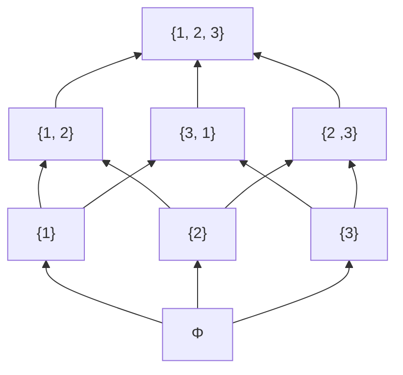

集合 $A$ の冪集合 $P(A)$ (P は Power の P)は $2^A$ とも表現されます。これは集合の要素を考える上で要素ごとにそれを集合に含めるか含めないの 2 通りがあるため、冪集合の要素の個数(部分集合の個数)は 2 を元の集合の個数でべき乗した値となるためです。つまり、上記の集合 $A$ なら要素の個数は 3 個なので、$2^3 = 8$ 個の要素を持つことになります。なおすべての要素を含めない場合(空集合)も要素として数えていることに注意してください。ベン図的な図式で包含関係を表現すると以下のようになります。


実際、`number` 型が数値リテラル型から作成できる型を要素とした冪集合として考えることもできます。例えば３つのリテラル型の集合 $A = \lbrace 1, 2, 3 \rbrace$ についての冪集合を考えるとき、上記の冪集合のハッセ図以下のように表現できます。空集合が `never` 型に相当していることに注意してください。

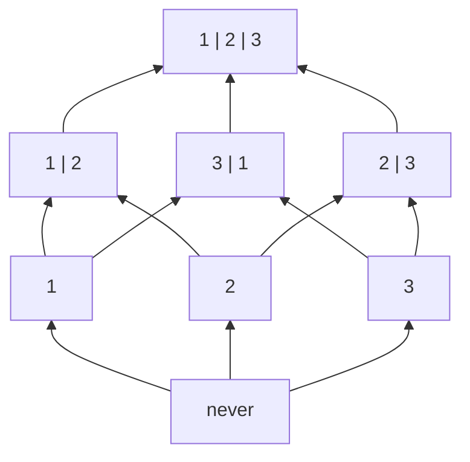

この型の冪集合においては、包含関係が部分型関係と一致しています。実際に、部分型関係を調べれば包含関係と一致していることがわかります。

```ts
type T0 = never;
type T1 = 1;
type T2 = 2;
type T3 = 3;
type T12 = 1 | 2;
type T31 = 3 | 1;
type T23 = 2 | 3;
type T123 = 1 | 2 | 3;

type R_0_1 = Relation<T0, T1>;
// => Subtype (T0 <: T1 => T0 ⊆ T1)
type R_31_2 = Relation<T31,T2>;
// => Unrelated
type R_3_23 = Relation<T3, T23>;
// => Subtype (T3 <: T23 => T3 ⊆ T23)
type R_12_123 = Relation<T12, T123>;
// => Subtype (T12 <: T123 => T12 ⊆ T123)
```

ちなみに `1 | 2` 型と `3 | 1` 型の共通部分をインターセクション型で生成すると両方の型の共通部分である `1` 型となります。分かりやすく `1 | 2` 型を `A`、`3 | 1` 型を `B` とおいてインターセクション型を使って関係を表現すると以下のようになります。この場合 `A | B` 型などは `1 | 2 | 3` となり `A | B | C` と一致しています。

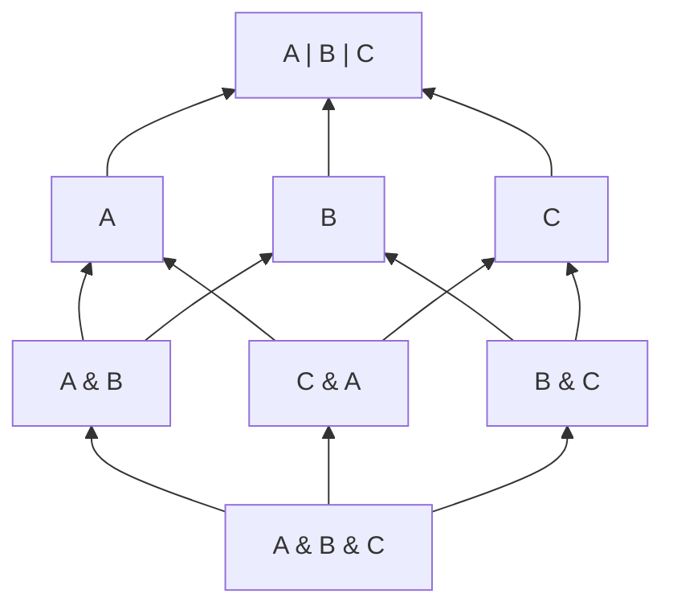

ここからさらにもう一つ数値リテラル型を加えた冪集合はかなり複雑になります。このようにボトムアップに要素を追加してくことでほぼ無限に冪集合を構築できます。

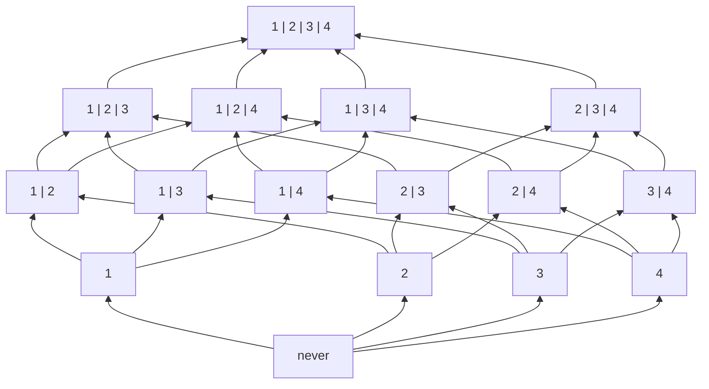

今度はもう少し簡単な例を考えます。濃度が $2$ の型 `boolean` は `true` と `false` という二つの要素から構成されました。`boolan` 型の包含関係について考えるには、$\text{boolean} = \lbrace \text{true}, \text{false} \rbrace$ という集合の冪集合を考え、その包含関係をハッセ図として図示します。

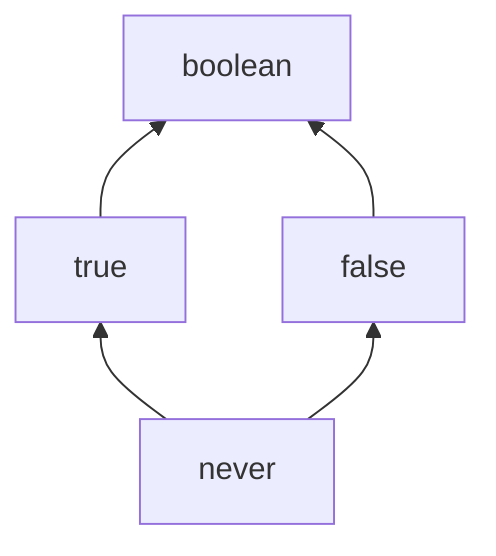

このように要素数が二個の集合の冪集合のハッセ図は非常にシンプルになります。

数値や真偽値といったプリミティブ型のリテラル型だけでなく、オブジェクト型についても考えてみましょう。まずは、`1, 2, 3` という数値リテラル型の冪集合ついてそのまま単一のプロパティを持つオブジェクトの型に写像した型を考えます(型の写像については圏論での型構築子に箇所ででてきます)。つまり、プロパティとその型の組からなるオブジェクト型を要素とした以下のような集合族をつくります。

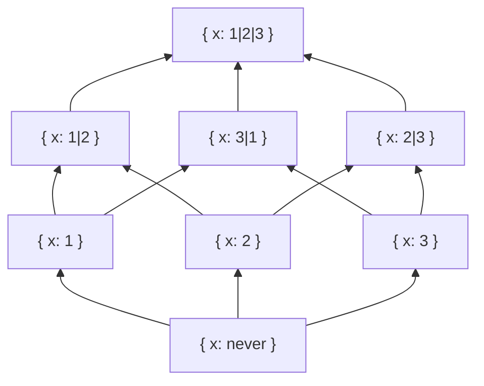

このハッセ図は実際の部分型関係を表現できています。ただし、ユニオンとインターセクションについて考えるときには注意が必要です。上記のようにプロパティの型単体について考えるときは数値リテラル型と同じ対応になりますが、オブジェクト型そのもののユニオンとインターセクションはまた別物となります。

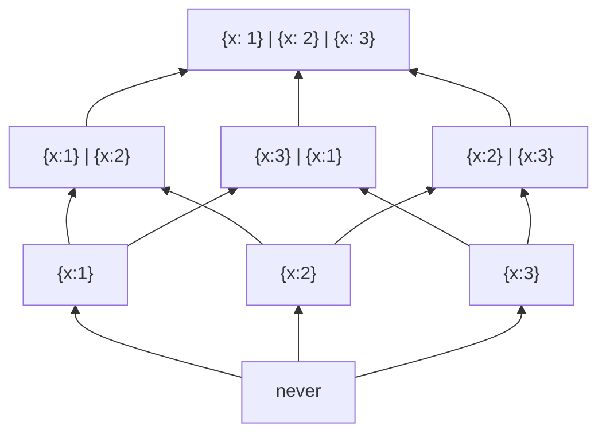

これも積で表現しなおすことができますね。それぞれの和を新しい型 `A, B, C` で置くと以下のようになります。この場合には `A | B = B | C = C | A = A | B | C` です。また、`A & B & C = never` となります。

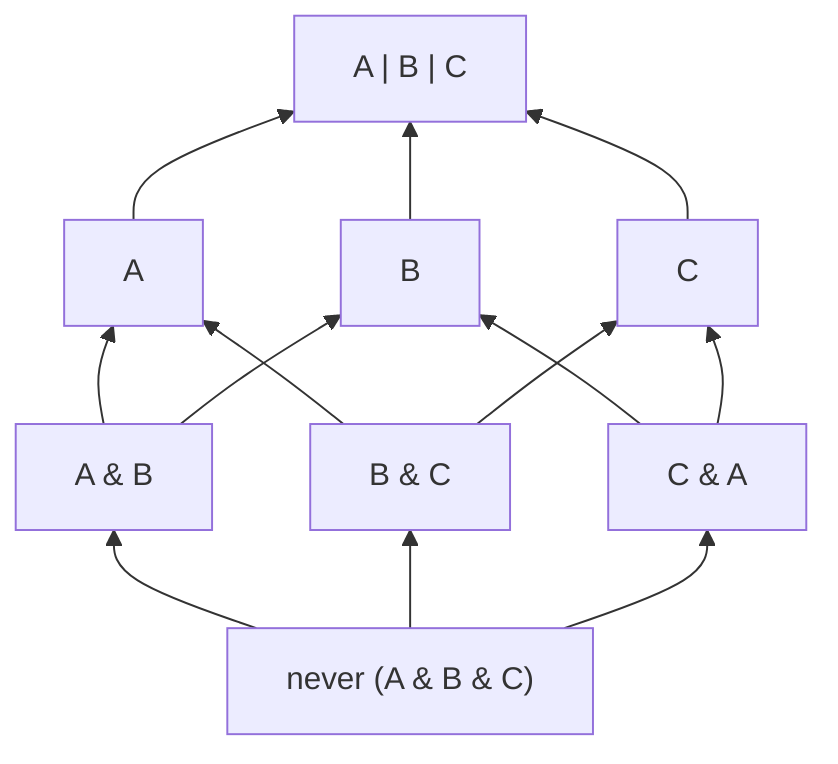

なお、以下ののようにオブジェクト型のユニオンやインターセクションは同一ではなく同値となる型がいくつかあるので注意してください。

```ts
type A = { x: 1 };
type B = { x: 2 };
type A_B = { x: 1 | 2 };
type AB = A | B;
type R = Relation<A_B, AB>;
// => Equivalent (同一ではないが同値となる)

type C = { x: string; };
type D = { y: number; };
type C_D = { x: string; y: number; };
type CD = C & D;
type R = Relation<C_D, CD>;
// => Equivalent (同一ではないが同値となる)
```

さて、ここまでは空集合に相当する `never` 型から要素を直接列挙して型を上方向(上位型の方向)に構築することで冪集合を考えていきました。`never` 型はボトム型であり、つまりこれは部分型関係の一番低い位置である底から文字通りボトムアップにみてきました。

逆に部分型関係の高い位置からトップダウンに型の集合を見てみましょう。例えば、オブジェクト型全体の集合内において最も広い集合、あるいは部分型関係の最も高い位置にある型は `{}` という型になります。空集合となる `never` 型からではなく、高い位置にある `{}` から型の包含関係について考えていきます。

なお、トップダウンに考えるといっても、とても大きな集合族についてその全体から次に小さな部分集合を考えるなどようなことは少々イメージが難しく、図で表現することも困難なので次に部分型関係で低い位置にある型として `{ x: string }` のようなある程度の抽象的な型を列挙して包含関係を考えてみましょう。

また、オブジェクト型の場合にはより情報量の多い(制約が多い)型が部分型になるため、数理リテラル型とは方向が配置が逆転していることに注意してください。制約が無い集合がより詳細な制約を持つ集合を包含すると考えれば実は数理リテラル型のときと同じ話になり、包含関係の図がまったく同じように表現されます。ただし、これは冪集合を表現しているわけではないことに注意してください。

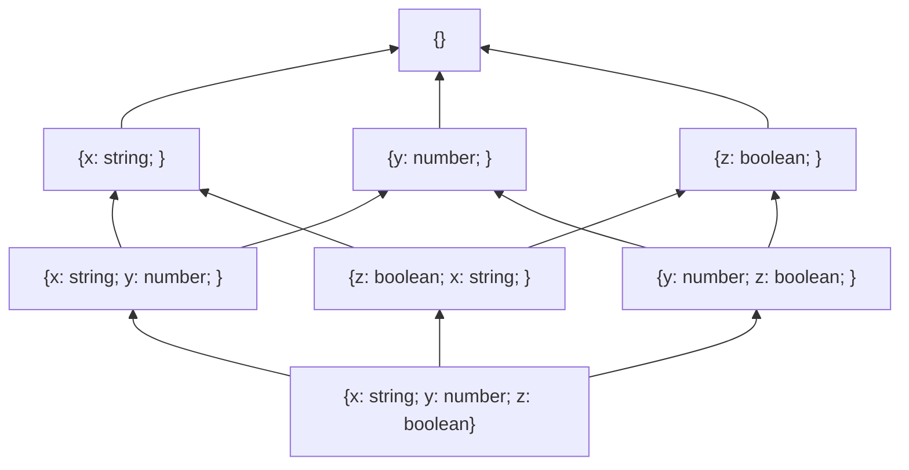

というのも、ボトムアップに作成した場合とは異なり、この図は集合族の要素をすべて表現しきれていません。なお、底である `never` から上方向に無限に型を構築できたように、`{}` から下方向に無限に型を構築することが可能です。

上記の３つの型を `X, Y, Z` と置き換えて、更に共通部分の集合演算に相当するインターセクション型の型構築子(`&`)を使って表現するようにします。

```ts
type X = { x: string; };
type Y = { y: number; };
type Z = { z: boolean; };
```

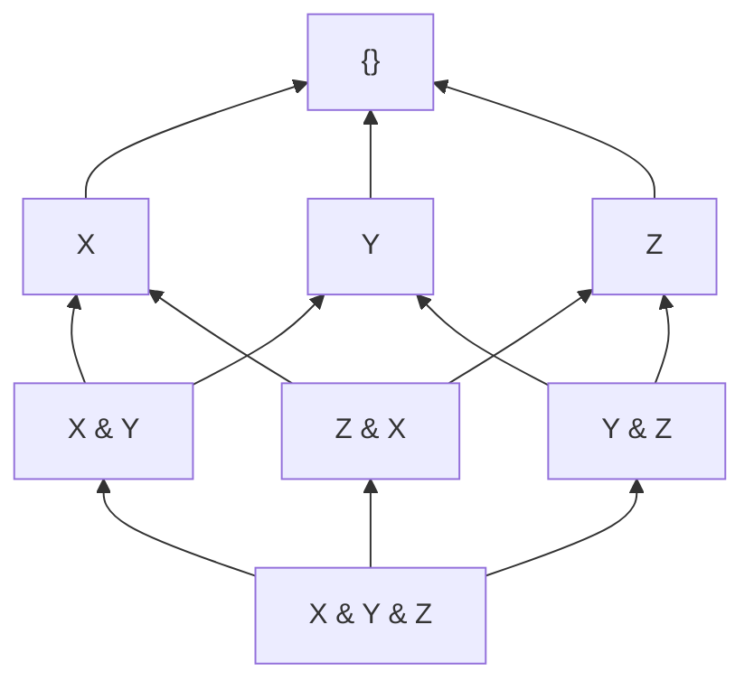

実はこの図ではインターセクションとユニオンが表現しきれていません。ということで、型 `X, Y, Z` についてのすべての和集合と共通部分を書ききれる分だけ書いてみましょう。とりあえず、`X, Y, Z` についてはそれぞれの組み合わせで和集合 `X | Y`、`Y | Z`、`Z | X` が考えられ、さらにそれらの和集合 `X | Y | Z` についても図に反映させます。

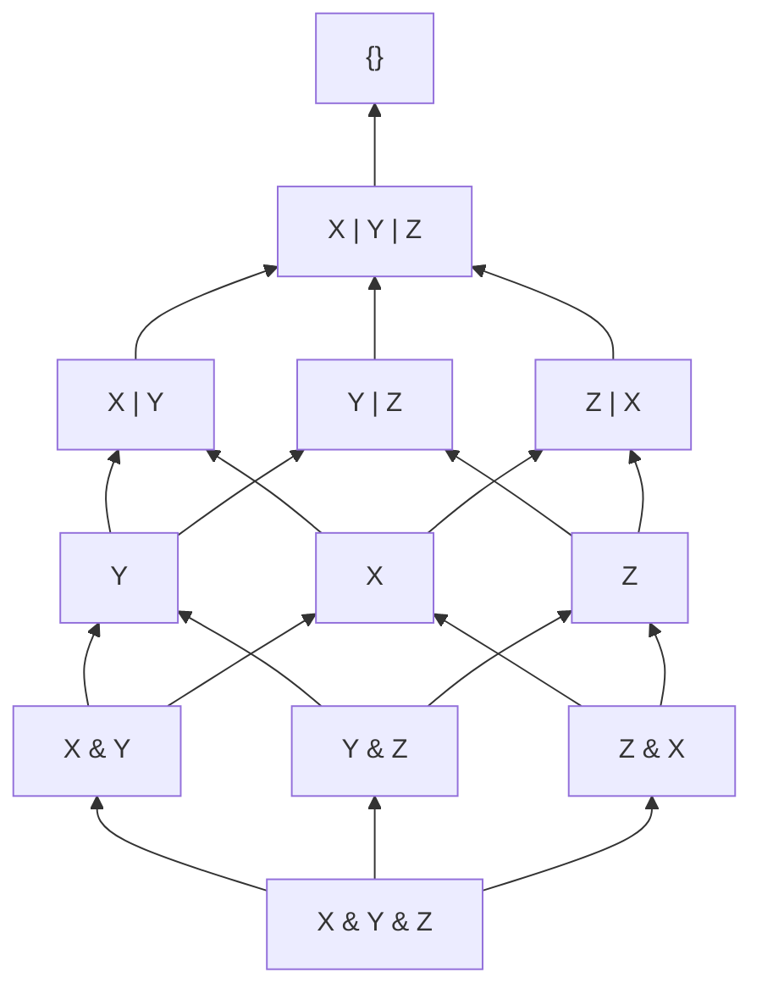

これまで 2 つの型の和と 3 つ型の和が同一になったり、2 つの型の積と３つの型の積が同一になる場合がありましたが、このような場合にはすべての型のインターセクションとユニオンが相異なるため、今のところきれいにすべての型の合成が表現されていることがわかります。ただし、この図ではまだまだ要素がたりません。

この図だけだとすべての要素を考えづらいですが、この集合の包含関係をベン図で表現すると以下のようになり、非常にイメージしやすい関係となります。


さて、現状の集合の包含関係の図において、以下のような和集合ともとの集合の和集合が考慮できていませんでした。`&` を `∩` に、`|` を `∪` に置き換えていますが、型表現で表すと `X | (Y & Z)` のような型です。


このような「共通部分ともとの型との和集合」までもを考慮してすべての和集合と共通部分の包含関係を書くと以下のようになります。※ 複雑な関係で下の部分が少し混雑して見づらくなっているためそれぞれの包含関係に色を付けています。

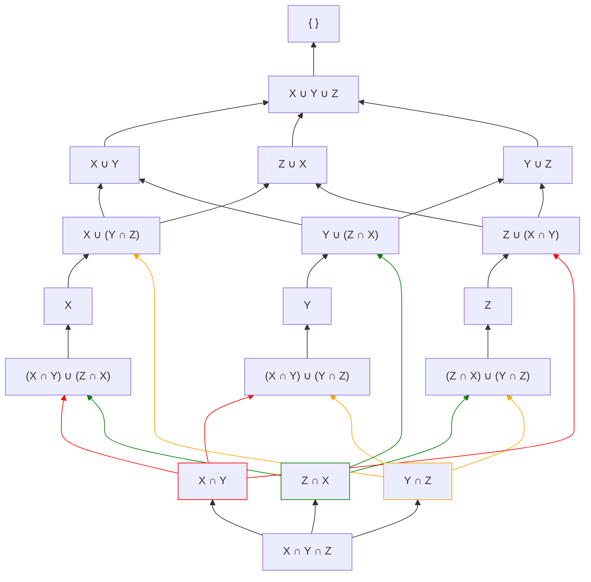

なお、３つのオブジェクト型ではなく、よりシンプルな２つのオブジェクト型についての関係は以下のようになります。

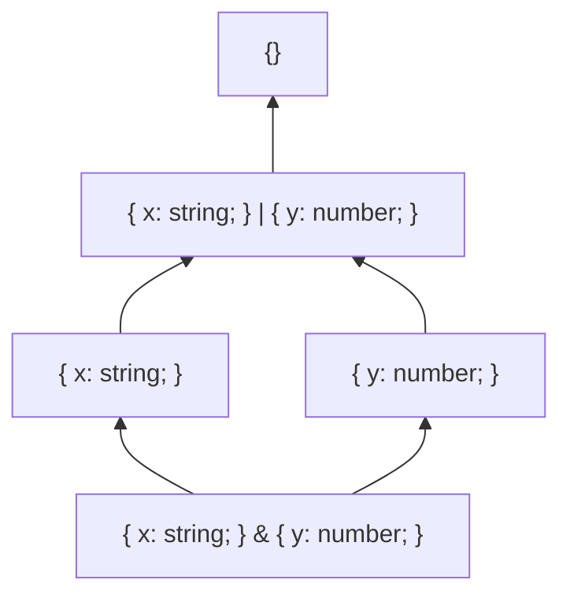

また、注意点として現在考えているオブジェクト型の全体集合として `{}` をつかっていますが、`{}` とその配下の型の間の関係は被覆関係 $\lessdot$ になっていないことに注意してください。例えば３つの型のベン図において新しいオブジェクト型 `V` を導入すれば新しい型の合成(和集合)となる `X | Z | V` や `X | Y | Z | V` などがつくれるため、`{}` と `X | Y | Z` の間には無限に型を挿入できます。


なお、図のような `V` の位置となり交差を持たない型は例えば `string` などがあります。プリミティブ型ではなく、通常のオブジェクト型なら基本的に交差が生まれるので４つの集合のベン図を考える必要がありますが、まったく交差がないオブジェクト型も存在し、`{ x: number; y: boolean; z: string; }` などがその一つです。

```ts
type A = { x: string };
type B = { y: number };
type C = { z: boolean };
type W = { x: number; y: boolean; z: string; };

type R1 = Relation<A, W>;
// => Unrelated
type R2 = Relation<B, W>;
// => Unrelated
type R3 = Relation<C, W>;
// => Unrelated
```

したがって、今後オブジェクト型の包含関係を考えるにあたっては、オブジェクト型の全体集合 `{}` は省略して、考えている型のすべての和集合を一番大きい要素として以下の図のように考えることにしましょう。

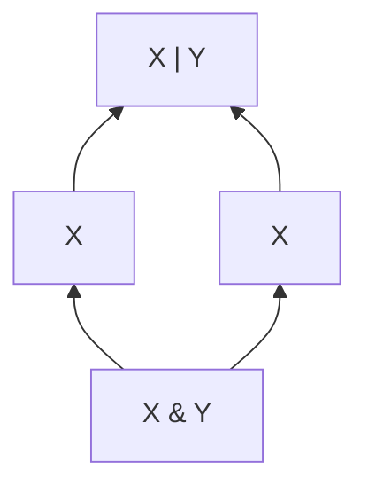
