:::message alert
2024-03-24: この章では型の集合が束にならないことを前提にしている記述がありましたが修正しました。束になるかいなかはいまだ不明瞭な点があるため一部の記述が間違っている可能性があります。
:::

## 束論の導入

集合論による冪集合はボトムアップに見たりしないと結構扱いづらい概念なので、トップダウンからもボトムアップからも同じように構造を把握することができる半束(semilattice)と、上下方向を統一して構造全体を見ることができる束(lattice)の概念を導入して、束論からのメンタルモデルを構築します。

まず、TypeScript の基本的な型の部分型関係は以下のような配置関係になっています。これまで考えてきた同値類を導入した型の商集合 $\text{TYPES'}$ の部分型関係は半順序関係であり、以下はハッセ図で表現されたものとなります。

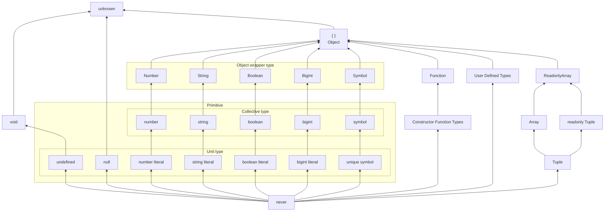

部分型関係による順序関係 $A <: B$ について、部分型 $A$ を下位、上位型 $B$ を上位として位置付けすることで、全体の構造を階層構造(hierarchy structure)とみなすことができます。

階層構造は上下関係を持つような構造を表す観念ではありますが、厳密な定義がないのであまり使えません。例えば木構造([tree structure](https://en.wikipedia.org/wiki/Tree_(graph_theory)))は階層構造を表す一つのグラフ構造ですが、以下のように木構造の各ノードは常に単一の親ノードを持つ構造であり、`never` 型の箇所で見れるような複数の親を持つ構造ではありません。

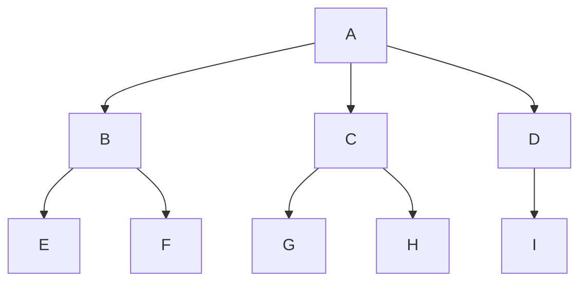

型の集合は一見すると木構造に見えますが、前の章で数値リテラル型が作る冪集合が木構造ではなかったように TypeScript の型がなす集合は木構造ではありません。このような構造を理解するには「束(そく)」とよばれる構造の知識が必要となります。

## 前提となる順序の諸概念

束を扱う束論(lattice theory)は順序理論に基づいており、束論の詳細に入る前に準備として半順序集合におけるいくつかの概念を導入しておきましょう。ただし、半順序をそのまま扱うよりもわかりやすい全順序でまずは考えてみます。

### 最大元と最小元

全順序集合は分岐がないことから鎖(chain)とも呼ばれ、例えば台集合 $A = \lbrace 1, 2, 3, 4, 5 \rbrace$ の全順序集合 $(A, \le)$ は以下のようなわかりやすい構造を持っていました。

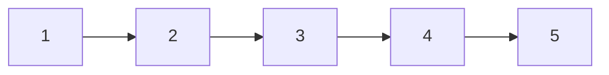

さてここで新しい概念を導入します。半順序集合における「**最大元**(greatest element)」とは集合 $P$ 内のすべての要素の中で最大のものであり、「**最小元**(lowest element)」とは集合 $P$ 内のすべての要素の中で最小のものを指します。全順序集合では最大値と最小値と言い換えてもいいでしょう。上図では、`1` が最小元であり、`5` が最大元です。

より厳密に定義すると $x \in P$ が最大元であるとは、$\forall y \in P, x \le y$ となることを意味します。つまり、$x$ は集合内のすべての要素よりも大きな要素となります。逆に、$x \in P$ が最小元であるとは $\forall y \in P, y \le x$ となることを意味します。つまり、$x$ は集合内のすべての要素よりも小さな要素となります。

:::message
最大元と最小元のように互いに対になっている対象の関係を「双対 (dual)」であると言います。最大元と最小元は互いに双対概念であり、片方で成り立つ事柄についてもう片方でも成り立ちます。
:::

さて、全順序集合では最小元と最大元は鎖の両端点なので非常にわかりやすいですね。半順序集合ではどうでしょうか。順序理論の章で見た以下のハッセ図は半順序集合を表現していました。この半順序集合において最大元と最小元を考えてみてください。

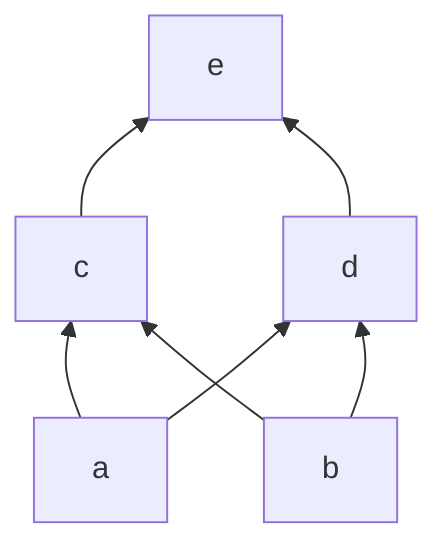

この半順序集合において最大元が $e$ となることはわかりやすいですね。半順序関係には推移律がありますが、ハッセ図はその推移性を表現できるため、矢印をたどれば比較可能な要素がわかります。$e$ に対して入ってくる矢印をたどればすべての要素と比較可能であることが分かり、自分自身を含めて集合内の任意の要素 $\alpha$ について $\alpha \le e$ が成り立ちます。つまり、すべての要素より大きく、最大元の定義を満たします。

一方で、最小元ですが、定義から $\forall y \in P, y \le x$ となる $x \in P$ を見つける必要があります。直感的には $a$ と $b$ がハッセ図の最下層にあるのでその両方が最小元になりそうですが、実はこの半順序集合には最小元は存在しません。

なぜなら、$a, b$ の両方が最小元になってしまうと、すべての要素よりも小さいという最小元の定義そのものに反してしまうからです。構造を見る限り $a$ と $b$ の間には順序関係は存在せず互いに比較不能であることが明らかです。つまり、$a \le b$ も $b \le a$ も言えません。したがって、すべての要素よりも小さい要素である最小元は存在しません。

同じように、上記の半順序集合に追加の要素 $f$ を追加して以下のような半順序集合をつくった場合には最大元も存在しないということなります。

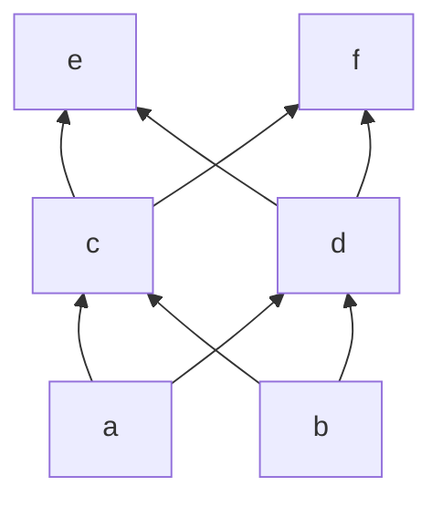

つまり、最小元も最小元も持つような半順序集合の構造は以下のように最も上位と下位の位置であらゆる関係が結ばれたような構造になります。以下の構造で $e$ は最大元となり、$a$ は最小元となります。

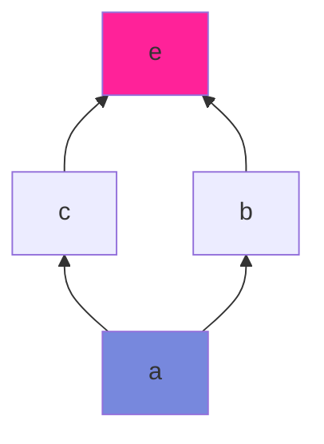

このように最大元と最小元は存在する場合には必ず一つに定まります。二つ以上となることはありえません。

### 上界と下界

ここから更に上界と下界("かかい")の概念を導入します。

半順序集合 $(P, \le)$ の要素 $x$ が $P$ の部分集合 $A$ の「上界 (upper bound)」であるとは集合 $A$ の元がすべて $x$ 以下であることを意味します。厳密には以下のように定義します。

$$
x \in P, \forall y \in A, y \le x
$$

更にその双対として、半順序集合 $(P, \le)$ の要素 $x$ が $P$ の部分集合 $A$ の「下界 (lower bound)」であるとは集合 $A$ の元がすべて $x$ 以上であることを意味します。厳密には以下のように定義します。

$$
x \in P, \forall y \in A, x \le y
$$

例の如く、最初は全順序集合で考えます。台集合 $P = \lbrace 1, 2, 3, 4, 5 \rbrace$ の全順序集合 $(P, \le)$ について、台集合 $P$ の部分集合を $A = \lbrace 2, 3, 4 \rbrace$ とします。

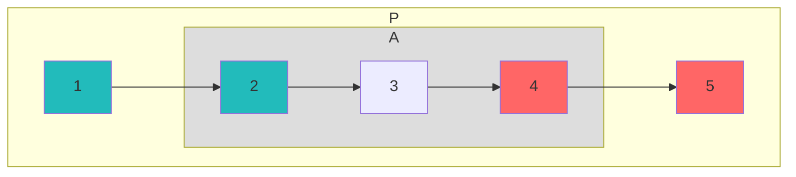

この場合、$5$ が集合 $A$ について上界となることがその定義から明らかですが 、$A$ のすべての元よりも大きければいいということは $A$ 自身の要素である $4$ も反射律によって $4 \le 4$ となることから上界と言えます。さらに、下界は上界と双対なので同じ議論ができ、$1$ と $2$ が集合 $A$ の下界となります。このように上界や下界は複数個ありえます。

台集合 $P$ の範囲を少し拡大した集合 $P' = \lbrace 0, 1, 2, 3, 4, 5, 6 \rbrace$ とその部分集合 $A$ について考える場合には、集合 $A$ の上界は $4, 5, 6$ となり、下界は $2, 1, 0$ となります。

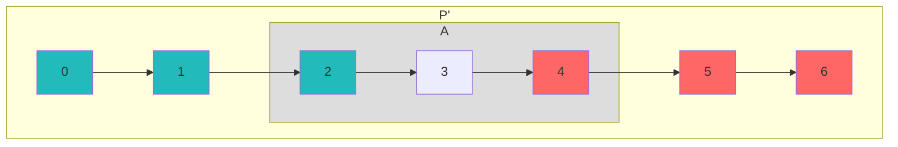

集合 $A$ の上界の中で $A$ に属するものがあればそれは $A$ の最大元となります。同様に $A$ の下界の中で $A$ に属するものがあればそれは $A$ の最小元となります。上図では $4$ が $A$ の最大元であり、$2$ が最小元となります。

全順序集合での例は分かったので典型的な半順序集合で考えてみます。以下のような台集合 $P$ とその部分集合 $A$ がある時、$A$ の上界と下界は何になるでしょうか。

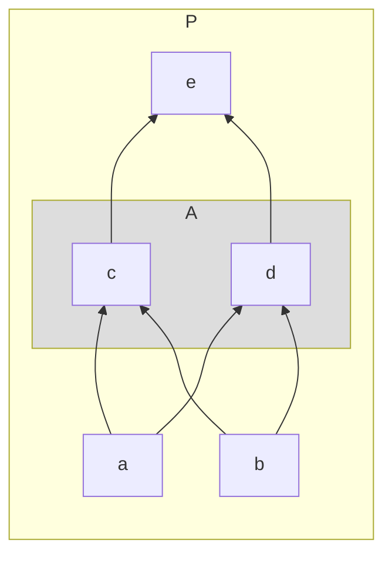

$c, d$ は比較不能なので部分集合 $A$ には最大元も最小元もありません。したがって、集合 $A$ 内に上界や下界になる要素はありません。上界は部分集合 $A$ のすべての要素より大きい必要がありますが、そのような要素は唯一つであり要素 $e$ が上界となります。同様に下界は部分集合 $A$ のすべての要素より小さい必要がありますが、そのような要素は二つ存在し、$a, b$ が下界となります。したがって、上界と下界を色付けした図式は以下のようになります。

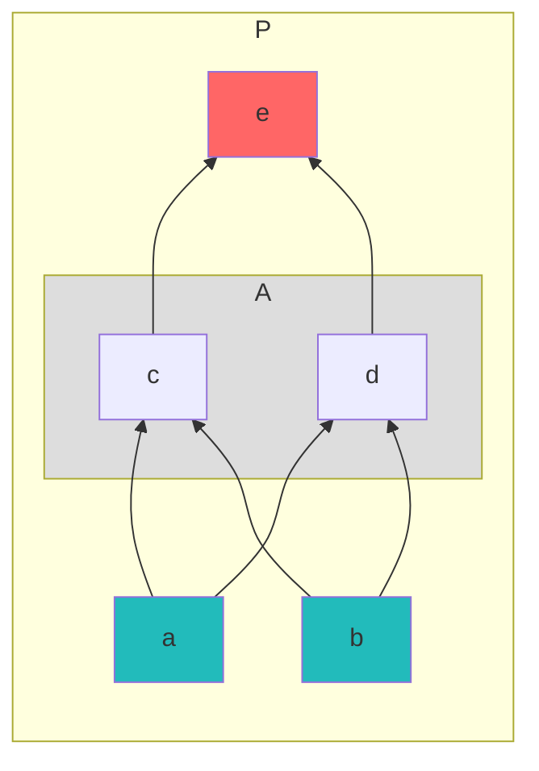

部分集合の作り方はどのようにしても良いので、もう一つの例として台集合 $P$ はそのままで部分集合 $B = \lbrace a, c \rbrace$ の上界と下界を図示しておくと以下のようになります。上界は $c, e$ の二つで、下界は $a$ の一つのみです。

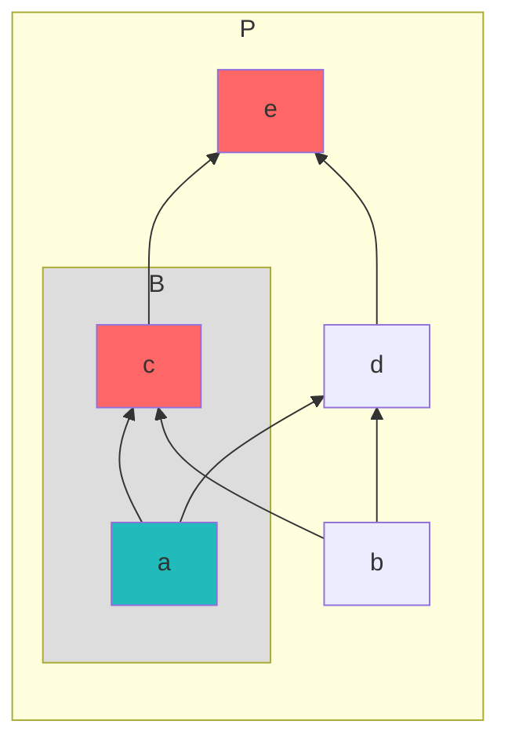

今度は部分集合を $C = \lbrace a, b \rbrace$ とします。この場合には上界の集合は $c, d, e$ の三つとなりますが、下界はどうでしょうか？

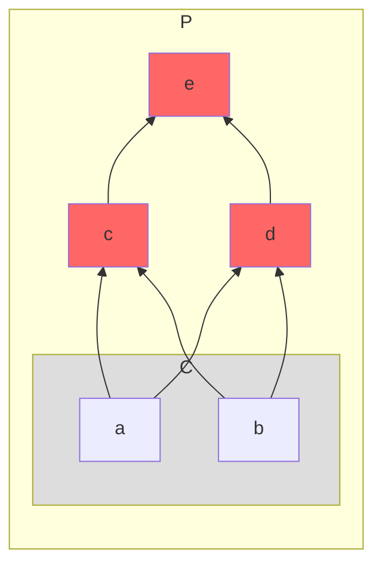

この場合には下界は存在しません。なぜなら下界は部分集合のすべての要素よりも小さい集合 $P$ の要素である必要があります。下界の候補としては $a, b$ がありますが、両者は比較不能であるためどちらがより小さいかを言えません。したがって部分集合 $C$ の下界は存在しません。

### 極大元と極小元

上界と下界の少し難しい例としては以下のような半順序集合 $K$ が考えられます。部分集合 $A$ の要素 $c, d$ が比較不能であり、さらに集合 $K$ には最小元が存在しません。この場合 $e$ が上界なのはそのままですが、集合 $K$ に下界は存在しません。

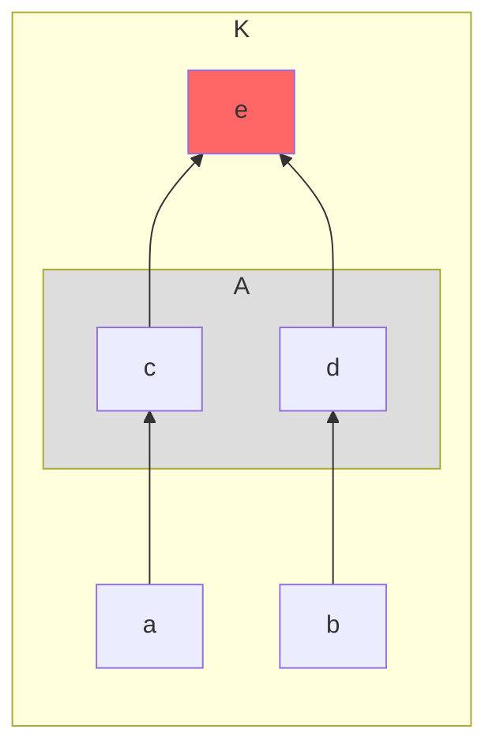

なぜなら、下界というのは部分集合 $A$ のすべての要素に対して小さい要素である必要があり、まず前提として比較可能でなければいけません。上記のハッセ図では $a$ は $d$ と比較不能であり、$b$ は $c$ と比較不能です。したがって、集合 $A$ のすべての要素よりも小さい要素は存在しません。ということで下界は存在しない、ということになります。

こういう場合であっても $a$ と $b$ のような要素について言及したいことがありますが、台集合 $K$ においてその要素よりも小さい要素が存在しないような要素のことを「極小元(minimal element)」と呼びます。集合 $K$ の場合にはまさに $a$ と $b$ が極小元に当たり、この二つについてそれぞれ集合 $K$ 内にそれよりも小さい要素は存在しません。厳密に表現すると要素 $x \in P$ が極小元であるとは以下の条件を満たす要素 $x$ です。

$$
\neg \exists y \in P, y \lt x
$$

:::message
$\neg$ は否定(negation)を表す論理記号であり、$\exists$ は存在(existence)を表す論理記号です。
:::

上記の式では「$y < x$ となるような要素 $y$ が集合内 $P$ に存在しない」ということを表現しています。最小元は「集合 $P$ 内のあらゆる要素 $y$ について $x \le y$ となる要素 $x \in P$」というものだったので、最小元はそもそもあらゆる要素と比較可能であることが前提条件となっていましたが、上記のハッセ図のようにそもそも比較不能なものがあった場合でも最小という概念を考えることできるようにしたものが極小元です。最小限はあきらかに極小元なので、極小元は条件を緩めた最小元であると捉えるといいかもしれません。

極小元の双対概念は「極大元(maximum element)」です。極大元は集合 $P$ においてその要素よりも大きい要素が存在しないような要素のことであり、厳密に表現すると要素 $x \in P$ が極大元であるとは以下の条件を満たす要素 $x$ です。

$$
\neg \exists y \in P, x \lt y
$$

上記の式では「$x \lt y$ となるような要素 $y$ が集合内 $P$ に存在しない」ということを表現しています。最大元はそもそもあらゆる要素と比較可能であることが前提条件となっていましたが、そもそも比較不能なものがあった場合でも最大という概念を考えることできるようにしたものが極大元です。最大限はあきらかに極大元なので、極大元は条件を緩めた最大元であると捉えるといいかもしれません。上記ハッセ図では要素 $e$ は集合 $K$ の極大元であると同時に最大元であるとも言えるわけです。

最小元も最大元も存在ぜず、上界も下界も存在しないが、極小元と極小元が両方存在するような半順序集合は例えば以下のようなものが考えられます。

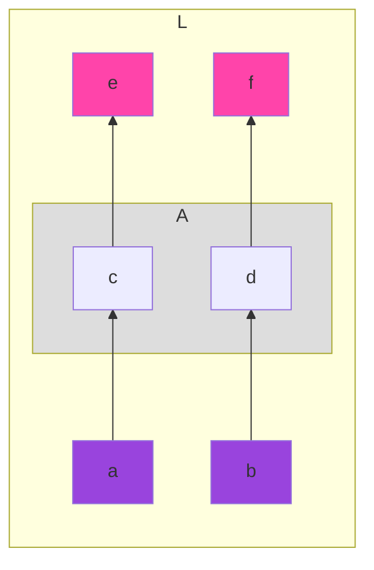

このような半順序集合は鎖(全順序集合)が二本あると考えると分かりやすいでしょう。実際、ハッセ図で表現される半順序集合は極小元から極大元までの矢印のルートを作る部分集合を抜き出せば鎖になります。

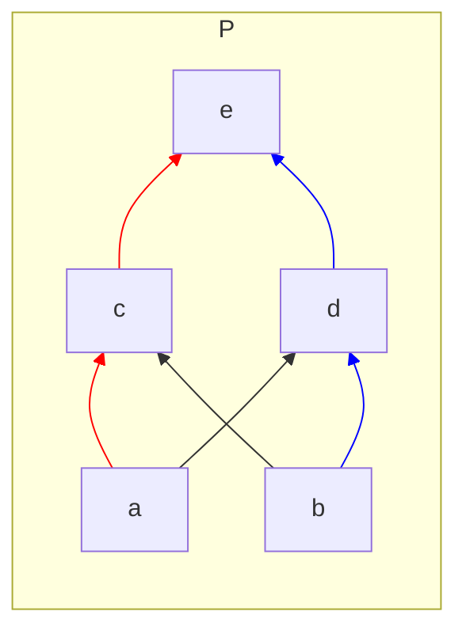

例えば上記の赤色のルートの部分集合 $\lbrace a, c, e \rbrace$ の要素はすべて比較可能であり完全律を満たすので全順序集合となります。どのようなルートを抜き出しても同じことになるため、半順序集合は複数の鎖(ルート)から成る集合であるとみなせます。

### 最小上界と最大下界

極大元と極小元の話は少し余談になりましたが、上界と下界がわかったところで重要な概念である最小上界と最大下界について取り扱います。これまでの議論が理解できていれば実は簡単で、上界と下界は存在すれば一つ以上ありえますが、最大元と最小元が複数個存在し得なかったように最小上界と最大下界は存在しても一つしかありえません。

「最小上界(**LUB**: least upper bound)」とは複数個ありえる上界の集合の中での最小元であり、台集合 $P$ の半順序集合 $(P, \le)$ の要素 $x$ が最小上界であるとは、集合 $P$ の部分集合 $A$ のすべての要素が $x$ よりも小さいということを意味し、厳密には最小上界は以下の条件を満たす要素 $x \in P$ です。

$$
\forall y \in A, y \le x
$$

最小上界の双対概念である「最大下界(**GLB**: greatest lower bound)」とは複数個ありえる下界の集合の中での最大元であり、台集合 $P$ の半順序集合 $(P, \le)$ の要素 $x$ が最大下界であるとは、集合 $P$ の部分集合 $A$ のすべての要素が $x$ よりも大きいということを意味し、厳密には最大下界は以下の条件を満たす要素 $x \in P$ です。

$$
\forall y \in A, x \le y
$$

具体的な例として、上界と下界を持つ以下のような典型的な半順序集合 $P$ とその部分集合 $A$ を考えます。上界の集合は $\lbrace e \rbrace$ であり、その最小元は $e$ です。なお要素が一つしかない集合の最小元や最大元はその要素自体になります。最小元や最小元になることは反射律($e \le e$)を使えば分かります。従って集合 $P$ の最小上界は $e$ となります。

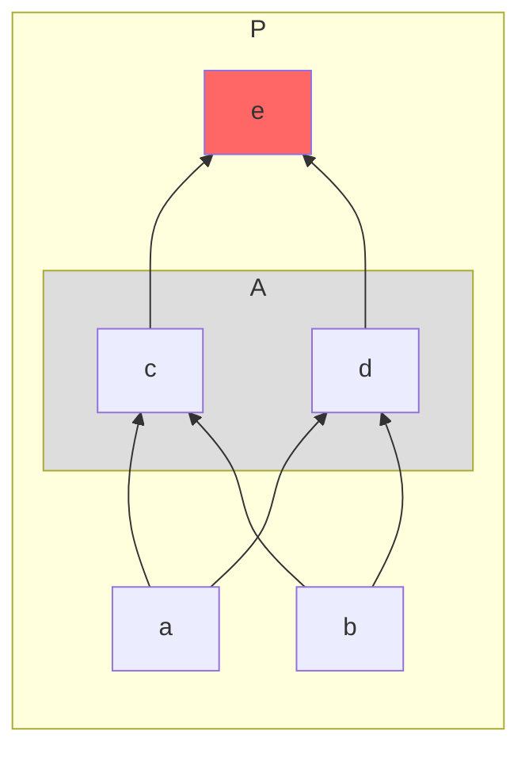

この半順序集合 $P$ の下界の集合は $\lbrace a, b \rbrace$ ですが、$a, b$ は互いに比較不能であるためこの集合 $\lbrace a, b \rbrace$ には最大元も最小元も存在しません。下界の集合に最大元が存在しないことから半順序集合 $P$ の部分集合 $A$ についての最大下界は存在しません。

それでは $f \le a \land f \le b$ となる要素 $f$ を集合 $P$ に追加した以下のような新しい半順序集合 $P'$ はどうでしょうか。

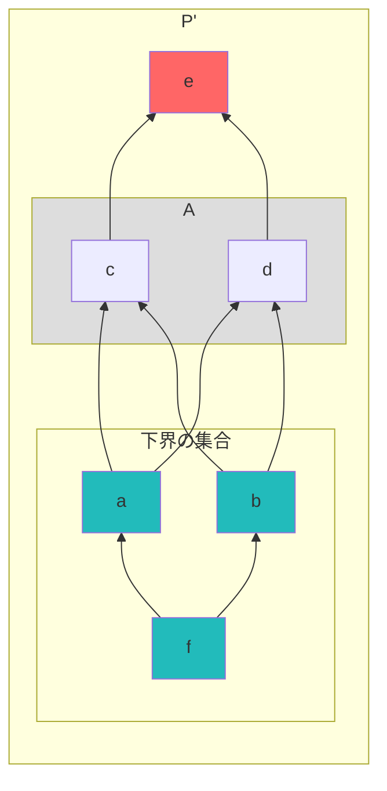

集合 $P'$ の部分集合 $A$ についての下界の集合は $\lbrace a, b, f \rbrace$ ですが、$a, b$ が比較不能であることからこの集合には最大元はありません。したがって、最大下界はやはり存在しないことになります。

最大下界を作ろうと思ったら下界の集合で極大元となるものが上記のような比較不能な二つではなく、部分集合 $A$ の任意の要素について比較可能かつ下界の集合の中で唯一の極大元となるものがあればよいことになります。つまり、以下のようは半順序集合となれば最大下界が存在することになります。

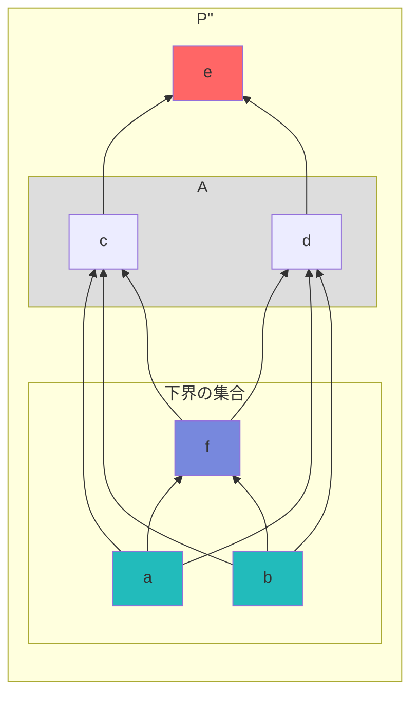

部分集合 $A$ の下界の集合の極大元が一つとなる、つまり最大元が存在するような場合にその最大元が最大下界となります。上記の図では $f$ が最大下界となっています。このとき $a \le f$ と $b \le f$ の関係が重要であり、これらの関係がなくなると $f$ について比較不能な場所がでてくるので、そのような場合には最大下界が存在しないことになります。

ただし、『[順序理論による模型](5-ast-order-theoretic-model)』の章のハッセ図のところで説明した通り、この図は $a \le f \le c$ のように $a$ と $c$ の間に中間点 $f$ があるのに $a$ と $c$ を直接的に線分で結んでおり、ハッセ図としては正しくありません。正しいハッセ図に修正すると以下のようになります。

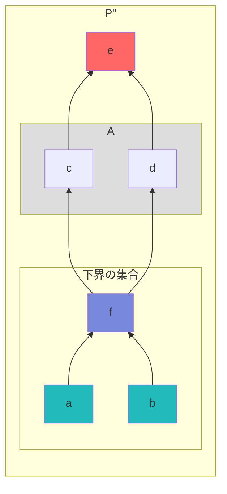

そして最大下界と最小上界は双対なので、今までしてきた議論は最小上界についても成り立ちます。最小上界は以下のような半順序集合 $P'''$ の部分集合 $B = \lbrace b, c \rbrace$ について存在し、$f$ が上界の集合の唯一の極小元、つまり最小元になるので、$f$ が最小上界です。

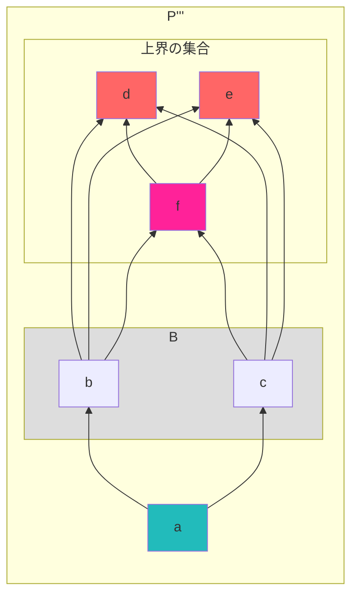

この図も中間点の存在する点同士を直接結んでおり、ハッセ図としては正しくないので正しいハッセ図に修正しておきましょう。

```mermaid
graph BT
subgraph P'''
  direction BT
  e:::ub
  a:::lb
  f:::lub
  d:::ub
  subgraph B
    direction BT
    b
    c
  end
  a --> b
  subgraph C["上界の集合"]
    direction BT
    e
    d
    f
  end
  b --> f
  c --> f
  f --> d & e
  a --> c
end
classDef ub fill:#f66
classDef lb fill:#2bb
classDef lub fill:#f29
style B fill:#ddd
```

## 束とは

最大元・最小元から始まり、上界・下界、極大元・極小元、最小上界・最大下界と紛らわしい用語と概念を説明してきましたが、これらを理解することで、ようやく束の構造を理解するための土台ができました。

典型的な構造として、ちょうど『[集合論による模型](6-ast-set-theoretic-model)』の章での冪集合のところででてきた数値リテラル型の冪集合が実はイメージのしやすい束(lattice)の構造となります。Lattice という英単語は日本語では普通「格子」とも訳されますが、束はこのような格子上の構造となる場合があります。

```mermaid
graph BT
  B["never"]
  X["1"]
  Y["2"]
  Z["3"]
  XY["1 | 2"]
  ZX["3 | 1"]
  YZ["2 | 3"]
  T["1 | 2 | 3"]
  B --> X & Y & Z
  X --> XY
  Y --> XY
  Z --> ZX
  Y --> YZ
  X --> ZX
  Z --> YZ
  XY & YZ & ZX --> T
```

束は特殊な半順序集合です。**集合内の任意の二つの要素が常に最小上界と最大下界を持つ構造**が束であり、集合要素が有限の場合には単一のルート要素(最大元)とリーフ要素(最小元)を常に持つ「**有界束**(bounded lattice)」という構造になります。

:::message
有界束にならない束はその半順序集合が無限集合の場合の時だけです。有限である場合には必ず有界束なので常に最小元と最大元を持ちます。
:::

例えば $S = \lbrace 1, 2, 3, 4, 5 \rbrace$ という自然数の集合と大小関係 $\le$ による鎖(全順序集合) $(S, \le)$ は以下の図のように分岐なく一直線になりました。全順序集合はまず半順序集合である必要がありましたが、全順序集合の場合には常にその集合は束になり、任意の二つの要素を選んで最小上界と最大下界があることが直感的にわかります。

```mermaid
graph LR
subgraph P
direction LR
1 --> 2 --> 3 --> 4 --> 5
1:::lb
2:::glb
3:::lub
4:::ub
5:::ub
  subgraph A
  direction LR
  2
  3
  end
end
classDef ub fill:#f66
classDef lub fill:#f29
classDef lb fill:#2bb
classDef glb fill:#78d
style A fill:#ddd
```

例えば部分集合を $A = \lbrace 2, 4 \rbrace$ と定めると、上界の集合は $UB = \lbrace 3, 4, 5 \rbrace$ となり、最小上界は $3$ に定まります。同様に下界の集合は $LB = \lbrace 1, 2 \rbrace$ となり、最大下界は $2$ に定まります。

### 単純な束

全順序ではない半順序集合でのシンプルな束は以下のようになります。$\text{Right}$ と $\text{Left}$ の要素は比較不能、つまり関係を持たず、これらは完全律を満たさないことから全順序ではないことが明らかです。

```mermaid
graph BT
  T["Top(⊤)"]
  L["Left"]
  R["Right"]
  B["Bottom(⊥)"]
  B --> L & R --> T
```

復習として基本的なことを再度確認していくと、束は半順序集合だったので、要素間には順序関係が存在します。上図で矢印の方向が半順序関係 $\le$ を表すとして、$\text{Bottom} \le \text{Left} \le \text{Top}$ や $\text{Bottom} \le \text{Right} \le \text{Top}$ のような順序があるわけです。

そして、上記の半順序集合においては $\text{Top}$ が最大元であり、$\text{Bottom}$ が最小元となります。有界束ではこのような Top と Bottom の位置の要素が常に存在しています。

お気づきかと思いますが半順序集合である $\text{TYPES'}$ には最小元(top)と最大元(bottom)が存在しており、以下のように非常に単純化した構造で考えると Top 位置に存在する `unknown` 型が最大元であり、Bottom 位置に存在する `never` 型が最小元となります。これらの型は一般には Top 型や Bottom 型とも呼ばれます。

```mermaid
graph BT
U["unknown"]
N["never"]
E["{ }"]
null
undefined
N --> null & undefined --> U
N --> E --> U
```

:::message alert
筆者はこの本を執筆するまで $\text{TYPES'}$ は有界束になると思っていました。しかし、そもそも束という構造自体がかなり強い条件を満たす必要があり、$\text{TYPES'}$ は部分的には束の構造を持つものの、~~全体としては束ではないことが判明しています~~。本当に束を満たすかどうかはまだ明らかではありません。

章の進行上の都合もありますが、束ではないが束の知識がないと構造が見えないという理由もあり、束についての知識は理解する必要があります。$\text{TYPES'}$ が~~束ではないことについての解説は後ほど行います~~。
:::

さて、半順序や前順序では反射律という自己言及的な法則($A \le A$)があり、これも図で表現すると以下のようになりましたね。図が汚くなるので以後も省略します(上の全順序集合の図においても省略しています)。

```mermaid
graph BT
  T["Top(⊤)"]
  L["Left"]
  R["Right"]
  B["Bottom(⊥)"]
  B --> B
  T --> T
  L --> L
  R --> R
  B --> L & R --> T
```

それではこのダイアモンド形状の半順序集合が束になることを確認していきます。束は任意の二元部分集合について最小上界と最大下界を持つ半順序集合ですから、実際に考えられる限りの二要素の部分集合を列挙して、その部分集合についての最小上界と最大下界が存在するかをすべて確認すればいいわけですね。

極大元と極小元のところで解説したように、半順序集合は複数の鎖から構成されていました。実は鎖上の任意の二要素は半順序関係の推移律によって必ず関係があるため、鎖上の二要素を選んだ場合には常に最小上界と最大下界があるということになります。

例えば、$A = \lbrace \text{Bottom, Top} \rbrace$ という二元部分集合を選択した場合には、その最小上界と最大下界は鎖のルート上では $\text{Top}$ が最小上界となり、$\text{Bottom}$ が最大下界となります。

```mermaid
graph BT
subgraph P
  direction BT
  T["Top(⊤)"]
  L["Left"]
  R["Right"]
  B["Bottom(⊥)"]
  subgraph A
  B:::glb
  T:::lub
  end
  B --> L & R --> T
end
style A fill:#ddd
classDef lub fill:#f29
classDef glb fill:#78d
linkStyle 0 stroke: red
linkStyle 2 stroke: red
```

そもそも半順序集合 $P$ の部分集合 $A$ についての上界となる要素の定義は以下のようなものでした。

$$
x \in P, \forall y \in A, y \le x
$$

上界は部分集合 $A$ のすべての要素よりも大きい、つまり前提として比較可能であることが必要でした。部分集合が二元集合である場合には、その二要素が元の半順序集合の推移律によるルートで形成される鎖上に配置されているか、そうでないかの二択となります。鎖上に配置されてる、つまり矢印を辿って二要素の直接の関係を作れる場合には最小上界はその二要素の大きい方ということになります。

下界と最大下界はそれぞれ上界と最小上界の双対概念なので、同じ議論ができ、二元部分集合が鎖上に配置されている場合には最大下界は二要素の小さい方ということになります。

一応、同じケースでもう一つ例をあげておくと部分集合が $A' = \lbrace \text{Bottom, Left} \rbrace$ の場合では $\text{Left}$ が最小上界で、$\text{Bottom}$ が最大下界となります。

```mermaid
graph BT
subgraph P
  direction BT
  T["Top(⊤)"]
  L["Left"]
  R["Right"]
  B["Bottom(⊥)"]
  subgraph A["A'"]
  B:::glb
  L:::lub
  end
  B --> L & R --> T
end
style A fill:#ddd
classDef lub fill:#f29
classDef glb fill:#78d
linkStyle 0 stroke: red
```

さて、ここで問題になるのは鎖上に配置されていない二元部分集合の場合であり、そのような二要素の間には関係がなく比較不能という場合となります。つまり、考えている部分集合が下記のような $A'' = \lbrace \text{Left, Right} \rbrace$ の場合には最小上界と最大下界はあるかどうかが問題になりますが、このようなシンプルな場合については最小上界と最大下界の説明ですでに説明しており、$\text{Top}$ と $\text{Bottom}$ がそれぞれ最小上界と最小上界になります。

```mermaid
graph BT
subgraph P
  direction BT
  T["Top(⊤)"]:::lub
  L["Left"]
  R["Right"]
  B["Bottom(⊥)"]:::glb
  subgraph A["A''"]
  L
  R
  end
  B --> L & R --> T
end
style A fill:#ddd
classDef lub fill:#f29
classDef glb fill:#78d
```

ということで、このダイアモンド形状の半順序集合は任意の二要素について最小上界と最大下界を持つことから束であることが言えます。このような構造はリテラル型の小さな冪集合である `boolean` 型や `1 | 2` などと同じであり、つまり以下のような構造は必ず束となります。

```mermaid
graph BT
subgraph A'["二つの数値リテラル型からなる冪集合"]
  direction BT
  n1[never]:::glb
  1
  2
  12["1 | 2"]:::lub

  n1 --> 1 & 2 --> 12
end

subgraph A["二つの真偽値リテラル型からなる冪集合"]
  direction BT
  n2[never]:::glb
  t[true]
  f[false]
  b2["boolean"]:::lub

  n2 --> t & f --> b2
end

classDef lub fill:#f29
classDef glb fill:#78d
```

このような単純な束の構造を改造して、すこしだけ複雑な場合を考えてみましょう。基本的な配置はそのままに $\text{Bottom}$ と $\text{Left}$ の間に $L2$ と挿入し、$\text{Bottom}$ と $\text{Right}$ の間に $R2$ を挿入します。この場合の最小上界と最大下界は実は単純な束と変わらず $\text{Top}$ と $\text{Bottom}$ のままとなります。

```mermaid
graph BT
subgraph P["P'"]
  direction BT
  T["Top(⊤)"]:::lub
  L["Left"]
  R["Right"]
  B["Bottom(⊥)"]:::glb
  subgraph A["A''"]
  L
  R
  end
  B --> L2 --> L --> T
  B --> R --> R2 --> T
end
style A fill:#ddd
classDef lub fill:#f29
classDef glb fill:#78d
```

最小上界は上界の集合の中の最小元でしたが、そもそも上界は部分集合のすべての要素よりも大きいため、前提として比較可能であることが必要でした。$R2$ は $\text{Left}$ に対して比較不能なため上界ではなく、$\text{Left}$ と $\text{Right}$ の両方ともに比較可能な $\text{Top}$ が唯一の上界であり、そして最小上界でもあります。同様に $L2$ は $\text{Right}$ と比較不能で下界ではなく、$\text{Bottom}$ が唯一の下界かつ最大下界となります。

それではもっと複雑な例を考えてみましょう。上記の半順序集合 $P'$ に以下のように新しく $\text{Top}$ と関係を持たないが他要素に対して同じ関係を持つ $T2$ を挿入し、$\text{Bottom}$ と関係を持たないが他要素に対して同じ関係を持つ $B2$ を挿入し、新しい半順序集合 $P''$ を作成します。

```mermaid
graph BT
subgraph P["P''"]
  direction BT
  T["Top(⊤)"]:::ub
  T2:::ub
  L["Left"]
  R["Right"]
  B2:::lb
  B["Bottom(⊥)"]:::lb
  subgraph A["A''"]
  L
  R
  end
  B --> L2 --> L --> T
  B --> R --> R2 --> T
  B2 --> L2
  B2 --> R
  L --> T2
  R2 --> T2
end
style A fill:#ddd
classDef ub fill:#f66
classDef lub fill:#f29
classDef lb fill:#2bb
classDef glb fill:#78d
```

この場合についても最小上界と最大下界のところで説明済みでした。上界の集合は $\text{UB} = \lbrace \text{Top, T2} \rbrace$ であり、この二つの要素は上界集合の中での極小元ではありますが、最小元はないため最小上界は存在しません。同様に下界の集合は $\text{LB} = \lbrace \text{Bottom, B2} \rbrace$ であり、この二つは下界集合の中での極大元ではありますが、最大元がないため最大下界は存在しません。

この構造から要素や関係を削らずに、最小上界を作り出すには、上界の集合の中でどの極小元よりも小さい追加の要素をいれるか、極小元同士の中に順序関係を入れるかの二通りです。同様に最大下界を作り出すには、下界の集合の中でどの極大元よりも大きい追加の要素を入れるか、極大元同士の中に順序関係を入れるかの二通りとなります。

最小上界については上界の中で一番小さい極小元を追加する方法で、最大下界については既存の極大元同士の中で順序関係を入れるように修正した半順序集合 $K$ を図示すると以下のようになります。

```mermaid
graph BT
subgraph P["K"]
  direction BT
  T["Top(⊤)"]:::ub
  T2:::ub
  L["Left"]
  R["Right"]
  B2:::glb
  B["Bottom(⊥)"]:::lb
  subgraph LB
    B
    B2
  end
  subgraph A["A''"]
    L
    R
  end
  subgraph UB
    T
    TGUB:::lub
    T2
  end
  B --> L2 --> L --> T
  B --> R --> R2 --> T
  B --> B2
  B2 --> L2
  B2 --> R
  L --> TGUB
  R2 --> TGUB
  TGUB --> T & T2
  L --> T2
  R2 --> T2
end
style A fill:#ddd
style LB fill:#ddd
style UB fill:#ddd
classDef ub fill:#f66
classDef lub fill:#f29
classDef lb fill:#2bb
classDef glb fill:#78d
```

図の中で、$\text{TUBG}$ が最小上界であり、$\text{B2}$ が最大下界となっていることが分かります。ただし、いつものごとく中間点が存在する二点間に直接線分が引かれてしまっているため正しいハッセ図に修正しておきましょう。以下が正しいハッセ図で表現された半順序集合 $K$ となります。

```mermaid
graph BT
subgraph P["K"]
  direction BT
  T["Top(⊤)"]:::ub
  T2:::ub
  L["Left"]
  R["Right"]
  B2:::glb
  B["Bottom(⊥)"]:::lb
  subgraph LB
    B
    B2
  end
  subgraph A["A''"]
    L
    R
  end
  subgraph UB
    T
    TGUB:::lub
    T2
  end
  L2 --> L
  R --> R2
  B --> B2
  B2 --> L2
  B2 --> R
  L --> TGUB
  R2 --> TGUB
  TGUB --> T & T2
end
style A fill:#ddd
style LB fill:#ddd
style UB fill:#ddd
classDef ub fill:#f66
classDef lub fill:#f29
classDef lb fill:#2bb
classDef glb fill:#78d
```

結構ヘビーな例を考えてきたので、ここまでで最小上界と最大下界のイメージが結構掴めてきたと思います。

### 束ではない半順序集合

束のイメージは逆に束ではない構造を見ることで理解できてきます。例えば上の集合 $K$ は半順序集合ではありますが束ではありません。なぜなら Top と T2 の二元部分集合についての最小上界が存在しないからです。

:::message
集合 $K$ のような場合、完全な束ではありませんが、最大下界については任意の二元部分集合が常に持つため「下半束 (meet-semilattice)」であると言えます。逆に、任意の二元部分集合が常に最小上界を持つ場合にはその半順序集合は「上半束 (join-semilattice)」であると言えます。上半束と下半足は双対概念であり、上半束かつ下半束でもある場合にその半順序集合は束(lattice)であると言えます。
:::

まず、有限な束は有界束であり、最小元と最大元が存在するはずなので、集合全体が有限で最大元と最小元が存在しない場合にはその半順序集合は束ではないことになります。より具体的には複数個ありえる極大元を二個部分集合の要素として選択した場合に最小上界がなく、同様に極小元から二個を選んで部分集合とした場合にも最大下界がないためです。例えば、以下の半順序集合が例として挙げられます。

```mermaid
graph BT
a --> c & d
b --> c & d
```

この構造では極大元は $\lbrace c, d \rbrace$ の二つであり、最大元が存在しません。極小元も同様で $\lbrace a, b \rbrace$ の二つであり、最小元が存在しません。したがって、束ではないことが明らかです。

最大元と最小元が存在した場合でも束にならないケースとして、例えば以下のような構造が考えられます。このケースについてもすでに見ているのですが、例えば部分集合を $A = \lbrace b, c \rbrace$ とした場合に上界の集合には最小元となるものが存在しません。

```mermaid
graph BT
subgraph P
direction BT
subgraph A["A"]
  b
  c
end
f:::ub
a:::glb
d:::ub
e:::ub
a --> b & c
b --> d
b --> e
c --> d
c --> e
d & e --> f
subgraph B["上界の集合"]
d
e
f
end
end
style A fill:#ddd
classDef ub fill:#f66
classDef lub fill:#f29
classDef lb fill:#2bb
classDef glb fill:#78d
```

さて、ここからが重要な話となりますが、前の章でオブジェクト型のユニオン型とインターセクション型による以下のような関係構造を見ました(すべての型関係を網羅していない図)。この中途半端な構造は束にはなっていない例となるので少し見てきましょう。

```mermaid
graph BT
  xyz["X | Y | Z"]
  xy["X | Y"]
  yz["Y | Z"]
  zx["Z | X"]
  X["X"]
  Y["Y"]
  Z["Z"]
  XY["X & Y"]
  ZX["Z & X"]
  YZ["Y & Z"]
  B["X & Y & Z"]
  B --> XY & YZ & ZX
  YZ --> Y
  XY --> Y
  XY --> X
  ZX --> X
  ZX --> Z
  YZ --> Z
  X --> xy
  Y --> xy
  Y --> yz
  Z --> yz
  X --> zx
  Z --> zx
  xy & yz & zx --> xyz
```

この構造が束にならない理由について考えていきます。まず、この集合全体を $P$、その二元部分集合を $A = \lbrace X | Y, Y | Z \rbrace$ として、いつも通り最小上界と最大下界を調べます。

```mermaid
graph BT
subgraph P
direction BT
  xyz["X | Y | Z"]:::lub
  xy["X | Y"]
  yz["Y | Z"]
  zx["Z | X"]
  X["X"]
  Y["Y"]:::mxe
  Z["Z"]
  XY["X & Y"]:::lb
  ZX["Z & X"]:::mxe
  YZ["Y & Z"]:::lb
  B["X & Y & Z"]:::lb
  B --> XY & YZ & ZX
  YZ --> Y
  XY --> Y
  XY --> X
  ZX --> X
  ZX --> Z
  YZ --> Z
  X --> xy
  Y --> xy
  Y --> yz
  Z --> yz
  X --> zx
  Z --> zx
  subgraph A["A"]
    xy
    yz
  end
  xy & yz & zx --> xyz
end
style A fill:#ddd
classDef ub fill:#f66
classDef lub fill:#f29
classDef lb fill:#2bb
classDef glb fill:#78d
classDef mxe fill:#29f
classDef mie fill:#f5f
linkStyle 0 stroke: red
linkStyle 1 stroke: red
linkStyle 2 stroke: red
linkStyle 3 stroke: red
linkStyle 4 stroke: red
linkStyle 5 stroke: blue
linkStyle 6 stroke: blue
linkStyle 7 stroke: green
linkStyle 8 stroke: green
linkStyle 9 stroke: blue
linkStyle 10 stroke: blue
linkStyle 11 stroke: green
linkStyle 12 stroke: green
```

上界の集合は明らかに $\text{UB} = \lbrace X | Y | Z \rbrace$ であり、これが最小上界であると分かります。問題なのは最大下界であり、一見すると $Y$ が相当するように思えますが、実は下界の集合の中での極大元は一つに定まらないので最大下界が存在していません。

下界の集合は $\text{LB} = \lbrace Y, Z \& X, X \& Y, Y \& Z, X \& Y \& Z \rbrace$ であり、極大元は $Y$ だけでなく $Z \& X$ も極大元となります。これは図の色付きの矢印を追ってみると分かります。$X | Y$ よりも小さい要素はハッセ図の青矢印を辿った要素で、$Y | Z$ よりも小さい要素はハッセ図の緑矢印を追った要素となります。赤矢印はその前に青矢印と緑矢印が交わってすでに $X | Y$ と $Y | Z$ の両方よりも小さいことがわかっている要素です。このように見ると、青矢印と緑矢印が最初に交わる点が下界集合の中での極大元となることが分かります。初めて交わるのが $Y$ と $Z \& X$ であり、この２つには直接の関係がありません。したがって下界の中での極大元が一つにならず、最大元つまり最大下界が存在しないことになります。

最小上界は存在したので、まだ上半束である可能性もありますが、この構造の対称性から明らかに最大下界についても言えてしまいます。

実際に、以下の図で逆側も考えてみると、最小上界が存在しない二元部分集合の取り方があることが分かります。したがって、上半束でもないことが分かりました。

```mermaid
graph BT
subgraph P
direction BT
  xyz["X | Y | Z"]:::lub
  xy["X | Y"]:::mie
  yz["Y | Z"]:::ub
  zx["Z | X"]:::ub
  X["X"]
  Y["Y"]
  Z["Z"]:::mie
  XY["X & Y"]
  ZX["Z & X"]
  YZ["Y & Z"]
  B["X & Y & Z"]:::glb
  B --> XY & YZ & ZX
  subgraph A["A"]
    ZX
    YZ
  end
  YZ --> Y
  XY --> Y
  XY --> X
  ZX --> X
  ZX --> Z
  YZ --> Z
  X --> xy
  Y --> xy
  Y --> yz
  Z --> yz
  X --> zx
  Z --> zx
  xy & yz & zx --> xyz
end
style A fill:#ddd
classDef ub fill:#f66
classDef lub fill:#f29
classDef lb fill:#2bb
classDef glb fill:#78d
classDef mie fill:#f5f
classDef mxe fill:#29f
linkStyle 3 stroke: green
linkStyle 6 stroke: blue
linkStyle 7 stroke: blue
linkStyle 8 stroke: green
linkStyle 9 stroke: blue
linkStyle 10 stroke: green
linkStyle 11 stroke: green
linkStyle 12 stroke: red
linkStyle 13 stroke: blue
linkStyle 14 stroke: red
linkStyle 15 stroke: red
linkStyle 16 stroke: red
linkStyle 17 stroke: red
```

:::message alert
以下のアコーディオンには以前の間違った図式が記載されているので注意してください。オブジェクト型は基本的に束構造になると考えられ、下の節でそのことを説明しています。
:::

:::details 2024-03-09 更新: 誤った図の説明
以下の説明は、**必要な要素を抜かしてしまった以前の間違った解説**となるのでご注意ください。実際には上記で考えている構造は束になります。

---

さて、このような中途半端な構造が束にならない典型的な構造ですが、オブジェクト型の包含関係は以下のようにより複雑でした。

```mermaid
graph BT
Bot["X ∩ Y ∩ Z"]
xy["X ∩ Y"]
zx["Z ∩ X"]
yz["Y ∩ Z"]
xy+zx["(X ∩ Y) ∪ (Z ∩ X)"]
yz+xy["(X ∩ Y) ∪ (Y ∩ Z)"]
zx+yz["(Z ∩ X) ∪ (Y ∩ Z)"]
x["X"]
y["Y"]
z["Z"]
x+yz["X ∪ (Y ∩ Z)"]
y+zx["Y ∪ (Z ∩ X)"]
z+xy["Z ∪ (X ∩ Y)"]
x+y["X ∪ Y"]
y+z["Y ∪ Z"]
z+x["Z ∪ X"]
Top["X ∪ Y ∪ Z"]

Bot --> xy
Bot --> yz
Bot --> zx
xy ---> yz+xy
xy ---> xy+zx

zx ---> xy+zx
zx ---> zx+yz
yz ---> yz+xy
yz ---> zx+yz
xy+zx --> x
yz+xy --> y
zx+yz --> z

x --> x+yz
y --> y+zx
z --> z+xy

xy --> z+xy
yz --> x+yz
zx --> y+zx

x+yz --> x+y
x+yz --> z+x
y+zx --> x+y
y+zx --> y+z
z+xy --> z+x
z+xy --> y+z
x+y --> Top
z+x --> Top
y+z --> Top
```

この構造が束になるかどうかを見てみましょう。

とりあえずのところ、最小元と最大元が存在するため、この半順序集合は元と最大元を結ぶ複数の鎖から構成されているとみなせます。鎖上の二要素の比較では最小上界と最大下界はその二要素となるため、二元部分集合の要素の片方が最小元と最大元なら最小上界と最大下界が決まります。問題なのは直接比較不能な二要素です。

そのような二元部分集合についてまず $A1 = \lbrace X ∪ Y, Z ∪ X \rbrace$ として、これまでと同じ考え方で経路をたどると最小上界と最大下界がそれぞれ存在することがわかります。

```mermaid
graph BT

Bot["X ∩ Y ∩ Z"]:::lb
xy["X ∩ Y"]:::lb
zx["Z ∩ X"]:::lb
yz["Y ∩ Z"]:::lb
xy+zx["(X ∩ Y) ∪ (Z ∩ X)"]:::lb
yz+xy["(X ∩ Y) ∪ (Y ∩ Z)"]
zx+yz["(Z ∩ X) ∪ (Y ∩ Z)"]
x["X"]:::lb
y["Y"]
z["Z"]
x+yz["X ∪ (Y ∩ Z)"]:::glb
y+zx["Y ∪ (Z ∩ X)"]
z+xy["Z ∪ (X ∩ Y)"]
x+y["X ∪ Y"]
y+z["Y ∪ Z"]
z+x["Z ∪ X"]
Top["X ∪ Y ∪ Z"]:::lub

subgraph A1
x+y
z+x
end

Bot --> xy
Bot --> yz
Bot --> zx
xy ---> yz+xy
xy ---> xy+zx

zx ---> xy+zx
zx ---> zx+yz
yz ---> yz+xy
yz ---> zx+yz
xy+zx --> x
yz+xy --> y
zx+yz --> z

x --> x+yz
y --> y+zx
z --> z+xy

xy --> z+xy
yz --> x+yz
zx --> y+zx

x+yz --> x+y
x+yz --> z+x
y+zx --> x+y
y+zx --> y+z
z+xy --> z+x
z+xy --> y+z
x+y --> Top
z+x --> Top
y+z --> Top

style x+y stroke:red
style z+x stroke:green

linkStyle 18 stroke: red
linkStyle 19 stroke: green
linkStyle 20 stroke: red
linkStyle 22 stroke: green

linkStyle 0 stroke: orange
linkStyle 1 stroke: orange
linkStyle 2 stroke: orange

linkStyle 3 stroke: red
linkStyle 4 stroke: orange
linkStyle 5 stroke: orange
linkStyle 6 stroke: green
linkStyle 7 stroke: red
linkStyle 8 stroke: green
linkStyle 9 stroke: orange
linkStyle 10 stroke: red

linkStyle 11 stroke: green
linkStyle 12 stroke: orange
linkStyle 13 stroke: red
linkStyle 14 stroke: green
linkStyle 15 stroke: green
linkStyle 16 stroke: orange
linkStyle 17 stroke: red

classDef ub fill:#f66
classDef lub fill:#f29
classDef lb fill:#2bb
classDef glb fill:#78d
classDef mxe fill:#29f
classDef mie fill:#f5f
```

`X ∪ Y`、`Z ∪ X`、`Y ∪ Z` は明らかに対称なので、その３つについて選び方によらずに最小上界と最大下界が存在します。

次に二元部分集合を $A2 = \lbrace X ∪ Y, Y ∪ (Z ∩ X) \rbrace$ とすると下界の集合内で最大元が定まらないため、残念ながら最大下界が存在しないことが分かります。

```mermaid
graph BT

Bot["X ∩ Y ∩ Z"]:::lb
xy["X ∩ Y"]:::mxe
zx["Z ∩ X"]:::mxe
yz["Y ∩ Z"]:::mxe
xy+zx["(X ∩ Y) ∪ (Z ∩ X)"]
yz+xy["(X ∩ Y) ∪ (Y ∩ Z)"]
zx+yz["(Z ∩ X) ∪ (Y ∩ Z)"]
x["X"]
y["Y"]
z["Z"]
x+yz["X ∪ (Y ∩ Z)"]
y+zx["Y ∪ (Z ∩ X)"]
z+xy["Z ∪ (X ∩ Y)"]
x+y["X ∪ Y"]
y+z["Y ∪ Z"]
z+x["Z ∪ X"]
Top["X ∪ Y ∪ Z"]:::lub

subgraph A2-1
x+y
end

subgraph A2-2
z+xy
end

Bot --> xy
Bot --> yz
Bot --> zx
xy ---> yz+xy
xy ---> xy+zx

zx ---> xy+zx
zx ---> zx+yz
yz ---> yz+xy
yz ---> zx+yz
xy+zx --> x
yz+xy --> y
zx+yz --> z

x --> x+yz
y --> y+zx
z --> z+xy

xy --> z+xy
yz --> x+yz
zx --> y+zx

x+yz --> x+y
x+yz --> z+x
y+zx --> x+y
y+zx --> y+z
z+xy --> z+x
z+xy --> y+z
x+y --> Top
z+x --> Top
y+z --> Top

style x+y stroke:red
style z+xy stroke:green

linkStyle 0 stroke: orange
linkStyle 1 stroke: orange
linkStyle 2 stroke: orange

linkStyle 3 stroke: red
linkStyle 4 stroke: red
linkStyle 5 stroke: red
linkStyle 6 stroke: green
linkStyle 7 stroke: red
linkStyle 8 stroke: green
linkStyle 9 stroke: red
linkStyle 10 stroke: red

linkStyle 11 stroke: green
linkStyle 12 stroke: red
linkStyle 13 stroke: red
linkStyle 14 stroke: green
linkStyle 15 stroke: green
linkStyle 16 stroke: red
linkStyle 17 stroke: red

linkStyle 18 stroke: red
linkStyle 20 stroke: red
linkStyle 22 stroke: green

linkStyle 23 stroke: green
linkStyle 24 stroke: red
linkStyle 25 stroke: green
linkStyle 26 stroke: green

classDef ub fill:#f66
classDef lub fill:#f29
classDef lb fill:#2bb
classDef glb fill:#78d
classDef mxe stroke:#29f, fill:#2bb
classDef mie stroke:#f5f, fill:#f66
```

$\text{TYPES'}$ はこのような構造を部分集合としてもっています。束は任意の二元部分集合について最小下界と最大下界を持つ必要があったため、元の台集合のいかなる部分集合についてもその二元部分集合が束である必要があります。しかしここまで見てきたようにオブジェクト型のユニオンとインターセクションがなす型の構造は束にならないため、元の台集合である $\text{TYPES'}$ も束ではないことが言えます。

また、オブジェクト型の集合族は集合の領域を完全に表現しきれていないことも判明しました。逆に考えると束ではないため冪集合を完全に表現できていないことも明らかになります(なぜなら冪集合は束だから)。
:::

### 冪集合は有界束となる

束にならない構造についてみてきましたが、一方で典型的な束の例として上げた冪集合については束になります。集合 $S$ の冪集合 $P(S)$ とその部分集合の包含関係 $\subseteq$ についての半順序集合 $(P(S), \subseteq)$ は集合 $S$ 自身を最大元とし、空集合 $\phi$ を最小元とする有界束になることが知られています。

例えば、集合 $S = \lbrace 1, 2, 3 \rbrace$ の冪集合は以下のような半順序集合でした。$S$ 自身が最大元であり、$\phi$ が最小元になっていることが明らかですね。鎖上の任意の二要素要素については最小元と最大元があるので、直接的に比較不能な二要素 $\lbrace \lbrace 3, 1 \rbrace, \lbrace 2, 3 \rbrace \rbrace$ について考えてみると、最小上界は $S$ であり、最大下界は $\lbrace 3 \rbrace$ となります。

```mermaid
graph BT
  B["Φ"]:::lb
  X["{1}"]
  Y["{2}"]
  Z["{3}"]:::glb
  XY["{1, 2}"]
  ZX["{3, 1}"]:::target1
  YZ["{2 ,3}"]:::target2
  T["{1, 2, 3}"]:::lub
  B --> X & Y & Z
  X --> XY
  Y --> XY
  Z --> ZX
  Y --> YZ
  X --> ZX
  Z --> YZ
  subgraph A
    ZX
    YZ
  end
XY & YZ & ZX --> T

linkStyle 0 stroke: red
linkStyle 1 stroke: green
linkStyle 2 stroke: orange
linkStyle 5 stroke: red
linkStyle 6 stroke: green
linkStyle 7 stroke: red
linkStyle 8 stroke: green

classDef ub fill:#f66
classDef lub fill:#f29
classDef lb fill:#2bb
classDef glb fill:#78d

classDef target1 fill:red
classDef target2 fill:green
```

オブジェクト型のユニオンとインターセクションがなす構造は束でないですが、このように似た構造である冪集合は束になります。

一般に冪集合の束においては**最小上界は二元部分集合の要素の和集合が相当し**、**最大下界は二元部分集合の要素の共通部分となる**ことが知られています。冪集合は集合族であり要素は集合でした。実際に、$\lbrace 3, 1 \rbrace$ と $\lbrace 2, 3 \rbrace$ の和集合は $\lbrace 1, 2, 3 \rbrace$ であり、共通部分は $\lbrace 3 \rbrace$ です。

### オブジェクト型の表現

三つのオブジェクト型のベン図から構成したハッセ図(的な図式)は以下のようになりました。なお `{}` と `never` 型は考えている型の上界と下界の集合に必ず含まれるのが明らかなので除去しています。

```mermaid
graph BT
Top["X ∪ Y ∪ Z"]

x+y["X ∪ Y"]
y+z["Y ∪ Z"]
z+x["Z ∪ X"]

x+yz["X ∪ (Y ∩ Z)"]
y+zx["Y ∪ (Z ∩ X)"]
z+xy["Z ∪ (X ∩ Y)"]

x["X"]
y["Y"]
z["Z"]

xy+yz+zx["(X ∩ Y) ∪ (Y ∩ Z) ∪ (Z ∩ X)"]

xy+zx["(X ∩ Y) ∪ (Z ∩ X) \n = X ∩ (Y ∪ Z)"]
yz+xy["(X ∩ Y) ∪ (Y ∩ Z) \n = Y ∩ (Z ∪ X)"]
zx+yz["(Z ∩ X) ∪ (Y ∩ Z) \n = Z ∩ (X ∪ Y)"]

xy["X ∩ Y"]
zx["Z ∩ X"]
yz["Y ∩ Z"]

xyz["X ∩ Y ∩ Z"]

xyz --> xy
xyz --> yz
xyz --> zx

xy ---> yz+xy
xy ---> xy+zx
zx ---> xy+zx
zx ---> zx+yz
yz ---> yz+xy
yz ---> zx+yz

xy+zx --> x
yz+xy --> y
zx+yz --> z
xy+zx -.-> xy+yz+zx
yz+xy -.-> xy+yz+zx
zx+yz -.-> xy+yz+zx

x --> x+yz
y --> y+zx
xy+yz+zx -.-> y+zx
xy+yz+zx -.-> z+xy
z --> z+xy
xy+yz+zx -.-> x+yz

x+yz --> x+y
x+yz --> z+x
y+zx --> x+y
y+zx --> y+z
z+xy --> z+x
z+xy --> y+z
x+y --> Top
z+x --> Top
y+z --> Top

style x stroke:red
style z stroke:green
style y stroke:blue

style Top stroke:orange
style xyz stroke:orange
style xy+yz+zx stroke:fuchsia

linkStyle 0 stroke: red
linkStyle 1 stroke: blue
linkStyle 2 stroke: green
linkStyle 4 stroke: red

linkStyle 6 stroke: green
linkStyle 7 stroke: blue
linkStyle 9 stroke: red

linkStyle 10 stroke: blue
linkStyle 11 stroke: green
linkStyle 15 stroke: red

linkStyle 16 stroke: blue
linkStyle 19 stroke: green

linkStyle 21 stroke: red
linkStyle 24 stroke: blue
linkStyle 25 stroke: green
linkStyle 27 stroke: red

linkStyle 28 stroke: green
linkStyle 29 stroke: blue
```

この構造を考える上で『[集合論による模型](5-ast-order-theoretic-model)』の章においてもともと考えているベン図を構成する基本の型は以下のようなプリミティブ型を使ったオブジェクト型でした。

```ts
type X = { x: string };
type Y = { y: number };
type Z = { z: boolean };
```

このような型の和と積を作ると実はそれぞれの型の濃度差が大きく、その分だけ合成した型同士の間で型挿入が可能となってしまい、それ故に上の図式は厳密にはすべてのあり得る型の被覆関係を表現できていないことになりました。そのような構造を考えると少し混乱するので当該の三つのオブジェクト型をとりあえず以下のように濃度１のユニット型を使ったシンプルなものに置き換えます。

```ts
type X = { x: 1 };
type Y = { y: 2 };
type Z = { z: 3 };
```

このような型の場合、それぞれのオブジェクト型のプロパティが異なるため、`{ x: 1 } & { x: 2 }` の合成が `never` 型として解決された場合と違ってそれぞれの積の合成が空集合にならなくなります。これによって元の型の場合と同じ図式が濃度差を小さいままにつくることができそうです。


`X` 型を主軸としたベン図内領域の包含関係は以下のような構造になっていました。


```ts
type X = { x: 1 };
type Y = { y: 2 };
type Z = { z: 3 };

type XoYoZ = X | Y | Z;
// {x:1} | {y:2} | {z:3}
type XoY = X | Y;
// {x:1} | {y:2}
type XoYaZ = X | (Y & Z);
// {x:1} | ({y:2} & {z:3})
type XaYoZ = X & (Y | Z);
// {x:1} & ({y:2} | {z:3})
type XaY = X & Y;
// {x:1} & {y:2}
type XaYaZ = X & Y & Z;
// {x:1} & {y:2} & {z:3}

type R1 = Relation<XaYaZ, XaY>;
// => Subtype
type R2 = Relation<XaY, XaYoZ>;
// => Subtype
type R3 = Relation<XaYoZ, X>;
// => Subtype
type R4 = Relation<X, XoYaZ>;
// => Subtype
type R5 = Relation<XoYaZ, XoY>;
// => Subtype
type R6 = Relation<XoY, XoYoZ>;
// => Subtype

type XaYoYaZoZaX = (X & Y) | (Y & Z) | (Z & X);
// ({x:1} & {y:2}) | ({y:2} & {z:3}) | ({z:3} & {x:1})
type R7 = Relation<XaYoZ, XaYoYaZoZaX>;
// => Subtype
type R8 = Relation<XaYoYaZoZaX, XoYaZ>;
// => Subtype
```


