## 順序関係と順序集合

さて、ここからはまた数学の話になります。部分型関係 $:>$ は、型を集めて作った集合における「二項関係 (binary relation)」の一種であり、ある種の順序関係 (order relation) を構築します。順序関係は後述する順序理論 (order theory) のコアとなる重要な概念であり、圏論においても活用されます。

順序関係とは簡単に言えば、数値の大小関係のような文字通りの対象間の順序の関係のことで、一般的には集合上の二項演算として定義され、いくつかの種類が存在します。そして、そのような要素同士で順序関係を持つような集合を順序集合 (ordered set) などと呼びます。

二項関係においても、代数法則のような法則 (law) があり、例えば以下の二つの法則を満たす関係 $\prec$ を持つ集合 $S$ とその関係の組 $(S,\prec)$ は「**前順序集合** (pre-ordered set)」と呼ばれます。

- 反射律 (reflexive) : $\forall a \in S\ (a \prec a)$
- 推移律 (transitive) : $\forall a, b, c \in S\ (a \prec b \land b \prec c \Rightarrow a \prec c)$

:::message
それぞれの記号について、$\land$ は「かつ」、$\lor$ は「または」、$\Rightarrow$ は「ならば」の意味で使っています。$\prec$ は prec (precedes) 記号といい、一般的な順序を表現するときなどに使えます。また、任意を表す記号である $\forall$ については冗長となるので今後は省略しています。
:::

記号 $\prec$ を整数の大小関係 $\le$ で置き換えてみるとイメージがしやすいです。まず、反射律は英語 reflexive から想像される再帰的 (自己言及的) な性質であり、$1 \le 1$ が成り立ちます。推移律は関係が要素間で伝播するような性質で、数値の大小関係なら $1 \le 2 \land 2 \le 4 \Rightarrow 1 \le 4$ というような感じです。

上記二つの法則を満たす「前順序関係 (pre-order relation)」においては、まったくその関係が成り立たないような要素が集合内にあってもよいことに注意してください。

前順序関係の二つの法則に加えて以下の法則を満たす関係は「**半順序関係** (partial order relation)」とよばれ、そのような二項関係を備えている集合を「**半順序集合** (partial ordered set)」と呼びます。

- 反対称律 (asymmetric) : $\forall a, b \in S\ (a \prec b \land b \prec a \Rightarrow a = b)$

これは双方向に関係が成り立つなら、両者に等価関係 (equality) が成り立つ、つまり同一の数学的対象であることを示しています。

さらに、半順序関係に加えて以下の法則を満たす関係は「**全順序関係** (total order relation)」と呼ばれ、そのような二項関係を備えている集合を「**全順序集合** (total ordered set)」と呼びます。

- 完全律 (total) : $\forall a, b \in S\ (a \prec b \lor b \prec a)$

これは集合内の任意の二つの要素 $a, b$ について $a \prec b$ か $b \prec a$ の関係が必ずあるということを言っています。逆に、この法則を満たしていない前順序集合や半順序集合には関係を持たない要素同士があるということになります。

前順序集合のところで、整数の大小関係について考えましたが、実は整数全体の集合 $\mathbb{Z}$ は全順序集合となります。もちろん、$\mathbb{Z}$ は前順序でも半順序でもあります。

## 順序の図式表現

この本では、各順序集合の順序を表現するために Mermaid を使ったグラフを利用していきます。例えば、$1 \le 2$ という大小関係があった場合には以下のように大きい方に矢印を接続したグラフで表現します。

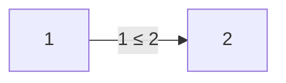

自然数の集合において $\le$ という関係は全順序関係(total order relation)であり、全順序関係には反射律という自己言及的な法則がありました。上記の $(S, \le), S = \lbrace 1, 2 \rbrace$ という全順序集合においては $1 \le 1$ と $2 \le 2$ が反射律に相当する関係ですが、これも図に反映させて表現するときは以下のようにします。

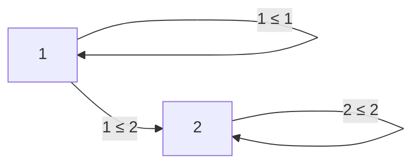

ただし、反射律についての関係を図に表現していくと集合のすべての要素について自己言及の矢印が必要となり、図が汚くなってしまうので基本的には省略していくので注意してください。また各順序関係を表すラベルテキストも省略していきます。

### ハッセ図

「ハッセ図 ([hasse diagram](https://en.wikipedia.org/wiki/Hasse_diagram))」とは、半順序集合をシンプルに図示するための一つの方法であり、有限な半順序集合は必ずこのハッセ図を作成できます。

台集合 $S$ とその半順序関係 $\le$ による半順序集合 $(S, \le)$ の各元について、$x < y$ (等号含まない) なら $x$ を $y$ よりも上方の位置にそれぞれを表す点を配置し、$x < z < y$ (等号含まない)となる要素 $z$ が存在しない場合には点 $x$ と点 $y$ を線分で結びます。このような線が他の元を表す点を通らないように配置していくとき、この図はハッセ図と呼ばれる図式になります。

例えば、以下のような図式がハッセ図であり、$a \le c \le e$ という関係と $b \le d \le e$ という関係と更に $a \le d$ という関係と $b \le c$ という関係があることがわかります。

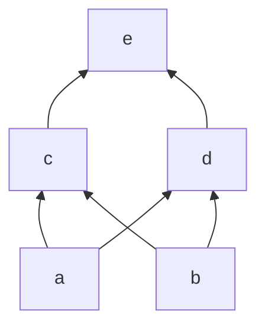

逆に以下のような図はハッセ図の原理に反しており、$a \le f \le c$ のような関係があるため、$a$ から $c$ への線分を削る必要があります。

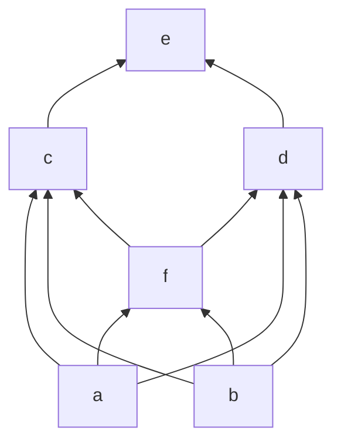

それぞれ中間点がある点同士の線分を削った正しいハッセ図が以下のようになります。

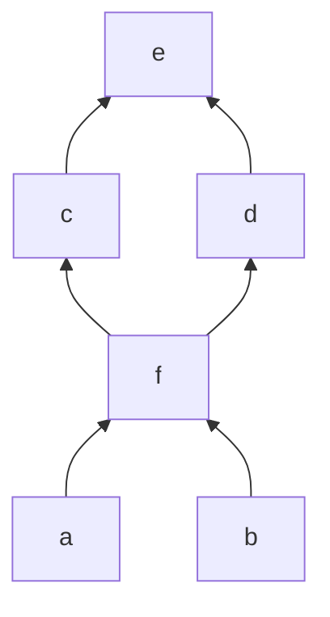

ハッセ図は非常に便利なので、この本での半順序関係をこのハッセ図によって表現することとします。ハッセ図においても反射律による自己言及的な関係は基本的に省略します(正確に言えばハッセ図の定義自体から反射律を表す線分は書かないことになっています)。

### 被覆関係

ハッセ図で表現される図で、線分が引かれる要素同士は $x < z < y$ (等号含まない)となる要素 $z$ が存在しない場合に限りました。つまり、$x, y$ の間に存在する要素は何もなく、$x, y$ は隣接していることが分かります。このとき、$x, y$ のように直接隣接する関係を「**被覆関係** ([covering relation](https://en.wikipedia.org/wiki/Covering_relation))」と呼び、$x \lessdot y$ のように表記して「$y$ が $x$ を被覆する」のように読みます。

### 全順序集合の図式

全順序集合はその前提として半順序集合であるので、もちろん全順序集合についてもハッセ図で表現できることになります。つまり、以下はハッセ図です。

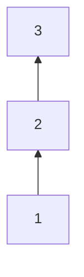

全順序集合は完全律によって比較不能な要素の組み合わせがなく、分岐が無いその構造的な特徴から線形順序(linear order)や鎖(chain)とも呼ばれます。被覆関係のみを表現するハッセ図では一本の線となるため、通常のハッセ図における下から上に順序関係が大きくなるように要素を並べるルールで書くと無駄にスペースと取って見づらいので基本的にこの本では以下のように右に 90°回転させて表現するようにします。また上述の通り反射律の関係も省略します。

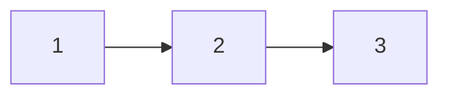

### 前順序集合の図式

ハッセ図は半順序集合(全順序集合も含む)について書ける図式ですが、前順序集合についてはどうでしょうか。例えば台集合 $S = \lbrace a, b, c, d, e \rbrace$ による以下のハッセ図で表現される半順序集合 $(S, \le)$ を少し改造して半順序関係が満たすべき反対称律($a \le b \land b \le a \Rightarrow a = b$)を壊すように関係を構築します。


例えば、$e \not = f$ だが、$a \le f, b \le f, c \le f, d \le f$ なる順序関係を持つ要素 $f$ を追加した台集合 $S' = \lbrace a, b, c, d, e, f \rbrace$ は大小関係 $\le$ について反対称律が満たされない場合($e \le f \land f \le f \Rightarrow e = f$ は成り立たない)があるため、これは半順序集合ではなく前順序集合となります。この前順序集合は上のハッセ図を改造して以下のように表現できます。

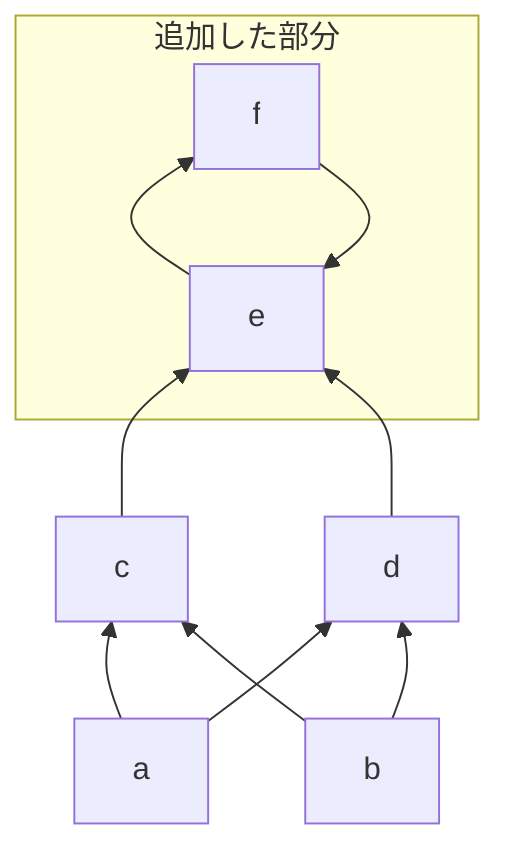

このような図式はハッセ図の被覆関係のみを表現するというルールから外れるのでハッセ図ではないということになりますが、前順序集合の図式を表現するにあたっては便利なので以後このような書き方をする場合もあることに注意してください。

さらに、$c \not = g$ だが、$a \le g, b \le g, c \le g$ なる順序関係をもつ要素 $g$ を追加した台集合 $S'' = \lbrace a, b, c, d, e, f, g \rbrace$ による前順序集合 $(S'', \le)$ は上の図式を改造して以下のように表現できます。

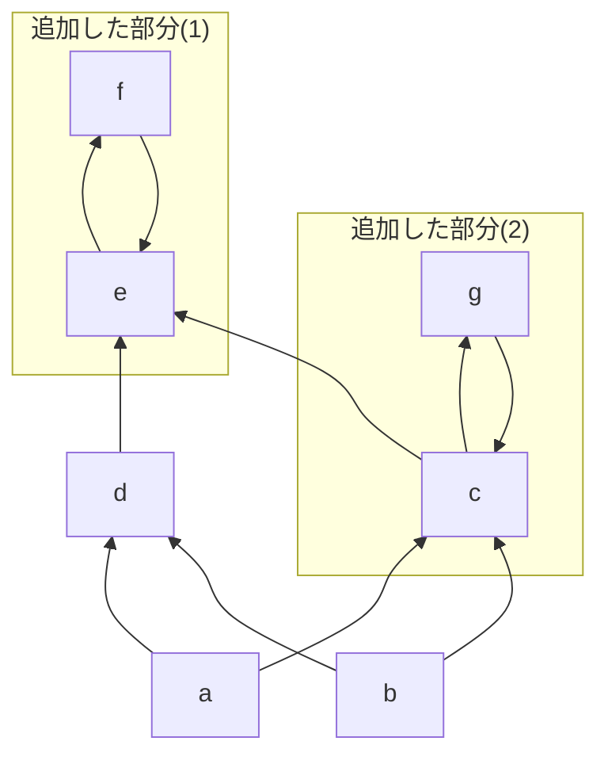

前順序集合はこのように循環するような矢印の経路を持つのが特徴的な順序集合となります。このような循環はグラフ理論では閉路(cycle)とよばれます。

逆に半順序集合ではこのような閉路はできず、閉路の無い有向グラフ、つまり「有向非巡回グラフ (DAG: [directed acyclic graph](https://en.wikipedia.org/wiki/Directed_acyclic_graph))」となります。

## 同値関係

さて、基本的な順序関係についての概念とそれを表現する図式について説明したので、次は同値関係について説明しておきましょう。

「**同値関係** (equivalence relation)」とは、二項関係の一種であり、以下の３つの法則を必要十分で満たす二項関係 $\sim$ です。

- 反射律 (asymmetric) : $a \sim a$
- 対称律 (symmetric) : $a \sim b \Rightarrow b \sim a$
- 推移律 (transitive) : $a \sim b \land b \sim c \Rightarrow a \sim c$

上記３つをまとめて**同値律**とよび、同値関係そのものを $a \equiv b$ などと表記します。

同値関係はオペランド同士が同一の対象であることや同じ値を持つことを示す等価関係 (equality) $=$ とは異なる概念であることに注意してください。

同値関係について説明したのは、それが満たす対称律と半順序関係が満たした反対称律についての違いに注意する必要があるからです。関係の記号を同じ $\prec$ にして比べてみましょう。

- 対称律 (symmetric) : $a \prec b \Rightarrow b \prec a$
- 反対称律 (asymmetric) : $a \prec b \land b \prec a \Rightarrow a = b$

対称律では、要素 $a, b$ についていずれかの方向で関係が定まるなら逆方向についても関係が定まるという関係ですが、反対称律では、両方の方向で関係が成り立つ場合に限り二つの対称は等価関係にある (つまり同一の対象である) と言えるということになります。

等価関係 (`=`) と同値関係 (`≡`) は関連していますが、異なる概念なので注意してください。

## 部分型関係の順序

さて、ここまで順序関係について説明してきたのは、実は部分型関係 $<:$ は実は順序関係と同じ法則をいくつか満たしているからです。部分型関係は以下の法則を満たします (むしろこの法則を満たすように部分型関係は定義されます)。

- 反射律 (reflexive) : $A <: A$
- 推移律 (transitive) : $A <: B \land B <: C \Rightarrow A <: C$

型の集合内の任意の型 $A, B$ についてこれは成り立ちます。実際に確認してみます。

```ts
type Assignable<Sub, Super> =
  [Sub] extends [Super] ? true : false;

type Unit = 1;
type Some = 1 | 2 | 3;
type Collection = number;

// 反射律: A <: A
type R1 = Assignable<Unit, Unit>;
// => true
type R2 = Assignable<Some, Some>;
// => true

// 推移律: A <: B かつ B <: C なら A <: C
type T1 = Assignable<Unit, Some>;
// => true
type T2 = Assignable<Some, Collection>;
// => true
type T3 = Assignable<Unit, Collection>;
// => true
```

ということで、部分型関係は前順序関係の法則を満たしていると言えます。

それでは以下の法則についてはどうでしょうか？

- 反対称律 (asymmetric) : $A <: B \land B <: A \Rightarrow A = B$

実は部分型関係が半順序 (partial order) であると嬉しいことがあるのでこれは成り立っていてほしいところなのですが、本当に成り立つかは正直微妙なところですね。

等価関係 (equality) が成り立つかどうかですが、等価関係とは二つのオペランドが同一の対象であることでした。ここでは $A$ と $B$ の型が同一 (identical) の型であることを言うと考えられますが、そもそも「型の同一性 (type identity)」とは何かを考える必要がありそうです。

## 型の同一性

型の同一性 (identity) の概念は公式ドキュメントには記載されていませんが、古の仕様書には記載されている概念です。

https://github.com/microsoft/TypeScript/blob/3c99d50da5a579d9fa92d02664b1b66d4ff55944/doc/spec-ARCHIVED.md#L2225-L2261

仕様書においては、そもそも TypeScript には型の関係性 (type relationship) として同一性、部分型、上位型、割当互換性という４つの関係があることが語られています。

> Types in TypeScript have **identity**, **subtype**, **supertype**, and **assignment** compatibility relationships as defined in the following sections.

関係性の定義は実装だと `checker.ts` の以下のように定義されているところですね。仕様書の頃よりもいくつか関係が増えていますね。

https://github.com/microsoft/TypeScript/blob/7d9399e353c1b770ab1b5c859c98e014cd3fda03/src/compiler/checker.ts#L2222-L2227

話を戻すと、この古の仕様書の時点においては、二つの型は以下の条件を満たしたときに同一 (identical) であると言えます。

- 二つの型が両方とも `any` 型
- 二つの型が両方とも同じプリミティブ型
- 二つの型が同じ型パラメータ
- 二つの型が同一の構成要素から成るユニオン型
- 二つの型が同一の構成要素からなるインターセクション型
- 二つの型が同一のメンバーセットを持つオブジェクト型

同一性の判定は以下の実装の箇所でしょう。
https://github.com/microsoft/TypeScript/blob/7d9399e353c1b770ab1b5c859c98e014cd3fda03/src/compiler/checker.ts#L19663-L19665

例えば、ユニオン型の `A | B` と `B | A` は同一の構成要素 `A, B` からなるユニオン型なので両者の型は同一 (identical) であると言えます。

型の同一性の概念が (部分的に) 定義されましたが、`checker.ts` などの TypeScript のソースコードを見ることなく型の等しさ (同じさ) についてプログラマーが語りたいときに本当に両者の型が同一の対象、つまり $A = B$ であると言い切れるでしょうか？

一方、ユニオン型やインターセクション型などの記述では、同値関係 (equivalence) の概念かどうはわかりませんが、`A | B` と `B | A` は同等 (equivalent to) であると記載されていますが、構成要素の型の順序も情報として保持されており、ユニオン型の呼び出しや構築シグネチャにおいて問題となる場合があるとも語られています。

> A union type encompasses an ordered set of constituent types. While it is generally true that _A_ | _B_ is equivalent to _B_ | _A_, the order of the constituent types may matter when determining the call and construct signatures of the union type.
> ([spec](https://github.com/microsoft/TypeScript/blob/3c99d50da5a579d9fa92d02664b1b66d4ff55944/doc/spec-ARCHIVED.md#34-union-types) より引用)

つまり、二つの型が対象として完全に同一であるかは明らかではないですし、ソースコードに立ち入らず、既存のシンタックスをつかって同一性を証明することは難しいということです。

現在自分たちの手にあるのは条件型を駆使した割当可能性を検証できる以下のような型構築子のみです。

```ts
type Assignable<Sub, Super> = [Sub] extends [Super] ? true : false;
```

さて、問題にしていた反対称律 ($A <: B \land B <: A \Rightarrow A = B$) についてですが、`Assignable` 型構築子では**二つの型が相互に部分型であるとしか言えません**。つまり、$A <: B \land A :> B$ のみが以下のように言えます。

```ts
type A = { fst: number };
type B = { fst: number };

type E1 = Assignable<A, B>;
// => true
type E2 = Assignable<B, A>;
// => true
```

$A <: B \land A :> B$ が言えたとしても $A = B$ は言えません。

一般に部分型関係は前順序 (pre-order) になると決まっています。例えば型システムにもよってレコード型 (簡易的なオブジェクトといえる) のプロパティ (あるいはメンバー) の順序 (order) などが変わることで同一の型ではなくなる場合があります。※ TypeScript ではプロパティ順序に関わらず同一とみなします。

その他にも TypeScript でいえば、`Object` と `object` と `{}` という３つのオブジェクトを表現する型は以下で検証しているように相互に部分型 (相互に割当可能) ですが、完全に同じ型ではありません。それぞれの型は振る舞いや役割が異なるからです。

```ts
type E1 = Assignable<object, Object>;
// => true
type E2 = Assignable<Object, {}>;
// => true
type E3 = Assignable<{}, object>;
// => true
type E4 = Assignable<object, {}>;
// => true
type E5 = Assignable<Object, object>;
// => true
type E6 = Assignable<{}, Object>;
// => true
```

$A <: B \land A :> B$ となっても常に $A = B$ が成り立たないなら、反対称律は成り立たないということになります。これらの３つの型の部分型関係を図式で表現すると以下のような部分型関係になっています。循環があるので半順序ではなく前順序であることがあきらかですね。

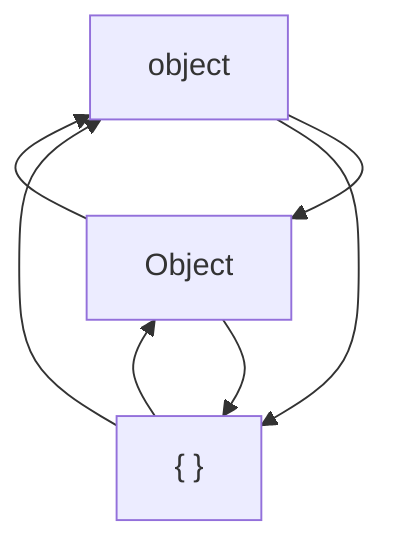

上の図式は少し分かり辛いので相互に部分型となる関係を矢印の循環で表現しなおすと以下のようになります。

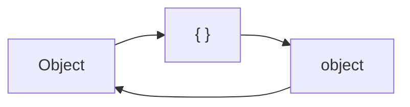

ここまで型の同一性を調べるのは困難であるということを述べてきましたが、実際には型の同一性を調べる方法として有名なハックが存在しています。公式ドキュメントにも載っておらず、いくつかのケースでは例外的にうまくいかない場合もあるとのことですが、大抵は以下の型構築子 `Identical` で検証することが可能です。

```ts
type Identical<Fst, Snd> =
  (<T>() => T extends Fst ? 1 : 2) extends
  (<T>() => T extends Snd ? 1 : 2)
    ? true
    : false;

// エイリアスとして Equals とも呼ぶようにする
type Equals<Fst, Snd> = Identical<Fst, Snd>;
```

実際にいくつかの型が同一であることを確認してみます。

```ts
type I0 = Identical<string, string>;
// => true

// 相互に割当可能な Object, object, {} は同一ではない
type I1 = Identical<Object, object>;
// => false
type I2 = Identical<object, {}>;
// => false

// ユニオン上のインターセクションの分配法則が同一性レベルで成り立つ
type A = { fst: number };
type B = { snd: string };
type C = { trd: boolean };
type I3 = Identical<A & (B | C), (A & B) | (A & C)>;
// => true

// オブジェクトのプロパティ順序によらず同一
type O1 = { fst: string; snd: number; };
type O2 = { snd: number; fst: string; };
type I4 = Identical<O1, O2>;
// => true
```

`Identical` の型構築子が型の同一性チェックとして機能するのは、二つの条件型の条件型 (比較) では `Fst` と `Snd` の二つの型パラメータが同一 (identical) であるときに限ってこの型が `true` ブランチの型を生成するからです。そして、条件型は通常は比較することができませんが、型引数として与えられない型パラメータ `T` によって条件型の解決が遅延することで条件型同士の比較が可能となっているというハックです。

実際に、`Object, object, {}` の同一性を検証するといずれの組み合わせも `false` になり、同一の型ではないことが分かります。

:::message
元ネタは、TypeScript リポジトリの [このissueのコメント](https://github.com/microsoft/TypeScript/issues/27024#issuecomment-421529650) で、型の名前は `Equals` として紹介されており、Type Challenge の [Utils](https://github.com/type-challenges/type-challenges/blob/main/utils/index.d.ts#L7-L9) としても実装されています。

この型についての解説は[リポジトリにあったこの解答](https://github.com/type-challenges/type-challenges/discussions/9100#discussioncomment-6896958)が詳しいので参照してください。
:::

## 同値類と商集合

型の同一性について紹介しましたが、型の集合において反対称律が成り立っていると色々構造として綺麗になるので、ここで無理やり反対称律を成り立たせるために同値類と商集合の概念を導入して、反対称律の等価関係を同値関係に置き換えます。

まずは、我々が二つの型における「同じさ」については言えるのは型同士の同一の対象であるという同一性と、相互に部分型関係であるという同値関係の二つです。

ここで思い出してほしいのは、同値関係が満たす法則の一つに対称律というものがありました。対称律は記号を $\prec$ から $\equiv$ に置き換えて書くと以下のようなものです。

$$
A \equiv B \Leftrightarrow B \equiv A
$$

ここで、二つの型 $A$ と $B$ について相互に部分型関係が成り立つ場合に限って二つの型が同値関係にあると定義して、$A \equiv B$ と表記するようにしましょう。

つまり、型同士に相互に部分型関係がなりたつことを同値関係と呼ぶなら以下のように同値関係が満たすべき同値律も成り立ちます。

- 反射律 (asymmetric) : $A \equiv A$
- 対称律 (symmetric) : $A \equiv B \Rightarrow B \equiv A$
- 推移律 (transitive) : $A \equiv B \land B \equiv C \Rightarrow A \equiv C$

:::message
TypeScript ではハックして型の同一性の概念検証を手に入れることができましたが、別の言語ではそのようなことができない場合もあるかもしれません。

二つの型が相互に部分型であるときにそれらの型を同値関係($\equiv$)として扱うというのは、筆者のアイデアなどでなく、例えば Kotlin 言語の仕様書にある[部分型のセクション](https://kotlinlang.org/spec/type-system.html?paragraph=,subtyping,3#subtyping-rules)などに見られます。

> Two types $A$ and $B$ are equivalent ($A \equiv B$), iff $A <: B \land B <: A$.

Scala言語の[仕様書にある同値関係のセクション](https://www.scala-lang.org/files/archive/spec/3.4/03-types.html#equivalence)では以下のように同値関係が定義されています。Scalaの場合は直接の部分型関係ではなく conformance という拡張された概念を利用しているようです。

> Equivalence is defined as mutual conformance.
> $S =:= T$ if and only if both $S <: T$ and $T <: S$
:::

これまで部分型関係 (割当可能性) についての検証を行うために使ってきた型構築子 `Assignable` の代わりに、型の同値関係を調べるための新しい型構築子 `Equivalent` と型の関係を調べる `Compat` を以下のように定義して導入します。

```ts
type Equivalent<Fst, Snd> =
  Assignable<Fst, Snd> extends true
    ? Assignable<Snd, Fst> extends true
      ? true
      : false
    : false;

type Compat<Fst, Snd> = Equivalent<Fst, Snd> extends true
  ? "Equivalent"       // Fst ≡ Snd
  : Assignable<Fst, Snd> extends true
      ? "Subtype"      // Fst <: Snd
      : Assignable<Snd, Fst> extends true
        ? "Supertype"  // Fst :> Snd
        : "Unrelated"; // Incomparable
```

これらの型構築子を使うことで、第一型パラメータと第二型パラメータについての部分型関係および同値関係を調べることができます。

```ts
type E1 = Equivalent<1, number>;
// => false
type E2 = Equivalent<object, {}>;
// => true
type C1 = Compat<1, number>;
// => Subtype: 1 <: number
type C2 = Compat<number, string>;
// => Unrelated

// 反射律: A ~ A
type R = Compat<string, string>;
// => Equivalent

// 対称律: A ~ B iff B ~ A
type S1 = Compat<object, Object>;
// => Equivalent
type S2 = Compat<Object, {}>;
// => Equivalent

// 推移律: A ~ B and B ~ C then A ~ C
type T = Compat<object, {}>;
// => Equivalent
```

:::message
型の関係性についてすべてを網羅するための型構築子 `Relation` も導入しておきます。

```ts
type Relation<Fst, Snd> =
  Identical<Fst, Snd> extends true
    ? "Identical"
    : Compat<Fst, Snd>;
```

同一でない場合には同値かどうかをフォールバックとして検証できます。
:::

さて、型について同値関係を導入できたので、次に同値類の概念を導入します。

同値関係を備えた集合 $S$ において、同値関係にある要素同士を一つにまとめてその中の一つの代表となる要素として扱うように集合 $S$ を再構成した集合です。

上で定義した同値関係 (つまり相互に部分型関係あるいは相互に割当可能) を使い、例えば型の集合 $Types$ において `Object`、`object`、`{}` は同値関係があるので、`{}` をその３つの代表となる要素として扱いましょう。このような代表となる要素は代表元 (representative) と呼ばれます。そして、この３つの型について `{}` を代表元として構成し直した集合を `{}` を代表元とする「**同値類** (equivalence class)」と言います。

さらに、オブジェクト型の３つの表現以外にも同値関係 $\equiv$ が定義された同値類をすべてかき集めて新しい型の集合を $Types$ からつくりなおします。このような集合は「商集合 (quotient set)」と呼ばれます。集合 $S$ が同値関係 $\sim$ による同値類から作った集合は $S/{\sim}$ と表記されます。

前順序から半順序への変換をわかりやすくするために図示すると、オブジェクト型が `{}` だけだったときは次のような基本的な部分型関係があったとします。※単純化するために図示した型以外の他の型はないものとしています。

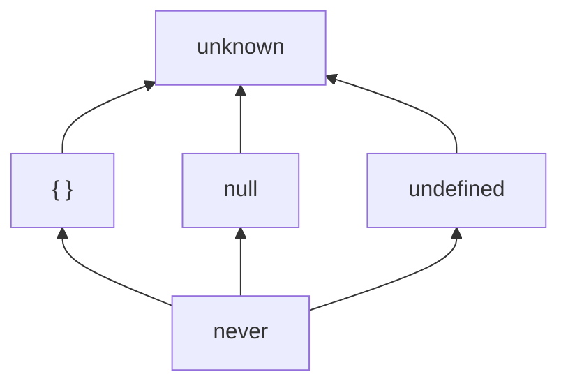

このときは循環がないため半順序となりますが、実際には以下のように `{}` に対して相互に部分型となる二つの型があります。

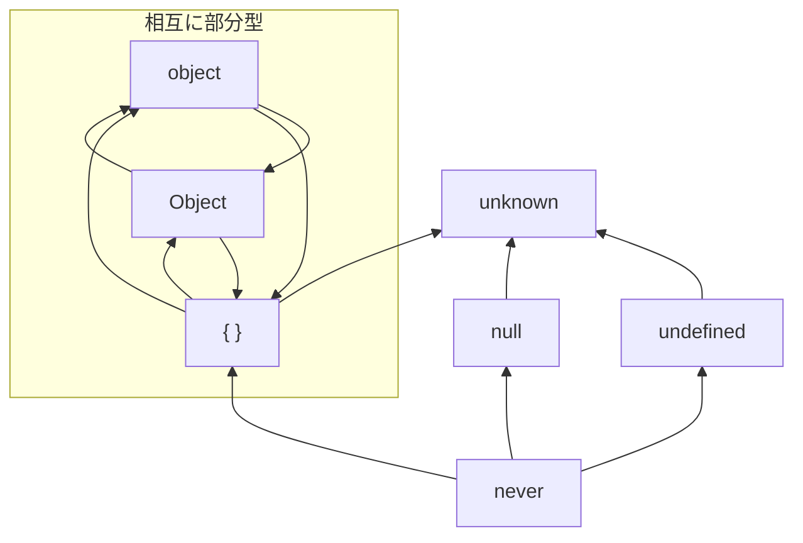

このような循環を形成する型は同値類にまとめてしまうことで元の半順序集合に変換できます。要素間の相互関係が折り畳まれたものとしても考えることができます。

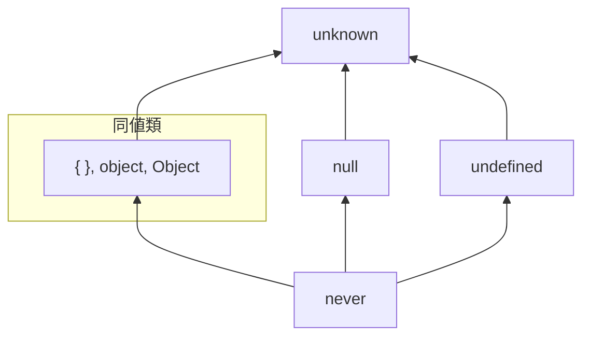

ハッセ図のところで、半順序を表現するハッセ図を改造して前順序の表現を行っていましたが、前順序集合は循環を持つ各要素をこのように一つにまとめてしまうことで半順序集合となりハッセ図で表現できることがわかります。

それでは、型の集合 $Types$ から同値関係 $\equiv$ による同値類から作った商集合 $Types/{\equiv}$ として、この集合を新しく $\text{TYPES}$ と呼ぶことにします。

これで面倒な型の同一性 (identity) について考える必要がなくなり、その代わりに緩い同値関係で型の同じさと違いについて考えることができます。実際、以下のようなかなり面倒な型同士の比較は同値で表現でき、同じものとして考えることができます。

```ts
type I1 = object & Object;
type I2 = Object & {};

type U1 = object | Object;

type C1 = Relation<I1, I2>;
// => Equivalent : I1 ≡ I2
type C2 = Relation<I1, U1>;
// => Equivalent : I1 ≡ U1
```

$\text{TYPES}$ においては、同値関係に基づき反対称律が成り立っています。

- 反対称律 (asymmetric) : $A <: B \land B <: A \Rightarrow A \equiv B$

:::message
ここで $\equiv$ は核 (kernel) と呼ばれるもので、半順序関係における核は等価関係 $=$ となります。
:::

これで型の集合は半順序集合 (partial ordered set) となりました。今後は半順序集合であることを強調する場合には $(\text{TYPES}, <:)$ のように表記します。

## 推移律の破れについて

『[TypeScript における型の集合性と階層性](https://zenn.dev/estra/articles/typescript-type-set-hierarchy)』の記事で解説したように`object`型は「プリミティブ型ではないこと」を表現するような導入された新しい特殊な型であり、以下の図で表現するように、`string` や `number` などのプリミティブ型から`object`型への直接の割当が禁止されています。

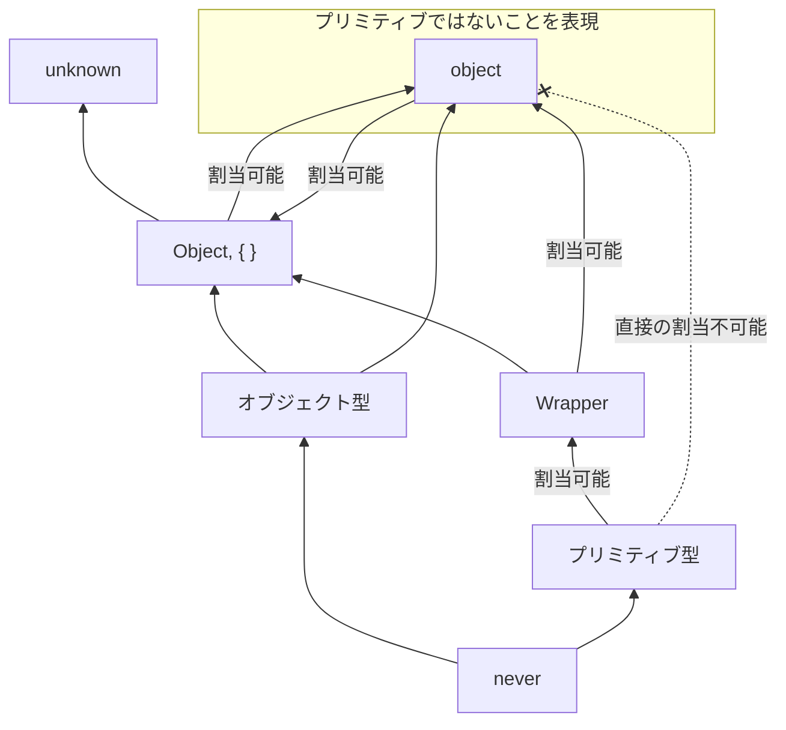

このことから、そもそも前順序関係において`object`型とプリミティブ型には関係がないということになります。とは言え、別の型を経由することで割り当てが可能にはなっています。

```ts
let pri: string = "st";
let Obj: Object;
let obj: object;

// string → Object → object の部分型関係を経由することで代入可能
Obj = pri; // OK → Object :> string
obj = Obj; // OK → object :> Object

// string → object への直接の代入は禁止されている
obj = pri; // NG → Error: Type 'string' is not assignable to type 'object'
```

プリミティブ型($P$ として抽象化)とそのラッパーオブジェクトの型($W$ として抽象化)と `object` 型の関係について見ると以下のように推移律が破れている箇所があります。

$$
P <: W \land W <: \text{object} \not \Rightarrow P <: \text{object}
$$

これは直接的な部分型関係が壊れているというよりかは、その拡張的概念である割当可能性において特別に割当不能であるとして定められているとして捉える方が自然です。

:::message alert
そもそも TypeScript は型システムの健全性よりも利便性を重視して、そのバランスを取っているので、このようなモデルとして綺麗にならないような場合は多々あります。
:::

ただし、このまま `object` 型を放置してモデルを考えのも都合が悪くなる場合がありえるので安全のために `object` 型も考えるモデルから取り除くことにしましょう。

同値類を考える上では `object, Object, {}` の３つがある方が話の都合上良かったので３つのオブジェクト型を含む型の集合 $Types$ を考えていましたが、そもそも `object` 型を取り除いた型の集合を $Types$ として扱い、その商集合を $\text{TYPES}$ とすることにします。新しい名前をつけるのが面倒なのでここは省略させてください。

