## 結びと交わり

さて、任意の二要素についての最小上界と最大下界の存在は束の構成条件となることからその二つには特別な名前が付いています。束論の文脈では、最小上界は「**結び**(join)」という名前で呼ばれ、最大下界は「**交わり**(meet)」という名前で呼ばれます。

$\text{TYPES'}$ が全体としては束にならないにもかかわらず束論を扱ってきたのはこの概念を手に入れるためといっていいです。

シンプルな束構造において、部分集合が比較不能な二つの要素からなる場合には以下のように Top と Bottom の位置が最小上界と最大下界だったので、それぞれ Join と Meet と呼べるわけです。これは単に名前が変わっただけなので変に身構える必要はないです。

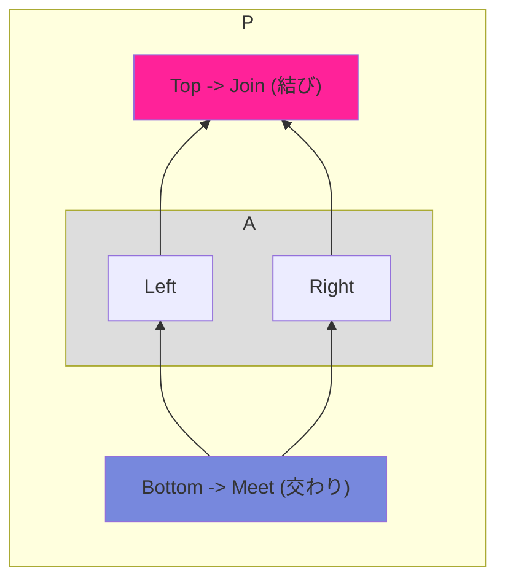

二元部分集合 $a, b$ が鎖上で、$a \le b$ なら最小上界と最大下界はそれぞれの要素となりました。つまり結びは $a$ となり、交わりは $b$ となります。

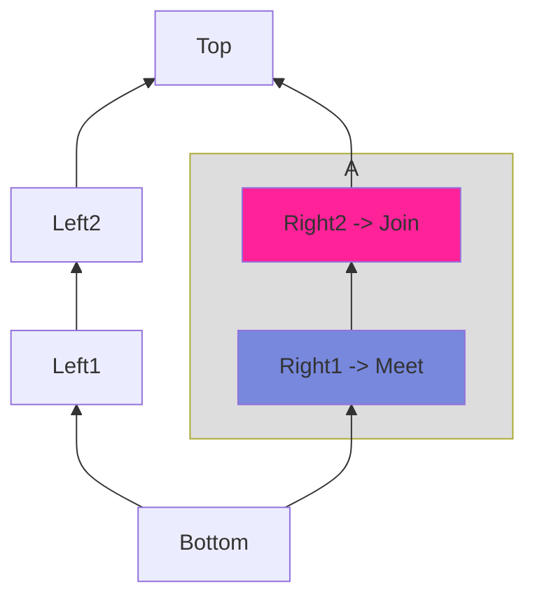

そろそろこの章の本題に入りますが、TypeScript の型には集合演算に相当する `|` と `&` がありましたが、束論の文脈では和集合(union: $\cup$)あるいは論理和(or: $|$)は「**結び**(join: $\lor$)」に相当し、共通部分(intersection: $\cap$)あるいは論理積(and: $\&$)は「**交わり**(meet: $\land$)」に相当します。

馴染み深い型で置き換えると join と meet は以下のような関係です。

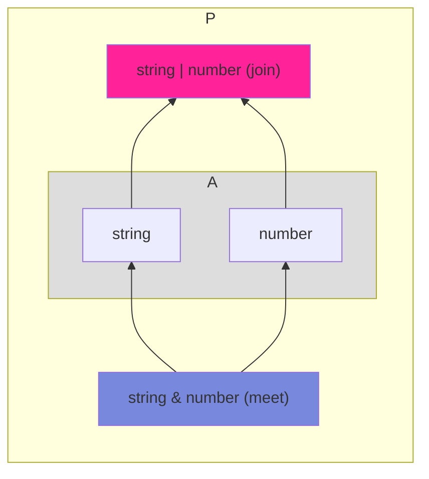

これまで $\lor$ を「または」として $\land$ を「かつ」として論理記号で使ってきましたが、同じ記号で join と meet を表現できます。つまり、ユニオン型 `string | number` は join として $\text{string} \lor \text{number}$ で表現でき、インターセクション型 `string & number` は meet として $\text{string} \land \text{number}$ のように表現可能です。

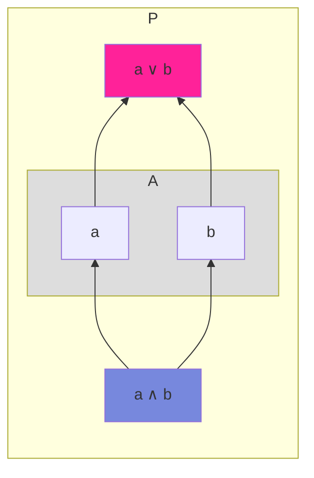

また、部分集合 $S$ の結び(join)を $\lor S$ と表現し、交わり(meet)を $\land S$ と表現することがあります。

さて、`Object, {}` などの相互に部分型関係となる、すなわち同値関係となるような型同士を同値類としてまとめた商集合は半順序集合になりました。このような型の集合 $\text{TYPES'}$ は半順序集合であり、以下のような基本構造(あるいは基本配置)を構築します。※ 一部簡略化しています。

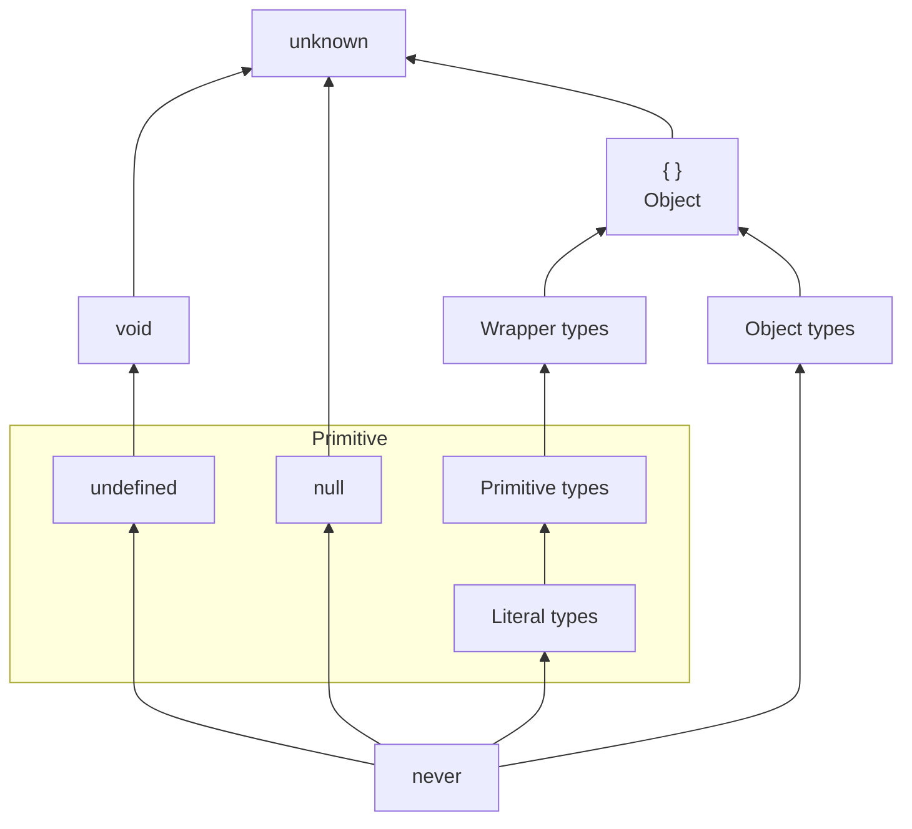

このとき「join 演算と meet 演算では任意の二つの型についてユニークな最大下界と最小上界を生成できるため、TypeScript の型の集合は上記の配置を基本とした束を形成します」と言えればよかったのですが、束にならない例で見たようにオブジェクト型の join 演算と meet 演算で生成される型は実際には厳密な最小上界と最大下界には相当しません。したがって、束に非常によく似た構造ではあるものの束にはなりません。

ただし、重要なことして、join (union) と meet (intersection) 演算の結果の型は一つに定まることが分かります。もしも join 演算と meet 演算が本当に最小上界と最大下界を生成するだけならそもそも束にならない構造においてユニオン型とインターセクション型を生成できないことになります。

## 有向集合

束じゃないなら何なんだという話になりますが、ここで[型システム入門](https://www.ohmsha.co.jp/book/9784274069116/)でどのように部分型関係における型の結びと交わりについて語られているか見てみましょう。

> 部分型関係がその部分型付けを持つ言語においてどのように定義されているかに依存して、すべての型の二つ組が結びを持つこともあり、そうでないこともある。ある部分型関係について、すべての $S$ と $T$ に対して $S$ と $T$ の結びとなる $J$ が存在するとき、この部分型関係は**結びを持**つという。同様に、すべての $S$ と $T$ に対して $S$ と $T$ の交わり $M$ が存在するとき、この部分型関係は**交わりを持つ**という。
> (型システム入門 p171 より引用)

述べられているように、部分型の型システムを持つ言語では、束になったり、ならなかったりすることがあります。このとき、部分型関係によって構成される束は Scala などの言語では「型束(type lattice)」あるいはそのまま「部分型束(subtype lattice)」などと呼ばれます。日本語での訳は見かけたことがないので筆者の適当な訳で申し訳ないですが、ここでは型の形成する束を型束と呼ぶことにします。

束という構造はそもそも非常に強い制約条件を持つため、もう少し緩めた条件の構造が概念としてあるとよいですね。そのような緩めた構造については最小上界や最大下界ではなく、上界や下界の概念を用いて集合を定義します。

> この節で考える部分型関係は結びを持つが交わりを持たない。例えば ${}$ と $Top \rightarrow Top$ は共通の部分型を全く持たないので、確実に最大の共通の部分型は存在しない。しかし、すこしだけ弱めた性質を満たす。型の二つ組 $S$ と $T$ が、ある型 $L$ が存在して $L <: S$ かつ $L <: T$ となるとき、**下に有界**であるという。
> (型システム入門 p171 より引用)

すでに上界と下界の概念は扱っていたので結構簡単に理解できるかと思います。前順序集合 $P$ に任意の二元部分集合 $A$ が上界と下界を持つとき、この集合を「有向集合([directed set](https://en.wikipedia.org/wiki/Directed_set))」と呼びます。

:::message alert
単に任意の二元部分集合が上界を持つ場合だけで有向集合と呼ばれることがありますが、ここでは上界と下界の両方を持つものを有向集合と呼ぶことにしています。
:::

有向集合はまず条件として前順序集合(pre-ordered set)の必要があるため、条件としてはそもそもかなり緩く、束も有向集合の一つとなります。

有向集合のイメージは集合全体がある一定の方向を向いているというものになります。これまで見てきた半順序集合は基本的には方向がありますが、上界と下界の説明で出した以下のような半順序集合は上界も下界も存在しないため、有向集合ではないです。なお、極小元と極大元は存在します。

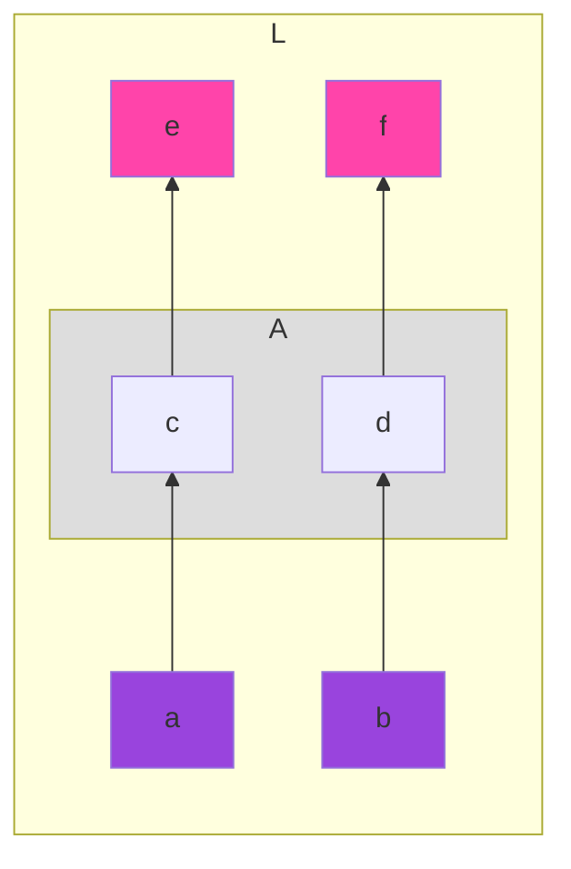

この図だと集合全体に方向があるようにみえてしまうので、以下のように書き直せば一定の方向がないことが分かります。

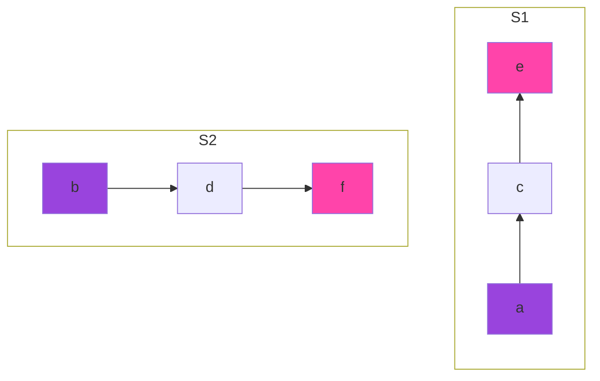

これを有向集合に改造するとしたら、二つの鎖をどこかで連結する必要がでてきますが、極小元や極大元が複数個あるとそれらを部分集合とした場合にその部分集合の下界や上界が存在しなくなります。したがって極大元と極大元は一つずつとなるように、つまり最大元と最小元が存在するように鎖の bottom 位置と top 位置を連結します。

ということで有向集合は一本鎖(全順序集合)でない半順序集合の場合には最低でも以下のような構造を必要とすることが分かります。

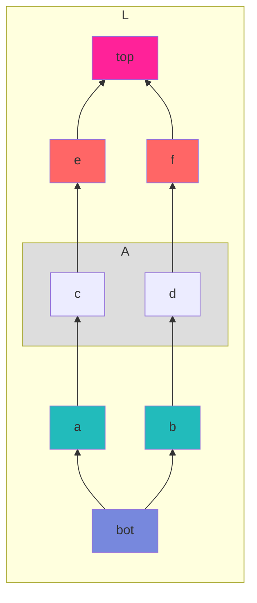


## 他言語での最小上界と最大下界

部分型関係を型システムに持つ言語は束になったり、ならなかったりしますが、他の言語で束の条件となる最小上界と最大下界がどのように扱われているか見てみましょう。

また、束という構造は相当強い条件なので型が束になる方が珍しいわけですが。

### Scala

#### 型の基本配置

Scala3 は束を持つと言われ、[公式ドキュメント](https://docs.scala-lang.org/tour/unified-types.html)では以下のような基本の配置構造が図示されています。

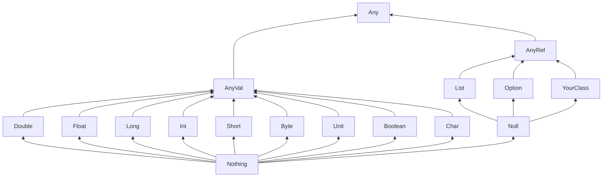

そして Scala3 が束を持つことは仕様書レベルで語られています。

> All types live in a single lattice with respect to a [conformance](https://www.scala-lang.org/files/archive/spec/3.4/03-types.html#conformance) relationship $<:$. The *top type* is `AnyKind` and the *bottom type* is `Nothing`: all types conform to `AnyKind`, and `Nothing` conforms to all types.
> (https://www.scala-lang.org/files/archive/spec/3.4/03-types.html#kinds より引用)

また最近のScala3について、基本配置図の [`Any`](https://scala-lang.org/api/3.x/scala/Any.html) 型はどうやらクラス階層のルートではあるもの Top 型ではなく、[`AnyKind`](https://scala-lang.org/api/3.x/scala/AnyKind.html) と呼ばれる型が Top 型となるようです。

また、束についての概念的説明は以下の動画で行われています。束の他にも pre-order や Category を形成することが語られているので Scala を扱っている方は参考に視聴することをおすすめします。

https://www.youtube.com/watch?v=vuTFg5g_f6w

#### 最小上界と最大下界

Scala3 のコンパイラのユニオン型のドキュメントを覗いてみると、最小上界(least upper bound)についての言及があります。

> From these rules it follows that the least upper bound (LUB) of a set of types is the union of these types. This replaces the [definition of least upper bound in the Scala 2 specification](https://dotty.epfl.ch/docs/reference/new-types/union-types-spec.html#:~:text=definition%20of%20least%20upper%20bound%20in%20the%20Scala%202%20specification).
> (https://dotty.epfl.ch/docs/reference/new-types/union-types-spec.html より引用)

ユニオン型は最小上界に相当し、部分型規則として結合律、可換律、乗法の加法上への分配律(インターセクション型のユニオン型に対しての分配律)を満たすことも記載されています。

[言語仕様書](https://www.scala-lang.org/files/archive/spec/3.4/03-types.html#internal-types)にもユニオン型とインターセクション型が最小上界と最大下界に相当することが記載されています。

> By construction, for all types A and B, the least upper bound of A and B is A ｜ B, and their greatest lower bound is A ＆ B.

:::message alert
Scalaの謎なところは直接の部分型関係ではなく、Conformanceと呼ばれる拡張的関係($<:$)による順序関係が推移律を満たさないと言っているのにもかかわらず、前順序関係であると述べられていたり、そもそも前順序なら束を形成しないのですが、同値類と商集合を導入して変換しているのでしょうか。このあたり、Scalaには詳しくないので有識者がいれば教えてほしいです。
:::

なお、Scala2 では最小上界や最大下界が常に存在するとは限らなかったそうです。

### Kotlin

#### 型の基本配置

Kotlin については筆者は詳しくないですが、Kotlin の型の基本配置については以下のブログ記事が非常に参考になります。

http://natpryce.com/articles/000818.html

上記記事の内容を元に Non-Nullable の型の順序関係を図示すると以下のようになります。

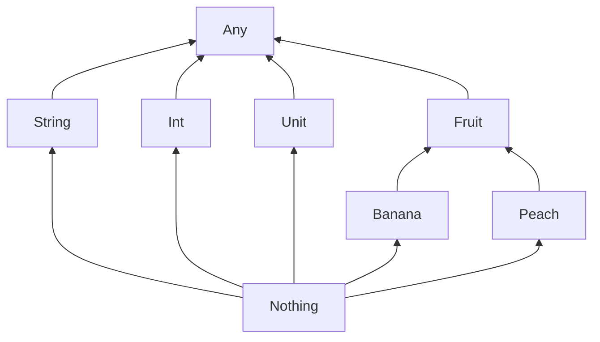

Nullable とは TypeScript で言うところの `type Nnullable<T> = T | null` のような型で `null` を許容します。この Nullable の型は以下のような型の順序関係が構成されます。

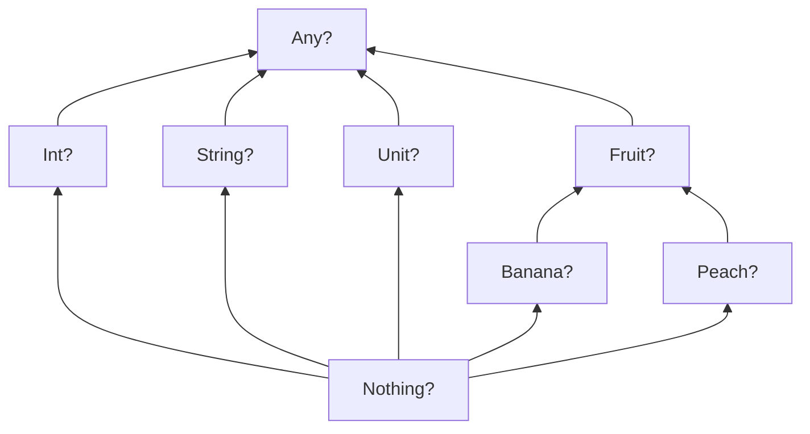

Nullable と Non-Nullable を組み合わせると以下のような複雑な型の順序関係が構築されます。

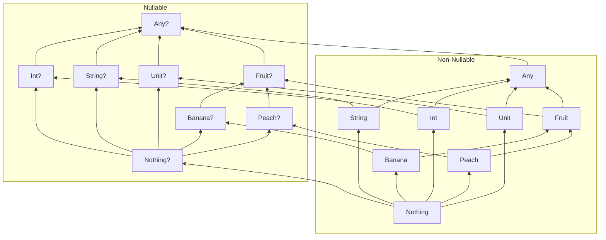

#### 最小上界と最大下界

Kotlin の仕様書にはユニオン型とインターセクション型が最小上界(LUB: least upper bound)と最大下界(GLB: greatest lower bound)に相当するととの記述があります。

> Union types of two types $A$ and $B$ is denoted $A | B$ and is equivalent to the least upper bound of its components LUB(A, B). Thus, the normalization procedure for LUB may be used to normalize a union type.
> (https://kotlinlang.org/spec/type-system.html#union-types より引用)

> intersection types of two types $A$ and $B$ is denoted $A\ \&\ B$ and is equivalent to the least upper bound of its components GLB(A, B). Thus, the normalization procedure for GLB may be used to normalize a union type.
> (https://kotlinlang.org/spec/type-system.html#intersection-types より引用)

なお、Kotlin はユニオン型を型システムに持ちませんが、型システムの機能についての推論を助けるために概念が仕様書に記載されているらしいです。

### CUE

通常のプログラミング言語とは別に構成記述言語などでも本当に束を持つ言語があります。それが [CUE](https://cuelang.org) 言語です。

CUE (Configure Unify Execute) はデータバリデーション機能と強力な推論エンジンを搭載している構成記述言語であり、CUE では型が値であるというコンセプトの元で、型と値の境界をなくし、さらに更に値(と型)を束として順序付けることで柔軟な制約条件を表現することができます。

以下のドキュメントで束とはそもそもなにか、CUE で束の構造がどのように役立つかが細かに解説されています。

https://cuelang.org/docs/concepts/logic/

CUE では TypeScript と同じく join 演算として `|` が利用でき、meet 演算として `&` が利用できます。これらが最小上界と最大下界を生成するようです。

## 束になるには

理想的には完全な束になると色々な構造的な性質が明言できて非常に便利なので、ここでは $\text{TYPES'}$ が束になるための条件を考えてみましょう。

問題となるオブジェクト型の集合的な解釈をベン図にしたものをもう一度見てみましょう。筆者はこの図に問題があると考えています。


このベン図で型の積と和で表現しきれない領域が存在していることがわかるでしょうか。それは以下の図で表現される領域 $X \cap (\overline{Y \cup Z})$ 及び $Y \cap (\overline{Z \cup X})$ と $Z \cap (\overline{X \cup Y})$ です。


ユニオン型とインターセクション型だけでは実はこれらの型を表現することはできません。そう、集合の否定演算つまり補集合を表現する型が必要となります。

https://github.com/microsoft/TypeScript/issues/4196

これによってオブジェクト型の和と積が束になることを示します。まず３つの型の構造を考える前に以下のような２つの集合の和と積が束になることから確認します。


これを使いベン図内のすべての領域について順序を構築します。

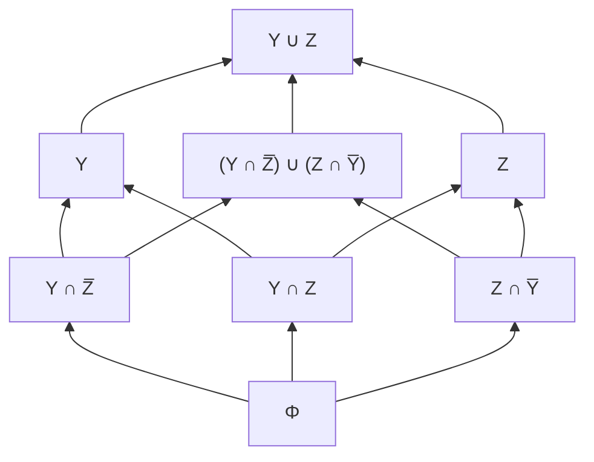

否定型を `!` という仮想の型構築子を使い、`A | B` の否定は `!(A | B)`と表現することにして、型で表現してみると以下のようになり、数値リテラル型の冪集合と同じ構造の束となります。

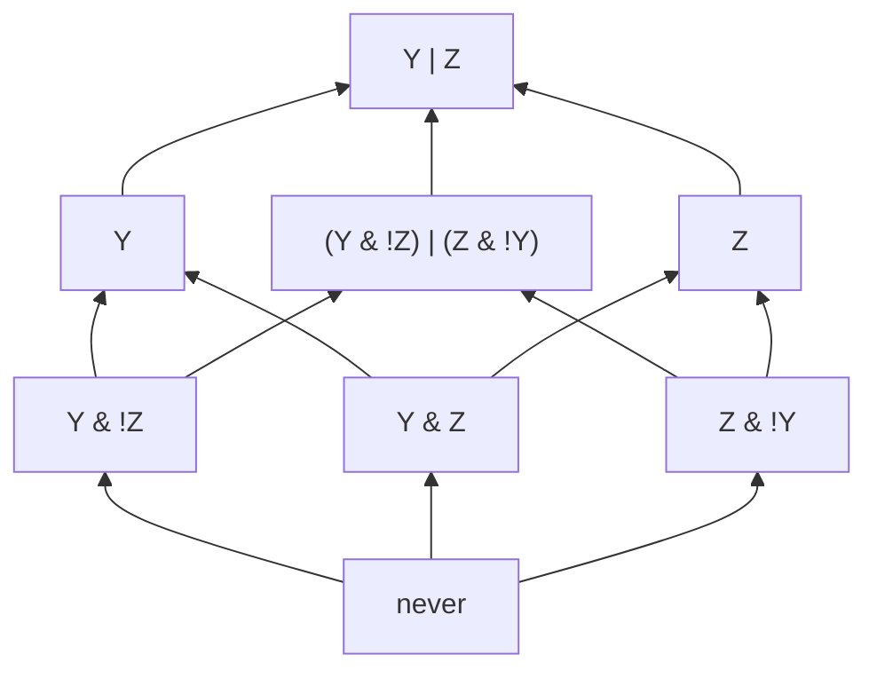

次に３つの型 `X, Y, Z` で考えます。再びベン図を眺めます。


３つの集合のベン図内の集合要素について和・積・否定のすべてを使った組み合わせはとんでもなく複雑なハッセ図を構築します。考え方としては、今３つの集合 `X, Y, Z` が非空であり、ベン図内に図示される分割された領域がすべて非空であって、各領域に１個の要素があるとして、各要素(各領域) $a, b, c, d, e, f, g$ として名前付けます。


描きたいハッセ図はこのベン図内のすべての部分集合の包含関係です。したがって、この領域から構成される集合をすべてかき集めた冪集合の包含関係のハッセ図が書ければいいわけです。つまり、集合 $S = \lbrace a, b, c, d, e, f, g \rbrace$ の冪集合を考えることになります。

ただし、この冪集合の要素は元の集合 $S$ の要素数が7個なので $2^7 = 128$ 個となります(そのうち一つは空集合の場合です)。つまり、このベン図で表現されるすべての部分集合の包含関係による半順序集合は128個の要素からなるハッセ図を構築するはずです。前章では4個の要素からなる集合の冪集合がかなり複雑になることを示しましたが、7個の要素からなる集合の冪集合を手動で図示するのは非常に困難です。

ということで [graphviz](https://graphviz.org) と [ts-graphviz](https://github.com/ts-graphviz/ts-graphviz) と ChatGPT の力を借りて TypeScript プログラムで生成したものが以下となります。


:::details 冪集合のハッセ図生成プログラムのソースコード
ts-graphviz は Graphviz の [Dot 言語](https://graphviz.org/doc/info/lang.html)を作成できる TypeScript 向けのライブラリです。

まず、graphviz 必要なので macOS なら Homebrew でインストールします。

```sh
brew install graphviz
```

そして、ts-graphviz は [Deno でも利用可能](https://github.com/ts-graphviz/ts-graphviz/blob/main/README_ja.md#deno-)でも利用できます。とうことで以下が上記のハッセ図を生成したプログラムのソースコードは以下となります。

※ Deno の環境は v1.40.5 (std: v.0.216.0)を使用しています。

```ts:genPowerHasse.ts
import { digraph, toDot } from "npm:ts-graphviz";
import { format } from "https://deno.land/std@0.216.0/datetime/format.ts";
import { ensureDir } from "https://deno.land/std@0.216.0/fs/ensure_dir.ts";

const empty = "Φ"

// 与えられた集合の全ての部分集合を生成
function powerSet<T>(set: T[]): T[][] {
  return set.reduce<T[][]>(
    (subsets, value) => subsets.concat(subsets.map((set) => [value, ...set])),
    [[]]
  );
  // [1, 2] => [[], [ 1 ], [ 2 ], [ 2, 1 ]]
  // [1, 2, 3] =>
  // [
  //   [],       [ 1 ],
  //   [ 2 ],    [ 2, 1 ],
  //   [ 3 ],    [ 3, 1 ],
  //   [ 3, 2 ], [ 3, 2, 1 ]
  // ]
}

// 部分集合間の被覆関係を判定
function isCoverRelation<T>(smaller: T[], larger: T[]): boolean {
  if (larger.length - smaller.length !== 1) {
    return false; // 要素数の差が1でなければ被覆関係ではない
  }
  const set = new Set(larger);
  return smaller.every((element) => set.has(element));
}

// 要素のラベル表現をフォーマット
function lavelFormat(element: string): string {
  return `{ ${element} }`;
}

// 冪集合のハッセ図を生成
function generateHasseDiagramDot<T>(set: T[]): string {
  const subsets = powerSet(set);
  const G = digraph('G', (g) => {
    g.set('rankdir', 'BT'); // グラフの構築方向
    g.set('ranksep', 2.5); // ranksep属性を設定(値を大きくするとスペースが広がる)

    // ノードを追加
    subsets.forEach((subset) => {
      const label = subset.length > 0 ? lavelFormat(subset.join(',')) : empty;
      g.node(label, { label });
    });

    // エッジを追加（直接的な包含関係のみ）
    subsets.forEach((smaller) => {
      subsets.forEach((larger) => {
        if (isCoverRelation(smaller, larger)) {
          const smallerLabel = smaller.length > 0 ? lavelFormat(smaller.join(',')) : empty;
          const largerLabel = larger.length > 0 ? lavelFormat(larger.join(',')) : empty;
          g.edge([smallerLabel, largerLabel]);
        }
      });
    });
  });

  console.log(`ノード数は ${subsets.length} 個です.`);

  return toDot(G);
}

async function main() {

  const defaultSetElements = [
    'a', // 1個目
    'b', // 2個目
    'c', // 3個目
    'd', // 4個目
    'e', // 5個目
    'f', // 6個目
    'g', // 7個目
  ];

  const arg = Number(Deno.args[0]);
  const numberOfElements = Number(arg) ? arg : defaultSetElements.length;

  if (numberOfElements > defaultSetElements.length) {
    console.log(`指定要素数が最大${defaultSetElements.length}個を超えています.`)
    return;
  }
  console.log(`${numberOfElements}個の要素から成る集合の冪集合のハッセ図を生成します.`)

  // 指定要素から成る集合の冪集合のハッセ図を生成
  const graph = generateHasseDiagramDot(defaultSetElements.slice(0, numberOfElements));

  // ファイルを生成
  const currentTime = format(new Date(), "yyyyMMddHHmmss");
  const dirPath = './graph';
  await ensureDir(dirPath);
  const dotFileName = `${dirPath}/${currentTime}.dot`;
  const outputFileName = `${dirPath}/${currentTime}.png`;

  await Deno.writeTextFile(dotFileName, graph);

  const cmd = ["-Tpng", dotFileName, "-o", outputFileName];
  const command = new Deno.Command("dot", { args: cmd });
  const { success } = await command.output();
  if (success) {
    console.log(`${outputFileName} が生成されました.`);
  } else {
    console.error("Error: Graphvizが画像の生成に失敗しました.");
  }
}

await main();
```

デフォルトでは7個の要素からなる集合の冪集合のハッセ図を生成しますが、便利なように元の集合の要素数を指定してハッセ図を生成できるようにしています。使い方としては以下のようにコマンドラインから実行して、ハッセ図を生成できます。

```sh
❯ deno run -A genPowerHasse.ts 3
3個の要素から成る集合の冪集合のハッセ図を生成します.
ノード数は 8 個です.
./graph/20240218105033.png が生成されました.
```

一応、要素2個の場合と3個の場合で出力される冪集合のハッセ図を図示しておきます。

二元集合の冪集合 | 三元集合の冪集合
--|--
 | 
:::

このような狂ったハッセ図が束になるかどうかを調べるにはこれまでのやり方ではほぼ無理でしょう。

## ブール束

ということで天下り的に知識を利用しますが、冪集合は必ず有界束となるため、このハッセ図による表現では任意の二元部分集合が常に最小上界と最大下界を持ちます。

通常の束は join 演算と meet 演算のみを持ちますが、否定演算 ($\neg$) を持つ束はブール束(boolean lattice)あるいはブール代数(boolean algebra)と呼ばれる特殊な束となります。

そして、ブール代数は冪集合の一般化であり、冪集合はブール束を形成することが知られています。つまり、以下のような冪集合はブール束です。

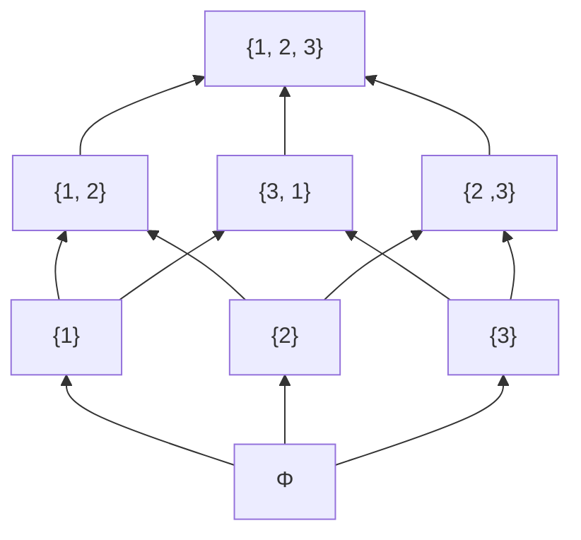

ブール束は最小元(bottom) $0$ と最大元(top) $1$ を持ち、二項演算である join 演算($\lor$) と meet 演算($\land$) と、単項演算である not 演算($\neg$) を備えた半順序集合であり、以下のような代数法則を満たします。

| 法則名 | 恒等式 |
|---|:---:|
| 結合律 (associativity) | $a \lor (b \lor c) = (a \lor b) \lor c$ <br/> $a \land (b \land c) = (a \land b) \land c$ |
| 可換律 (commutativity) | $a \lor b = b \lor a$ <br/> $a \land b = b \land a$ |
| 吸収律 (absorption) | $a \lor (a \land b) = a$ <br/> $a \land (a \lor b) = a$ |
| 冪等律 (idempotent) | $a \lor a = a$ <br/> $a \land a = a$
| 単位元 (identity) | $a \lor 0 = a$ <br/> $a \land 1 = a$ |
| 分配律 (distributivity) | $a \lor (b \land c) = (a \lor b) \land (a \lor c)$ <br/> $a \land (b \lor c) = (a \land b) \lor (a \land c)$ |
| 補元 (complements) | $a \lor \neg a = 1$ <br/> $a \land \neg a = 0$ |

実際に上記の法則が成り立っているかを先の冪集合と同じ束構造で確認してみてください。

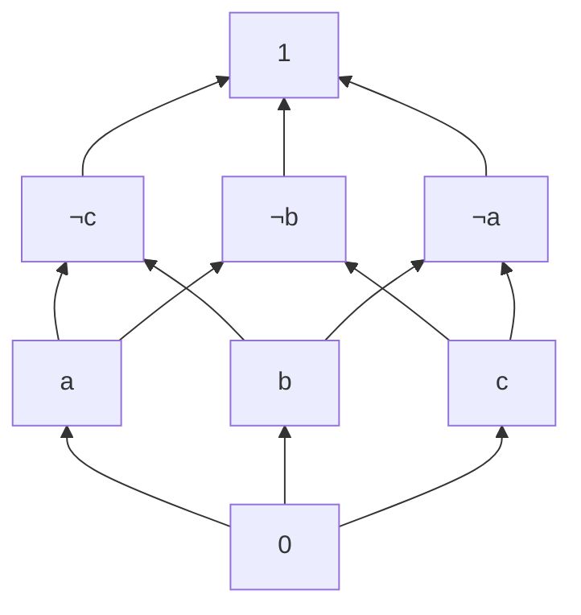

ブール束の条件を緩めて、通常の束構造が持つ代数法則は以下のようになります。

| 法則名 | 恒等式 |
|---|:---:|
| 結合律 (associative) | $a \lor (b \lor c) = (a \lor b) \lor c$ <br/> $a \land (b \land c) = (a \land b) \land c$ |
| 可換律 (commutative) | $a \lor b = b \lor a$ <br/> $a \land b = b \land a$ |
| 吸収律 (absorptive) | $a \lor (a \land b) = a$ <br/> $a \land (a \lor b) = a$ |
| 冪等律 (idempotent) | $a \lor a = a$ <br/> $a \land a = a$

有限な束は有界束(bound lattice)であり、最小元(bottom) $0$ と最大元(top) $1$ も持ちます。つまり、有界束は以下の単位元の存在性も満たします。

| 法則名 | 恒等式 |
|---|:---:|
| 単位元 (identity) | $a \lor 0 = a$ <br/> $a \land 1 = a$ |

このことからブール束はシンプルに見れば有界束に否定演算が追加されただけの構造のように見えますが、演算二つから三つとなって組合せ数が多くなるため、相当の表現力を持つことになります。またブール束の構造の条件としては分配束([distributed lattice](https://en.wikipedia.org/wiki/Distributive_lattice))かつ可補束([complemented lattice](https://en.wikipedia.org/wiki/Complemented_lattice))である必要もあります。

分配束とは以下のような分配律を満たす束のことであり、通常の束は分配律を満たすとは限りません。

| 法則名 | 恒等式 |
|---|:---:|
| 分配律 (distributive) | $a \lor (b \land c) = (a \lor b) \land (a \lor c)$ <br/> $a \land (b \lor c) = (a \land b) \lor (a \land c)$ |

可補束とは特殊な有界束で、すべての要素がすくなくても一つの補元(complement)を持つ有界束です。つまり、集合内の任意の要素 $a$ について以下のような性質を持つ要素 $b$ (補元)が必ず一つ以上存在するという構造です。

$$
\begin{aligned}
a \lor b = 1 \\
a \land b = 0 \\
\end{aligned}
$$

ブール束では否定演算があり、補元 $b$ を $\neg a$ と表現できます。つまり、上の恒等式は以下のようになります。

$$
\begin{aligned}
a \lor \neg a = 1 \\
a \land \neg a = 0 \\
\end{aligned}
$$

ブール束の構造的なイメージについては以下の記事が参考にしてください。
https://www.cs-study.com/koga/cmath/cmath01.html#bool

### 和集合と共通部分と補集合を有する型システム

和集合に相当するユニオン型(join演算)と共通部分に相当するインターセクション型(meet演算)に加えて補集合に相当する否定型(not演算)がある言語について興味があれば Giuseppe Castagna 氏による以下の論文が参考になるでしょう。
※ 以下は Giuseppe 氏本人が公開している論文のURLです。

https://www.irif.fr/~gc/papers/set-theoretic-types-2022.pdf

Giuseppe 氏は Semantic Subtyping の研究なども行っており、ユニオン型、インターセクション型、否定形、Semantic Subtyping の型システムを備えた Roblox の [Luau 言語](https://luau-lang.org)にもコメントを寄せています。

https://blog.roblox.com/2022/11/semantic-subtyping-luau/

Luau は通常の構文主導の構文的部分型(Syntactic Subtyping)のシステムではなく、意味論主導で以下の公理を実装するような意味論的部分型(Semantic Subtyping)のシステムを採用しています。

- 型の意味論は値の集合である
- インターセクション型は集合の共通部分である
- ユニオン型は集合の和集合である
- 部分型関係は集合の包含関係である

『[部分型関係の概念](4-ast-subtyping-concept)』の章において、部分型関係は厳密には集合の包含関係ではないと述べましたが、Semantic Subtypingの型システムにおいては集合論を公理として実装を行うため、これまで考えてきた部分型関係をそのまま集合の包含関係として扱うことができるようです。

Luau でもすべての否定形を実装できているわけではなく、実装的に難しい箇所などによって理想的な意味論的部分型にはできていない部分もあるそうです。

## 型束の代数的振る舞い

$\text{TYPES'}$ は厳密には束ではないですが、有向集合を前提としてかなり束に近い構造をしています。加えて任意の型についてユニークなユニオン型とインターセクション型を生成できます。仮にそれらの型が半順序集合内で最小上界や最大下界にならずとも、joinとmeetの演算結果が定まることから束と同じような代数的振る舞いを有することが推測されます。

ここで、ブール束の代数法則から補元の存在性だけを除いた有界な分配束を考えましょう。

| 法則名 | 恒等式 |
|---|:---:|
| 結合律 (associativity) | $a \lor (b \lor c) = (a \lor b) \lor c$ <br/> $a \land (b \land c) = (a \land b) \land c$ |
| 可換律 (commutativity) | $a \lor b = b \lor a$ <br/> $a \land b = b \land a$ |
| 吸収律 (absorption) | $a \lor (a \land b) = a$ <br/> $a \land (a \lor b) = a$ |
| 冪等律 (idempotent) | $a \lor a = a$ <br/> $a \land a = a$
| 単位元 (identity) | $a \lor 0 = a$ <br/> $a \land 1 = a$ |
| 分配律 (distributivity) | $a \lor (b \land c) = (a \lor b) \land (a \lor c)$ <br/> $a \land (b \lor c) = (a \land b) \lor (a \land c)$ |

有界ということで、$\text{TYPES'}$ では `never` 型は最小元 $0$ に相当し、`unknown` 型は最大元 $1$ に相当します。そしてこれらの型は束のjoin演算とmeet演算において単位元として振る舞います。

### 単位元の存在性

ある二項演算において単位元(identity element)とは、他のどの元もその単位元との演算において影響を受けないという法則です。例えば自然数の集合では加法の単位元は $0$ であり、乗法の単位元は $1$ です。

$$
\begin{aligned}
0 + 3 &= 3 + 0 = 3 \\
1 \times 3 &= 3 \times 1 = 3
\end{aligned}
$$

和集合に相当するユニオン型のjoin演算について表現の仕方を網羅すると以下のようになります。

$$
\begin{aligned}
a \lor \text{never} &\equiv \text{never} \lor a \equiv  a \\
a \cup \text{never} &\equiv \text{never} \cup a \equiv a \\
a\ |\ \text{never} &\equiv \text{never}\ |\ a \equiv a
\end{aligned}
$$

これは直感的にも明らかであり、任意の型と `never` 型とのユニオンは必ずその型自身になります。集合論的に見れば任意の集合と空集合の和集合は元の集合になります。

同様に、共通部分に相当するインターセクション型のmeet演算について表現の仕方を網羅すると以下のようになります。

$$
\begin{aligned}
a \land \text{unknown} &\equiv \text{unknown} \land a \equiv a \\
a \cap \text{unknown} &\equiv \text{unknown} \cap a \equiv a \\
a\ \&\ \text{unknown} &\equiv \text{unknown}\ \&\ a \equiv a
\end{aligned}
$$

これは直感的にも明らかであり、任意の型と `unknown` 型とのインターセクションは必ずその型自身になります。集合論的に見れば任意の部分集合と全体集合の共通部分は部分集合そのものになります。

### 可換律

可換律(commutativity)は交換律とも呼ばれます。演算のオペランドの順番を交換しても結果は同じとなります。例えば、自然数の集合において加法と乗法はこの可換律を満たします。

$$
\begin{aligned}
2 + 3 &= 3 + 2 = 5 \\
2 \times 3 &= 3 \times 2 = 6
\end{aligned}
$$

集合論的に見れば、和集合を得る演算について対象の順番を交換しても同じ結果になります。

$$
\begin{aligned}
a \lor b &\equiv b \lor a \\
a \cup b &\equiv b \cup b \\
a\ |\ b &\equiv b\ |\ a
\end{aligned}
$$

共通部分を得る演算について対象の順番を交換しても同じ結果になります。

$$
\begin{aligned}
a \land b &\equiv b \land a \\
a \cap b &\equiv b \cap b \\
a\ \&\ b &\equiv b\ \&\ a
\end{aligned}
$$

### 結合律

結合律(associativity)は、同じ演算子が式に複数個出力する場合に演算を施す順番が結果に影響を与えないという法則です。例えば自然数の集合では加法も乗法も結合律を満たします。

$$
\begin{aligned}
2 + (3 + 4) &= (2 + 3) + 4 = 9 \\
2 \times (3 \times 4) &= (2 \times 3) \times 4 = 24
\end{aligned}
$$

集合論的に見てもどのような順番で和集合をつくっても同じになることは直感的に分かります。

$$
\begin{aligned}
a \lor (b \lor c) &\equiv (a \lor b) \lor c \\
a \cap (b \cap c) &\equiv (a \cap b) \cap c \\
a\ \&\ (b\ \&\ c) &\equiv (a\ \&\ b)\ \&\ c
\end{aligned}
$$

共通部分についてはそこまで直感的ではないですが、同様に順番によりません。

$$
\begin{aligned}
a \land (b \land c) &\equiv (a \land b) \land c \\
a \cup (b \cup c) &\equiv (a \cup b) \cup c \\
a\ \&\ (b\ \&\ c) &\equiv (a\ \&\ b)\ \&\ c
\end{aligned}
$$

### 吸収律

吸収律(absorption)は束としての構造を最も特徴づける代数法則であり、かなり特殊な法則なため具体的な例は思いつきません。

ただし、これも集合論的に見ればある集合 $a$ と $b$ の共通部分を作ってから元の集合 $a$ との和集合を作れば元の集合 $a$ に戻るということは直感的に分かります。

$$
\begin{aligned}
a \lor (a \land b) &\equiv (a \land b) \lor a \equiv a \\
a \cup (a \cap b) &\equiv (a \cap b) \cup a \equiv a \\
a\ |\ (a\ \&\ b) &\equiv (a\ \&\ b)\ |\ a \equiv a
\end{aligned}
$$

同様にある集合 $a$ と $b$ の和集合を作ってから元の集合 $a$ との共通部分を作れば元の集合 $a$ に戻るということも直感的に分かります。

$$
\begin{aligned}
a \land (a \lor b) &\equiv (a \lor b) \land a \equiv a \\
a \cap (a \cup b) &\equiv (a \cup b) \cap a \equiv a \\
a\ \&\ (a\ |\ b) &\equiv (a\ |\ b)\ \&\ a \equiv a
\end{aligned}
$$

### 冪等律

冪等性(idempotence)とは、$x^2 = x$ のような文字通り冪が元の要素と等しくなる性質のことです。

ユニオン型(和集合/join演算)について表現すると以下のような法則となります。これも集合的に見れば、ある集合の自分自身との和集合はその集合そのものになります。

$$
\begin{aligned}
a \lor a &\equiv a \\
a \cup a &\equiv a \\
a\ |\ a &\equiv a
\end{aligned}
$$

インターセクション型(共通部分/meet演算)について表現すると以下のような法則となります。これも集合的に見れば、ある集合の自分自身との共通部分はその集合そのものになります。

$$
\begin{aligned}
a \land a &\equiv a \\
a \cap a &\equiv a \\
a\ \&\ a &\equiv a
\end{aligned}
$$

冪等律は順序関係の反射律や圏の恒等射のようなものとしても見れるかもしれません。

### 分配律

分配律(distributivity)とは文字通りある演算を別の演算に対して分配できるという法則です。例えば自然数の集合の乗法は加法に対して分配律を満たします。

$$
\begin{aligned}
2 \times (3 + 4) &= (2 \times 3) + (2 \times 4) = 14
\end{aligned}
$$

一方で、加法は乗法に対して分配律を満たしません。

$$
\begin{aligned}
2 + (3 \times 4) &= 14 \\
(2 + 3) \times (2 + 4) &= 30
\end{aligned}
$$

自然数では一方の分配律しか成り立ちませんが、今考えている束的な構造ではブール束と同じように異なる二つの演算が相互に分配律を満たしています。

$$
\begin{aligned}
a \land (b \lor c) &\equiv (a \land b) \lor (a \land c) \equiv (b \lor c) \land a \\
a \cap (b \cup c) &\equiv (a \cap b) \cup (a \cap c) \equiv (b \cup c) \cap a \\
a\ \&\ (b\ |\ c) &\equiv (a\ \&\ b)\ |\ (a\ \&\ c) \equiv (b\ |\ c)\ \&\ a
\end{aligned}
$$

$$
\begin{aligned}
a \lor (b \land c) &\equiv (a \lor b) \land (a \lor c) \equiv (b \land c) \lor a \\
a \cup (b \cap c) &\equiv (a \cup b) \cap (a \cup c) \equiv (b \cap c) \cup a \\
a\ |\ (b\ \&\ c) &\equiv (a\ |\ b)\ \&\ (a\ |\ c) \equiv (b\ \&\ c)\ |\ a
\end{aligned}
$$

### 代数法則の検証

単純な型のレベルではこれらは少なくても同値関係ですべての法則が成り立つ事がわかります。なお吸収律は同一性ではなく同値関係レベルで成り立ちます。

```ts
type A = number;
type B = string;
type C = boolean;

// 結合律
type A1 = Relation<A | (B | C), (A | B) | C>;
// => Identical
type A2 = Relation<A & (B & C), (A & B) & C>;
// => Identical
type A3 = Relation<A | B | C, C | A | B>
// => Identical

// 可換律
type C1 = Relation<A | B, B | A>;
// => Identical
type C2 = Relation<A & B, B & A>;
// => Identical

// 単位元の存在性
// join演算の単位元: 0 → never
type R1 = Relation<A, A | never>;
// => Identical
// meet演算の単位元: 1 → unknown
type R2 = Relation<A, A & unknown>;
// => Identical

// 吸収律
type H1 = Relation<A | (A & B), A>;
// => Equivalent
type H2 = Relation<A & (A | B), A>;
// => Equivalent

// 冪等律
type I1 = Relation<A | A, A>;
// => Identical
type I2 = Relation<A & A, A>;
// => Identical

// 分配律
type D1 = Relation<A & (B | C), (A & B) | (A & C)>;
// => Identical
type D2 = Relation<(A | B) & C, (A & C) | (B & C)>;
// => Identical
type D3 = Relation<A | (B & C), (A | B) & (A | C)>;
// => Identical
type D4 = Relation<A & (B | C), (A & B) | (A & C)>;
// => Identical
```

オブジェクト型についても同様です。

```ts
type A = { fst: number };
type B = { snd: string };
type C = { trd: boolean };

// 結合律
type A1 = Relation<A | (B | C), (A | B) | C>;
// => Identical
type A2 = Relation<A & (B & C), (A & B) & C>;
// => Identical
type A3 = Relation<A | B | C, C | A | B>
// => Identical

// 可換律
type C1 = Relation<A | B, B | A>;
// => Identical
type C2 = Relation<A & B, B & A>;
// => Identical

// 単位元の存在性
// join演算の単位元: 0 → never
type R1 = Relation<A, A | never>;
// => Identical
// meet演算の単位元: 1 → unknown
type R2 = Relation<A, A & unknown>;
// => Identical

// 吸収律
type H2 = Relation<A | (A & B), A>;
// => Equivalent
type H3 = Relation<A & (A | B), A>;
// => Equivalent

// 冪等律
type I1 = Relation<A | A, A>;
// => Identical
type I2 = Relation<A & A, A>;
// => Identical

// 分配律
type D1 = Relation<A & (B | C), (A & B) | (A & C)>;
// => Identical
type D2 = Relation<(A | B) & C, (A & C) | (B & C)>;
// => Identical
type D3 = Relation<A | (B & C), (A | B) & (A | C)>;
// => Equivalent
type D4 = Relation<A & (B | C), (A & B) | (A & C)>;
// => Identical
```


