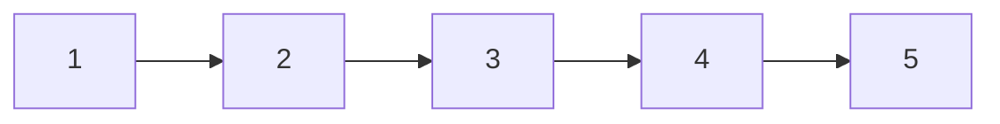
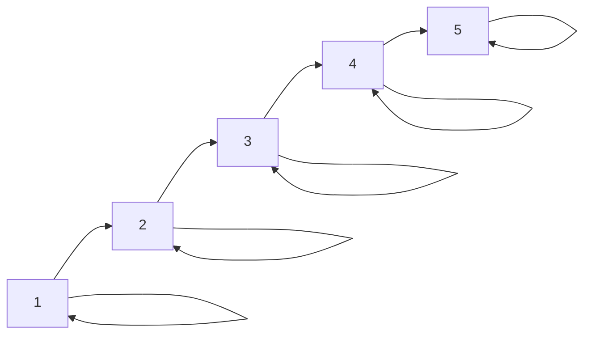
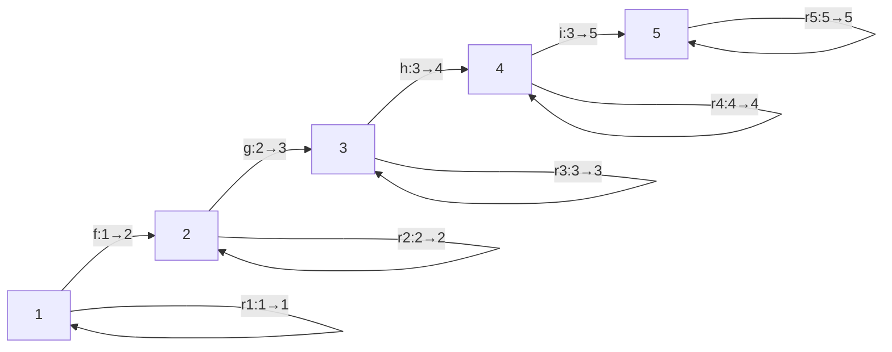
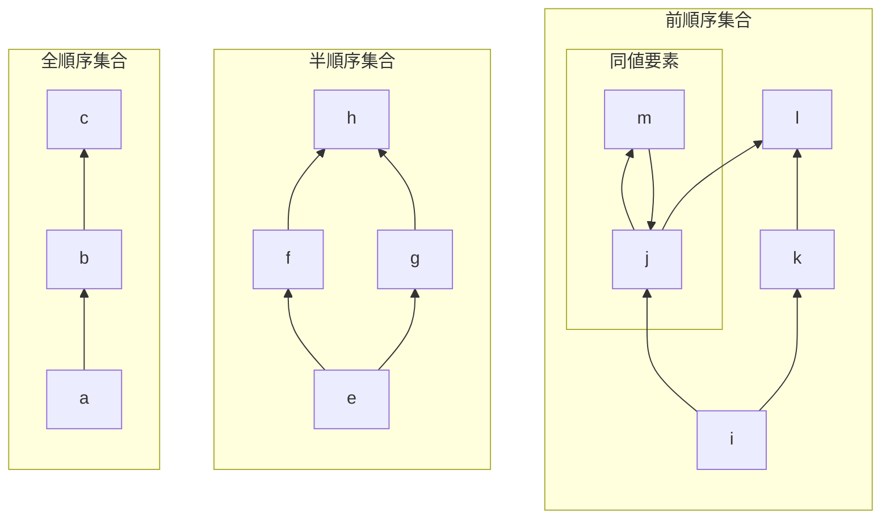
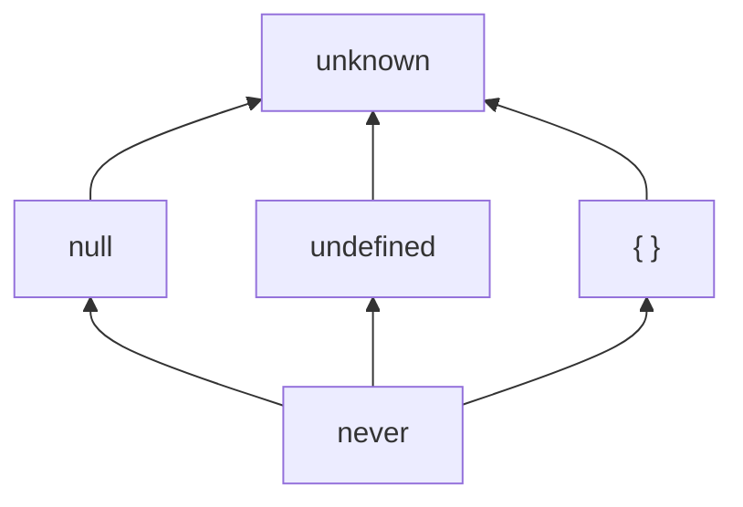
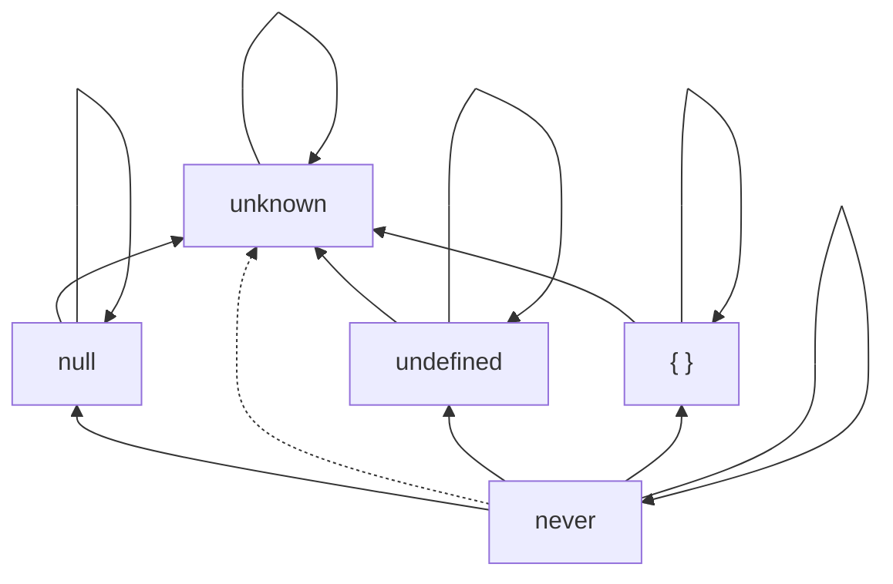
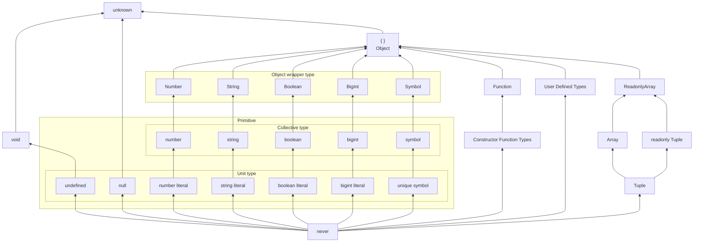

## 圏論の導入

「圏論 ([category theory](https://en.wikipedia.org/wiki/Category_theory))」とは「対象 (object)」の集まりとそれらの間の関係を表す「射 (morphism あるいは arrow)」の集まりからなる構造である「圏 (category)」を研究分野です。

圏論の概念は特に [Haskell](https://www.haskell.org) という純粋関数型言語で利用されていますが、Haskell 以外でも圏論は使えますし、実はオブジェクト指向言語の部分型関係においても一部の概念 (変性) は圏論由来のものです。圏論は以下で説明する「圏の公理」さえ満たせば考えているシステムを圏としてみなせるので、TypeScript が持つような型システムについても圏を考えることができます。

ちなみにこの章で考える圏は、Haskell における「**対象を型、射を関数とする圏**」である [Hask](https://ja.wikibooks.org/wiki/Haskell/%E5%9C%8F%E8%AB%96) とは異なるものであることに注意してください

## 圏とは

圏とは簡単に言えば複数のモノの集まりとそのモノ同士の関係を表す矢印からなるある種のシステムです。具体的な定義を与えると、考えている領域において以下のようなモノ(対象)とその間の矢印(射)が存在するとします。

- 対象の集まり $A, B, C \ldots$ と、その対象間に射の集まり $f, g, h \ldots$ がある
- 任意の射の組 $f: A \rightarrow B,\ g: B \rightarrow C$ の合成射(composition) $f \circ g$ が存在する
- 任意の対象 $A$ に恒等射(identity arrow) $id_A: A \rightarrow A$ が存在する

このとき、任意の射 $f: A \rightarrow B,\ g: B \rightarrow C,\ h: C \rightarrow D$ について以下の「圏の公理」を満たすとき、その構造を圏(category)であると言います。

- 結合律 (associativity): $h \circ (g \circ f) = (h \circ g) \circ f$
- 単位律 (identity): $f \circ id_A = f = id_B \circ f$

あるシステムを考えるとき、そのシステムがこの圏の公理を満たしてさえいればそれは圏であると言うことができるので、様々なものが圏という構造であるとみなせます (あるいは圏を構築できます)。

圏は一般的に **C**ategory の頭文字 C のスクリプトフォントを使って $\mathscr{C}$ のように表記されたり、他のアルファベットを使って $\mathscr{A, B}$ のように表記されます。このとき、圏の公理を満たす構造である圏 $\mathscr{C}$ がどのような構造が図示すると以下のような構造となります。


恒等射はある対象から自分自身への矢印であり、対象ごとに必ず存在し、対象 $A$ の恒等射は $1_A$ や $id_A$ などと表記されます。

また一般に、対象間の射の数は制限されておらず、以下のように複数個の射が存在してもよいのが圏という構造の特徴です。つまり、図のように二つの対象の間には同じ方向の射が何本あってもよいですし、逆の方向の射も何本あってもよいということになります。


代表的な圏の構造として、ミニマルな圏をいくつか図示して考えてみます。まず、対象が一つも存在しない圏は $\mathbf{0}$ と呼ばれ、対象が一つもないので射も存在しません。この圏が最もシンプルな圏です。そして、対象が一つの圏は $\mathbf{1}$ と呼ばれ一つの対象とその対象についての恒等射のみを持ちます。次に複雑となるのは $\mathbf{2}$ と呼ばれる圏で、この圏は二つの対象とそれぞれの恒等射と、異なる対象間に一つの射を持つ構造です。そして、対象が三つで、異なる対象間の射が三つとなる圏は $\mathbf{3}$ と呼ばれ、これらの圏は以下のような構造となっています。


ここまで圏の図式で対象からその対象自身への射である恒等射を書いてきましたが、一般的には恒等射の表現は冗長になるため圏の図式では省略されることが多いので注意してください。

そして、以下のような対象と射の図式において始点と終点の合成の結果が等しくなるとき、つまり対象 $A$ から $C$ を経由して $D$ へ到達するパスと、対象 $A$ から $B$ を経由して $D$ へ到達するパスの結果が同じになる、言い換えれば射の合成 $h \circ g = i \circ f$ となるとき、図式が可換(commutative)であると言い、このような図式を「可換図式 ([commutative diagram](https://en.wikipedia.org/wiki/Commutative_diagram))」と呼びます。
※ 実際の合成射はこの図式では表現されていません。

$$
  \begin{CD}
     A @>{f}>> B \\
  @V{g}VV    @V{i}VV \\
     C   @>{h}>>  D
  \end{CD}
$$

上で説明したように対象間の射は何個あってもいいので、二つの射 $h \circ g, i \circ f$ が同一となることは決して自明ではありませんが、このような可換図式が与えられたときは同一として考えて良いわけです。

## 順序集合の圏

さて、最低限の圏の知識を入れたのでここからは本題に入る前の下ごしらえとして、いくつかの追加の圏と概念を解説していきます。

ここまで何度も述べてきたように考えている構造が圏の公理を満たしさえすればその構造は圏としてみなすことができます。この本では多くの順序集合(全順序集合、半順序集合、前順序集合)を扱ってきました。順序集合を $(P, \prec)$ として、台集合 $P$ の各要素を対象(object)として、要素間の順序関係 $\prec$ を射(arrow)として扱うことで順序集合は圏としてみなせます。

つまり、要素 $a, b$ を圏の対象 $a, b$ として扱い、さらにその間の順序関係 $a \prec b$ を射 $a \rightarrow b$ として扱います。つまり以下のように射と順序関係を論理的な同値([if and only if](https://en.wikipedia.org/wiki/If_and_only_if))として扱います。

$$
a \le b \Leftrightarrow a \rightarrow b
$$

:::message
"if and only if" は片方が成り立つときに限ってもう片方が成り立つという関係を表現し、"iff" と省略されて $\Leftrightarrow$ や $\equiv$ の記号で表現されます。iff の関係では片方が成り立たないならもう片方も成り立ちません。
:::

それでは実際に順序集合が圏になることを確認していきます。これまで順序集合を表現するためにハッセ図を書いてきましたが、これ自体で圏の構造のある種の表現ができます。例えば、自然数 $\lbrace 1, 2, 3, 4, 5 \rbrace$ を台集合とする大小関係 $\le$ による鎖(全順序集合)は以下のようにハッセ図で表現可能でした。



ハッセ図では反射律($a \prec a$)の表現はしませんでしたが、ハッセ図をやめて反射律までも表現すると図式は以下のようになります。



また、構造を圏としてみなすには圏の公理を満たす必要がありましたが、その前の前提として圏には恒等射(identity arrow)が必要でした。順序集合における射は順序関係なので、反射律による自分自身への順序関係 $a \prec a$ が恒等射 $a \rightarrow a$ に相当します。上記の図で、順序関係 $1 \le 2$ を $f: 1 \rightarrow 2$ のように置き換え、対象 $a$ についての反射律(reflexivity)による自身への順序関係 $a \le a$ を $r_a: a \rightarrow a$ とするように表現すると以下のように図示できます。



これで圏して扱える準備が整ってきましたが、圏となる構造の前提には更に任意の射の組 $f: A \rightarrow B,\ g: B \rightarrow C$ に対して合成射(composition) $f \circ g$ が存在する必要があります。

ところで、全順序集合というのはそもそもの前提として前順序集合であり、反射律に加えて推移律($a \prec b \land b \prec c \Rightarrow a \prec c$)を満たしていました。

順序集合を圏としてみなした時、射は順序関係 $\prec$ (鎖なら $\le$)になるわけですから、二つの射 $a \prec b$ と $b \prec c$ の合成射は $a \prec c$ という順序関係となります。そして $a \prec b$ かつ $b \prec c$ なら $a \prec c$ であることは推移律によって保証されています。例えば上記の鎖であれば、$1 \le 2$ と $2 \le 3$ は射 $f: 1 \rightarrow 2$ と $g: 2 \rightarrow 3$ に相当するわけですから、反射律による関係 $1 \le 3$ は合成射 $g \circ f: 1 \rightarrow 3$ という感じで作ることができます。つまり、少なくても前順序集合であるならば順序集合には合成射が存在することになります。

ここで順序理論の章を思い出すと、ハッセ図では $x < y < z$ となる $z$ が存在しない場合の $x < y$ という被覆関係($x \lessdot y$)のみを表示していました。上記鎖でいえば $f, g, h, i$ の射による関係のみです。このような被覆関係以外のすべての順序関係、例えば合成射 $g \circ f: 1 \rightarrow 3$ なども含めてすべての順序関係による射を描けば以下のように表現できます。


ハッセ図では鎖の被覆関係を矢印として表現していましたが、このように被覆関係について推移律を使えば要素間のあらゆる順序関係を構成できます。つまり順序関係を表す射を合成することができるわけです。

ここで再確認すると、圏の公理とは任意の射 $f: A \rightarrow B,\ g: B \rightarrow C,\ h: C \rightarrow D$ についての以下の法則でした。

- 結合律 (associativity): $h \circ (g \circ f) = (h \circ g) \circ f$
- 単位律 (identity): $f \circ id_A = f = id_B \circ f$

実際に圏の公理を満たしていることを確認してきます。

結合律についてですが、上記の鎖を使って具体的に考えると $h \circ (g \circ f)$ は射 $f: 1 \rightarrow 2$ と $g: 2 \rightarrow 3$ を先に合成してから、$h: 3 \rightarrow 4$ をその合成結果に合成しています。まずはこれらの射を順序関係と対応させて二つの射の合成までを書き下すと以下のようになります。

射 | 順序関係
--|--
$f: 1 \rightarrow 2$ | $1 \le 2$
$g: 2 \rightarrow 3$ | $2 \le 3$
$h: 3 \rightarrow 4$ | $3 \le 4$

射の合成 $g \circ f$ は $f: a \rightarrow b$ と $g: b \rightarrow c$ があったときに $f$ の始点 $a$ から終点 $b$ へと移動し、同じ対象である $g$ の始点 $b$ から $c$ へと動くパスの移動としても考えられます。つまり $a \rightarrow b \rightarrow c$ というように動きますが、最終的にはどのような中継点を通ろうが最初の始点 $a$ と最後の終点 $c$ を結ぶパスを考えるわけで、$g \circ f$ なら順番的に $f$ から考えて $g$ を後に考えます。

このような射の合成の順番を推移律を表現する論理式の順番と対応させて論理的な同値(iff)として扱うようにします。

$$
\lbrace g \circ f: (b \rightarrow c) \circ (a \rightarrow b) = a \rightarrow c \rbrace\ \text{iff}\ \lbrace a \le b \land b \le c \Rightarrow a \le c \rbrace
$$

順序関係の射の合成のやり方は

射 | 推移律 | 合成結果
--|--|--
$g \circ f: 1 \rightarrow 3$ | $1 \le 2 \land 2 \le 3 \Rightarrow 1 \le 3$ | $1 \le 3$
$h \circ g: 2 \rightarrow 4$ | $2 \le 3 \land 3 \le 4 \Rightarrow 2 \le 4$ | $2 \le 4$

問題となる三つの射の合成結果が同じになればいいわけですが、このように考えていくと、$h \circ (g \circ f)$ の方は反射律 $1 \le 3 \land 3 \le 4 \Rightarrow 1 \le 4$ を使って合成した結果は $1 \rightarrow 4$ となります。同様に射 $(h \circ g) \circ f$ も反射律 $1 \le 2 \land 2 \le 4 \Rightarrow 1 \le 4$ を使って合成した結果が $1 \rightarrow 4$ となり、二つの合成の結果が等しくなることが分かります。

射 | 推移律 | 合成結果
--|--|--
$h \circ (g \circ f): 1 \rightarrow 4$ | $1 \le 3 \land 3 \le 4 \Rightarrow 1 \le 4$ | $1 \le 4$
$(h \circ g) \circ f: 1 \rightarrow 4$ | $1 \le 2 \land 2 \le 4 \Rightarrow 1 \le 4$ | $1 \le 4$

射の合成の順番は論理和 $\land$ の前後の順番に対応させたわけですが、そもそも論理和という演算はそのオペランドの順番を変更しても結果は変わらないということが[代数法則である可換律](https://en.wikipedia.org/wiki/Logical_disjunction)(commutativity)によって定められています。したがって、推移律を表す論理式についてオペランドの順番をどのように書こうが同じ結果になります。

最後に単位律を考えると、単位律はある対象 $a$ についての恒等射 $id_a$ とその対象から別の対象 $b$ へ接続する射 $f: a \rightarrow b$ との合成が $f$ 自体となるということを表現しています。$id_a \circ f$ という射の合成は推移律の論理式 $a \le b \land a \le a \Rightarrow a \le b$ に相当するので合成結果は $a \le b$ を表す $f$ そのものになります。

同様に $f \circ id_a$ という射の合成は推移律の論理式 $a \le a \land a \le b \Rightarrow a \le b$ に相当するので合成結果は $a \le b$ を表す $f$ そのものになります。したがって以下が成り立ちます。

$$
id_a \circ f = f = f \circ id_a
$$

したがって、鎖(全順序集合)は圏を構築できます。以下の図は鎖の圏におけるすべての射を表現したものです。


このように全順序集合は圏の公理を満たしますが、前順序集合も反射律と推移律を持つので、同じように圏になります。結局のところ反射律と推移律にが圏の公理を保証するので順番集合(前順序集合、半順序集合、全順序集合)は圏としてみなすことができます。

そして、順序集合の圏の特徴的なポイントは一般的な圏に比べて射の数が少ないところです。対象間の射の数は制限されておらず二つの対象間に射がいくつあろうが良いわけですが、順序関係は二つの対象に関係があるかないかだけの二択となり、順序関係がある場合でも一方向につき一つなので、二対象 $a, b$ の間には射があったとしても高々二つしか存在しません。

より具体的に見ると、全順序集合なら $a \le b$ という関係から必ず一つの射が存在し、半順序集合なら関係が存在したとしても $a \le b$ による射が一つだけで、二要素が比較不能ならそもそも射が一つも存在しないということになります。前順序集合では双方の関係によるサイクルがある場合(同値な要素間)には $a \le b$ と $b \le a$ という二つの射がある場合がありますが、その他は全順序集合と半順序集合と同じことになります。



順序集合の圏における射の数をまとめると以下のようになります。

順序集合 | 射の数
--|--
前順序集合 | 高々２個 (0, 1, 2 の場合がある)
半順序集合 | 高々１個 (0, 1 の場合がある)
全順序集合 | 必ず１個

## 関手とは

圏内の対象とその対象間の関係である射の集まりを俯瞰的に考えるのが圏論の基本ですが、圏論という分野は抽象化を繰り返すことがよくあるため、圏(category)そのものを対象(object)として考えて、圏と圏の間で射(arrow)を考えるということを行うことができます。つまり「圏の圏」ということを考えることができるわけですが、このとき圏同士の間にある射を「関手 ([functor](https://en.wikipedia.org/wiki/Functor))」と呼びます。

### 共変関手

例えば、以下のように二つの圏 $\mathscr{C, D}$ において圏 $\mathscr{C}$ から圏 $\mathscr{D}$ への射があるとき、それを関手 $F$ と呼ぶようにします。


関手とは、より具体的に言えば圏内の対象と射を別の圏の対象と射にそれぞれ対応づける、あるいは圏を別の圏に変換するようなものであると捉えることができます。

具体的に関手 $F$ がやることを見ていくと、まず圏 $\mathscr{C}$ のすべての対象 $A, B, C$ を圏 $\mathscr{D}$ の対象へとマッピングします。このとき関手 $F$ による対象 $A$ のマッピング先の対象は $F(A)$ のように表せます。


対象がマッピングできたら、次に圏 $\mathscr{C}$ から圏 $\mathscr{D}$ への射のマッピングを行います。このとき関手 $F$ による射 $f$ のマッピング先の射は $F(f)$ のように表せます。


この図の例では二つの圏 $\mathscr{C, D}$ において対象と射がそれぞれ一対一に対応していますが、一般的に関手による対応付けがこのように一対一になるとは限りません。

例えば、三つの対象 $A, B, C$ から構成される同じ圏 $\mathscr{C}$ に対して $\mathscr{D}$ ではない別の圏として二つの対象から構成される $\mathscr{E}$ という圏への関手 $G$ を考えます。関手 $F$ では一対一に対象をマッピングできましたが、この関手 $G$ では圏 $\mathscr{C}$ の対象 $B, C$ を同じ対象 $G(B) = G(C)$ へとマッピングします。


射 $g: B \rightarrow C$ は対象 $G(B) = G(C)$ から同じ対象への射として関手 $G$ によって射 $G(g)$ 変換されますが、この際に $G(g)$ は恒等射である必要はありません。ただし、圏 $\mathscr{C}$ の対象 $B, C$ の恒等射である $id_B, id_C$ は圏 $\mathscr{E}$ の対象 $G(B) = G(C)$ の恒等射 $G(id_B) = G(id_C)$ にマッピングされます。

これが通常の関手の性質であり、一般に圏 $\mathscr{C}$ から圏 $\mathscr{D}$ への関手 $F$ は、圏 $\mathscr{C}$ 内の任意の対象 $A, B, C$ と、射 $f: A \rightarrow B,\ g: B \rightarrow C$ について以下の公理に従います。

- $F(id_A) = id_{F(A)}$
- $F(g \circ f) = F(g) \circ F(f)$

ここまで説明してきた関手 $F$ と $G$ はこの公理に従っていますが、図をみてもらえばわかるように圏 $\mathscr{C}$ から関手を使って変換した構造 $\mathscr{D, E}$ は元々の圏 $\mathscr{C}$ 内の射の方向が保持されている事がわかります。例えば、$F(f)$ や $G(f)$ などの射は元の射である $f$ と全く同じ方向を向いています。より詳しく言えば、$F(f)$ は射 $f$ の始点である対象 $A$ と終点である $B$ を関手 $F$ により変換した $F(A)$ と $F(B)$ をそれぞれ始点、終点として同じ方向に射がでていることが分かります。言い換えれば対象間における構造(射の方向)が保持されていますね。

このような性質を持つ関手が一般的な関手となりますが、そうでない関手と区別するために通常の関手には特別な名前がついています。このような通常の関手は「**共変関手** (covariant functor)」と呼ばれます。

### 反変関手

少し話を変えますが、束論の章において双対性(duality)という概念がでてきました。圏論においても双対性の概念は重要な位置を占めます。

束論での双対は順序関係 $\le$ において一方向についての定義や証明を逆方向についても言うことができるというようなものでしたが、圏論においても射の方向を逆転することで双対概念を考えることができます。

例えば、圏 $\mathscr{C}$ と同じ対象 $A, B, C$ を持ち、射の方向を逆転させた圏を「双対圏(dual category)」や「反対圏(opposite category)」と呼び、$\mathscr{C}^{op}$ のように圏を表記します。双対圏 $\mathscr{C}^{op}$ を図示すると元の圏の射がすべて逆向きになっていることが分かります。


双対圏と元の圏の同じ対象について異なる圏の対象であることを強調するために対象 $A$ をオーバーラインを付けて $\overline{A}$ のように表記することがあります。また、方向が逆転した射についても元の射 $f: A \rightarrow B$ だとしたら双対圏の射は $\overline{f}: \overline{B} \rightarrow \overline{A}$ のように表記します。

このとき、圏 $\mathscr{C}$ から双対圏 $\mathscr{C}^{op}$ に対象と射をマッピングする $H$ のような関手があったとして、そのような関手は射の方向を逆転させているわけです。このような射の方向を逆転させる関手を「**反変関手** (contravariant functor)」と呼びます。

反変関手は共変関手と逆向きの公理に従います。一般に圏 $\mathscr{C}$ から圏 $\mathscr{D}$ への反変関手 $H$ は、圏 $\mathscr{C}$ 内の任意の対象 $A, B, C$ と、射 $f: A \rightarrow B,\ g: B \rightarrow C$ について以下の公理に従います。

- $H(id_A) = id_{H(A)}$
- $H(g \circ f) = H(f) \circ H(g)$

双対圏への反変関手で考えてみると、恒等射はそのまま写しますが、合成射については $H(g \circ f) = H(f) \circ H(g) = \overline{f} \circ \overline{g}$ と実際に上の公理に従ってることが分かります。

### 自己関手

圏の圏における対象間の射は関手だったので、圏の圏における対象の恒等射というものも考えることができます。圏を対象とする圏において恒等射はもちろんある種の関手であり、そのような関手は「恒等関手(identity functor)」と呼ばれます。


恒等関手は圏という対象についての恒等射なのでなにも特別なことしない射として、ただ自分自身にマッピングする関手です。つまり、圏 $\mathscr{C}$ の対象 $A, B, C$ をそのまま同じ圏 $\mathscr{C}$ の対象 $A, B, C$ にマッピングし、射についても同様にすべて同じ射にマッピングします。

恒等関手のような圏から同じ圏への関手を「**自己関手**(endofunctor)」と呼びます。対象から同一対象への射は恒等射だけでなかったように、自己関手も恒等関手だけでなく様々な関手がありえます。例えば、以下の図式のように対象 $A, B$ はそのまま同じ対象に写すが、対象 $C$ は別の対象 $B$ に写し、射もそれに従うように $A, B$ に関わる射にだけ写すような自己関手 $J$ を考えることができます。


このように自己関手は恒等関手以外にもいくらでも考えることができます。

### 部分圏

そして、上記の自己関手 $J$ で圏 $\mathscr{C}$ からすべての対象と射を圏 $\mathscr{C}$ の対象 $C$ が関わるもの以外の対象と射へとマッピングを行いました。集合に部分集合(subset)があるように、圏にその部分となる副次的な構造があります。そのような構造を「部分圏([subcategory](https://en.wikipedia.org/wiki/Subcategory))」と呼びます。したがって、以下の図では、自己関手 $J$ で圏 $\mathscr{C}$ の部分圏 $\mathscr{S}$ へとマッピングをおこなっているとみなすことができます。


## 型と部分型関係の圏

この章の冒頭で述べたように、TypeScript の型システムで考える圏は Haskell における「**対象を型、射を関数とする圏**」である [Hask](https://ja.wikibooks.org/wiki/Haskell/%E5%9C%8F%E8%AB%96) のような圏とはまったく異なります。

むしろ Hask のような圏よりもかなりシンプルで扱いやすい構造として「**対象を型、射を部分型関係とする圏**」を考えます。部分型関係は少なくとも前順序であり、同値類の導入で半順序に変換できました。したがって型と部分型関係の圏は半順序集合の圏として構築することが可能です。

同値関係($\equiv$)を核とした商集合 $\text{TYPES'}$ を台集合として、半順序関係となる部分型関係 $<:$ を射とした圏を構築します。順序集合の圏についての説明で見たように、順序集合では反射律による関係が恒等射となります。つまり、任意の型 $T$ についての自己言及的な部分型関係 $T <: T$ が恒等射です。また、射の合成についても同様に部分型関係が満たす推移律を使って行うことで合成射を定義できます。


基本的に圏において二対象間の射は一つであるとは限りませんが、半順序集合の圏では対象と対象の間の射はあってもただ一つとなりますした。もちろん前順序では要素間が比較不能である場合(関係がない場合)もあるので、そのような二対象間では射が無い(部分型関係がない)わけです。推移律によって合成された部分型関係はどのルートを取ろうが一つの関係 $\le$ があるかないかだけなので、半順序集合の圏においては複数個ありえる射の合成は必ず一つの射に定まります。

もう少し具体的に見ると、例えば簡略化された以下の型の配置図ではそれぞれの線分は部分型関係を表しており、これもある種の圏の図式としてみなせます。各部分型関係はそれぞれが型(対象)から型(対象)への射となります。



ただし、この図式では恒等射や合成射が表現されていませんね。推移律による合成射や型や反射律による恒等射までを表現すると以下のようになります。



`never` 型という対象から `unknown` 型という対象までパスの基本ルートは `null`、`undefined`、`{}` の三つがありますが、どの部分型関係の推移律で射の合成を行おうが、合成結果はすべて $\text{never} <: \text{unknown}$ となります。つまり合成の方法によらず必ず一つの射に定まります。反射律による循環の関係を途中で使っても同様です。

このような恒等射と合成射は表現するとキリがないため今後も省略します。そして以下の基本型配置図は基本的な型の被覆関係を示したものですが、これも恒等射や合成射が省略された圏の図式としてみなすことができます。



圏論の概念を導入することでやっかいな変性(variance)の概念をかなりスッキリと理解できるようになります。

変性は圏論由来の概念であり、具体的には変性の種類である共変性(covariance)や反変性(contravariance)は圏の関手(functor)という概念から来ています。

関手とは、圏から別の圏への対応付け(mapping)であり、ある圏内の対象と射をそれぞれ別の圏内の対象と射へと写すというものです。

このとき、圏の構造(恒等射と射の合成や向き)をそのまま保ったまま別の圏へつ写す関手は共変関手(covariant functor)と呼ばれます。逆に、射の方向(合成)を逆転させるような関手は反変関手(contravariant functor)と呼ばれます。

自己関手(endofunctor)とは、特殊な関手であり、圏から同じ圏へと対応付けするような関手のことです。もっともわかりやすい自己関手は恒等関手(identity functor)であり、圏の恒等射と同じように、自分自身についてなにも特別なことをしないでそのまま写します。つまり、それぞれの対象と射をそのまま同じ対象と射に写します。

自己関手はもちろん恒等関手だけでなく、様々なものが存在し、共変であったり反変であったりします。

さて、型と部分型関係の圏において、自己関手に相当するものはどのようなものが考えられるでしょうか？勘の良い人は変性の概念からなんとなく気づくかもしれませんが、型構築子が自己関手に相当します。

型構築子(type constructor)とは、型から新しい型を構築するものであり、ユニオン型を構築する `|` インターセクション型を構築する `&` などであり、更に関数型を構築する `=>` や、ジェネリクス型 `Promise<T>` や `Identical<T>` なども相当します。

例えば、単一要素のタプル型 `[T]` の構築子を考えてみましょう。例えばこの構築子は圏内の対象である任意の型 `A` を引数にとって、新しい型 `[A]` を構成します。このとき新しい型 `[A]` は同じ「型と部分型関係の圏」の対象であることはあらかですね。つまり圏内の対象を別の対象にマッピングしています。

関手は対象だけでなく射もマッピングする必要がありますが、この圏における射は部分型関係でした。型と関数の圏(Hask)では射のマッピングなどは自分で定義したりする必要がありますが、部分型関係は部分型付け規則によって定められているので射の対応が自動的に決まります。

配列型の構築子は以下のような部分型付け規則(subtyping rule)を持っているので、二つの型間の部分型関係(つまり対象間の射)は関係を保って移されます。

$$
{S <: T}
\over
{[S]<:[T]}
$$

:::message
上記のようなものは推論規則と呼ばれ、線上に列挙した前提が成立するなら下の結論を導出できる」ということを表現しています。上記の推論規則なら、二つの型 $S, T$ について部分型関係 $S <: T$ が前提として成り立つなら、そのタプル型 $[S],[T]$ についての部分型関係 $[S]<:[T]$ が成り立つということを表現しています。
:::

例えば、数値リテラル型である `1` とその集合的なプリミティブ型 `number` についての部分型関係は `1 <: number` ですが、この二つの型をタプル型の構築子で写して新しい型を構成した場合にの部分型関係は保持されて `[1] <: [number]` となります。

```ts
type Unit = 1;
type Primitive = number;
type C1 = Compat<[Unit], [Primitive]>;
// => Subtype ([Unit] <: [Primitive])
```

さて、部分型関係は考えている圏での射だったわけで、このように射(関係性)の方向を保持する関手は共変関手と呼ばれていました。これがまさに変性の概念であり、型を型構築子によって写して新しい型を構成したときに部分型関係が保持される場合のときに共変(covariant)であると言い、部分型関係が逆転される場合のときに反変(contravariant)と言います。

タプル型に限らずそれぞれの型構築子は独自に変性を持ちます。変性は部分型付け規則によって支配されていますが、多くの場合には共変性を持っています。例えば `Promise<T>` 型構築子も共変であり、以下のような部分型付け規則を持っていると推論されます。

$$
{S <: T}
\over
{Promise \langle S \rangle <: Promise \langle T \rangle}
$$

実際に確かめてみると共変であることが分かります。

```ts
type C2 = Compat<Promise<string>, Promise<string | number>>;
// => Subtype: Promise<string> <: Promise<string | number>
```

## 関数型と双関手

各型構築子は独自に変性を持っていますが、顕著なのが関数型の構築子 `=>` でしょう。これまで見てきた型構築子は型引数が一つのものでしたが、関数型では引数と返り値の型の二つが必要となります。分かりやすくジェネリクスを使って定義すると以下のようになります。

```ts
type F<Fst, Snd> = (param: Fst) => Snd;
```

このように二つの型パラメータを持つ関手は双関手(bifunctor)と呼ばれます。

$$
{P_1 :> P_1 \quad R_1 <: R_2}
\over
{P_1 \rightarrow R_1 <: P_2 \rightarrow R_2}
$$

## 型と関数の圏

副作用などを無くした純粋関数と型の世界を作り、様々な理想的な条件を考えることで TypeScript においても Hask のような「型を対象、射を関数とした圏」を考えることができます。

そのような圏は「**カルテシアン閉圏** (CCC: [Cartesian closed category](https://en.wikipedia.org/wiki/Cartesian_closed_category))」と呼ばれ、型の直積(タプル型)や冪対象(関数型)といった型の対象について多くの考察を行うことが可能となり(カリー化や随伴など)、部分型関係とは少し異なる半環の代数が可能となります。

これは順序理論の章で同一性($=$)とは異なる同じさの概念である同値関係($\equiv$)を導入したように、圏論におけるある種の同じさを表現する「**同型性** (isomorphism)」($\cong$) の概念を取得することで、これまでとは別の種類の型の代数(type algebra)を行えるようになるということです。例えば、型の和(バリアント型)の冪対象は冪対象と冪対象の直積(タプル型)が同型となり、型同士のある種の同じさを語ることができます。

$$
Z^{X+Y} \cong Z^X \times Z^Y
$$

このような型の代数について興味がある場合には以下の『Reason Isomorphically!』という論文を参照してみてください。高校数学と同じ代数が型の同型性において繰り広げられているの見ることができます。

https://www.cs.ox.ac.uk/ralf.hinze/publications/WGP10.pdf

筆者は圏論をそこまで使いこなしていないので正直手が余りまが、そのような圏については Haskell や Scala を中心にして種々の資料がインターネット内外で手に入りますので探してみてください。また、入門の動画としては Bartosz Milewski 氏の以下の動画『A Crash Course in Category Theory』などが分かりやすいです。

https://www.youtube.com/watch?v=JH_Ou17_zyU

日本語で手に入る資料としては以下の書籍などもあります。

https://www.kyoritsu-pub.co.jp/book/b10008105.html

上の書籍は少々取っ付きづらいと思いますが、より親しみやすい入門書としては imonikike さんが執筆した『JavaScript 徹底攻略関数』という電子書籍がおすすめです。この書籍の付録において JavaScript での型と関数の圏について分かりやすく解説しています。

https://booth.pm/ja/items/4435258

