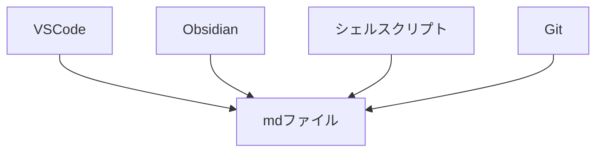

# このチャプターについて

このチャプターでは、Obsidian を利用する上での重要な考え方やいくつかのコンセプトについて解説しておきます。

# エイリアス

Obsidian の重要なコンセプトの１つが「エイリアス」です。ノートに対してファイル名とは別に名前を複数個つけることができます。具体的には以下のように YAML フロントマターの `aliase` や `aliases` キーの値としてノートに対する別名を付けます。

例えば、`MOC とは.md` というファイルがあったとして、そのフロントマターにエイリアスを以下のように設定したとします。

```md:MOCとは
---
aliases: 
  - MOC
  - Map of contents
  - 構造ノート
---
```

このときこのファイルはそのファイル名とは別にエイリアスで検索したり、参照することができるようになります。

ウィキリンクでノートの呼び出しができましたが、このときエイリアスで検索したとしても

# アトミックノート

PKM では知識 (とそれに基づくノート) をアトミックに、つまり可能な限り小さくして分割して管理が非常に重要です。

知識管理においての重要であることもちろんですが、これは Obsidian においても実用上かなり重要な話であり、知識は可能な限り小さく分割してノートの呼び出しやリンクで扱いやすいようにしておくことに繋がります。

例えば、ECMAScript の仕様を読んで解析する際にはこの手法が非常に役立ちます。

ECMAScript では抽象操作 (Abstract operation) と呼ばれる仕様内部で利用される操作名が大量にありますが、これらを１つのノートに記載するのはもちろん不可能ですし、かなり不便なことになります。

そのような場合には自分が読み込んだ抽象操作を１つずつノートにしていき、それをインデックス化するような大きな枠組みとなるノートでリンクさせておくことで情報の粒度を制御することができます。

具体的には ECMAScript の仕様には Promise の抽象操作が記載された [Promise Abstract Operations](https://tc39.es/ecma262/#sec-promise-abstract-operations) という項目があります。この項目にはいくつかの抽象操作が記載されていますが、それぞれの操作名でノートを作成しておくことで、呼び出しや参照が簡単になります。

実際の Promise Abstraction Operation のノートが以下のリンクで公開しているものです。

https://publish.obsidian.md/ankiyorihajimeyo/TSJS/ECMAScript+Promise+Abstract+Operation

以下の図のように抽象度の高い情報はインデックスノートにしてそれぞれの粒度の小さいノートを埋め込みなどで参照できるようしておきます。


他の例を挙げると、Git などの操作コマンドは大量にありますが、Git 自体は抽象度が高く、様々なカテゴリの情報を含むの概念なので、そういったものに対してはインデックスとなるようなノートをその概念の名前のファイルで作成しておき、そこに関連ノートをインデックス化しておきます。

https://publish.obsidian.md/ankiyorihajimeyo/MOC/Git+MOC

こうすることで、他のノートからの呼び出しを抽象化し１つのインターフェースとしてまとめあげることが可能となります。筆者の場合はこのようなノートに対して `Git MOC.md` のように「概念名 +MOC」と名付けを行っています。もちろん、呼び出し時には概念名で行いたいので上で紹介したエイリアスをつかって `git` という別名を付けて呼び出します。

# データとアプリケーションの分離

Obsidian はローカルのプレーンテキストファイルをベースにしたアプリケーションです。

それぞれのノート (メモ) はマークダウン形式のプレーンテキストファイルとして PC 内のローカルデータとして保存されています。

従って、ファイルシステム上のファイルであることの恩恵をそのまま受けることができます。つまり、コマンドラインから触れたり、別のアプリケーションで開くことができます。つまり、git やコードエディタ、シェルスクリプトなどの様々なソフトウェアやプログラムの対象にすることができます。

コードエディタという観点ではもちろん Obsidian は VSCode に勝つことはできません。それは PKM とプログラミングというように扱っているドメイン自体が異なるから当たり前の話です。Obsidian は VSCode と競っている訳ではないので、複雑なコード編集やテキスト処理がしたいときにはそちらが得意な VSCode 側でファイルを開いてそちら側に制御を移して編集するようにすればいいわけです。

両者で共通しているのはマークダウンファイルを扱えるという点であり、ローカルのプレーンテキストファイルというデータに対してエディタを用途ごとに切り替えればよいということになります。

このように Obsidian ではこれまでのナレッジベースツールとは異なり、データとアプリケーションが明確に分離されているため、別のアプリケーションでデータを触ることが可能になっています。



データはローカルのプレーンテキストファイルに保存されていることによって、ベンダーロックインとならないようにデザインされていることも重要です。Obsidian がいつの日かなくなったしてもローカルのプレーンテキストファイルとしてデータが残りつづけるため、別のツールを使って再度ナレッジベースとして運用することが可能です。

このようなやり方でも開発ができるのは開発力に自信があるからだと考えています。実際、開発チームは VC を調達せずに、独自の開発支援の仕組みづくりやサブスクリプション形式のアドオンサービスを展開しており、開発のスタイルを貫いています。

# VSCode との連携

Obsidian でメモを取ったり、Zenn の記事を作成したりするのに、VSCode を全く利用しないのかといったらそれは違います。

上で説明したとおり、Obsidian ではローカルのプレーンテキストファイルという形でデータとアプリケーションが分離されているため、状況によって Obsidian から VSCode でファイルを開くようにしたり、逆に VSCode 側から Obsidian で開く場合もあります。

## VSCode を使う利点

具体的な状況としては、記事内のコードスニペットなどを編集したり正規表現での置換や Textlint などの外部ツールを利用したい場合に VSCode 側に移行します。特にコードスニペットについては少し大きめのコードとなると、インデントを整理しやすかったり、コード補完などの編集機能が強い VSCode で編集を行う方が便利です。

あるいは Obsidian と VSCode で同じファイルを同時に開きながらコードを見つつ記事を執筆するなどを行うこともあります。


Obsidian 側で必要なメモを開き、コードスニペットは VSCode で集中して書けるようにしているわけです。

また、Obsidian では基本的に保管庫内のノートファイルしか開くことができませんが、VSCode なら同一のウィンドウに保管庫外のファイルやディレクトリを開いておけるのでコードのテストなどをしながら書きたい場合には非常に便利です。

VSCode で開くときは以下の拡張機能で Zenn の記事としてのプレビューも確認することができます。

https://marketplace.visualstudio.com/items?itemName=negokaz.zenn-editor

## 相互移動の簡便化

Obsidian には「デフォルトアプリで開く」というコマンドが存在しているので、例えば `Cmd+D` というようなホットキーを設定画面から設定しておくことで、マークダウンファイルのデフォルトアプリを VSCode にしておけば一瞬でノートを VSCode で開くようにできます。


VSCode 側からは以下のプラグインを使ってノートファイルを保管庫で開くことができます。

https://marketplace.visualstudio.com/items?itemName=HenryHeDiff.obsidian-code

これについても VSCode 側からキーボードショートカットキーを同じ `Cmd+D` に設定しておきます。


これで同じファイルでの Obsidian ↔ VSCode の行き来が簡単になりました。

:::message alert
**注意点**

Obsidian ではノートはデフォルトで自動保存されますが、VSCode ではデフォルトで自動保存されないので注意してください。筆者は衝突しないように VSCode では `Cmd+S` キーで手動保存を行っています。
:::
