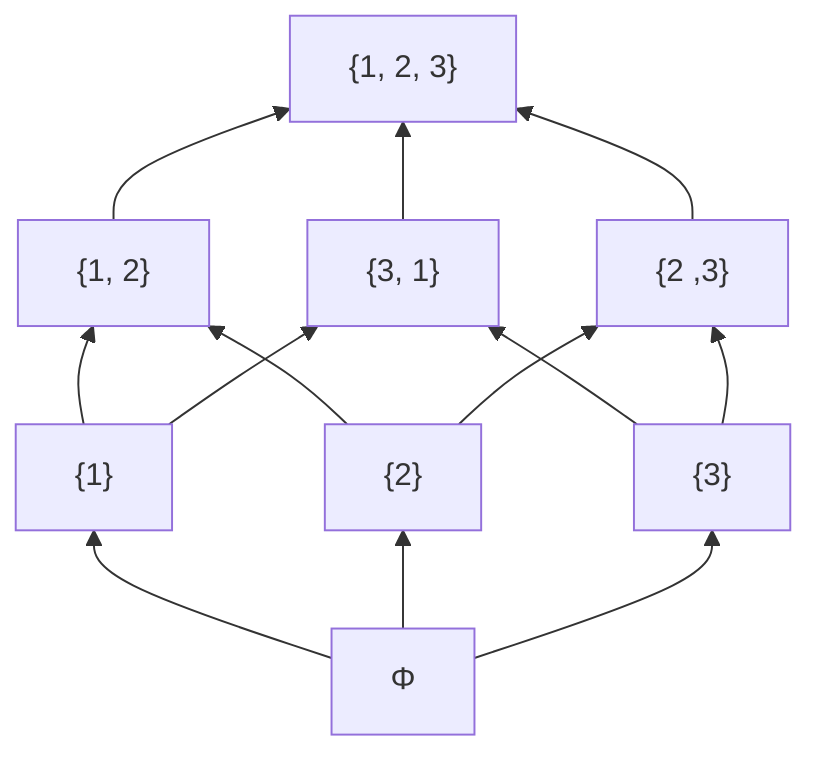
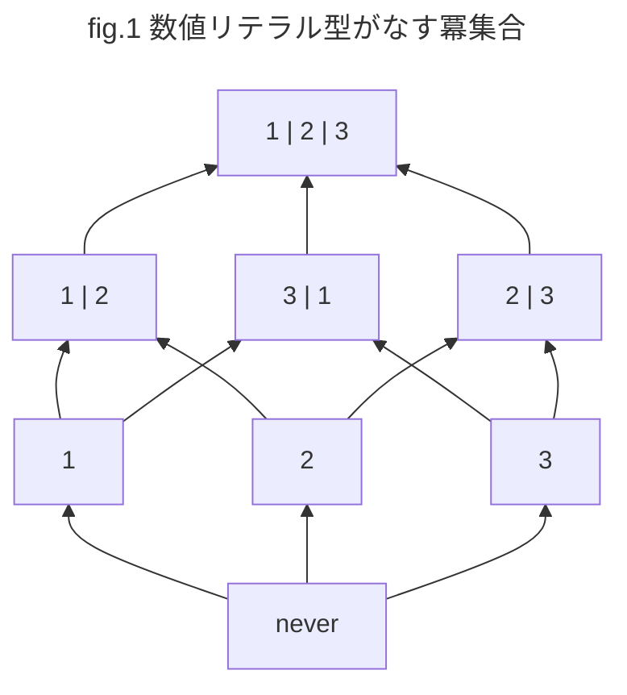
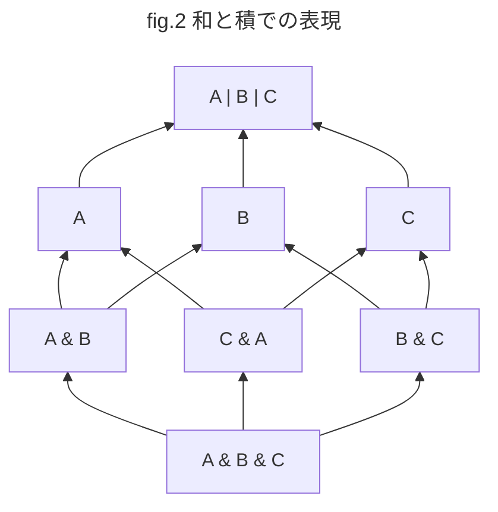
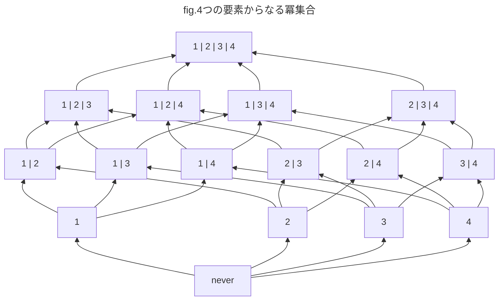
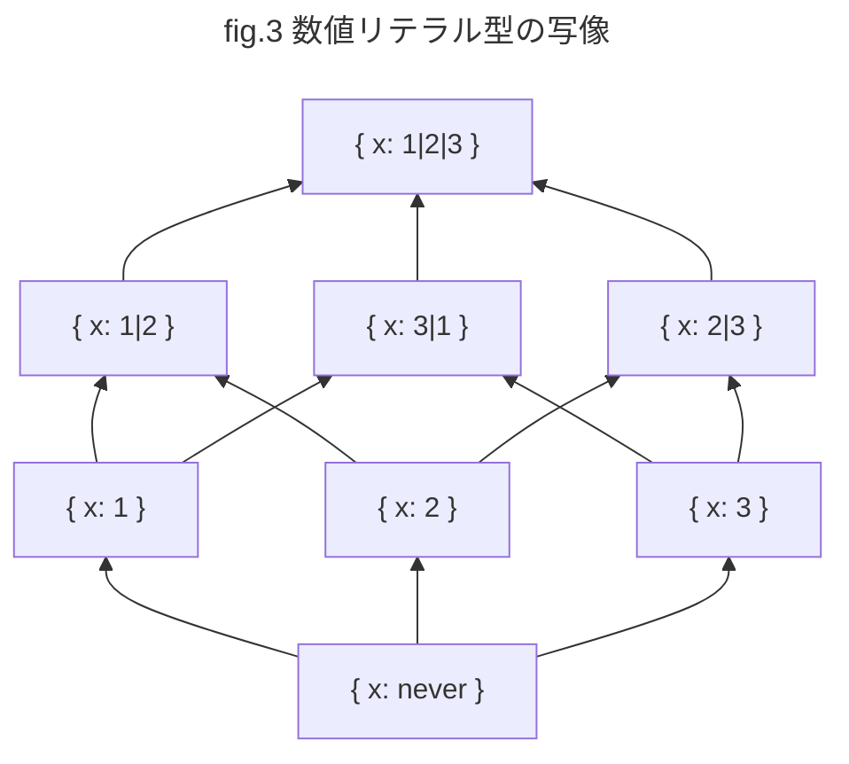
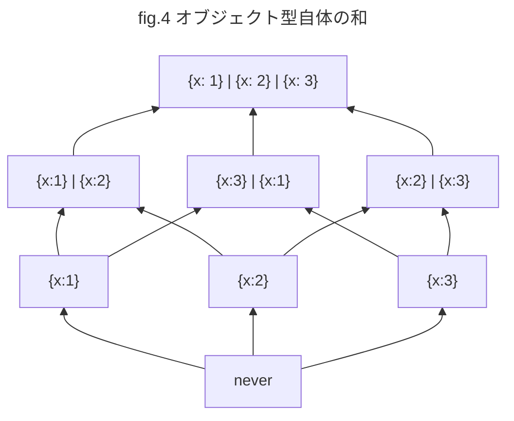
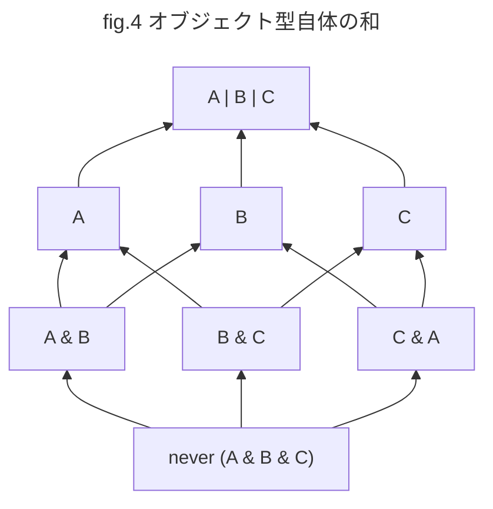
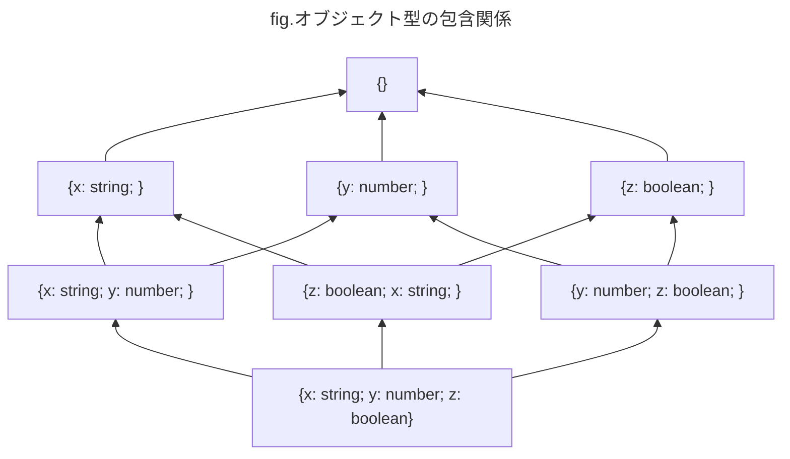
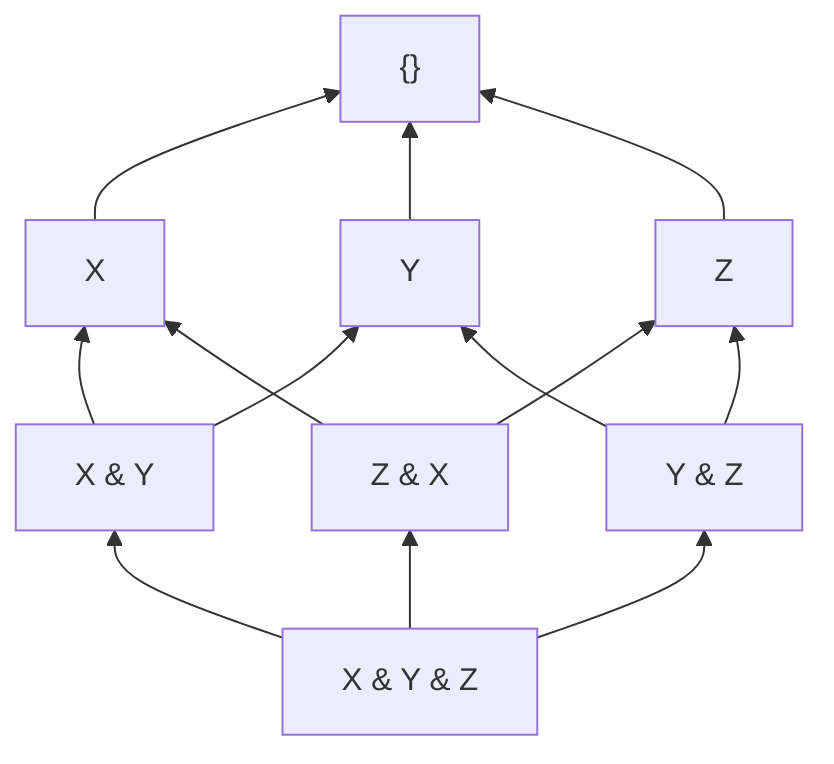
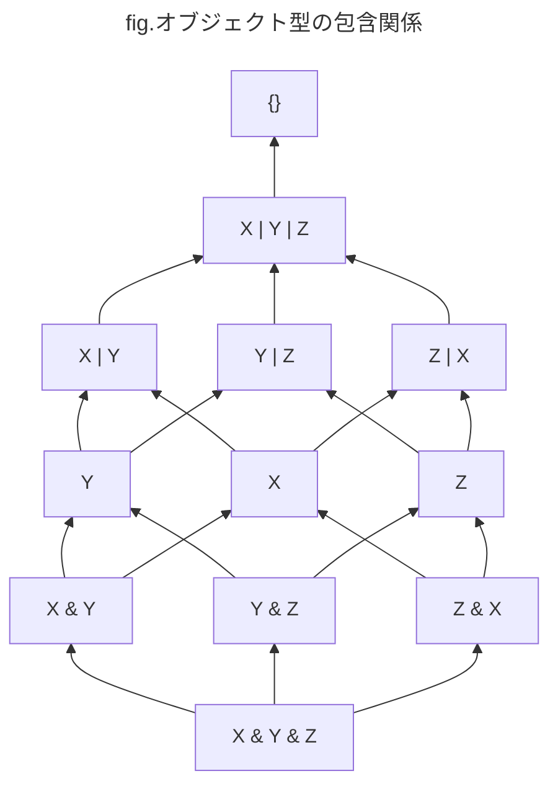

## 冪集合としての構造

ここからが型の代数的構造についての説明となります。これまで半順序 (partial order) にこだわっていたのは、半順序を使うことで型の集合がいくつかの付加的な構造を持つものとしてみなすことができ、様々な名前を持つ概念が利用できるようになるからです。半順序が役に立つのは主に次の束論のところですが、まずは集合論から行きましょう。

さて、商集合 $\text{TYPES}$ について考えますが、関数型について除いた部分集合 $\text{TYPES'}$ を考えることにしましょう (もちろん再帰型についても除きます)。なぜかと言えば、関数型はこれから話す集合論的なモデルの都合上うまく解釈ができないからです。

:::message
関数型 (関数値) を対象として含めた部分型について、よりうまく集合論的に考えることができる「意味論的部分型 (semantic subtyping)」という型システムの分野があります。
:::

型が厳密には集合ではないことを考慮しても、そもそも型の集まりについて集合論的に扱えるかどうかは一般的に言えることではありません。

一方で、TypeScript は公式ドキュメントの「[Types as Sets](https://www.typescriptlang.org/docs/handbook/typescript-in-5-minutes-oop.html#types-as-sets)」にも記載してあるとおり、かなり集合論的に扱えるようにデザインされています。ということで、直感的な集合論で型についてのメンタルモデルを構築することに大きな問題はありません。集合論で扱えきれない部分については後述する圏論などを使って補います。

集合論的に扱えるとは、例えば、ユニオン型やインターセクション型が集合の演算としての和集合や交差などに相当する概念として使えることや、リテラル型とプリミティブ型の関係や、空集合や全体集合に相当する `never` 型や `unknown` 型が存在しているということです。

型の演算として否定もあればさらに、より集合に近づくこともありまえますね。
https://github.com/microsoft/TypeScript/issues/4196

さて、型の集合はいったいどんな集合であるかと言えば、そもそもリテラル型がプリミティブ型の部分型であり、プリミティブ型がトップ型 (`unknown`) の部分型であったように、それぞれの型を集合として解釈して、さらに部分型関係を集合の「包含関係 (inclusion)」として解釈できます。

:::message alert
部分型関係は厳密には包含関係ではなく、「型 $S$ が型 $T$ の部分型であるとき ($S <: T$ と表記する)、$T$ 型の値が期待される場所で安全に型 $S$ の値を使用できる」というような型の(順序)関係です。関数型になるとそのような関係についての本質的な理解が必要となり、変性の概念と相まってシンプルな包含関係で捉えきれなくなります。
:::

つまり、型 $S$ と $T$ の間に部分型関係 $S <: T$ があったときにはそれぞれが対応する集合として $S \subseteq T$ ($S$ が $T$ の部分集合である) が成り立ちます。ここでは更に二つの型が同値 (equivalent) であるならば、同じ集合であるとしましょう。具体的には以下の図のように集合の包含関係が部分型関係に対応するようにして $S \subseteq T\ \Leftrightarrow S <: T$ と考えます。


このように考えると型の集合 $\text{TYPES'}$ は「**冪集合** (power set)」と呼ばれる構造になります。冪集合は集合の部分集合をかき集めて作った集合です。冪集合のような集合が要素であるような集まりを一般には「集合族 (family of sets)」とよびます。例えば集合 $A = \lbrace 1, 2, 3 \rbrace$ の冪集合は以下のようにハッセ図で表現できます。



冪集合は集合の包含関係を半順序関係とする半順序集合を作ることが知られています。つまり上記の冪集合は矢印の方向に対して $a \subseteq b$ (例えば $\lbrace 1 \rbrace \subseteq \lbrace 1, 2 \rbrace$)のような関係があり、これは半順序関係となります。

$$
\begin{aligned}
&\text{reflexive:} && a \subseteq a \\
&\text{antisymmetric:} && a \subseteq b \land b \subseteq a \Rightarrow a = b \\
&\text{transitive:} && a \subseteq b \land b \subseteq c \Rightarrow a \subseteq c
\end{aligned}
$$

集合 $A$ の冪集合は $P(A)$ や $2^A$ とも表現されます。集合の要素を考える上で要素ごとにそれを集合に含めるか含めないの2通りがあるため、冪集合の要素の個数(部分集合の個数)は2を元の集合の個数でべき乗した値となります。つまり、上記の集合 $A$ なら要素の個数は3個なので、$2^3 = 8$ 個の要素を持つことになります。なおすべての要素を含めない場合(空集合)も要素として数えていることに注意してください。ベン図で表現すると以下のようになります。


実際、`number`型が数値リテラル型から作成できる型を要素とした冪集合として考えることもできます。例えば３つのリテラル型の集合 $A = \lbrace 1, 2, 3 \rbrace$ についての冪集合を考えるとき、上記の冪集合のハッセ図以下のように表現できます。空集合が `never` 型に相当していることに注意してください。



この型の冪集合においては、包含関係が部分型関係と一致しています。実際に、部分型関係を調べれば包含関係と一致していることがわかります。

```ts
type T0 = never;
type T1 = 1;
type T2 = 2;
type T3 = 3;
type T12 = 1 | 2;
type T31 = 3 | 1;
type T23 = 2 | 3;
type T123 = 1 | 2 | 3;

type R_0_1 = Relation<T0, T1>;
// => Subtype (T0 <: T1 => T0 ⊆ T1)
type R_31_2 = Relation<T31,T2>;
// => Unrelated
type R_3_23 = Relation<T3, T23>;
// => Subtype (T3 <: T23 => T3 ⊆ T23)
type R_12_123 = Relation<T12, T123>;
// => Subtype (T12 <: T123 => T12 ⊆ T123)
```

ちなみに `1 | 2` 型と `3 | 1` 型の共通部分をインターセクション型で生成すると両方の型の共通部分である `1` 型となります。分かりやすく `1 | 2` 型を `A`、`3 | 1` 型を `B` とおいてインターセクション型を使って関係を表現すると以下のようになります。この場合 `A | B` 型などは `1 | 2 | 3` となり `A | B | C` と一致しています。



ここからさらにもう一つ数値リテラル型を加えた冪集合はかなり複雑になります。このようにボトムアップに要素を追加してくことでほぼ無限に冪集合を構築できます。



数値リテラル型だけでなく、オブジェクト型についても考えてみましょう。まずは、上記の数値リテラル型の冪集合ついてそのまま単一のプロパティを持つオブジェクトの型に写像した型を考えます(型の写像については圏論での型構築子に箇所ででてきます)。つまり、プロパティとその型の組からなるオブジェクト型を要素とした以下のような集合族をつくります。



このハッセ図は実際の部分型関係を表現できています。ただし、ユニオンとインターセクションについて考えるときには注意が必要です。上記のようにプロパティの型単体について考えるときは数値リテラル型と同じ対応になりますが、オブジェクト型そのもののユニオンとインターセクションはまた別物となります。



これも積で表現しなおすことができますね。それぞれの和を新しい型 `A, B, C` で置くと以下のようになります。この場合には `A | B = B | C = C | A = A | B | C` です。また、`A & B & C = never` となります。



なお、以下ののようにオブジェクト型のユニオンやインターセクションは同一ではなく同値となる型がいくつかあるので注意してください。

```ts
type A = { x: 1 };
type B = { x: 2 };
type A_B = { x: 1 | 2 };
type AB = A | B;
type R = Relation<A_B, AB>;
// => Equivalent (同一ではないが同値となる)

type C = { x: string; };
type D = { y: number; };
type C_D = { x: string; y: number; };
type CD = C & D;
type R = Relation<C_D, CD>;
// => Equivalent (同一ではないが同値となる)
```

さて、ここまでは空集合に相当する `never` 型から要素を直接列挙して型を上方向(上位型の方向)に構築することで冪集合を考えていきました。`never` 型はボトム型であり、つまりこれは部分型関係の一番低い位置である底から文字通りボトムアップにみてきました。

逆に部分型関係の高い位置からトップダウンに型の集合を見てみましょう。例えば、オブジェクト型全体の集合内において最も広い集合、あるいは部分型関係の最も高い位置にある型は `{}` という型になります。空集合となる `never` 型からではなく、高い位置にある `{}` から型の包含関係について考えていきます。

なお、トップダウンに考えるといっても、とても大きな集合族についてその全体から次に小さな部分集合を考えるなどようなことはすこしイメージしずらく、図で表現することも困難なので次に部分型関係で低い位置にある型として `{ x: string }` のようなある程度の抽象的な型を列挙して包含関係を考えてみましょう。

また、オブジェクト型の場合にはより情報量の多い(制約が多い)型が部分型になるため、数理リテラル型とは方向が配置が逆転していることに注意してください。制約が無い集合がより詳細な制約を持つ集合を包含すると考えれば実は数理リテラル型のときと同じ話になり、ハッセ図がまったく同じように表現されます。ただし、これは冪集合を表現しているわけではないことに注意してください。



というのも、ボトムアップに作成した場合とは異なり、この図は集合族の要素をすべて表現しきれていません。ただし、底である `never` から上方向に無限に型を構築できたように、`{}` から下方向に無限に型を構築することが可能です。

上記の３つの型を `X, Y, Z` と置き換えて、更に共通部分の集合演算に相当するインターセクション型の型構築子(`&`)を使って表現するようにします。

```ts
type X = { x: string; };
type Y = { y: number; };
type Z = { z: boolean; };
```



実はこの図ではインターセクションとユニオンが表現しきれていません。`{ x: string }` を `X` のように置き直して、それぞれの和と積も考慮して書き直すと以下のようになります。



これまで2つの型の和と3つ型の和が同一になったり、2つの型の積と３つの型の積が同一になる場合がありましたが、このような場合にはすべての型のインターセクションとユニオンが相異なるため、きれいにすべての型の合成が表現されていることがわかります。

今回はトップダウンに見ているので直接的に冪集合は考えづらいですが、この集合の包含関係をベン図で表現すると以下のようになり、非常にイメージしやすい関係となります。


