## 束論の導入

集合論による冪集合はボトムアップに見たりしないと結構扱いづらい概念なので、トップダウンからもボトムアップからも同じように構造を把握することができる半束(semilattice)と、上下方向を統一して構造全体を見ることができる束(lattice)の概念を導入して、束論からのメンタルモデルを構築します。

まず、TypeScript の基本的な型の部分型関係は以下のような配置関係になっています。これまで考えてきた同値類を導入した型の商集合 $\text{TYPES'}$ の部分型関係は半順序関係であり、以下はハッセ図で表現されたものとなります。

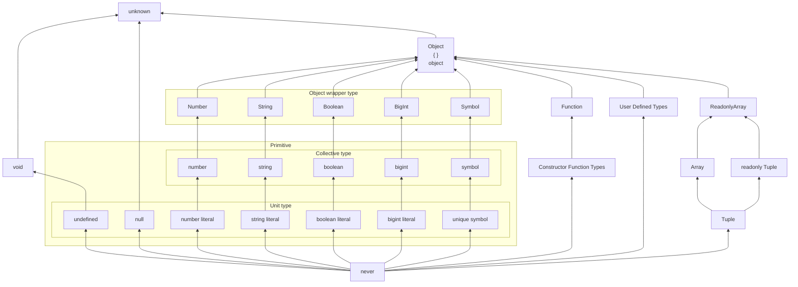

部分型関係による順序関係 $A <: B$ について $A$ を下位、$B$ を上位として位置づけすることで、このような構造は階層構造(hierarchy structure)とみなすことができますね。

階層構造は上下関係を持つような構造を表す観念ではありますが、厳密な定義がないのであまり使えません。例えば木構造([tree structure](https://en.wikipedia.org/wiki/Tree_(graph_theory)))は階層構造を表す一つのグラフ構造ですが、以下のように木構造の各ノードは常に単一の親ノードを持つ構造であり、`never`型の箇所で見れるような複数の親を持つ構造ではありません。

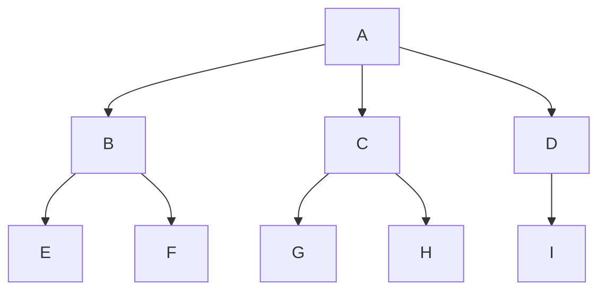

型の集合は一見すると木構造に見えますが、前の章で数値リテラル型が作る冪集合が木構造ではなかったようにTypeScriptの型がなす集合は木構造ではありません。このような構造にはより適切な概念名があります。それが「束(そく)」とよばれる構造です。

## 前提となる順序の諸概念

束論の詳細に入る前に準備として半順序集合におけるいくつかの概念を導入しておきましょう。ただし、半順序をそのまま扱うよりもわかりやすい全順序でまずは考えてみます。

### 最大元と最小元

全順序集合は分岐がないことから鎖(chain)とも呼ばれ、例えば台集合 $A = \lbrace 1, 2, 3, 4, 5 \rbrace$ の全順序集合 $(A, \le)$ は以下のようなわかりやすい構造を持っていました。

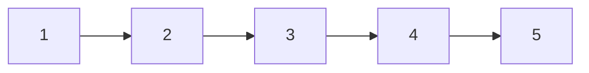

さてここで新しい概念を導入します。半順序集合における「**最大元**(greatest element)」とは集合 $P$ 内のすべての要素の中で最大のものであり、「**最小元**(lowest element)」とは集合 $P$ 内のすべての要素の中で最小のものを指します。全順序集合では最大値と最小値と言い換えてもいいでしょう。上図では、`1`が最小元であり、`5`が最大元です。

より厳密に定義すると $x \in P$ が最大元であるとは、$\forall y \in P, x \le y$ となることを意味します。つまり、$x$ は集合内のすべての要素よりも大きな要素となります。逆に、$x \in P$ が最小元であるとは $\forall y \in P, y \le x$ となることを意味します。つまり、$x$ は集合内のすべての要素よりも小さな要素となります。

:::message
最大元と最小元のように互いに対になっている対象の関係を「双対 (dual)」であると言います。最大元と最小元は互いに双対概念であり、片方で成り立つ事柄についてもう片方でも成り立ちます。
:::

さて、全順序集合では最小元と最大元は鎖の両端点なので非常にわかりやすいですね。半順序集合ではどうでしょうか。順序理論の章で見た以下のハッセ図は半順序集合を表現していました。この半順序集合において最大元と最小元を考えてみてください。

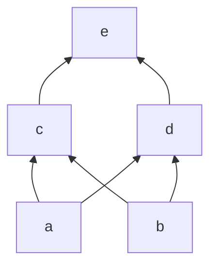

この半順序集合において最大元が $e$ となることはわかりやすいですね。半順序関係には推移律がありますが、ハッセ図はその推移性を表現できるため、矢印をたどれば比較可能な要素がわかります。$e$ に対して入ってくる矢印をたどればすべての要素と比較可能であることが分かり、自分自身を含めて集合内の任意の要素 $\alpha$ について $\alpha \le e$ が成り立ちます。つまり、すべての要素より大きく、最大元の定義を満たします。

一方で、最小元ですが、定義から $\forall y \in P, y \le x$ となる $x \in P$ を見つける必要があります。直感的には $a$ と $b$ がハッセ図の最下層にあるのでその両方が最小元になりそうですが、実はこの半順序集合には最小元は存在しません。

なぜなら、$a, b$ の両方が最小元になってしまうと、すべての要素よりも小さいという最小元の定義そのものに反してしまうからです。構造を見る限り $a$ と $b$ の間には順序関係は存在せず互いに比較不能であることが明らかです。つまり、$a \le b$ も $b \le a$ も言えません。したがって、すべての要素よりも小さい要素である最小元は存在しません。

同じように、上記の半順序集合に追加の要素 $f$ を追加して以下のような半順序集合をつくった場合には最大元も存在しないということなります。

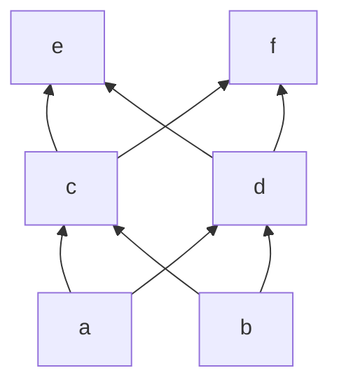

つまり、最小元も最小元も持つような半順序集合の構造は以下のように最も上位と下位の位置であらゆる関係が結ばれたような構造になります。以下の構造で $e$ は最大元となり、$a$ は最小元となります。

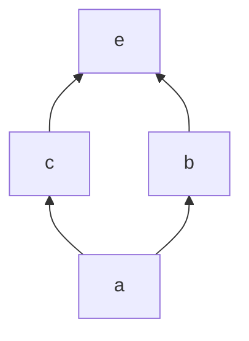

このように最大元と最小元は存在する場合には必ず一つに定まります。二つ以上となることはありえません。

## 上界と下界

ここから更に上界と下界('かかい')の概念を導入します。

半順序集合 $(P, \le)$ の要素 $x$ が $P$ の部分集合 $A$ の「上界 (upper bound)」であるとは集合 $A$ の元がすべて $x$ 以下であることを意味します。厳密には以下のように定義します。

$$
x \in P, \forall y \in A, y \le x
$$

更にその双対として、半順序集合 $(P, \le)$ の要素 $x$ が $P$ の部分集合 $A$ の「下界 (lower bound)」であるとは集合 $A$ の元がすべて $x$ 以上であることを意味します。厳密には以下のように定義します。

$$
x \in P, \forall y \in A, x \le y
$$

例の如く、最初は全順序集合で考えます。台集合 $P = \lbrace 1, 2, 3, 4, 5 \rbrace$ の全順序集合 $(P, \le)$ について、台集合 $P$ の部分集合を $A = \lbrace 2, 3, 4 \rbrace$ とします。

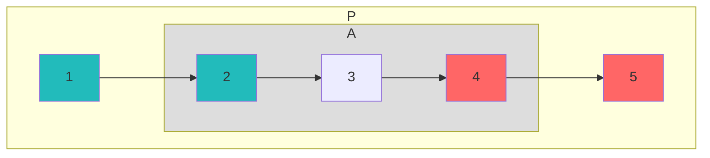

この場合、$5$ が集合 $A$ について上界となることがその定義から明らかですが 、$A$ のすべての元よりも大きければいいということは $A$ 自身の要素である $4$ も反射律によって $4 \le 4$ となることから上界と言えます。さらに、下界は上界と双対なので同じ議論ができ、$1$ と $2$ が集合 $A$ の下界となります。このように上界や下界は複数個ありえます。

台集合 $P$ の範囲を少し拡大した集合 $P' = \lbrace 0, 1, 2, 3, 4, 5, 6 \rbrace$ とその部分集合 $A$ について考える場合には、集合 $A$ の上界は $4, 5, 6$ となり、下界は $2, 1, 0$ となります。

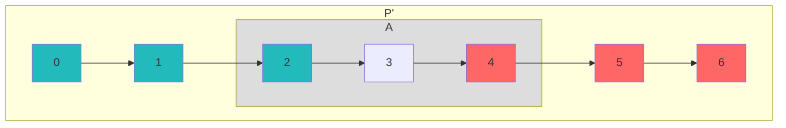

集合 $A$ の上界の中で $A$ に属するものがあればそれは $A$ の最大元となります。同様に $A$ の下界の中で $A$ に属するものがあればそれは $A$ の最小元となります。上図では $4$ が $A$ の最大元であり、$2$ 最小元となります。

全順序集合での例は分かったので典型的な半順序集合で考えてみます。以下のような台集合 $P$ とその部分集合 $A$ がある時、$A$ の上界と下界は何になるでしょうか。

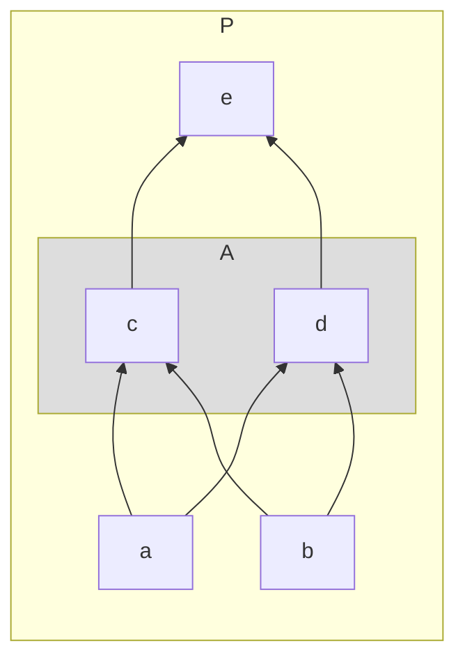

$c, d$ は比較不能なので部分集合 $A$ には最大元も最小元もありません。したがって、集合 $A$ 内に上界や下界になる要素はありません。上界は部分集合 $A$ のすべての要素より大きい必要がありますが、そのような要素は唯一つであり要素 $e$ が上界となります。同様に下界は部分集合 $A$ のすべての要素より小さい必要がありますが、そのような要素は二つ存在し、$a, b$ が下界となります。したがって、上界と下界を色付けした図式は以下のようになります。

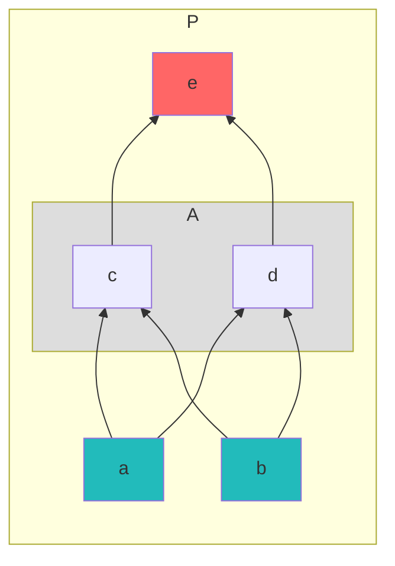

部分集合の作り方はどのようにしても良いので、もう一つの例として台集合 $P$ はそのままで部分集合 $B = \lbrace a, c \rbrace$ の上界と下界を図示しておくと以下のようになります。上界は $c, e$ の二つで、下界は $a$ の一つのみです。

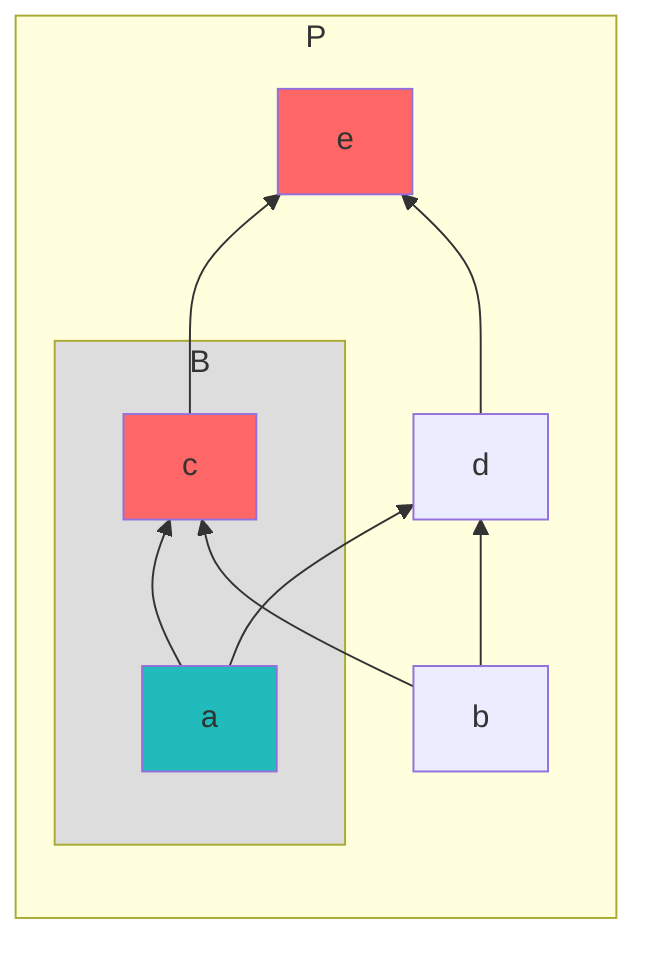

### 極大元と極小元

上界と下界の少し難しい例としては以下のような半順序集合 $K$ が考えられます。部分集合 $A$ の要素 $c, d$ が比較不能であり、さらに集合 $K$ には最小元が存在しません。この場合 $e$ が上界なのはそのままですが、集合 $K$ に下界は存在しません。

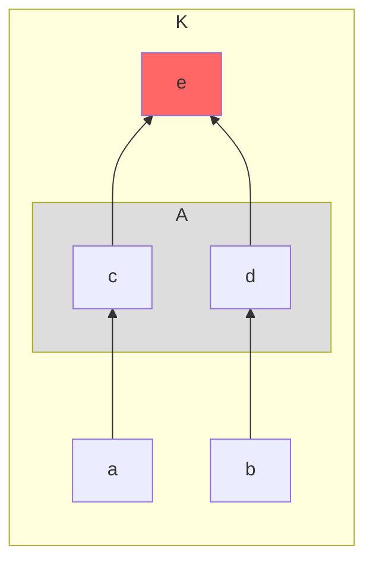

なぜなら、下界というのは部分集合 $A$ のすべての要素に対して小さい要素である必要があり、まず前提として比較可能でなければいけません。上記のハッセ図では $a$ は $d$ と比較不能であり、$b$ は $c$ と比較不能です。したがって、集合 $A$ のすべての要素よりも小さい要素は存在しません。ということで下界は存在しない、ということになります。

こういう場合であっても $a$ と $b$ のような要素について言及したいことがありますが、台集合 $K$ においてその要素よりも小さい要素が存在しないような要素のことを「極小元(minimal element)」と呼びます。集合 $K$ の場合にはまさに $a$ と $b$ が極小元に当たり、この二つについてそれぞれ集合 $K$ 内にそれよりも小さい要素は存在しません。厳密に表現すると要素 $x \in P$ が極小元であるとは以下の条件を満たす要素 $x$ です。

$$
\neg \exists y \in P, y \lt x
$$

:::message
$\neg$ は否定(negation)を表す論理記号であり、$\exists$ は存在(existence)を表す論理記号です。
:::

上記の式では「$y < x$ となるような要素 $y$ が集合内 $P$ に存在しない」ということを表現しています。最小元は「集合 $P$ 内のあらゆる要素 $y$ について $x \le y$ となる要素 $x \in P$」というものだったので、最小元はそもそもあらゆる要素と比較可能であることが前提条件となっていましたが、上記のハッセ図のようにそもそも比較不能なものがあった場合でも最小という概念を考えることできるようにしたものが極小元です。最小限はあきらかに極小元なので、極小元は条件を緩めた最小元であると捉えるといいかもしれません。

極小元の双対概念は「極大元(maximum element)」です。極大元は集合 $P$ においてその要素よりも大きい要素が存在しないような要素のことであり、厳密に表現すると要素 $x \in P$ が極大元であるとは以下の条件を満たす要素 $x$ です。

$$
\neg \exists y \in P, x \lt y
$$

上記の式では「$x \lt y$ となるような要素 $y$ が集合内 $P$ に存在しない」ということを表現しています。最大元はそもそもあらゆる要素と比較可能であることが前提条件となっていましたが、そもそも比較不能なものがあった場合でも最大という概念を考えることできるようにしたものが極大元です。最大限はあきらかに極大元なので、極大元は条件を緩めた最大元であると捉えるといいかもしれません。上記ハッセ図では要素 $e$ は集合 $K$ の極大元であると同時に最大元であるとも言えるわけです。

最小元も最大元も存在ぜず、上界も下界も存在しないが、極小元と極小元が両方存在するような半順序集合は例えば以下のようなものが考えられます。

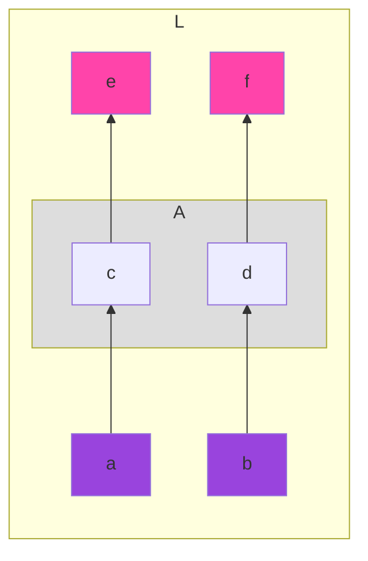

このような半順序集合は鎖(全順序集合)が二本あると考えると分かりやすいでしょう。実際、ハッセ図で表現される半順序集合は極小元から極大元までの矢印のルートを作る部分集合を抜き出せば鎖になります。

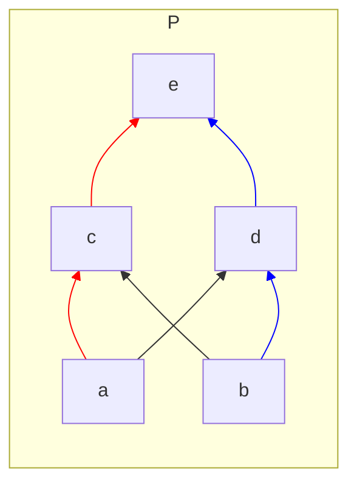

例えば上記の赤色のルートの部分集合 $\lbrace a, c, e \rbrace$ の要素はすべて比較可能であり完全律を満たすので全順序集合となります。どのようなルートを抜き出しても同じことになるため、半順序集合は複数の鎖(ルート)から成る集合であるとみなせます。

### 最小上界と最大下界

極大元と極小元の話は少し余談になりましたが、上界と下界がわかったところで重要な概念である最小上界と最大下界について取り扱います。これまでの議論が理解できていれば実は簡単で、上界と下界は存在すれば一つ以上ありえますが、最大元と最小元が複数個存在し得なかったように最小上界と最大下界は存在しても一つしかありえません。

「最小上界(**LUB**: least upper bound)」とは複数個ありえる上界の集合の中での最小元であり、台集合 $P$ の半順序集合 $(P, \le)$ の要素 $x$ が最小上界であるとは、集合 $P$ の部分集合 $A$ のすべての要素が $x$ よりも小さいということを意味し、厳密には最小上界は以下の条件を満たす要素 $x \in P$ です。

$$
\forall y \in A, y \le x
$$

最小上界の双対概念である「最大下界(**GLB**: greatest lower bound)」とは複数個ありえる下界の集合の中での最大元であり、台集合 $P$ の半順序集合 $(P, \le)$ の要素 $x$ が最大下界であるとは、集合 $P$ の部分集合 $A$ のすべての要素が $x$ よりも大きいということを意味し、厳密には最大下界は以下の条件を満たす要素 $x \in P$ です。

$$
\forall y \in A, x \le y
$$

具体的な例として、上界と下界を持つ以下のような典型的な半順序集合 $P$ とその部分集合 $A$ を考えます。上界の集合は $\lbrace e \rbrace$ であり、その最小元は $e$ です。なお要素が一つしかない集合の最小元や最大元はその要素自体になります。最小元や最小元になることは反射律($e \le e$)を使えば分かります。従って集合 $P$ の最小上界は $e$ となります。

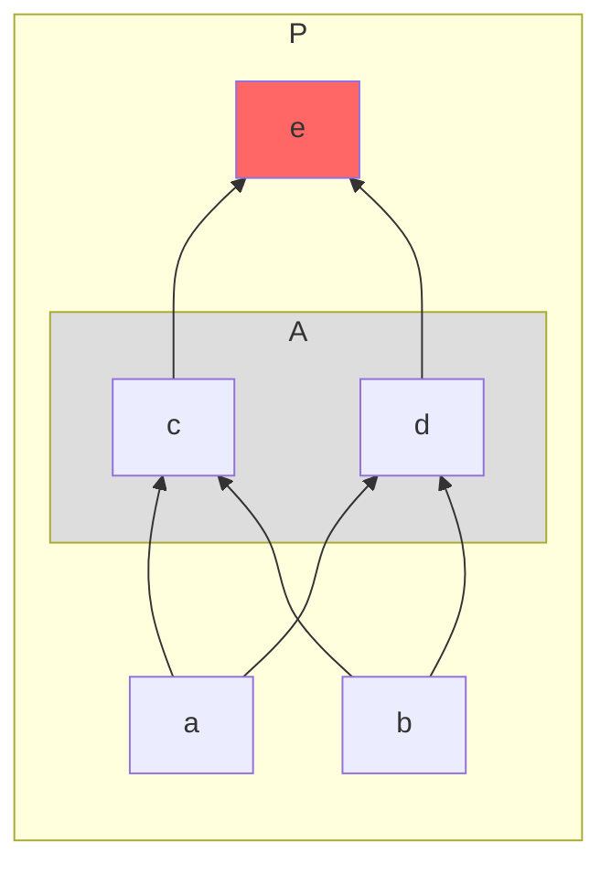

この半順序集合 $P$ の下界の集合は $\lbrace a, b \rbrace$ ですが、$a, b$ は互いに比較不能であるためこの集合 $\lbrace a, b \rbrace$ には最大元も最小元も存在しません。下界の集合に最大元が存在しないことから半順序集合 $P$ の部分集合 $A$ についての最大下界は存在しません。

それでは $f \le a \land f \le b$ となる要素 $f$ を集合 $P$ に追加した以下のような新しい半順序集合 $P'$ はどうでしょうか。

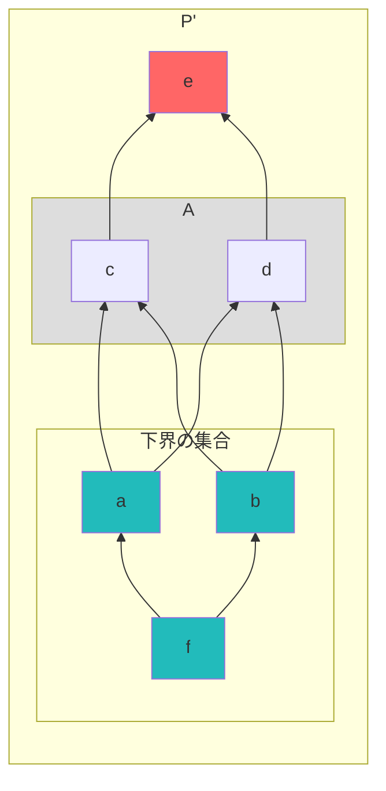

集合 $P'$ の部分集合 $A$ についての下界の集合は $\lbrace a, b, f \rbrace$ ですが、$a, b$ が比較不能であることからこの集合には最大元はありません。したがって、最大下界はやはり存在しないことになります。

最大下界を作ろうと思ったら下界の集合で極大元となるものが上記のような比較不能な二つではなく、部分集合 $A$ の任意の要素について比較可能かつ下界の集合の中で唯一の極大元となるものがあればよいことになります。つまり、以下のようは半順序集合となれば最大下界が存在することになります。

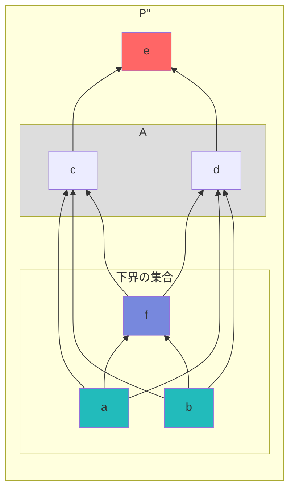

部分集合 $A$ の下界の集合の極大元が一つとなる、つまり最大元が存在するような場合にその最大元が最大下界となります。上記の図では $f$ が最大下界となっています。このとき $a \le f$ と $b \le f$ の関係が重要であり、これらの関係がなくなると $f$ について比較不能な場所がでてくるので、そのような場合には最大下界が存在しないことになります。

ただし、『[順序理論による模型](5-tam-order-theoretic-model)』の章のハッセ図のところで説明した通り、この図は $a \le f \le c$ のように $a$ と $c$ の間に中間点 $f$ があるのに $a$ と $c$ を直接的に線分で結んでおり、ハッセ図としては正しくありません。正しいハッセ図に修正すると以下のようになります。

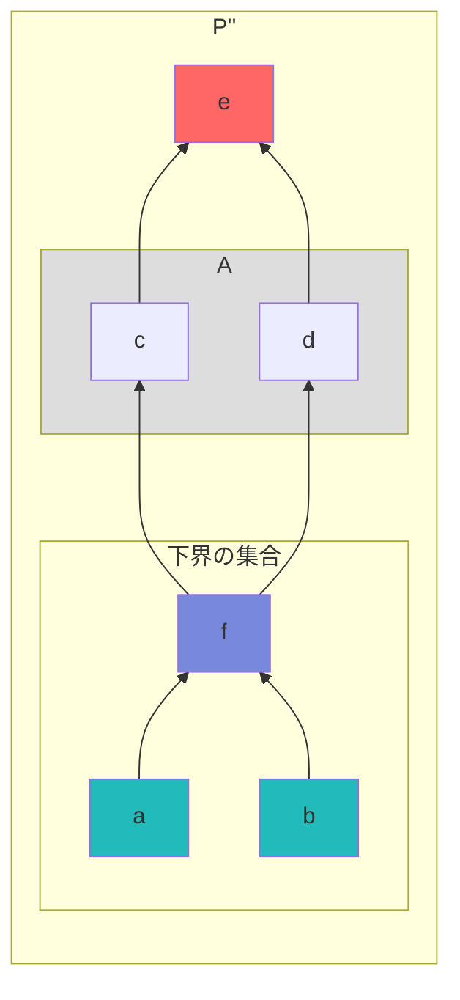

そして最大下界と最小上界は双対なので、今までしてきた議論は最小上界についても成り立ちます。最小上界は以下のような半順序集合 $P'''$ の部分集合 $B = \lbrace b, c \rbrace$ について存在し、$f$ が上界の集合の唯一の極小元、つまり最小元になるので、$f$ が最小上界です。

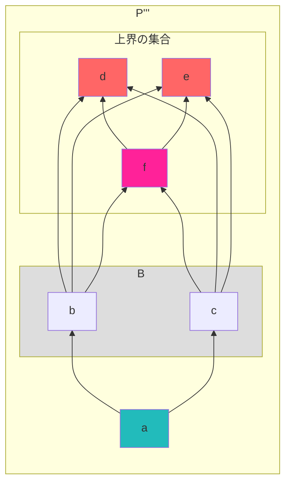

この図も中間点の存在する点同士を直接結んでおり、ハッセ図としては正しくないので正しいハッセ図に修正しておきましょう。

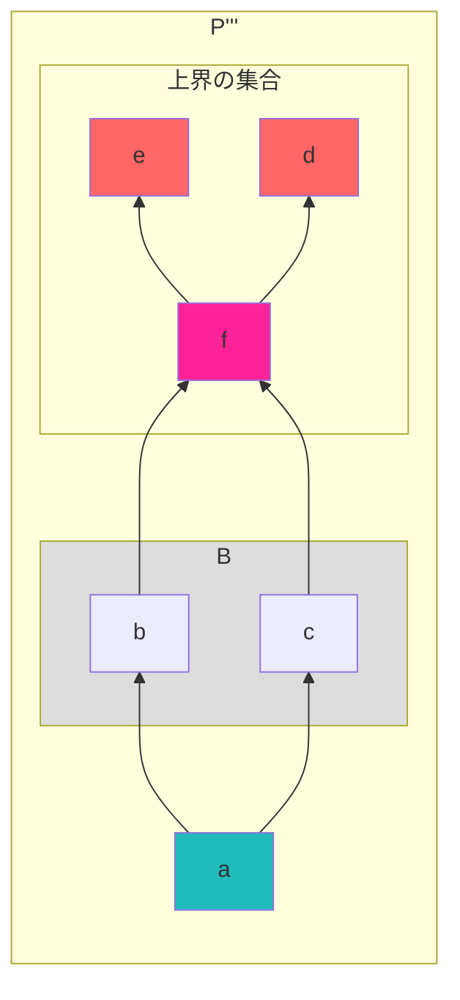

## 束とは

最大元・最小元から始まり、上界・下界、極大元・極小元、最小上界・最大下界とややこしい用語と概念を説明してきましたが、これらを理解することで、ようやく束の構造を理解するための土台ができました。

典型的な構造として、ちょうど『[集合論による模型](6-tam-set-theoretic-model)』の章での冪集合のところででてきたオブジェクト型の集合族が都合のよい構造が実はイメージのしやすい束(lattice)の構造となります。Lattice という英単語は日本語では普通「格子」とも訳されますが、束はこのような格子上の構造となる場合があります。

```mermaid
---
title: fig.典型的な束の構造
---
graph BT
  xyz["X | Y | Z"]
  xy["X | Y"]
  yz["Y | Z"]
  zx["Z | X"]
  X["X"]
  Y["Y"]
  Z["Z"]
  XY["X & Y"]
  ZX["Z & X"]
  YZ["Y & Z"]
  B["X & Y & Z"]
  B --> XY & YZ & ZX
  YZ --> Y
  XY --> Y
  XY --> X
  ZX --> X
  ZX --> Z
  YZ --> Z
  X --> xy
  Y --> xy
  Y --> yz
  Z --> yz
  X --> zx
  Z --> zx
  xy & yz & zx --> xyz
```

束(lattice)は特殊な半順序集合であり、集合内の任意の二つの要素についてユニークな最小上界と最大下界の両方を持つような構造で、有限集合の場合には単一のルート要素(最大元)とリーフ要素(最小元)を常に持つ有界束(bounded lattice)という構造になります。

:::message
有界束にならない束はその半順序集合が無限集合の場合のときだけです。
:::

例えば $S = \lbrace 1, 2, 3, 4, 5 \rbrace$ という自然数の集合と大小関係 $\le$ による鎖(全順序集合) $(S, \le)$ は以下の図のように分岐なく一直線になりました。全順序集合はまず半順序集合である必要がありましたが、全順序集合の場合には常にその集合は束になり、任意の二つの要素を選んで最小上界と最大下界があることが直感的にわかります。

```mermaid
graph LR
subgraph P
direction LR
1 --> 2 --> 3 --> 4 --> 5
1:::lb
2:::glb
3:::lub
4:::ub
5:::ub
  subgraph A
  direction LR
  2
  3
  end
end
classDef ub fill:#f66
classDef lub fill:#f29
classDef lb fill:#2bb
classDef glb fill:#78d
style A fill:#ddd
```

例えば部分集合を $A = \lbrace 2, 4 \rbrace$ と定めると、上界の集合は $UB = \lbrace 3, 4, 5 \rbrace$ となり、最小上界は $3$ に定まります。同様に下界の集合は $LB = \lbrace 1, 2 \rbrace$ となり、最大下界は $2$ に定まります。

全順序ではない半順序でのシンプルな束は以下のようになります。$Right$ と $Left$ は比較不能であり(関係を持たない)、完全律を満たさないことから全順序ではないことが明らかです。

```mermaid
graph BT
  T["Top(⊤)"]
  L["Left"]
  R["Right"]
  B["Bottom(⊥)"]
  B --> L & R --> T
```

復習として基本的なことを再度確認していくと、束は半順序集合だったので、要素間には順序関係が存在します。上図で矢印の方向が半順序関係 $\le$ を表すとして、$Bottom \le Left \le Top$ や $Bottom \le Right \le Top$ のような順序があるわけです。

半順序や前順序では反射律という自己言及的な法則($A \le A$)がありました。これまで図で表現してきせんでしたが、これも図で表現すると以下のようになりましたね。図が汚くなるので以後も省略します(上の全順序集合の図においても省略しています)。

```mermaid
graph BT
  T["Top(⊤)"]
  L["Left"]
  R["Right"]
  B["Bottom(⊥)"]
  B --> B
  T --> T
  L --> L
  R --> R
  B --> L & R --> T
```

さて、このダイアモンド形状の半順序集合が束になることを確認していきます。束は任意の二要素について最小上界と最大下界を持つ半順序集合ですから、実際に考えられる限りの二要素の部分集合を列挙して、その部分集合についての最小上界と最大下界が存在するかをすべて確認すればいいわけですね。

```mermaid
graph BT
  T["Top(⊤)"]
  L["Left"]
  R["Right"]
  B["Bottom(⊥)"]
  B --> L & R --> T
```


## 結びと交わり

TypeScript の型には集合演算に相当する `|` と `&` がありましたが、束論の文脈では和集合(union: $\cup$)あるいは論理和(or: $|$)**は「結び**(join: $\lor$)」と呼ばれ、共通部分(intersection: $\cap$)あるいは論理積(and: $\&$)は「**交わり**(meet: $\land$)」と呼ばれ、結びは最小上界に、交わりは最大下界に対応します。

もう少し複雑な例を挙げます。冪集合において部分集合の包含関係は半順序を形成すると述べましたが、以下のようにハッセ図を作ってみると冪集合は束を形成することが分かります。

```mermaid
graph BT
  B["Φ"]
  X["{x}"]
  Y["{y}"]
  Z["{z}"]
  XY["{x, y}"]
  ZX["{x, z}"]
  YZ["{y ,z}"]
  T["{x, y, z}"]
  B --> X & Y & Z
  X --> XY
  Y --> XY
  Z --> ZX
  Y --> YZ
  X --> ZX
  Z --> YZ
  XY & YZ & ZX --> T
```

さて、`Object, {}, object` などの相互に部分型関係となる、すなわち同値関係となるような型同士を同値類としてまとめた商集合は半順序集合になりました。このような型の集合 $\text{TYPES'}$ は半順序集合であり、以下のような基本構造を構築します。

```mermaid
graph BT
  U[unknown]
  N[never]
  V[void]
  O["Object\n { }\n object"]
  W[Wrapper types]
  subgraph Primitive
    u[undefined]
    n[null]
    P[Primitive types]
  end
  objs[Object types]
  N --> u --> V --> U
  N --> n --> U
  N --> P --> W --> O
  N --> objs --> O
  O --> U
```

join 演算と meet 演算では任意の二つの型についてユニークな最大下界と最小上界を生成できるため、TypeScript の型の集合は上記の配置を基本とした束を形成します。

部分型関係によって構成される束は Scala などの言語では型束(type lattice)あるいはそのまま部分型束(subtype lattice)などと呼ばれます。ここでは型の形成する束を型束と呼ぶことにしましょう。

## 有界束としての構造

## 他言語での有界束

### Scala

Scala 3 は束を持つと言われ、[公式ドキュメント](https://docs.scala-lang.org/tour/unified-types.html)では以下のような束構造が図示されています。

```mermaid
graph BT
  A[Any]
  AV[AnyVal]
  AR[AnyRef]
  LI[List]
  O[Option]
  Y[YourClass]
  NL[Null]
  D[Double]
  F[Float]
  L[Long]
  I[Int]
  S[Short]
  B[Byte]
  U[Unit]
  BL[Boolean]
  C[Char]
  N[Nothing]

  N --> D & F & L & I & S & B & U & BL & C --> AV -->A
  N --> NL --> LI & O & Y --> AR --> A
```

Scala が束を持つことは以下の動画で解説されています。束の他にも pre-order や Category を形成することが語られているので参考に視聴することをおすすめします。

https://www.youtube.com/watch?v=vuTFg5g_f6w

### Kotlin

Kotlin も束を持ちます。

http://natpryce.com/articles/000818.html

Non-Nullable の型は以下のような順序関係が構成されます。

```mermaid
graph BT
  A[Any]
  S[String]
  I[Int]
  U[Unit]
  F[Fruit]
  B[Banana]
  P[Peach]
  N[Nothing]
  N --> S --> A
  N --> I --> A
  N --> U --> A
  N --> B & P --> F --> A
```

Nullable の型は以下のような型の順序関係が構成されます。

```mermaid
graph BT
  A?[Any?]
  S?[String?]
  I?[Int?]
  U?[Unit?]
  F?[Fruit?]
  B?[Banana?]
  P?[Peach?]
  N?[Nothing?]
  N? --> I? --> A?
  N? --> S? --> A?
  N? --> U? --> A?
  N? --> B? & P? --> F? --> A?
```

Nullable と Non-Nullable を組み合わせると以下のような複雑な型の順序関係が構築されます。

```mermaid
graph BT
  A[Any]
  S[String]
  I[Int]
  U[Unit]
  F[Fruit]
  B[Banana]
  P[Peach]
  N[Nothing]
  subgraph Non-Nullable
    N --> S --> A
    N --> I --> A
    N --> U --> A
    N --> B & P --> F --> A
  end
  A?[Any?]
  S?[String?]
  I?[Int?]
  U?[Unit?]
  F?[Fruit?]
  B?[Banana?]
  P?[Peach?]
  N?[Nothing?]
  subgraph Nullable
    N? --> I? --> A?
    N? --> S? --> A?
    N? --> U? --> A?
    N? --> B? & P? --> F? --> A?
  end

  A --> A?
  S --> S?
  I --> I?
  U --> U?
  F --> F?
  B --> B?
  P --> P?
  N --> N?
```

### CUEは束を持つ

部分型を持つ言語で、トップ型とボトム型を持っているなら束を考えることができますが、そのような言語とは別に、束を持つ言語の例として [CUE](https://cuelang.org) が挙げられます。

CUE (Configure Unify Execute) は構成記述言語と呼ばれ、データバリデーション機能と強力な推論エンジンを搭載してます。

CUE では型が値であるというコンセプトの元で、型と値の境界をなくし、さらに更に値(と型)を束として順序付けることで柔軟な制約条件を表現することができます。

以下のドキュメントで束(lattice)とはなにか、CUE で束の構造がどのように役立つかが細かに解説されています。

https://cuelang.org/docs/concepts/logic/

TypeScript よりも束としての機能的振る舞いがわかりやすいので参考にしてください。