## 有界束としての構造

集合論による冪集合はボトムアップに見たりしないと結構扱いづらい概念なので、トップダウンからもボトムアップからも同じように構造を把握することができる半束(semilattice)と、上下方向を統一して構造全体を見ることができる束(lattice)の概念を導入して、順序理論からのメンタルモデルを構築します。

まず、TypeScriptの基本的な型の部分型関係は以下のような配置関係になっています。部分型関係は順序関係であり、以下はハッセ図で表現されたものとなります。

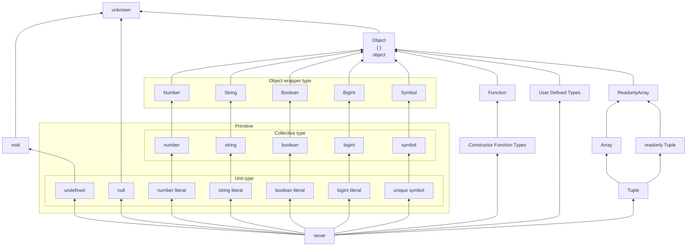

このような型の構造は一見すると階層的な構造(あるいはツリー構造)を持っているように見えますが、実は階層構造というよりも適切な構造の見方があります。それが「束」とよばれる構造です。ちょうど上の冪集合のところででてきた都合のよい構造がイメージのしやすい束の構造です。Latticeは普通「格子」とも訳されますが、束はこのような格子上の構造となる場合があります。

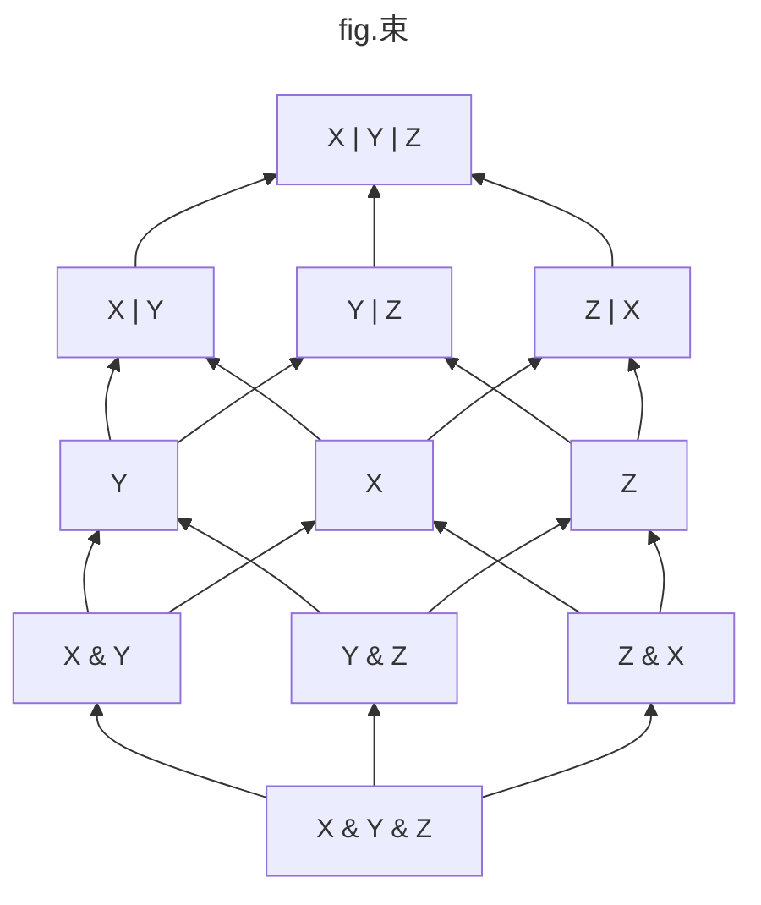

束(lattice)は特殊な半順序集合であり、集合内の任意の二つの要素についてそれぞれユニークな最小上界(**LUB**: least upper bound)と最大下界(**GLB**: greatest lower bound)を持つような構造で、有限集合の場合には単一のルート要素(top)とリーフ要素(bottom)を常に持ちます。

例えば $S = \lbrace 1, 2, 3, 4, 5 \rbrace$ という自然数の集合と大小関係 $\le$ による全順序集合 $(S, \le)$ は以下の図のように分岐なく一直線になるため、線形順序(linear order)や鎖(chain)とも呼ばれます。全順序集合はまず半順序集合である必要がありましたが、全順序集合の場合には常にその集合は束になり、任意の二つの要素を選んで最小上界と最大下界があることが直感的にわかります。

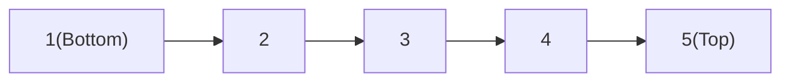

全順序ではない半順序でのシンプルな束は以下のようになります。$Right$ と $Left$ は比較不能であり(関係を持たない)、完全律を満たさないことから全順序ではないことが明らかです。

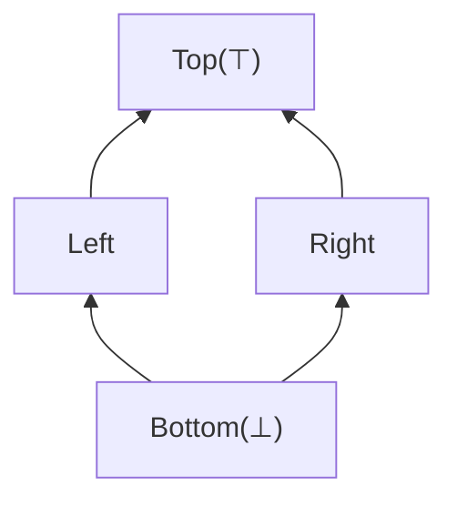

さて、束は半順序集合だったので、要素間には順序関係が存在します。上図で矢印の方向が半順序関係 $\le$ を表すとして、$Bottom \le Left \le Top$ や $Bottom \le Right \le Top$ のような順序があるわけです。

半順序や前順序では反射律という自己言及的な法則($A \le A$)がありました。これまで図で表現してきせんでしたが、これも図で表現すると以下のようになります。図が汚くなるので以後は省略します(上の全順序集合の図においても省略しています)。

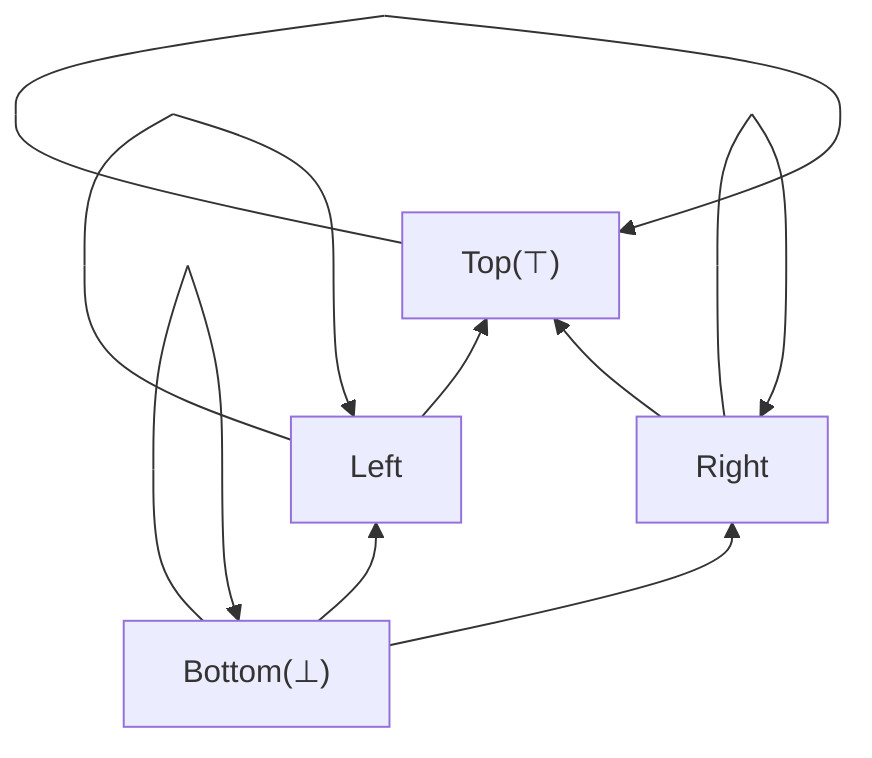

TypeScript の型には集合演算に相当する `|` と `&` がありましたが、束論の文脈では和集合(union: $\cup$)あるいは論理和(or: $|$)**は「結び**(join: $\lor$)」と呼ばれ、共通部分(intersection: $\cap$)あるいは論理積(and: $\&$)は「**交わり**(meet: $\land$)」と呼ばれ、結びは最小上界に、交わりは最大下界に対応します。

もう少し複雑な例を挙げます。冪集合において部分集合の包含関係は半順序を形成すると述べましたが、以下のようにハッセ図を作ってみると冪集合は束を形成することが分かります。

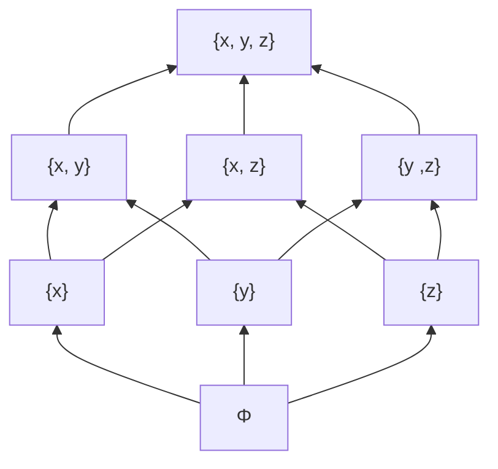

さて、`Object, {}, object` などの相互に部分型関係となる、すなわち同値関係となるような型同士を同値類としてまとめた商集合は半順序集合になりました。このような型の集合 $\text{TYPES'}$ は半順序集合であり、以下のような基本構造を構築します。

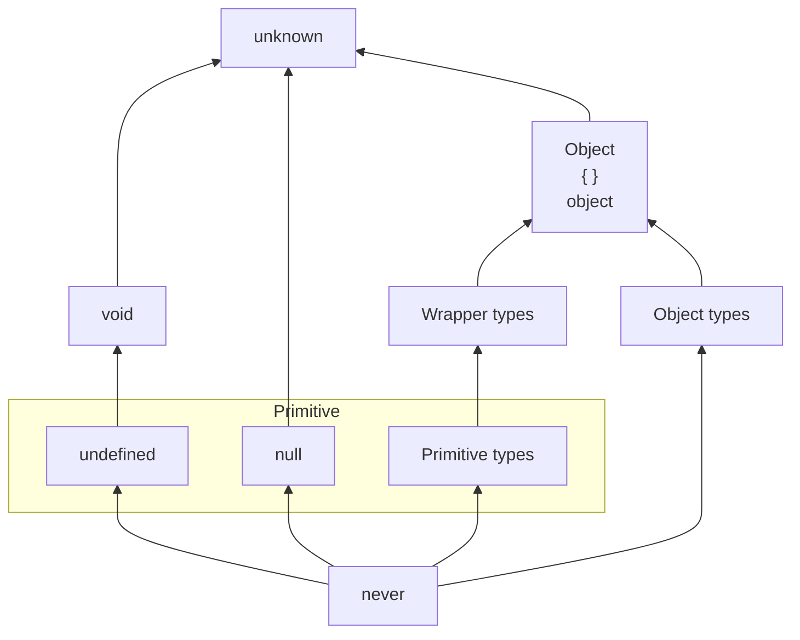

join演算とmeet演算では任意の二つの型についてユニークな最大下界と最小上界を生成できるため、TypeScriptの型の集合は上記の配置を基本とした束を形成します。

部分型関係によって構成される束は Scala などの言語では型束(type lattice)あるいはそのまま部分型束(subtype lattice)などと呼ばれます。ここでは型の形成する束を型束と呼ぶことにしましょう。

## 他言語での有界束

### Scala

Scala 3 は束を持つと言われ、[公式ドキュメント](https://docs.scala-lang.org/tour/unified-types.html)では以下のような束構造が図示されています。

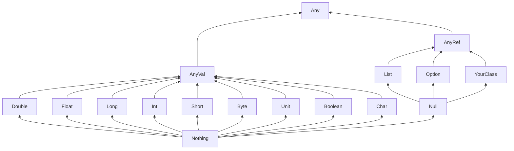

Scala が束を持つことは以下の動画で解説されています。束の他にも pre-order や Category を形成することが語られているので参考に視聴することをおすすめします。

https://www.youtube.com/watch?v=vuTFg5g_f6w

### Kotlin

Kotlin も束を持ちます。

http://natpryce.com/articles/000818.html

Non-Nullable の型は以下のような順序関係が構成されます。

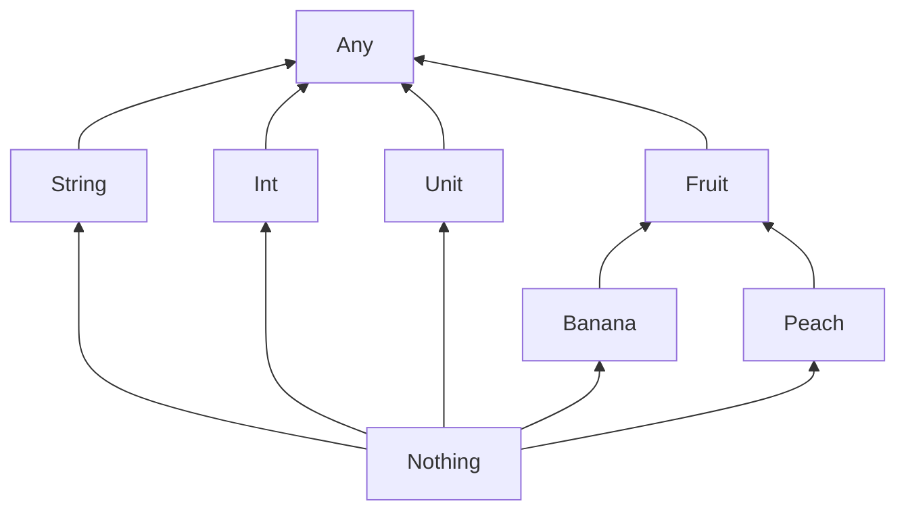

Nullable の型は以下のような型の順序関係が構成されます。

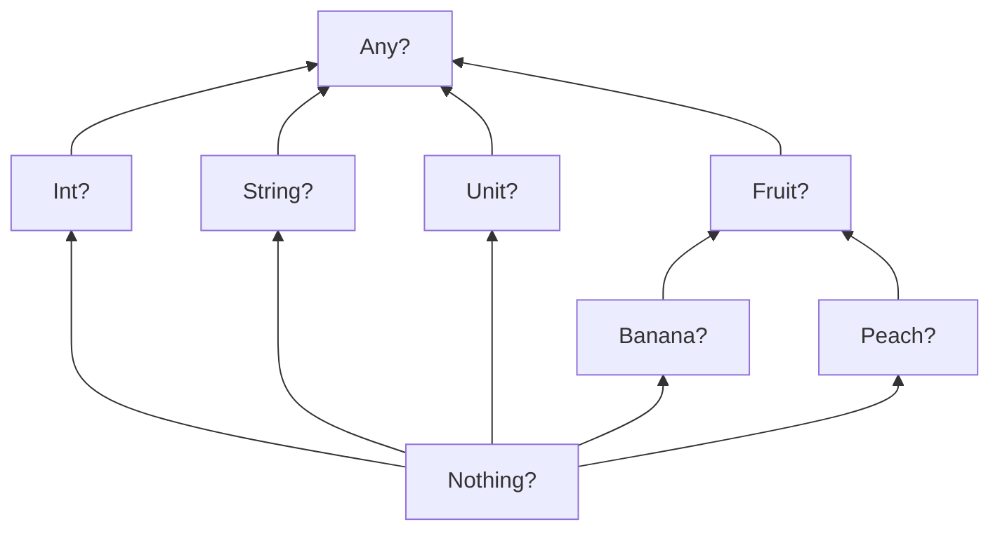

Nullableと Non-Nullable を組み合わせると以下のような複雑な型の順序関係が構築されます。

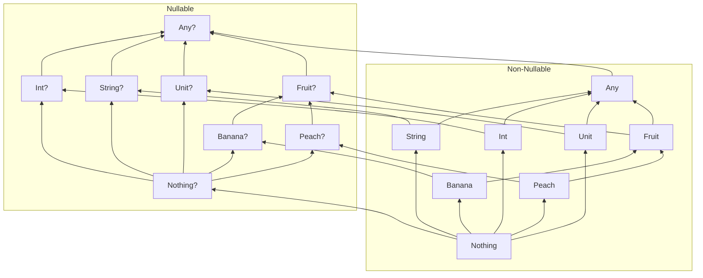

### CUEは束を持つ

部分型を持つ言語で、トップ型とボトム型を持っているなら束を考えることができますが、そのような言語とは別に、束を持つ言語の例として [CUE](https://cuelang.org) が挙げられます。

CUE (Configure Unify Execute) は構成記述言語と呼ばれ、データバリデーション機能と強力な推論エンジンを搭載してます。

CUE では型が値であるというコンセプトの元で、型と値の境界をなくし、さらに更に値(と型)を束として順序付けることで柔軟な制約条件を表現することができます。

以下のドキュメントで束(lattice)とはなにか、CUE で束の構造がどのように役立つかが細かに解説されています。

https://cuelang.org/docs/concepts/logic/

TypeScript よりも束としての機能的振る舞いがわかりやすいので参考にしてください。